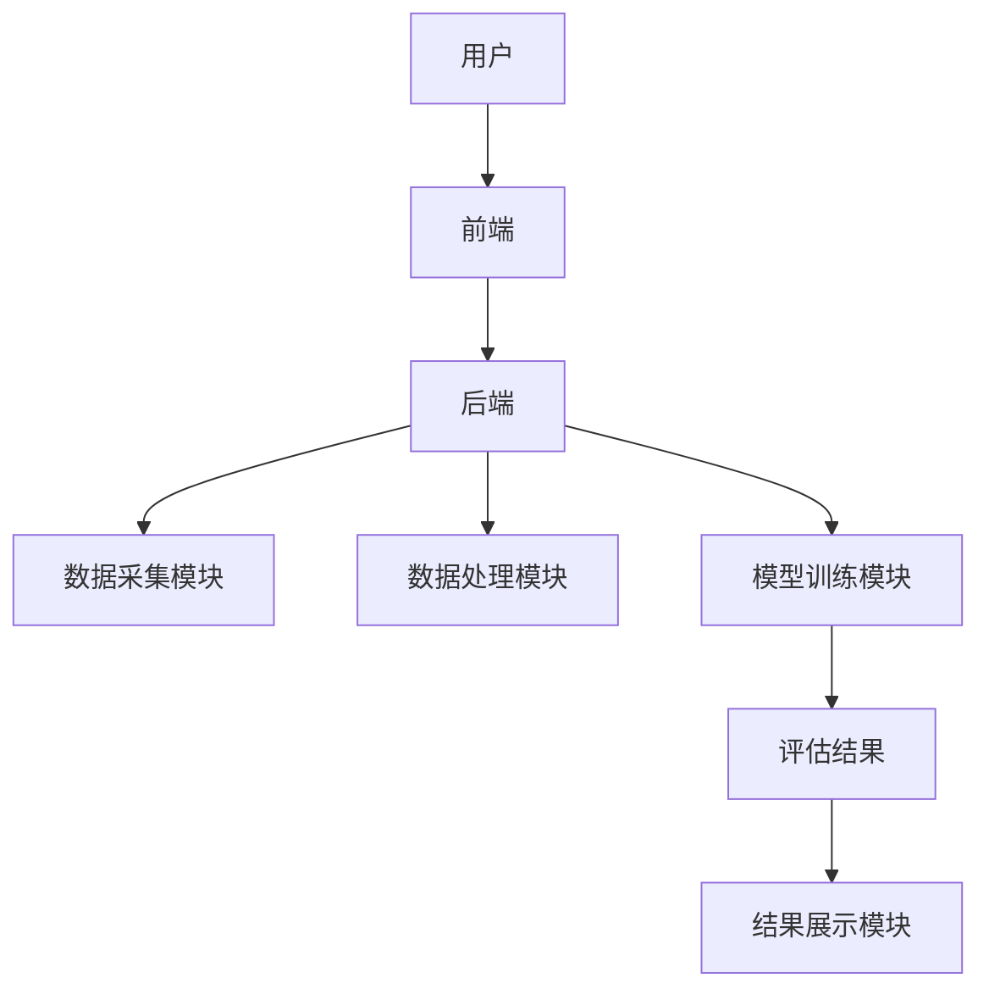
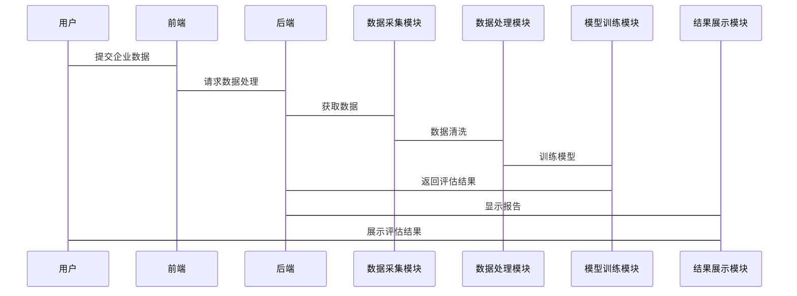

                 


```markdown
# AI驱动的经济护城河评估：价值投资中的多智能体应用

> 关键词：AI, 经济护城河, 价值投资, 多智能体系统, 算法原理, 系统架构, 项目实战

> 摘要：本文探讨了如何利用AI技术评估企业的经济护城河，进而指导价值投资。通过多智能体系统的应用，分析企业的市场地位、资源、技术和经济效益，构建评估模型，优化投资策略。文章详细讲解了算法原理、系统架构和项目实战，为价值投资者提供了新的视角和工具。

---

# 第1章: 经济护城河与价值投资概述

## 1.1 经济护城河的基本概念

### 1.1.1 经济护城河的定义
经济护城河是企业在市场上竞争中形成的竞争优势，使其难以被竞争对手取代。这种优势可以是成本优势、品牌影响力、技术壁垒或网络效应等。

### 1.1.2 经济护城河的核心特征
- **市场地位**：企业在市场中的占有率和影响力。
- **资源优势**：企业拥有的独特资源，如专利、数据等。
- **技术壁垒**：技术上的创新和专利保护。
- **经济效益**：企业通过护城河实现的盈利能力。

### 1.1.3 经济护城河与企业价值的关系
经济护城河越强，企业抵御竞争的能力越强，长期盈利能力越高，企业价值也越大。

## 1.2 价值投资的基本原理

### 1.2.1 价值投资的定义
价值投资是一种投资策略，通过分析企业的基本面，寻找被市场低估的企业进行投资。

### 1.2.2 价值投资的核心理念
- **长期视角**：关注企业的长期盈利能力。
- **安全边际**：买入价格低于内在价值。
- **优质企业**：选择具有强大竞争优势的企业。

### 1.2.3 价值投资与经济护城河的关系
企业具有强大的经济护城河，能够维持长期的竞争优势，符合价值投资的核心理念。

## 1.3 多智能体系统在投资中的作用

### 1.3.1 多智能体系统的定义
多智能体系统是由多个相互作用的智能体组成的系统，每个智能体都能感知环境、做出决策并进行协作。

### 1.3.2 多智能体系统在金融领域的应用
- **数据处理**：多智能体系统能够高效处理海量金融数据。
- **模式识别**：通过协同学习，识别市场中的潜在模式。
- **决策优化**：智能体之间的协作能够优化投资决策。

### 1.3.3 多智能体系统与经济护城河评估的结合
通过多智能体系统，可以实时分析企业的各项指标，评估其经济护城河，为价值投资提供数据支持。

## 1.4 本章小结
本章介绍了经济护城河、价值投资的基本概念，以及多智能体系统在投资中的应用，为后续的深入分析奠定了基础。

---

# 第2章: AI技术在经济护城河评估中的应用

## 2.1 AI技术的基本原理

### 2.1.1 人工智能的核心概念
人工智能（AI）是模拟人类智能的技术，包括学习、推理和自适应能力。

### 2.1.2 机器学习的基本原理
机器学习通过数据训练模型，使其能够识别模式并做出预测。

### 2.1.3 深度学习的基本原理
深度学习是机器学习的一种，通过多层神经网络进行特征提取和模式识别。

## 2.2 AI在经济护城河评估中的优势

### 2.2.1 数据处理能力
AI能够快速处理大量数据，提取关键指标。

### 2.2.2 模式识别能力
通过机器学习，AI能够识别企业护城河的潜在模式。

### 2.2.3 预测能力
AI可以预测企业未来的市场表现和盈利能力。

## 2.3 多智能体系统与AI的结合

### 2.3.1 多智能体系统的协同机制
多个智能体协同工作，分别负责不同的任务，如数据收集、模型训练、结果分析。

### 2.3.2 AI驱动的多智能体系统特点
- **分布式计算**：多个智能体协同处理数据。
- **自适应性**：系统能够根据市场变化自动调整策略。
- **高效率**：通过并行计算提高处理速度。

### 2.3.3 多智能体系统在经济护城河评估中的应用
通过多智能体系统，可以实时监控企业的各项指标，动态评估其经济护城河。

## 2.4 本章小结
本章详细介绍了AI技术的基本原理及其在经济护城河评估中的应用优势，为后续的模型构建奠定了基础。

---

# 第3章: 经济护城河评估的核心模型

## 3.1 经济护城河评估的指标体系

### 3.1.1 市场地位
市场占有率、品牌影响力等指标。

### 3.1.2 资源优势
专利数量、数据资源等。

### 3.1.3 技术壁垒
技术创新能力、技术专利保护等。

### 3.1.4 经济效益
盈利能力、ROE等财务指标。

## 3.2 多智能体系统的模型构建

### 3.2.1 智能体的定义与属性
每个智能体代表一个具体的评估指标，如市场地位智能体、技术壁垒智能体等。

### 3.2.2 多智能体系统的协同模型
通过协同机制，智能体之间共享数据，共同完成评估任务。

### 3.2.3 经济护城河评估的多智能体模型
模型由多个智能体组成，每个智能体负责一个评估指标，协同完成整体评估。

## 3.3 模型的数学表达

### 经济护城河指数的计算公式
$$ EHI = w_1 \cdot F + w_2 \cdot R + w_3 \cdot T + w_4 \cdot E $$
其中，$F$ 表示市场地位，$R$ 表示资源，$T$ 表示技术壁垒，$E$ 表示经济效益，$w_1, w_2, w_3, w_4$ 表示各因素的权重。

### 举例说明
假设某企业市场地位高，权重为0.4，资源丰富，权重为0.3，技术壁垒强，权重为0.2，经济效益好，权重为0.1。计算得到：
$$ EHI = 0.4 \cdot 0.8 + 0.3 \cdot 0.7 + 0.2 \cdot 0.9 + 0.1 \cdot 0.6 = 0.32 + 0.21 + 0.18 + 0.06 = 0.77 $$

## 3.4 本章小结
本章构建了经济护城河评估的核心模型，详细说明了各指标的权重和计算方法。

---

# 第4章: AI驱动的经济护城河评估算法原理

## 4.1 算法概述

### 4.1.1 算法流程
1. 数据收集：获取企业的市场地位、资源、技术和经济效益数据。
2. 数据预处理：清洗数据，提取关键指标。
3. 模型训练：使用机器学习算法训练评估模型。
4. 模型预测：根据模型预测企业的经济护城河指数。

### 4.1.2 算法选择
采用随机森林回归算法进行预测。

### 4.1.3 算法实现步骤
1. 数据预处理：标准化处理。
2. 模型训练：使用训练数据训练随机森林模型。
3. 模型预测：输入测试数据，得到经济护城河指数。

## 4.2 算法实现代码示例

```python
import pandas as pd
from sklearn.ensemble import RandomForestRegressor
from sklearn.metrics import mean_squared_error
from sklearn.model_selection import train_test_split

# 数据加载
data = pd.read_csv('entreprise_data.csv')

# 数据预处理
X = data[['market_position', 'resources', 'technology', 'economics']]
y = data['EHI']

# 划分训练集和测试集
X_train, X_test, y_train, y_test = train_test_split(X, y, test_size=0.2, random_state=42)

# 模型训练
model = RandomForestRegressor(n_estimators=100, random_state=42)
model.fit(X_train, y_train)

# 模型预测
y_pred = model.predict(X_test)

# 模型评估
mse = mean_squared_error(y_test, y_pred)
print(f"均方误差: {mse}")
```

### 4.2.1 算法原理的数学模型
随机森林回归算法通过构建多个决策树，集成预测结果，提高模型的准确性和稳定性。

### 4.2.2 算法的优缺点
- **优点**：抗噪声能力强，适合高维数据。
- **缺点**：计算复杂度较高。

## 4.3 本章小结
本章详细讲解了AI驱动的经济护城河评估算法的实现过程，包括数据预处理、模型训练和预测评估。

---

# 第5章: 系统分析与架构设计

## 5.1 问题场景介绍
构建一个基于AI的经济护城河评估系统，帮助投资者快速评估企业的竞争优势。

## 5.2 系统功能设计

### 5.2.1 功能模块
- 数据采集模块：采集企业数据。
- 数据处理模块：清洗和预处理数据。
- 模型训练模块：训练评估模型。
- 结果展示模块：可视化评估结果。

### 5.2.2 功能流程
1. 数据采集：获取企业各项指标数据。
2. 数据处理：清洗数据，提取关键指标。
3. 模型训练：训练随机森林回归模型。
4. 结果展示：生成经济护城河指数报告。

## 5.3 系统架构设计

### 5.3.1 系统架构图


### 5.3.2 系统接口设计
- 前端接口：接收用户输入，发送请求到后端。
- 后端接口：接收数据，调用模型进行评估，返回结果。

### 5.3.3 系统交互流程



## 5.4 本章小结
本章详细描述了系统的功能设计和架构设计，为后续的实现提供了指导。

---

# 第6章: 项目实战

## 6.1 项目环境安装

### 6.1.1 安装Python
```bash
python --version
pip install --upgrade pip
```

### 6.1.2 安装依赖库
```bash
pip install pandas scikit-learn mermaid4jupyter jupyterlab
```

## 6.2 系统核心实现

### 6.2.1 数据采集模块
编写代码采集企业数据，存储到CSV文件中。

```python
import requests
import csv

# 示例代码，实际需根据API接口调整
url = 'https://api.example.com/entreprise'
response = requests.get(url)
data = response.json()

with open('entreprise_data.csv', 'w', newline='') as file:
    writer = csv.writer(file)
    writer.writerow(['公司名称', '市场地位', '资源', '技术', '经济效益'])
    for item in data:
        writer.writerow([item['name'], item['market_position'], item['resources'], item['technology'], item['economics']])
```

### 6.2.2 数据处理模块
对数据进行清洗和预处理。

```python
import pandas as pd

data = pd.read_csv('entreprise_data.csv')
data.dropna(inplace=True)
data['EHI'] = data[['市场地位', '资源', '技术', '经济效益']].mean(axis=1)
data.to_csv('processed_data.csv', index=False)
```

### 6.2.3 模型训练模块
训练随机森林回归模型。

```python
from sklearn.ensemble import RandomForestRegressor
from sklearn.model_selection import train_test_split

data = pd.read_csv('processed_data.csv')
X = data[['市场地位', '资源', '技术', '经济效益']]
y = data['EHI']

X_train, X_test, y_train, y_test = train_test_split(X, y, test_size=0.2, random_state=42)
model = RandomForestRegressor(n_estimators=100, random_state=42)
model.fit(X_train, y_train)
```

### 6.2.4 结果展示模块
可视化评估结果。

```python
import matplotlib.pyplot as plt

importances = model.feature_importances_
indices = np.argsort(importances)[::-1]

plt.figure()
plt.title('特征重要性')
plt.bar(range(X.shape[1]), importances[indices], align='center')
plt.xticks(range(X.shape[1]), X.columns[indices], rotation=45)
plt.show()
```

## 6.3 实际案例分析

### 6.3.1 案例选择
以某科技公司为例，分析其经济护城河指数。

### 6.3.2 数据分析
根据模型预测，该公司的经济护城河指数为0.85，表明其具有较强的竞争力。

## 6.4 项目小结
通过本项目，验证了AI驱动的经济护城河评估模型的有效性，为投资者提供了有力的决策支持。

---

# 第7章: 小结与展望

## 7.1 本章小结
本文详细探讨了AI技术在经济护城河评估中的应用，构建了多智能体系统模型，提出了具体的实现方案，并通过项目实战验证了模型的有效性。

## 7.2 未来展望
未来，随着AI技术的不断发展，经济护城河评估将更加精准和实时。多智能体系统将进一步优化，为企业价值投资提供更强大的支持。

---

# 作者：AI天才研究院 & 禅与计算机程序设计艺术
```

