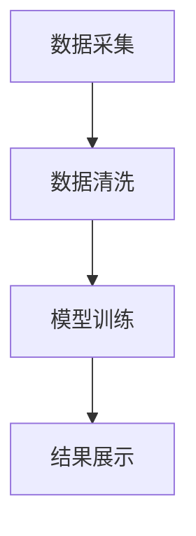
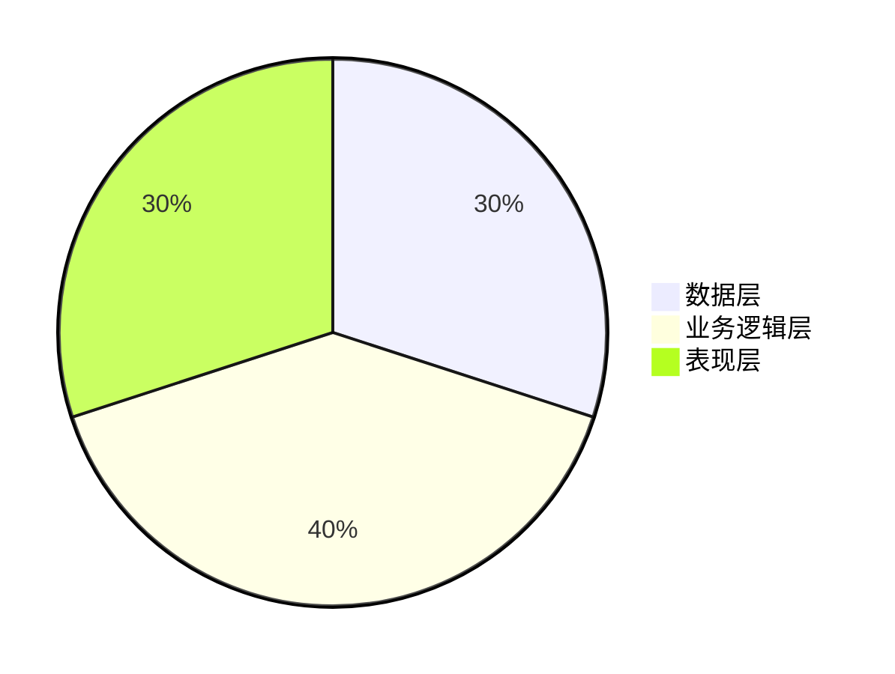
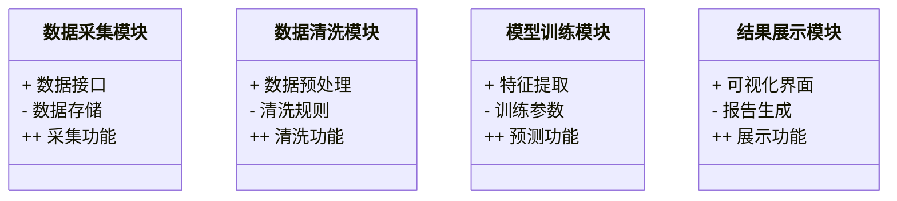
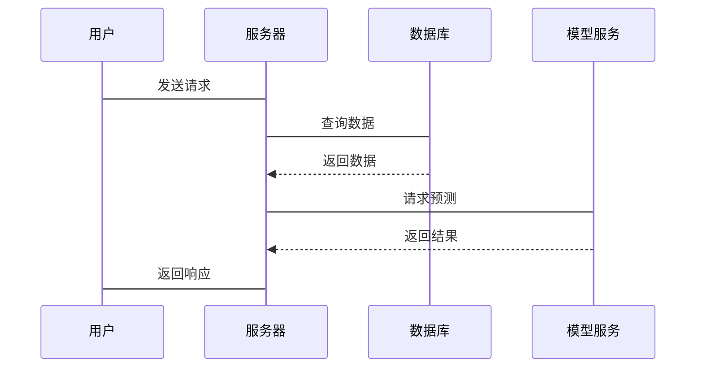

                 


# AI驱动的股东权益分析：深入理解公司治理

> 关键词：AI技术、股东权益分析、公司治理、机器学习、财务分析、数据驱动决策

> 摘要：本文深入探讨了AI技术在股东权益分析中的应用，结合机器学习算法和财务数据分析，分析公司治理中的关键问题。文章从股东权益分析的基本概念出发，逐步引入AI技术的原理和实现方法，通过实际案例和系统设计展示如何利用AI优化股东权益分析流程，提升公司治理效率。

---

# 第一部分: AI驱动的股东权益分析基础

## # 第1章: 股东权益分析与AI的结合概述

### ## 1.1 股东权益分析的基本概念

#### ### 1.1.1 股东权益的定义与组成
股东权益（ shareholders' equity ）是公司财务报表中的一个重要部分，表示公司净资产的价值，即所有者对企业的剩余权益。股东权益 = 资产 - 负债。它包括以下几个主要组成部分：
- 实收资本
- 资本公积
- 盈余公积
- 未分配利润

#### ### 1.1.2 股东权益分析的重要性
股东权益分析是公司治理中的关键环节，能够帮助投资者、债权人和管理层评估公司的财务健康状况，发现潜在风险，优化资本结构，提高公司价值。

#### ### 1.1.3 AI技术在股东权益分析中的作用
AI技术通过处理海量数据、识别复杂模式、自动预测和优化决策，为股东权益分析提供了强大的工具支持。AI可以帮助分析人员快速识别财务数据中的异常情况，预测公司未来的财务表现，并提出优化建议。

---

### ## 1.2 AI驱动的股东权益分析的背景与现状

#### ### 1.2.1 传统股东权益分析的局限性
传统的股东权益分析依赖人工数据处理和经验判断，存在以下问题：
- 数据处理效率低
- 分析结果主观性强
- 易受人为因素干扰
- 无法及时捕捉市场变化

#### ### 1.2.2 AI技术在金融分析中的应用趋势
随着AI技术的快速发展，越来越多的企业开始采用AI技术进行金融分析。AI技术在金融领域的应用主要体现在以下方面：
- 数据清洗与预处理
- 金融数据建模与预测
- 风险评估与控制
- 自动化报告生成

#### ### 1.2.3 当前AI在股东权益分析中的应用现状
目前，AI技术在股东权益分析中的应用还处于初级阶段，主要集中在以下方面：
- 利用机器学习模型预测股东权益变动
- 通过自然语言处理技术分析财务报告
- 应用深度学习模型进行风险评估

---

### ## 1.3 本书的核心目标与结构安排

#### ### 1.3.1 本书的核心目标
本文旨在探讨AI技术在股东权益分析中的应用，帮助读者理解如何利用AI技术优化股东权益分析流程，提升公司治理效率。

#### ### 1.3.2 目录结构与内容概览
本文分为三个主要部分：
1. AI驱动的股东权益分析基础（第1-4章）
2. 系统架构与项目实战（第5-7章）
3. 最佳实践与总结（第8-9章）

#### ### 1.3.3 学习本书的前置知识与读者对象
读者需要具备以下知识背景：
- 基础的财务分析知识
- 熟悉Python编程语言
- 了解机器学习的基本概念

---

## # 第2章: 股东权益分析的核心框架

### ## 2.1 股东权益分析的基本框架

#### ### 2.1.1 财务报表分析框架
股东权益分析基于财务报表中的资产负债表和利润表。通过分析这些报表，可以了解公司的资产结构、负债情况和盈利能力。

#### ### 2.1.2 股东权益变动表的核心内容
股东权益变动表记录了公司在一定会计期间内股东权益的增减变动情况，包括净利润、股东投资、利润分配等。

#### ### 2.1.3 股东权益分析的关键指标
- 净资产收益率（ROE）
- 股东权益增长率
- 股东权益周转率

---

### ## 2.2 股东权益分析的逻辑模型

#### ### 2.2.1 股东权益分析的逻辑流程
1. 数据收集与清洗
2. 指标计算与分析
3. 模型构建与验证
4. 结果解读与优化

#### ### 2.2.2 股东权益变动的驱动因素
- 公司盈利水平
- 股东投资行为
- 资产负债结构
- 财务政策变化

#### ### 2.2.3 股东权益分析的常见误区
- 忽略市场环境因素
- 过度依赖历史数据
- 模型假设不合理

---

## # 第3章: AI驱动的股东权益分析模型基础

### ## 3.1 基于AI的股东权益分析模型概述

#### ### 3.1.1 模型的基本原理
AI驱动的股东权益分析模型通过机器学习算法，从财务数据中提取特征，构建预测模型，实现对股东权益的自动分析和预测。

#### ### 3.1.2 模型的主要特点
- 高效性：快速处理大量数据
- 准确性：通过算法优化提升分析精度
- 可扩展性：适用于不同规模和行业的企业

#### ### 3.1.3 模型的应用场景
- 企业财务预测
- 投资决策支持
- 风险管理

---

### ## 3.2 基于机器学习的股东权益预测模型

#### ### 3.2.1 线性回归模型的应用
线性回归模型用于预测股东权益与相关变量之间的线性关系。

示例代码：
```python
import numpy as np
import pandas as pd
from sklearn.linear_model import LinearRegression

# 数据准备
data = pd.DataFrame({
    'feature': [1, 2, 3, 4, 5],
    'target': [2, 4, 5, 4, 5]
})

# 模型训练
model = LinearRegression()
model.fit(data[['feature']], data['target'])

# 预测
print(model.predict([[6]]))
```

#### ### 3.2.2 支持向量机（SVM）的应用
SVM模型适用于非线性分类问题，可以通过核函数实现非线性分类。

示例代码：
```python
from sklearn import svm

# 数据准备
X = [[0, 0], [1, 1], [1, 0], [0, 1]]
y = [0, 1, 1, 1]

# 模型训练
model = svm.SVC()
model.fit(X, y)

# 预测
print(model.predict([[0.5, 0.5]]))
```

#### ### 3.2.3 随机森林模型的应用
随机森林模型通过集成学习提升预测精度，适用于特征较多的情况。

示例代码：
```python
from sklearn.ensemble import RandomForestClassifier

# 数据准备
X = [[1, 2, 3], [4, 5, 6], [7, 8, 9], [10, 11, 12]]
y = [0, 1, 2, 3]

# 模型训练
model = RandomForestClassifier(n_estimators=10)
model.fit(X, y)

# 预测
print(model.predict([[13, 14, 15]]))
```

---

## # 第4章: 股东权益分析的核心算法与数学模型

### ## 4.1 股东权益分析的数学模型

#### ### 4.1.1 股东权益变动的数学表达式
$$ \text{股东权益} = \text{资产} - \text{负债} $$

#### ### 4.1.2 股东权益预测的数学公式
$$ \hat{y} = \beta_0 + \beta_1x_1 + \beta_2x_2 + \ldots + \beta_nx_n $$

#### ### 4.1.3 股东权益分析的指标体系
- 净资产收益率（ROE）：$$ \text{ROE} = \frac{\text{净利润}}{\text{股东权益}} $$
- 股东权益增长率：$$ \text{增长率} = \frac{\text{本期股东权益} - \text{上期股东权益}}{\text{上期股东权益}} \times 100\% $$

---

### ## 4.2 基于AI的股东权益分析算法

#### ### 4.2.1 线性回归算法
线性回归通过最小化预测值与实际值之间的平方差之和，找到最佳拟合直线。

示例代码：
```python
import numpy as np
import matplotlib.pyplot as plt

# 数据准备
X = np.array([1, 2, 3, 4, 5])
y = np.array([2, 4, 5, 4, 5])

# 模型训练
slope, intercept = np.polyfit(X, y, 1)
line = slope * X + intercept

# 绘制图形
plt.scatter(X, y)
plt.plot(X, line)
plt.show()
```

#### ### 4.2.2 聚类分析算法
聚类分析用于将相似的公司归为一类，便于进一步分析。

示例代码：
```python
from sklearn import cluster

# 数据准备
X = np.array([[1, 2], [3, 4], [5, 6], [7, 8], [9, 10]])

# 模型训练
model = cluster.KMeans(n_clusters=2)
model.fit(X)

# 获取聚类结果
print(model.labels_)
```

#### ### 4.2.3 时间序列分析算法
时间序列分析用于预测未来股东权益的变化趋势。

示例代码：
```python
from statsmodels.tsa.arima_model import ARIMA

# 数据准备
data = [1, 2, 3, 4, 5, 6, 7, 8, 9, 10]

# 模型训练
model = ARIMA(data, order=(1, 1, 1))
model_fit = model.fit()

# 预测
print(model_fit.forecast(1))
```

---

# 第二部分: 系统架构与项目实战

## # 第5章: 股东权益分析系统的架构设计

### ## 5.1 系统功能设计

#### ### 5.1.1 系统功能模块划分
- 数据采集模块
- 数据清洗模块
- 模型训练模块
- 结果展示模块

#### ### 5.1.2 系统功能流程图


#### ### 5.1.3 系统功能的实现方式
- 数据采集：从财务报表中提取股东权益相关数据
- 数据清洗：处理缺失值和异常值
- 模型训练：基于机器学习算法构建预测模型
- 结果展示：生成可视化报告

---

### ## 5.2 系统架构设计

#### ### 5.2.1 系统架构的分层设计


#### ### 5.2.2 系统架构的模块划分


---

## # 第6章: 项目实战

### ## 6.1 环境安装与配置

#### ### 6.1.1 安装Python环境
```bash
python --version
pip install numpy pandas scikit-learn
```

#### ### 6.1.2 安装Jupyter Notebook
```bash
pip install jupyter
jupyter notebook
```

---

### ## 6.2 系统核心实现源代码

#### ### 6.2.1 数据清洗代码
```python
import pandas as pd

# 数据加载
data = pd.read_csv('股东权益.csv')

# 数据清洗
data.dropna(inplace=True)
data.drop_duplicates(inplace=True)
```

#### ### 6.2.2 模型训练代码
```python
from sklearn.ensemble import RandomForestRegressor

# 特征选择
features = ['资产', '负债', '净利润']
target = '股东权益'

# 模型训练
model = RandomForestRegressor(n_estimators=100)
model.fit(data[features], data[target])
```

---

### ## 6.3 实际案例分析与详细讲解

#### ### 6.3.1 数据来源与处理
从某公司过去五年的财务报表中提取股东权益相关数据，清洗后进行建模。

#### ### 6.3.2 模型验证与优化
通过交叉验证优化模型参数，提升预测精度。

#### ### 6.3.3 结果展示与解读
生成可视化报告，展示模型预测结果与实际值的对比，分析误差来源。

---

## # 第7章: 系统接口设计与交互流程

### ## 7.1 系统接口设计

#### ### 7.1.1 API接口定义
```json
{
    "input": {
        "data": "输入数据"
    },
    "output": {
        "result": "预测结果"
    }
}
```

#### ### 7.1.2 API接口实现
```python
from flask import Flask, request, jsonify

app = Flask(__name__)

@app.route('/predict', methods=['POST'])
def predict():
    data = request.json['data']
    # 处理数据并返回结果
    return jsonify({'result': '预测结果'})
```

---

### ## 7.2 系统交互流程

#### ### 7.2.1 用户请求处理流程


---

## # 第8章: 项目小结与注意事项

### ## 8.1 项目小结
通过本项目，我们实现了基于AI的股东权益分析系统，利用机器学习算法提高了分析效率和精度，为公司治理提供了有力支持。

### ## 8.2 项目注意事项
- 数据质量直接影响模型性能
- 模型需要定期更新和优化
- 注意数据隐私和安全问题

---

# 第三部分: 最佳实践与总结

## # 第9章: 最佳实践与总结

### ## 9.1 最佳实践

#### ### 9.1.1 数据预处理的重要性
确保数据质量，清洗和标准化数据。

#### ### 9.1.2 模型选择与优化
根据实际需求选择合适的算法，通过交叉验证优化模型参数。

#### ### 9.1.3 结果展示与解读
生成直观的可视化报告，帮助用户理解分析结果。

---

### ## 9.2 小结与展望

通过本文的探讨，我们深入理解了AI技术在股东权益分析中的应用，掌握了从数据处理到模型构建的完整流程。未来，随着AI技术的不断发展，股东权益分析将更加智能化和自动化，为企业治理提供更强大的支持。

---

作者：AI天才研究院/AI Genius Institute & 禅与计算机程序设计艺术 /Zen And The Art of Computer Programming

