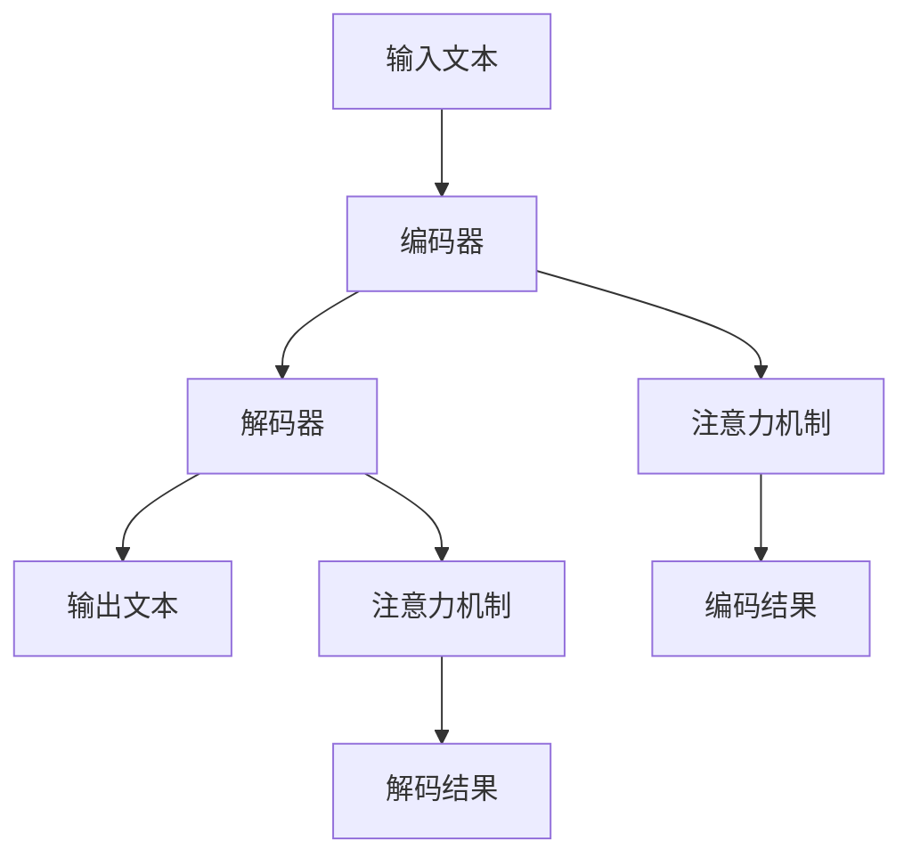

                 


```markdown
# AI驱动的自动化投资报告生成

> 关键词：AI, 自动化投资报告, 自然语言处理, 机器学习, 投资策略, Transformer模型

> 摘要：本文详细探讨了AI驱动的自动化投资报告生成的技术与应用，从自然语言处理和机器学习的基础概念出发，结合实际案例分析，深入解析了如何利用AI技术实现高效、智能的投资报告生成。文章内容涵盖AI与自动化投资报告的概述、NLP与机器学习在投资报告生成中的应用、基于Transformer模型的文本生成算法、系统架构设计与实现、项目实战及优化建议。

---

## 第一部分: AI驱动的自动化投资报告生成基础

### 第1章: AI与自动化投资报告概述

#### 1.1 投资报告生成的背景与问题
##### 1.1.1 传统投资报告的生成方式
传统的投资报告生成过程通常依赖于人工编写，需要分析师根据市场数据、财务报表、行业趋势等信息进行详细分析和撰写。这种方式不仅耗时耗力，而且容易受到主观因素的影响，导致报告的质量和效率受到限制。

##### 1.1.2 传统报告生成的痛点与挑战
- 数据量大：金融市场数据复杂且多样化，人工处理效率低下。
- 时间成本高：分析师需要花费大量时间收集、整理和分析数据。
- 主观性较强：报告的结论可能受到分析师个人判断的影响。
- 更新频率低：市场变化快，报告难以及时更新。

##### 1.1.3 AI驱动的自动化投资报告的优势
AI驱动的自动化投资报告生成能够显著提高效率，降低成本，并提供更客观、精准的分析结果。通过机器学习和自然语言处理技术，AI能够快速处理大量数据，自动生成结构化报告，并根据市场变化实时更新。

#### 1.2 AI驱动的自动化投资报告的核心概念
##### 1.2.1 自动化投资报告的定义与特点
自动化投资报告是指通过AI技术自动生成的投资报告，其特点是高效、准确、可定制和实时更新。与传统报告相比，自动化报告能够更快地响应市场变化，并提供更多的数据支持。

##### 1.2.2 AI在投资报告生成中的角色
AI在投资报告生成中的角色主要包括数据处理、模型训练、文本生成和报告优化。AI能够通过机器学习算法分析数据，提取关键信息，并生成自然流畅的文本报告。

##### 1.2.3 自动化投资报告的边界与外延
自动化投资报告的边界主要在于其数据来源和生成能力。其外延则包括从简单的数据汇总到复杂的策略分析，以及从单资产分析到多资产配置的全过程。

#### 1.3 自动化投资报告生成的流程与要素
##### 1.3.1 数据输入与处理
数据输入包括市场数据、公司财务数据、行业报告等。数据处理需要进行清洗、特征提取和结构化处理。

##### 1.3.2 模型训练与生成
模型训练包括选择合适的算法（如Transformer模型）并进行参数调优。生成阶段通过模型预测和文本优化生成最终的报告。

##### 1.3.3 报告输出与优化
报告输出包括生成文本的格式化和排版优化。优化阶段通过反馈机制不断改进生成质量。

---

## 第二部分: 自然语言处理与投资报告生成

### 第2章: 自然语言处理基础

#### 2.1 自然语言处理核心技术与工具
##### 2.1.1 分词与词性标注
分词是将文本分割成词语，词性标注是对每个词语进行词性分类。

##### 2.1.2 命名实体识别（NER）
NER用于识别文本中的专有名词，如公司名称、人名等。

##### 2.1.3 文本摘要与关键词提取
通过NLP技术生成文本摘要或提取关键词，帮助快速理解文本内容。

#### 2.2 自然语言处理在文本分析中的应用
##### 2.2.1 文本分类与主题识别
通过分类算法将文本分为不同类别，识别投资报告的主题。

##### 2.2.2 实体识别与信息提取
从文本中提取关键实体信息，如公司名称、财务数据等。

##### 2.2.3 文本生成与报告自动生成
使用生成模型（如GPT）直接生成投资报告文本。

---

## 第三部分: 机器学习与投资报告生成

### 第3章: 机器学习基础

#### 3.1 机器学习的核心概念
##### 3.1.1 监督学习、无监督学习与强化学习
- 监督学习：基于标注数据进行模型训练。
- 无监督学习：在无标注数据中发现模式。
- 强化学习：通过试错优化决策策略。

#### 3.2 机器学习在金融领域的应用
##### 3.2.1 数据特征提取与选择
通过机器学习算法提取影响投资决策的关键特征。

##### 3.2.2 投资策略预测与生成
利用机器学习模型预测市场趋势和投资策略。

##### 3.2.3 机器学习在风险管理中的应用
通过模型识别潜在风险，优化投资组合。

---

## 第四部分: 投资报告生成的算法与实现

### 第4章: 基于NLP的文本生成算法

#### 4.1 Transformer模型与文本生成
##### 4.1.1 Transformer模型的结构与原理
- 编码器：将输入序列映射为一个上下文向量。
- 解码器：根据编码器输出生成目标序列。

##### 4.1.2 注意力机制在文本生成中的作用
注意力机制帮助模型关注输入中的重要部分，提高生成文本的质量。

##### 4.1.3 GPT模型在投资报告生成中的应用
GPT模型通过大量金融数据训练，能够生成与投资相关的高质量文本。

#### 4.2 文本生成的数学模型与公式
##### 4.2.1 Transformer模型的数学公式
$$\text{softmax}(\text{Q}K^T/\sqrt{d_k})$$

##### 4.2.2 注意力机制的计算过程
$$\text{score}(i,j) = \frac{\exp(\text{Q}_i\text{K}_j^T)}{\sum_{k}\exp(\text{Q}_i\text{K}_k^T)}$$

##### 4.2.3 梯度下降与损失函数优化
使用交叉熵损失函数和Adam优化器优化模型参数。

#### 4.3 基于Transformer的文本生成流程图


---

## 第五章: 基于机器学习的投资报告生成系统

### 5.1 系统架构设计

#### 5.1.1 系统功能设计（领域模型）
```mermaid
classDiagram
    class 数据输入模块 {
        输入数据
        数据清洗
    }
    class 数据处理模块 {
        特征提取
        数据结构化
    }
    class 模型训练模块 {
        模型选择
        参数调优
    }
    class 文本生成模块 {
        文本生成
        结果优化
    }
    数据输入模块 --> 数据处理模块 --> 模型训练模块 --> 文本生成模块
```

#### 5.1.2 系统架构设计（架构图）


---

## 第六章: 项目实战与优化

### 6.1 环境搭建
- 安装Python和相关库（如TensorFlow、PyTorch、Hugging Face Transformers）。
- 配置开发环境（如Jupyter Notebook、VS Code）。

### 6.2 核心代码实现
#### 6.2.1 数据预处理
```python
import pandas as pd

def preprocess_data(data):
    # 数据清洗
    data.dropna()
    # 特征提取
    features = data[['revenue', 'profit', 'growth_rate']]
    return features
```

#### 6.2.2 模型训练
```python
from tensorflow.keras import layers

def build_model(input_shape):
    model = tf.keras.Sequential()
    model.add(layers.Dense(64, activation='relu', input_shape=input_shape))
    model.add(layers.Dense(1, activation='sigmoid'))
    model.compile(optimizer='adam', loss='binary_crossentropy', metrics=['accuracy'])
    return model
```

#### 6.2.3 文本生成
```python
from transformers import GPT2LMHeadModel, GPT2Tokenizer

tokenizer = GPT2Tokenizer.from_pretrained('gpt2')
model = GPT2LMHeadModel.from_pretrained('gpt2')

def generate_report(prompt):
    inputs = tokenizer.encode(prompt, return_tensors='np')
    outputs = model.generate(inputs, max_length=500)
    report = tokenizer.decode(outputs[0])
    return report
```

### 6.3 项目小结
通过实际项目，我们验证了AI驱动的自动化投资报告生成的可行性。未来可以进一步优化模型，提升生成报告的准确性和可读性。

---

## 作者

作者：AI天才研究院/AI Genius Institute & 禅与计算机程序设计艺术/Zen And The Art of Computer Programming

---

以上是《AI驱动的自动化投资报告生成》的技术博客文章的详细内容，涵盖从基础概念到实际应用的各个方面，结合理论与实践，为读者提供全面的指导和参考。
```

