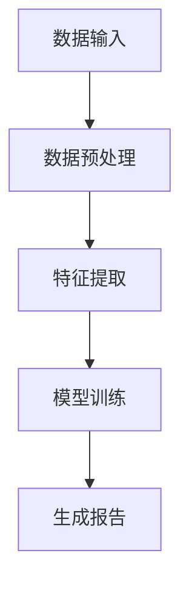
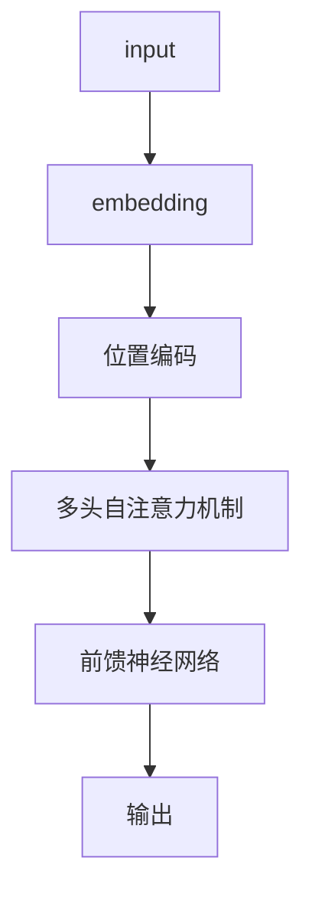
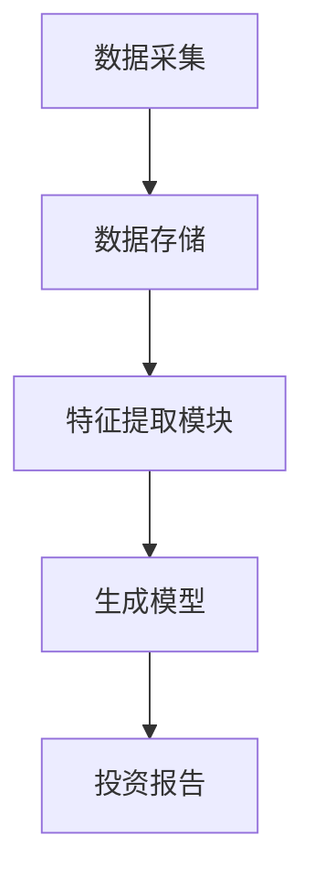
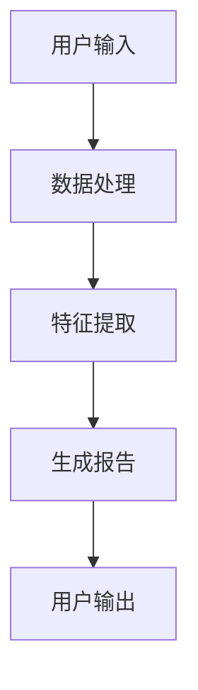

                 


# AI驱动的自动化投资报告生成

> 关键词：AI，投资报告，自动化，自然语言处理，机器学习，文本生成

> 摘要：本文探讨了如何利用AI技术实现投资报告的自动化生成。通过分析传统投资报告生成的痛点，介绍了AI驱动的自动化生成的核心概念、算法原理、系统架构设计以及项目实战，为读者提供从理论到实践的全面指导。

---

## 第1章：背景与基础

### 1.1 投资报告的生成现状

#### 1.1.1 传统投资报告的生成方式
传统的投资报告生成过程依赖于人工编写，包括数据收集、分析、撰写和校对等步骤。这种方式耗时长、效率低，且容易受到主观因素的影响。

#### 1.1.2 传统方法的局限性
- 数据依赖性高：需要大量人工收集和整理数据。
- 时间成本高：从数据收集到报告完成需要数天时间。
- 一致性问题：不同分析师可能会产生不同的报告结果。

#### 1.1.3 AI驱动的自动化优势
AI技术的应用可以显著提高投资报告生成的效率和准确性。通过自动化处理数据、生成分析和撰写报告，AI能够快速提供高质量的投资建议。

---

### 1.2 自动化投资报告的核心概念

#### 1.2.1 自动化生成的定义
自动化投资报告生成是指利用AI技术，通过算法自动处理数据、分析信息并生成结构化的投资报告。

#### 1.2.2 AI在投资报告中的应用范围
- 数据分析与预测
- 文本生成
- 投资策略推荐

#### 1.2.3 技术实现的关键点
- 数据预处理与特征提取
- 自然语言处理模型的应用
- 生成模型的优化与调优

---

## 第2章：AI驱动的自动化投资报告生成原理

### 2.1 自然语言处理与生成

#### 2.1.1 NLP技术在文本生成中的应用
自然语言处理（NLP）技术是AI驱动投资报告生成的核心。通过NLP，模型可以理解投资数据并生成自然流畅的文本。

#### 2.1.2 大模型在投资报告生成中的作用
大模型（如GPT系列）具有强大的文本生成能力，能够根据输入的数据和上下文生成高质量的投资报告。

---

### 2.2 机器学习与数据驱动

#### 2.2.1 数据驱动的投资分析
机器学习模型通过分析大量历史数据，识别投资模式和趋势，为报告生成提供数据支持。

#### 2.2.2 机器学习模型的训练与应用
- 数据预处理：清洗、标准化和特征提取。
- 模型训练：使用投资相关数据训练模型，使其能够理解投资场景。
- 模型应用：将训练好的模型用于实际投资数据的分析和报告生成。

---

### 2.3 投资决策与自动化生成的关系

#### 2.3.1 数据流与模型关系（ER图）
以下是一个简化的ER图，展示了投资数据、模型和生成报告之间的关系：

```mermaid
erDiagram
    投资数据 <--- 数据源
    数据源 --> 特征提取模块
    特征提取模块 --> 生成模型
    生成模型 --> 投资报告
```

#### 2.3.2 系统功能与核心要素（流程图）
以下是一个系统功能流程图：



---

## 第3章：算法原理与实现

### 3.1 大模型的文本生成机制

#### 3.1.1 Transformer架构（Mermaid流程图）
以下是一个Transformer架构的简要流程图：



#### 3.1.2 损失函数与优化器（数学公式）
- 损失函数：交叉熵损失
  $$\mathcal{L}(\theta) = -\frac{1}{N}\sum_{i=1}^{N} \sum_{j=1}^{M} y_{i,j} \log(p_{i,j})$$
- 优化器：Adam优化器
  $$\theta_{t+1} = \theta_t - \eta \frac{\partial \mathcal{L}}{\partial \theta_t}$$

---

### 3.2 投资数据的特征提取

#### 3.2.1 特征工程方法
- 数据清洗：去除无效数据。
- 特征选择：选择对投资分析有影响的关键特征。

#### 3.2.2 特征选择的数学模型
- 稳定期：数据的平稳性检验。
- 重要性评估：使用特征重要性评分模型（如XGBoost）评估特征的重要性。

---

## 第4章：系统分析与架构设计

### 4.1 系统架构设计

#### 4.1.1 系统架构（Mermaid图）
以下是一个简要的系统架构图：



#### 4.1.2 接口设计与交互流程（Mermaid图）
以下是一个接口交互流程图：



---

## 第5章：项目实战

### 5.1 环境搭建与数据准备

#### 5.1.1 环境搭建
- Python 3.8+
- PyTorch 2.0+
- transformers库

#### 5.1.2 数据准备
- 数据来源：股票市场数据（如K线图、成交量等）。
- 数据格式：CSV格式。

---

### 5.2 核心实现

#### 5.2.1 数据预处理
```python
import pandas as pd

# 读取数据
data = pd.read_csv('stock_data.csv')

# 数据清洗
data.dropna(inplace=True)
```

#### 5.2.2 模型训练
```python
from transformers import AutoModelWithLM, AutoTokenizer

# 加载预训练模型
model_name = 'gpt2'
tokenizer = AutoTokenizer.from_pretrained(model_name)
model = AutoModelWithLM.from_pretrained(model_name)
```

#### 5.2.3 文本生成
```python
def generate_report(context):
    inputs = tokenizer.encode(context, return_tensors='pt')
    outputs = model.generate(inputs, max_length=500)
    report = tokenizer.decode(outputs[0], skip_special_tokens=True)
    return report

context = "最近的市场趋势显示..."
report = generate_report(context)
print(report)
```

---

### 5.3 案例分析

#### 5.3.1 案例背景
分析某股票的历史数据，生成投资建议报告。

#### 5.3.2 数据分析
```python
import matplotlib.pyplot as plt

data['close'].plot()
plt.show()
```

#### 5.3.3 生成报告
```python
context = "某股票的历史数据：..."
report = generate_report(context)
print(report)
```

---

## 第6章：最佳实践与小结

### 6.1 最佳实践

#### 6.1.1 数据隐私与安全
确保投资数据的安全性，防止数据泄露。

#### 6.1.2 模型可解释性
提升模型的可解释性，便于用户理解和信任生成的报告。

#### 6.1.3 模型优化
定期更新模型，提升生成报告的准确性和相关性。

---

### 6.2 小结

AI驱动的自动化投资报告生成是一个充满潜力的领域。通过结合NLP、机器学习和系统架构设计，我们可以显著提高投资分析的效率和准确性。

---

## 作者

作者：AI天才研究院/AI Genius Institute & 禅与计算机程序设计艺术 /Zen And The Art of Computer Programming

---

通过以上内容，读者可以系统地了解AI驱动的自动化投资报告生成的背景、原理、实现和应用。

