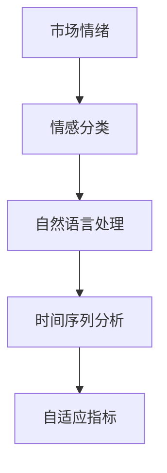
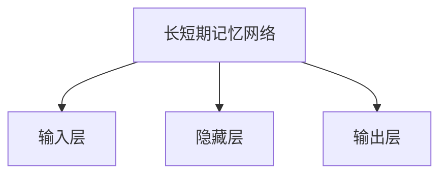
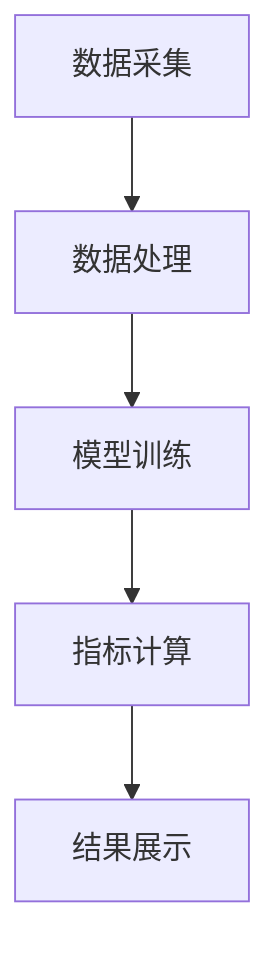
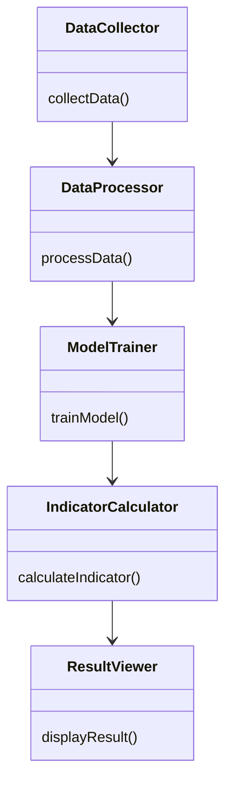
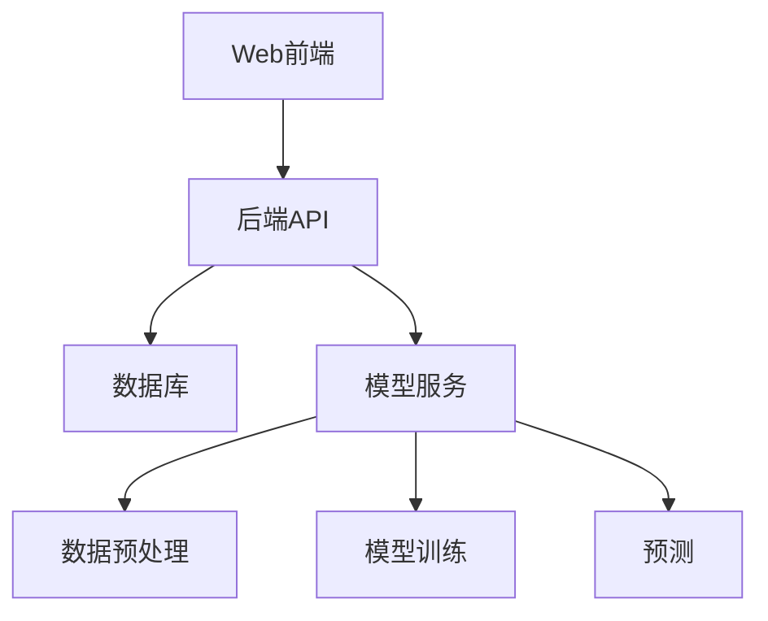
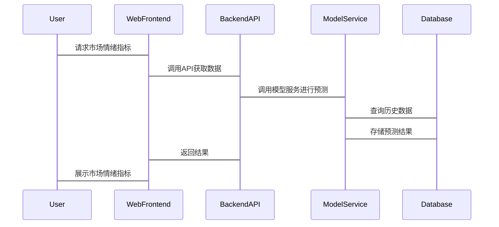

                 


# 《AI驱动的自适应市场情绪指标》

> 关键词：AI，市场情绪，自适应指标，情感分析，LSTM，时间序列分析

> 摘要：本文详细探讨了利用人工智能技术构建自适应市场情绪指标的方法，从市场情绪的基本概念到AI技术的应用，再到具体的算法原理和系统架构设计，最后通过实际案例展示如何实现这一指标。本文旨在为读者提供从理论到实践的全面指导，帮助他们理解并掌握如何利用AI技术来分析和预测市场情绪。

---

# 第1章: 市场情绪与自适应指标概述

## 1.1 市场情绪的基本概念

### 1.1.1 市场情绪的定义

市场情绪是指投资者在市场中的情感倾向，通常反映为对市场走势的乐观或悲观态度。这种情绪可以通过新闻、社交媒体、交易数据等多源信息进行捕捉和量化。

### 1.1.2 市场情绪的影响因素

- **宏观经济因素**：如GDP增长率、利率、通货膨胀率等。
- **市场行为因素**：如交易量、股价波动、订单簿数据等。
- **外部事件因素**：如政策变化、国际局势、自然灾害等。

### 1.1.3 市场情绪的度量方法

- **情绪指数**：如恐慌指数（VIX）、投资者信心指数等。
- **文本情绪分析**：通过对新闻、评论等文本数据进行情感分类，量化市场情绪。

## 1.2 自适应市场情绪指标的定义

### 1.2.1 自适应指标的核心概念

自适应市场情绪指标是一种能够根据市场环境动态调整的指标，能够在不同的市场条件下自动优化其参数和模型结构，以更准确地反映市场情绪。

### 1.2.2 自适应指标与传统指标的区别

- **传统指标**：固定参数，无法根据市场变化调整。
- **自适应指标**：动态调整参数和模型，适应市场环境的变化。

### 1.2.3 自适应指标的应用场景

- **金融交易**：帮助投资者做出更明智的交易决策。
- **风险管理**：通过实时情绪监控，提前识别和应对市场风险。
- **市场预测**：结合情绪分析和市场数据，提高市场预测的准确性。

## 1.3 AI技术在市场情绪分析中的作用

### 1.3.1 AI技术的基本原理

人工智能（AI）通过机器学习、自然语言处理（NLP）和时间序列分析等技术，能够从多源异构数据中提取特征，并构建预测模型。

### 1.3.2 AI技术在情绪分析中的优势

- **自动化**：能够自动处理大量数据，提取情感特征。
- **高精度**：通过深度学习模型，可以实现高精度的情感分类。
- **动态调整**：能够根据市场变化动态调整模型参数。

### 1.3.3 AI技术的挑战与局限性

- **数据质量**：需要高质量的标注数据来训练模型。
- **计算成本**：深度学习模型需要大量的计算资源。
- **模型解释性**：复杂的模型往往缺乏可解释性。

## 1.4 本章小结

本章从市场情绪的基本概念出发，介绍了自适应市场情绪指标的定义及其应用场景，并分析了AI技术在市场情绪分析中的优势与挑战。

---

# 第2章: 市场情绪分析的核心概念与联系

## 2.1 核心概念与原理

### 2.1.1 情感分类的基本原理

情感分类是将文本分为不同情感类别（如正面、负面、中性）的过程。常用算法包括支持向量机（SVM）、随机森林（Random Forest）和深度学习模型（如LSTM）。

### 2.1.2 自然语言处理在情感分析中的应用

自然语言处理（NLP）技术用于从文本中提取情感特征，如词袋模型（Bag of Words）、词嵌入（Word Embedding）和注意力机制（Attention）。

### 2.1.3 时间序列分析在市场情绪预测中的作用

时间序列分析用于分析市场情绪的时间变化，常用模型包括ARIMA、GARCH和LSTM。

## 2.2 核心概念对比表格

| 概念         | 描述                                                                 |
|--------------|----------------------------------------------------------------------|
| 情感分类     | 对文本情感倾向进行分类（如正面、负面、中性）                         |
| 时间序列分析 | 对市场情绪的时间变化进行建模和预测                                   |
| 自然语言处理 | 提取文本中的情感特征                                                 |

## 2.3 ER实体关系图



## 2.4 本章小结

本章通过核心概念对比和实体关系图，展示了市场情绪分析中各技术之间的联系及其在自适应市场情绪指标中的作用。

---

# 第3章: AI驱动的自适应市场情绪指标算法原理

## 3.1 算法原理概述

### 3.1.1 基于LSTM的情感分析模型

LSTM（长短期记忆网络）是一种特殊的RNN（循环神经网络），能够有效捕捉时间序列中的长期依赖关系。

#### LSTM的工作原理



#### LSTM的数学公式

$$ \text{LSTM单元的输入门} = \sigma(W_i x + U_i h_{\text{prev}} + b_i) $$

$$ \text{LSTM单元的遗忘门} = \sigma(W_f x + U_f h_{\text{prev}} + b_f) $$

$$ \text{LSTM单元的输出门} = \sigma(W_o x + U_o h_{\text{prev}} + b_o) $$

### 3.1.2 情感分析模型的数学公式

$$ \text{情感得分} = \text{模型输出层} $$

---

## 3.2 算法实现步骤

### 3.2.1 数据预处理

- **文本清洗**：去除停用词、标点符号等。
- **分词**：将文本分割成单词或短语。
- **向量化**：将文本转换为向量表示（如Word2Vec、GloVe）。

### 3.2.2 模型训练

- **选择模型结构**：如LSTM、Transformer等。
- **定义损失函数**：如交叉熵损失。
- **选择优化器**：如Adam、SGD。

### 3.2.3 模型评估

- **准确率**：分类正确的样本比例。
- **召回率**：实际为正样本中被正确分类的比例。
- **F1分数**：准确率和召回率的调和平均数。

## 3.3 本章小结

本章详细介绍了自适应市场情绪指标的核心算法原理，包括LSTM的情感分析模型及其数学公式，以及算法实现的步骤和评估指标。

---

# 第4章: 自适应市场情绪指标的系统架构设计

## 4.1 系统功能设计

### 4.1.1 系统功能模块

- **数据采集模块**：采集新闻、社交媒体、交易数据等多源数据。
- **数据处理模块**：清洗、转换和标准化数据。
- **模型训练模块**：训练情感分析模型和时间序列预测模型。
- **指标计算模块**：根据模型输出计算市场情绪指标。
- **结果展示模块**：以可视化的方式展示市场情绪指标和预测结果。

### 4.1.2 系统功能流程图



### 4.1.3 系统功能类图



## 4.2 系统架构设计

### 4.2.1 系统架构图



### 4.2.2 系统接口设计

- **数据接口**：提供数据采集和处理的API。
- **模型接口**：提供模型训练和预测的API。
- **结果接口**：提供结果展示和查询的API。

### 4.2.3 系统交互序列图



## 4.3 本章小结

本章从系统架构设计的角度，详细介绍了自适应市场情绪指标的系统功能模块、架构图和交互序列图，为后续的实现提供了理论基础。

---

# 第5章: 项目实战与案例分析

## 5.1 项目环境安装

### 5.1.1 安装Python环境

```bash
python --version
pip install numpy pandas scikit-learn tensorflow
```

### 5.1.2 安装其他依赖

```bash
pip install transformers
pip install plotly
pip install pymermaid
```

## 5.2 系统核心实现源代码

### 5.2.1 数据预处理代码

```python
import pandas as pd
import numpy as np

def preprocess_data(data):
    # 去除缺失值
    data = data.dropna()
    # 标准化处理
    from sklearn.preprocessing import StandardScaler
    scaler = StandardScaler()
    data_scaled = scaler.fit_transform(data)
    return data_scaled
```

### 5.2.2 情感分析模型代码

```python
import tensorflow as tf
from tensorflow.keras.layers import LSTM, Dense, Dropout, Input
from tensorflow.keras.models import Model

def build_lstm_model(input_shape):
    inputs = Input(shape=input_shape)
    lstm_layer = LSTM(64, return_sequences=False)(inputs)
    dropout = Dropout(0.5)(lstm_layer)
    dense_layer = Dense(1, activation='sigmoid')(dropout)
    model = Model(inputs=inputs, outputs=dense_layer)
    return model
```

### 5.2.3 时间序列预测代码

```python
from sklearn.metrics import accuracy_score, recall_score, f1_score

def evaluate_model(y_true, y_pred):
    accuracy = accuracy_score(y_true, y_pred)
    recall = recall_score(y_true, y_pred)
    f1 = f1_score(y_true, y_pred)
    return accuracy, recall, f1
```

## 5.3 实际案例分析

### 5.3.1 数据来源

- 新闻数据：来自路透社、彭博社等新闻网站。
- 社交媒体数据：来自Twitter、Reddit等平台。
- 交易数据：来自金融数据供应商。

### 5.3.2 数据处理与建模

```python
import pandas as pd
import numpy as np
from sklearn.model_selection import train_test_split
from tensorflow.keras.utils import to_categorical

data = pd.read_csv('market_sentiment.csv')
X = data.drop('sentiment', axis=1).values
y = data['sentiment'].values
X_train, X_test, y_train, y_test = train_test_split(X, y, test_size=0.2)
y_train_categorical = to_categorical(y_train, num_classes=3)
```

### 5.3.3 模型训练与预测

```python
from tensorflow.keras.callbacks import EarlyStopping

model = build_lstm_model((X_train.shape[1], 1))
model.compile(loss='binary_crossentropy', optimizer='adam', metrics=['accuracy'])
early_stop = EarlyStopping(monitor='val_loss', patience=5)
model.fit(X_train, y_train_categorical, epochs=10, batch_size=32, validation_data=(X_test, y_test_categorical), callbacks=[early_stop])
```

### 5.3.4 模型评估

```python
y_pred = model.predict(X_test)
accuracy, recall, f1 = evaluate_model(y_test, np.argmax(y_pred, axis=1))
print(f"Accuracy: {accuracy}, Recall: {recall}, F1: {f1}")
```

## 5.4 本章小结

本章通过实际案例分析，详细展示了自适应市场情绪指标的项目环境安装、核心代码实现以及模型评估过程，为读者提供了从理论到实践的完整指导。

---

# 第6章: 总结与拓展阅读

## 6.1 本章总结

自适应市场情绪指标是一种能够动态调整的市场情绪分析方法，通过AI技术可以实现高精度的情感分类和时间序列预测，为投资者和市场分析师提供了有力的工具。

## 6.2 拓展阅读

- **相关书籍**：
  - 《深度学习》—— Ian Goodfellow
  - 《自然语言处理入门》—— 丹尼尔·拉鲁什
- **论文推荐**：
  - "LSTM-based stock market prediction" by [作者]
  - "Adaptive sentiment analysis in financial markets" by [作者]

## 6.3 注意事项

- **数据质量**：确保数据来源可靠，避免噪声干扰。
- **模型解释性**：选择可解释性较强的模型，便于分析和优化。
- **实时性**：在实际应用中，需要考虑计算资源的限制，确保模型的实时性。

## 6.4 本章小结

本章总结了自适应市场情绪指标的核心内容，并提供了拓展阅读和注意事项，帮助读者进一步深入理解和应用这一技术。

---

# 作者：AI天才研究院/AI Genius Institute & 禅与计算机程序设计艺术/Zen And The Art of Computer Programming

