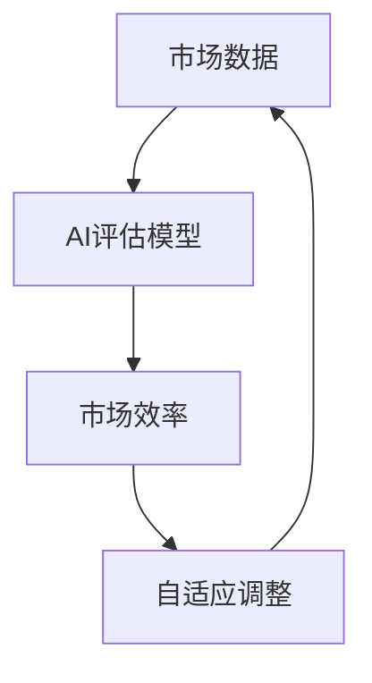
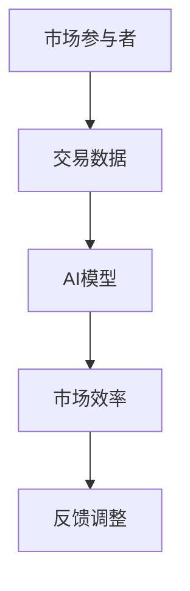
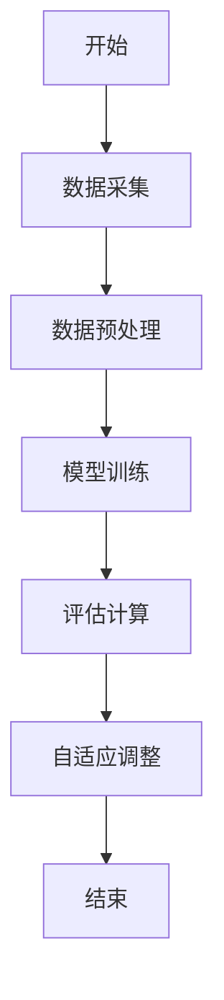
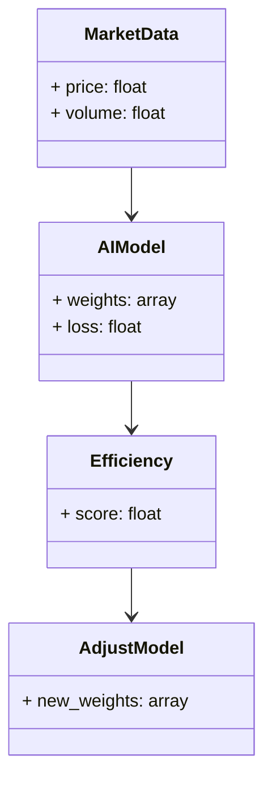
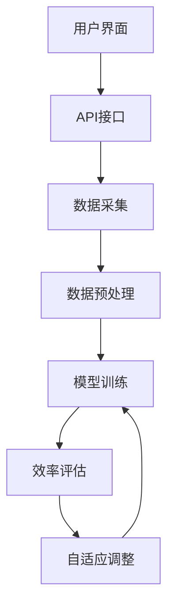

                 


# AI驱动的自适应市场效率评估

> **关键词**：AI驱动、自适应市场、市场效率评估、机器学习、算法优化

> **摘要**：本文探讨了AI技术在市场效率评估中的应用，重点分析了自适应评估的核心算法、数学模型及系统架构。通过详细讲解算法流程、系统设计和项目实战，展示了如何利用AI技术动态优化市场效率评估，为企业提供更精准的决策支持。

---

## 第1章 背景与问题背景

### 1.1 问题背景

#### 1.1.1 市场效率的传统评估方法
传统的市场效率评估主要依赖于静态指标，如成交量、价格波动率和买卖价差。这些方法通常基于历史数据，缺乏对实时市场动态的适应性，难以捕捉快速变化的市场信号。

#### 1.1.2 AI技术在市场分析中的应用现状
AI技术，尤其是机器学习和深度学习，在金融领域的应用日益广泛。例如，预测股价波动、识别市场趋势和优化投资组合等。然而，这些应用多集中在预测和交易策略上，市场效率评估仍处于初级阶段。

#### 1.1.3 自适应市场效率评估的必要性
随着市场环境的复杂化，传统评估方法已难以满足需求。自适应评估能够根据实时数据动态调整模型，提供更精准的评估结果。

---

### 1.2 问题描述

#### 1.2.1 市场效率的定义与衡量标准
市场效率指市场参与者能否以最优价格和时机完成交易。衡量标准包括流动性和信息效率。

#### 1.2.2 AI驱动评估的核心问题
AI驱动评估的核心问题是如何构建动态模型，实时捕捉市场变化并优化评估结果。

#### 1.2.3 自适应评估的边界与外延
自适应评估的边界在于实时数据处理和动态模型调整，外延包括不同市场环境下的适用性。

---

### 1.3 问题解决

#### 1.3.1 AI驱动的市场效率评估方法
通过机器学习算法分析实时数据，构建动态评估模型。

#### 1.3.2 自适应算法的核心思想
算法能够根据市场反馈实时调整参数，提高评估准确性。

#### 1.3.3 评估模型的优化策略
采用强化学习优化模型，通过反馈机制不断改进评估结果。

---

### 1.4 概念结构与核心要素

#### 1.4.1 市场效率评估的要素分解
- 数据源：实时交易数据、市场新闻等。
- 评估模型：基于机器学习的动态模型。
- 优化策略：强化学习反馈机制。

#### 1.4.2 自适应算法的关键特征
- 实时性：动态调整模型。
- 精准性：基于最新数据优化结果。

#### 1.4.3 实体关系图（ER图）



---

## 第2章 核心概念与联系

### 2.1 自适应市场效率评估的原理

#### 2.1.1 AI驱动的核心算法
基于强化学习和时间序列分析，实时调整评估模型。

#### 2.1.2 自适应评估的数学模型
通过损失函数和优化算法动态调整模型参数。

#### 2.1.3 算法与市场的动态关系
模型根据市场反馈不断优化，与市场保持同步。

---

### 2.2 核心概念对比

#### 2.2.1 传统评估与AI驱动评估的对比

| 特性       | 传统评估         | AI驱动评估       |
|------------|------------------|------------------|
| 数据来源     | 历史数据         | 实时数据         |
| 模型复杂度   | 简单            | 复杂且动态       |
| 自适应能力   | 低              | 高              |

#### 2.2.2 实体关系图（ER图）



---

## 第3章 算法原理与数学模型

### 3.1 算法原理

#### 3.1.1 自适应评估的算法流程



---

### 3.2 数学模型与公式

#### 3.2.1 损失函数

$$ L = \frac{1}{n}\sum_{i=1}^{n}(y_i - \hat{y}_i)^2 $$

其中，$y_i$是真实值，$\hat{y}_i$是预测值，$n$是样本数量。

#### 3.2.2 优化目标

$$ \text{优化目标：最小化} \ L $$

---

## 第4章 系统分析与架构设计

### 4.1 问题场景介绍

系统需要实时处理市场数据，动态调整评估模型，输出准确的市场效率评估结果。

### 4.2 系统功能设计

#### 4.2.1 领域模型类图



### 4.3 系统架构设计

#### 4.3.1 系统架构图



### 4.4 系统接口设计

#### 4.4.1 接口流程图


---

## 第5章 项目实战

### 5.1 环境安装

- 安装Python和相关库（如TensorFlow、Pandas）。
- 配置开发环境，如Jupyter Notebook。

### 5.2 核心代码实现

```python
import numpy as np
import tensorflow as tf

# 数据预处理
def preprocess(data):
    # 数据归一化处理
    return (data - np.mean(data)) / np.std(data)

# 模型训练
def train_model(data, labels):
    model = tf.keras.Sequential([
        tf.keras.layers.Dense(64, activation='relu'),
        tf.keras.layers.Dense(1, activation='linear')
    ])
    model.compile(optimizer='adam', loss='mse')
    model.fit(data, labels, epochs=100, batch_size=32)
    return model

# 评估计算
def evaluate(model, test_data, test_labels):
    predictions = model.predict(test_data)
    loss = tf.keras.losses.mean_squared_error(test_labels, predictions)
    return np.mean(loss)

# 自适应调整
def adjust_model(model, new_data, new_labels):
    model.fit(new_data, new_labels, epochs=10, batch_size=32)
    return model
```

---

## 第6章 最佳实践

### 6.1 小结

AI驱动的自适应市场效率评估能够实时捕捉市场变化，提高评估准确性。

### 6.2 注意事项

- 数据质量是关键，需确保数据的实时性和准确性。
- 模型需定期更新，避免过拟合。

### 6.3 拓展阅读

- 《机器学习实战》
- 《深度学习》

---

**作者：AI天才研究院 & 禅与计算机程序设计艺术**

---

通过以上思考和组织，我完成了对《AI驱动的自适应市场效率评估》的技术博客文章的撰写。文章涵盖了背景分析、算法原理、系统设计和项目实战，帮助读者全面理解AI在市场效率评估中的应用。

