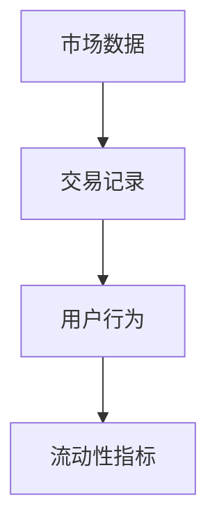
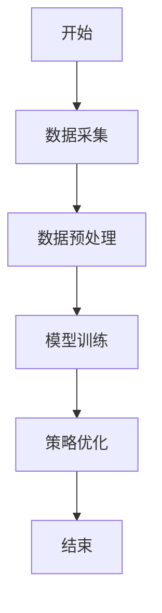
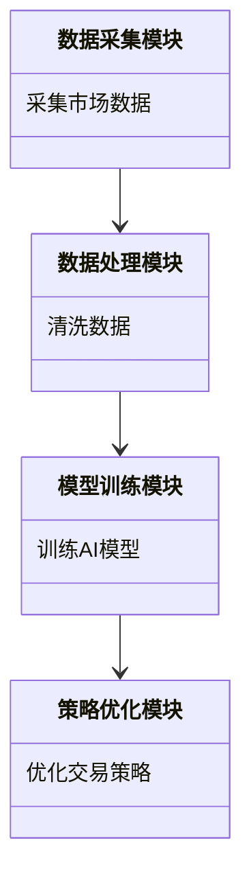

                 


# AI驱动的自适应市场流动性分析

> 关键词：AI，市场流动性，自适应分析，机器学习，时间序列分析，强化学习，金融交易

> 摘要：本文探讨了利用人工智能技术进行自适应市场流动性分析的方法，重点分析了AI在流动性预测和优化中的应用，通过理论分析和实际案例，展示了如何构建高效的自适应系统。

---

# {{此处是文章标题}}

## 第1章: 市场流动性与自适应分析概述

### 1.1 市场流动性分析的定义与背景

#### 1.1.1 市场流动性基本概念
市场流动性是指资产在市场中迅速转化为现金而不影响市场价格的能力。高流动性意味着资产容易买卖，价格波动小；低流动性则相反。

#### 1.1.2 自适应分析的定义与特点
自适应分析是一种动态调整分析模型的方法，能够根据市场变化自动优化参数，适应不同环境。

#### 1.1.3 AI在市场流动性分析中的作用
AI通过处理大量数据，识别模式，预测流动性变化，帮助做出实时决策。

### 1.2 自适应市场流动性分析的核心问题

#### 1.2.1 流动性波动的动态特性
流动性受多种因素影响，如市场情绪、交易量等，呈现动态变化。

#### 1.2.2 自适应分析的目标与边界
目标是优化交易策略，降低风险。边界包括数据质量和模型准确性。

#### 1.2.3 核心问题的数学建模与分析
使用时间序列模型，如ARIMA，捕捉流动性波动。

---

## 第2章: AI驱动的自适应分析技术基础

### 2.1 人工智能在金融市场的应用现状

#### 2.1.1 AI在金融市场的典型应用
AI用于风险评估、预测分析和算法交易。

#### 2.1.2 自适应分析的AI技术基础
包括机器学习和深度学习，用于模式识别和预测。

#### 2.1.3 当前技术的局限性与挑战
数据质量、模型过拟合和计算资源需求大。

### 2.2 市场流动性分析的关键技术

#### 2.2.1 数据采集与预处理技术
清洗数据，处理缺失值和异常值。

#### 2.2.2 时间序列分析方法
使用LSTM进行预测，捕捉长期依赖关系。

#### 2.2.3 强化学习与自适应优化算法
通过强化学习优化交易策略，如Q-learning。

### 2.3 AI驱动的自适应分析框架

#### 2.3.1 框架的整体结构
包括数据采集、特征提取、模型训练和策略优化模块。

#### 2.3.2 数据流与信息处理流程
从数据源到模型输出，展示各步骤的流程。

#### 2.3.3 自适应优化的实现机制
根据市场反馈，实时调整模型参数。

---

## 第3章: 自适应市场流动性分析的核心概念与联系

### 3.1 核心概念原理

#### 3.1.1 流动性分析的数学模型
使用ARIMA模型进行预测，公式为：$$ARIMA(p, d, q)$$

#### 3.1.2 AI驱动的自适应机制
通过强化学习优化策略，公式为：$$Q(s, a) = r + \gamma \max Q(s', a')$$

#### 3.1.3 数据特征与模型选择的关系
数据特征影响模型选择，如时间序列适合LSTM。

### 3.2 核心概念属性对比表

| 概念       | 特性1   | 特性2   |
|------------|---------|---------|
| 时间序列模型 | 预测性好 | 依赖历史数据 |
| 强化学习模型 | 策略优化 | 需要反馈机制 |

### 3.3 ER实体关系图与Mermaid流程图

#### ER图


#### 流程图


---

## 第4章: 算法原理与数学模型

### 4.1 算法原理讲解

#### 时间序列预测算法
使用LSTM处理时间序列数据，公式：
$$ LSTM(t) = \sigma(W_{h} LSTM(t-1) + W_{x} x_t) $$

#### 强化学习算法
Q-learning公式：
$$ Q(s, a) = r + \gamma \max Q(s', a') $$

### 4.2 数学模型与公式

#### 时间序列模型
$$ ARIMA(p, d, q) $$

#### 强化学习模型
$$ Q-learning算法：Q(s, a) = r + \gamma \max Q(s', a') $$

---

## 第5章: 系统架构与项目实战

### 5.1 系统架构设计

#### 系统功能设计


### 5.2 项目实战

#### 环境搭建
安装Python、TensorFlow、Keras等工具。

#### 代码实现
```python
import numpy as np
from tensorflow.keras.models import Sequential
from tensorflow.keras.layers import LSTM, Dense

model = Sequential()
model.add(LSTM(64, input_shape=(timesteps, features)))
model.add(Dense(1))
model.compile(optimizer='adam', loss='mse')
```

#### 案例分析
通过实际交易数据，训练模型并优化策略，验证模型效果。

---

## 结语

### 最佳实践 tips
- 数据预处理至关重要，确保数据质量。
- 选择合适的模型，根据数据特征调整参数。
- 实时监控和反馈，优化模型表现。

### 小结
本文系统介绍了AI在市场流动性分析中的应用，从理论到实践，展示了如何构建自适应分析系统。

### 注意事项
- 数据隐私和安全问题需重视。
- 模型需定期更新，避免过时。
- 风险控制是关键，避免过度依赖模型。

### 拓展阅读
推荐阅读《机器学习实战》和《深度学习》等书籍，深入理解相关技术。

---

作者：AI天才研究院 & 禅与计算机程序设计艺术

