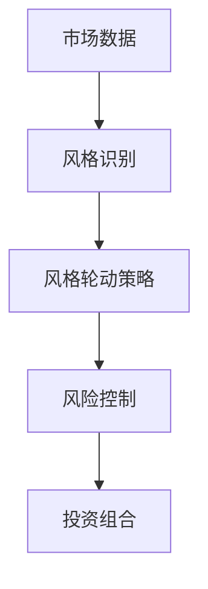
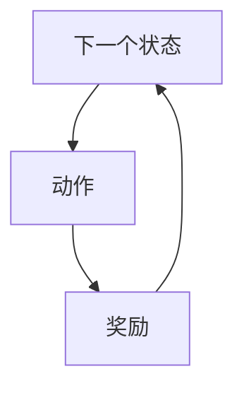

                 


---

# AI驱动的自适应投资风格轮动

> 关键词：AI驱动，自适应投资风格轮动，算法，系统架构，项目实战

> 摘要：本文探讨了如何利用人工智能技术实现投资风格的自适应轮动，通过分析市场变化和投资者需求，提出了一种基于AI的动态调整策略。文章详细介绍了核心概念、算法原理、系统架构设计以及实际项目案例，为读者提供了一套完整的解决方案。

---

## 第一部分: AI驱动的自适应投资风格轮动概述

### 第1章: AI驱动的自适应投资风格轮动背景与意义

#### 1.1 投资风格轮动的背景与重要性

##### 1.1.1 投资风格轮动的定义

投资风格轮动是指根据市场环境的变化，动态调整投资策略和资产配置的过程。传统的投资风格（如成长型、价值型、周期型等）在不同的市场条件下表现各异，投资者需要根据市场变化及时调整投资组合以实现最大收益。

##### 1.1.2 市场环境变化与投资风格轮动的关系

市场环境的变化，如经济周期波动、政策调整、突发事件等，都会影响不同投资风格的表现。例如，在经济增长期，周期性股票可能表现较好，而在经济衰退期，防御性股票可能更受青睐。

##### 1.1.3 自适应投资风格轮动的意义

自适应投资风格轮动能够根据实时市场数据和投资者风险偏好，动态调整投资组合，从而在不同市场环境下实现收益最大化和风险最小化。这种动态调整能力是传统静态投资策略无法比拟的。

#### 1.2 AI在投资风格轮动中的作用

##### 1.2.1 AI技术在金融领域的应用现状

人工智能技术已经在金融领域得到了广泛应用，包括股票预测、风险评估、交易策略优化等。AI能够处理海量数据，发现传统方法难以察觉的模式和趋势。

##### 1.2.2 AI驱动投资风格轮动的核心优势

AI能够实时分析市场数据，快速识别市场变化，并根据变化调整投资策略。此外，AI还可以根据投资者的个性化需求，提供定制化的投资建议。

##### 1.2.3 未来发展趋势与潜力

随着AI技术的不断进步，投资风格轮动将更加智能化和自动化。未来，AI驱动的投资风格轮动将更加注重个性化和实时性，帮助投资者在复杂多变的市场中获得更好的收益。

#### 1.3 本书的核心内容与目标

##### 1.3.1 本书的研究范围

本书主要研究如何利用人工智能技术实现投资风格的自适应轮动，包括数据处理、模型构建、策略优化等方面。

##### 1.3.2 本书的主要目标

通过理论分析和实践案例，帮助读者理解AI驱动的自适应投资风格轮动的核心原理，并掌握实际应用的方法。

##### 1.3.3 本书的结构安排

本书分为几个部分：背景与意义、核心概念、算法原理、系统架构设计、项目实战以及总结与展望。

---

## 第二部分: 自适应投资风格轮动的核心概念

### 第2章: 自适应投资风格轮动的核心概念

#### 2.1 投资风格轮动的定义与分类

##### 2.1.1 投资风格的定义

投资风格是指在特定市场环境下，投资者选择资产和配置投资比例的策略。常见的投资风格包括成长型、价值型、周期型等。

##### 2.1.2 投资风格的分类

根据不同的标准，投资风格可以分为多种类型。例如，按照资产类别可以分为股票型、债券型等；按照风险偏好可以分为保守型、平衡型、激进型等。

##### 2.1.3 投资风格轮动的机制

投资风格轮动的机制是指根据市场变化，动态调整投资风格的过程。这个过程需要结合市场数据、投资者需求和风险偏好等因素。

#### 2.2 AI驱动的自适应投资风格轮动原理

##### 2.2.1 数据驱动的投资风格识别

通过分析历史数据，识别不同投资风格的表现特征，建立风格识别模型。

##### 2.2.2 AI算法在风格轮动中的应用

利用机器学习算法（如聚类、分类等）对市场数据进行分析，识别当前市场环境下最适合的投资风格。

##### 2.2.3 自适应机制的核心算法

自适应机制的核心算法包括强化学习、自适应控制等，用于根据市场反馈动态调整投资策略。

#### 2.3 自适应投资风格轮动的关键要素

##### 2.3.1 数据来源与特征提取

数据来源包括市场数据、经济指标、投资者行为数据等。特征提取需要从这些数据中提取有用的特征，用于风格识别和轮动策略。

##### 2.3.2 AI模型的选择与训练

选择适合的AI模型，并利用历史数据进行训练，使其能够识别不同的投资风格并预测风格轮动的趋势。

##### 2.3.3 风险控制与收益优化

在自适应投资风格轮动的过程中，需要考虑风险控制，确保投资组合的稳定性，同时追求收益的最大化。

---

## 第三部分: 自适应投资风格轮动的算法原理

### 第3章: 自适应投资风格轮动的算法原理

#### 3.1 基于机器学习的风格识别算法

##### 3.1.1 传统机器学习算法在风格识别中的应用

常用的算法包括支持向量机（SVM）、随机森林（Random Forest）等。

##### 3.1.2 深度学习算法在风格识别中的优势

深度学习算法（如卷积神经网络、循环神经网络等）在处理复杂数据和非线性关系方面具有优势。

##### 3.1.3 算法选择的依据与优化

根据具体问题和数据特点选择合适的算法，并通过交叉验证等方法进行优化。

#### 3.2 基于强化学习的风格轮动策略

##### 3.2.1 强化学习的基本原理

强化学习通过智能体与环境的交互，学习最优策略。在投资风格轮动中，智能体可以根据市场反馈调整投资策略。

##### 3.2.2 强化学习在风格轮动中的应用

通过定义状态、动作和奖励函数，构建强化学习模型，实现投资风格的动态调整。

##### 3.2.3 策略优化与调参

通过调整强化学习模型的参数和超参数，优化策略的表现，提高收益和降低风险。

#### 3.3 自适应模型的构建与训练

##### 3.3.1 数据预处理与特征工程

对原始数据进行清洗、标准化等处理，并提取有助于风格识别的特征。

##### 3.3.2 模型训练与验证

利用训练数据训练模型，并通过验证数据评估模型的性能。

##### 3.3.3 模型评估与优化

通过测试数据评估模型的泛化能力，并根据评估结果进行优化。

---

## 第四部分: 系统架构与项目实战

### 第4章: 系统架构设计与实现

#### 4.1 问题场景介绍

在实际投资过程中，投资者需要根据市场变化动态调整投资风格。传统的静态投资策略难以适应复杂的市场环境。

#### 4.2 项目介绍

本项目旨在开发一个基于AI的自适应投资风格轮动系统，帮助投资者实现动态调整。

#### 4.3 系统功能设计

##### 4.3.1 数据采集模块

负责采集市场数据、经济指标等信息。

##### 4.3.2 风格识别模块

利用机器学习算法识别当前市场环境下的投资风格。

##### 4.3.3 轮动策略模块

根据识别结果和市场反馈，动态调整投资策略。

##### 4.3.4 风险控制模块

监控投资组合的风险，确保在可控范围内。

#### 4.4 系统架构设计

##### 4.4.1 功能模块划分

数据采集、风格识别、轮动策略、风险控制等模块。

##### 4.4.2 系统架构图

使用Mermaid绘制系统架构图，展示各模块之间的关系和交互。

#### 4.5 系统接口设计

定义各模块之间的接口，确保系统能够协同工作。

#### 4.6 系统交互流程

使用Mermaid绘制交互序列图，展示系统的运行流程。

---

## 第五部分: 项目实战

### 第5章: 项目实战与案例分析

#### 5.1 环境安装与配置

介绍开发环境的搭建，包括安装必要的库和工具。

#### 5.2 核心代码实现

展示系统的核心代码，包括数据处理、模型训练、策略调整等部分。

#### 5.3 代码应用解读与分析

详细解读代码的功能和实现细节，分析其在实际应用中的表现。

#### 5.4 实际案例分析

通过具体案例，展示系统的实际应用效果和表现。

#### 5.5 项目总结与经验分享

总结项目实施的经验和教训，提出改进建议。

---

## 第六部分: 总结与展望

### 第6章: 总结与展望

#### 6.1 本书的总结

回顾本书的主要内容和研究成果，强调AI驱动的自适应投资风格轮动的重要性和潜力。

#### 6.2 未来的研究方向

提出未来可能的研究方向，包括更复杂的模型、更广泛的数据来源、更个性化的投资策略等。

#### 6.3 最佳实践与注意事项

为读者提供一些实际操作中的建议和注意事项，帮助他们更好地应用本书的内容。

---

## 作者信息

作者：AI天才研究院/AI Genius Institute & 禅与计算机程序设计艺术 /Zen And The Art of Computer Programming

---

### 附录: 代码示例

#### 代码示例1: 数据处理

```python
import pandas as pd
import numpy as np

# 数据清洗
data = pd.read_csv('market_data.csv')
data = data.dropna()
data = data.drop_duplicates()

# 特征提取
features = data[['return', 'volatility', 'market_cap', 'pe_ratio']]
target = data['style']
```

#### 代码示例2: 模型训练

```python
from sklearn.ensemble import RandomForestClassifier

model = RandomForestClassifier(n_estimators=100, random_state=42)
model.fit(features, target)
```

#### 代码示例3: 强化学习策略

```python
import gym

env = gym.make('StockTradingEnv-v0')
agent = A2CAgent(env)
agent.train()
```

---

### 图表示例

#### 图表1: 投资风格分类的实体关系图



#### 图表2: 强化学习算法流程图



---

以上是《AI驱动的自适应投资风格轮动》的技术博客文章的完整目录和部分具体内容。文章详细介绍了AI在投资风格轮动中的应用，从理论到实践，为读者提供了全面的指导。

