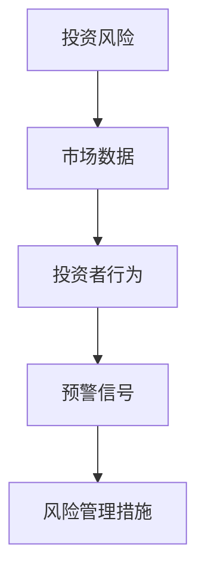
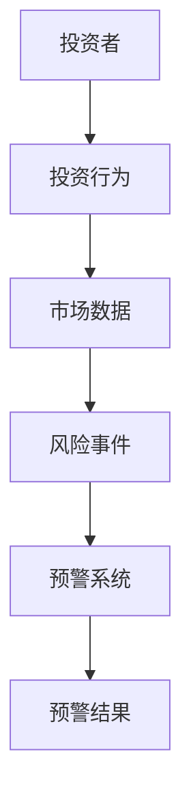
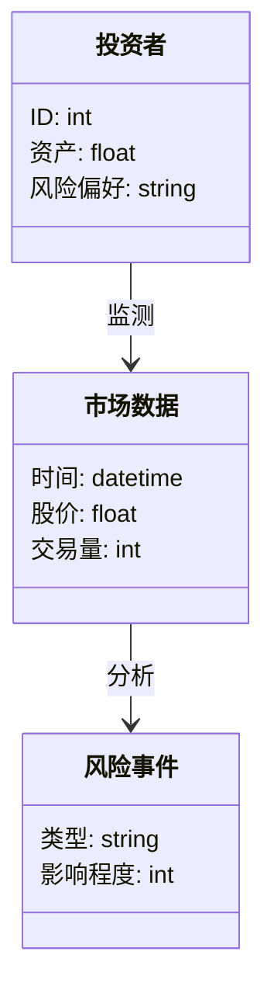
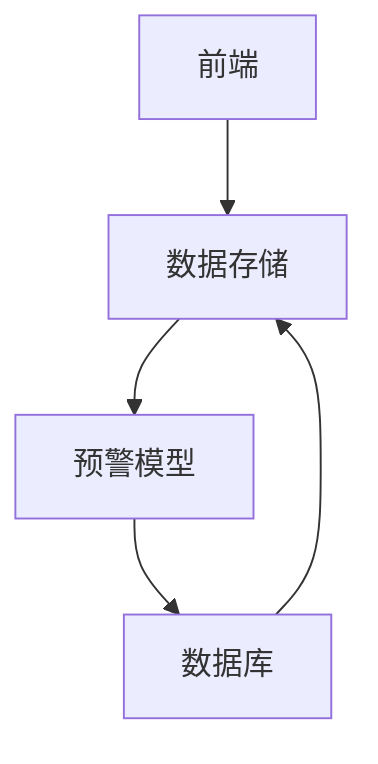
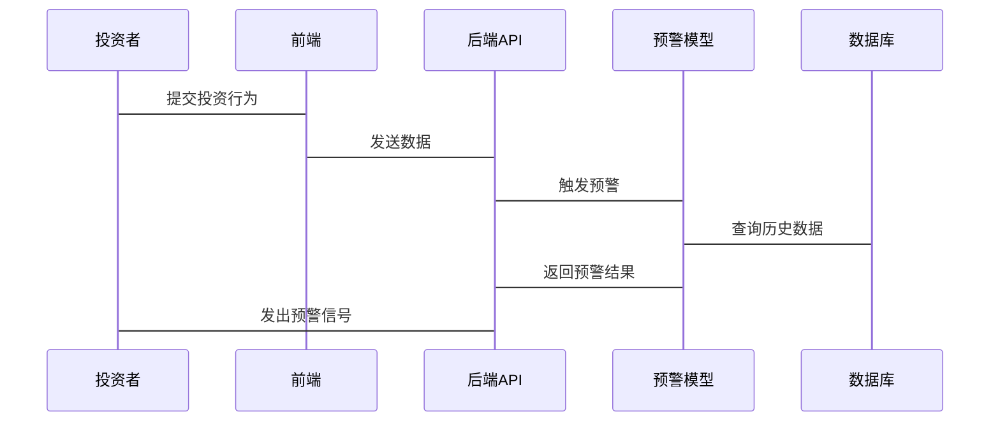

                 


# AI驱动的自适应投资风险预警

> 关键词：AI，投资风险，自适应预警，风险控制，深度学习

> 摘要：本文深入探讨了如何利用人工智能技术构建自适应投资风险预警系统，通过分析投资风险的核心要素，结合AI算法和实时数据处理，提出了一种创新的预警模型。文章详细讲解了自适应预警模型的原理、算法实现、系统架构，并通过实际案例展示了该系统的应用价值。

---

# 第一部分: 投资风险预警的背景与挑战

## 第1章: 投资风险预警的背景与挑战

### 1.1 问题背景

#### 1.1.1 投资风险的定义与分类
投资风险是指在投资过程中，由于市场波动、经济变化或其他不可预见因素，导致投资收益低于预期甚至出现损失的可能性。投资风险可以分为系统性风险（如市场风险、利率风险）和非系统性风险（如公司特定风险）。

#### 1.1.2 传统投资风险预警的局限性
传统的投资风险预警方法通常依赖于历史数据分析和统计模型，存在以下局限性：
- 数据更新频率低，无法实时捕捉市场变化。
- 预警模型缺乏灵活性，难以适应市场的快速变化。
- 预警结果的准确性依赖于模型假设，存在较大的主观性。

#### 1.1.3 AI技术在投资风险预警中的优势
人工智能技术，尤其是机器学习和深度学习，能够处理海量数据，并通过自适应学习不断优化模型，从而提高预警的准确性和实时性。

### 1.2 问题描述

#### 1.2.1 投资风险预警的核心目标
投资风险预警的核心目标是通过实时监测市场数据和投资者行为，及时识别潜在风险，并发出预警信号，帮助投资者采取相应的风险管理措施。

#### 1.2.2 投资风险预警的关键问题
- 如何高效处理海量数据并提取有效特征。
- 如何构建自适应模型以应对市场的动态变化。
- 如何保证预警系统的实时性和准确性。

#### 1.2.3 自适应预警的必要性
市场环境复杂多变，传统的静态模型难以应对突发事件和市场拐点，因此需要一种能够自适应调整的预警系统。

### 1.3 问题解决

#### 1.3.1 AI驱动的解决方案概述
通过AI技术，构建一个基于实时数据流的自适应预警系统，利用深度学习模型捕捉市场波动，并通过反馈机制不断优化模型。

#### 1.3.2 自适应模型的核心思想
自适应模型能够在数据流中动态调整参数，实时更新模型，从而更准确地预测风险。

#### 1.3.3 数据驱动的风险预警新范式
通过收集和分析市场数据、投资者行为数据等多源数据，构建一个数据驱动的预警系统，实现风险的早期识别。

### 1.4 边界与外延

#### 1.4.1 投资风险预警的边界条件
- 数据来源：包括市场数据、公司基本面数据、投资者行为数据等。
- 预警范围：仅针对特定类型的投资风险。
- 时间范围：实时监测和预警。

#### 1.4.2 自适应模型的应用范围
适用于股票、基金、债券等金融产品的投资风险预警。

#### 1.4.3 相关领域的联系与区别
与金融风险管理、量化投资等领域密切相关，但更专注于实时风险预警。

### 1.5 概念结构与核心要素

#### 1.5.1 概念框架图


#### 1.5.2 核心要素组成
- 数据采集：实时收集市场数据和投资者行为数据。
- 数据处理：清洗、特征提取和数据建模。
- 预警模型：构建自适应深度学习模型。
- 预警结果：输出风险信号并触发相应的风险管理措施。

#### 1.5.3 案例分析
假设某股票价格突然大幅波动，系统通过分析市场数据和投资者行为，识别出潜在的市场崩盘风险，并发出预警信号，帮助投资者及时调整投资策略。

---

# 第二部分: 自适应投资风险预警的核心概念与联系

## 第2章: 自适应预警模型的原理与实现

### 2.1 核心概念原理

#### 2.1.1 自适应模型的基本原理
自适应模型通过实时更新参数和模型结构，根据最新数据不断优化预警效果。

#### 2.1.2 AI在风险预警中的作用机制
AI技术能够处理非结构化数据，识别潜在风险模式，并提供实时预警。

#### 2.1.3 自适应学习的核心算法
自适应学习算法包括在线学习、迁移学习等，能够在动态环境中保持模型的有效性。

### 2.2 核心概念属性特征对比

#### 2.2.1 不同模型的特征对比
| 模型类型 | 是否自适应 | 数据需求 | 预警精度 |
|----------|------------|----------|----------|
| ARIMA    | 否         | 时间序列数据 | 较低     |
| LSTM     | 是         | 时间序列数据 | 较高     |
| Transformer | 是       | 多模态数据 | 高       |

#### 2.2.2 数据特征与模型性能的关系
数据特征越丰富，模型性能越好。例如，引入投资者情绪数据可以提高预警的准确性。

#### 2.2.3 自适应能力的评价指标
- 预警准确率：模型正确识别风险的概率。
- 预警延迟：从风险发生到预警信号发出的时间间隔。
- 模型更新频率：自适应模型的更新速度。

### 2.3 ER实体关系图架构



---

# 第三部分: 算法原理讲解

## 第3章: 自适应预警算法的数学模型

### 3.1 时间序列分析模型

#### 3.1.1 ARIMA模型
ARIMA模型用于分析时间序列数据，其数学公式为：
$$ ARIMA(p, d, q) $$
其中，p为自回归阶数，d为差分阶数，q为移动平均阶数。

#### 3.1.2 LSTM网络
LSTM是一种深度学习模型，通过长短期记忆单元捕捉时间序列的长期依赖关系。其核心公式为：
$$ f_t = \sigma(W_f \cdot [h_{t-1}, x_t]) $$
$$ i_t = \sigma(W_i \cdot [h_{t-1}, x_t]) $$
$$ o_t = \sigma(W_o \cdot [h_{t-1}, x_t]) $$
$$ c_t = f_t \cdot c_{t-1} + i_t \cdot tanh(W_c \cdot [h_{t-1}, x_t]) $$
$$ h_t = o_t \cdot tanh(c_t) $$

#### 3.1.3 模型比较与选择
LSTM在时间序列预测中表现优于ARIMA，尤其是在处理复杂市场波动时。

### 3.2 机器学习模型

#### 3.2.1 支持向量机（SVM）
SVM用于分类问题，其数学公式为：
$$ \text{最大化} \ 1/\lambda ||w||^2 $$
$$ \text{subject to} \ y_i (w \cdot x_i + b) \geq 1 $$

#### 3.2.2 随机森林（Random Forest）
随机森林通过集成多个决策树模型提高预测精度。

### 3.3 深度学习模型

#### 3.3.1 Transformer架构
Transformer用于处理序列数据，其核心思想是引入自注意力机制：
$$ \text{Attention}(Q, K, V) = \text{softmax}(\frac{QK^T}{\sqrt{d_k}})V $$

#### 3.3.2 图神经网络（GNN）
GNN用于处理图结构数据，其数学公式为：
$$ H = G \cdot H $$
其中，G为图的邻接矩阵，H为节点嵌入向量。

---

## 第4章: 算法实现与代码示例

### 4.1 时间序列分析代码示例

#### LSTM模型实现
```python
import numpy as np
from keras.models import Sequential
from keras.layers import LSTM, Dense

# 数据准备
X_train = np.random.rand(1000, 1, 5)
y_train = np.random.rand(1000, 1)

# 模型构建
model = Sequential()
model.add(LSTM(64, input_shape=(1, 5)))
model.add(Dense(1))
model.compile(loss='mean_squared_error', optimizer='adam')

# 模型训练
model.fit(X_train, y_train, epochs=10, batch_size=32)
```

---

# 第四部分: 系统分析与架构设计

## 第5章: 系统分析与架构设计方案

### 5.1 项目背景
本项目旨在构建一个基于AI的自适应投资风险预警系统，帮助投资者实时监测市场风险。

### 5.2 系统功能设计

#### 5.2.1 领域模型


### 5.3 系统架构设计

#### 5.3.1 系统架构图


### 5.4 系统接口设计
- 前端接口：发送投资行为数据。
- 后端接口：接收数据并触发预警模型。

### 5.5 系统交互设计

#### 5.5.1 序列图


---

# 第五部分: 项目实战

## 第6章: 项目实战

### 6.1 环境安装

#### 6.1.1 安装Python和相关库
```bash
pip install numpy pandas scikit-learn tensorflow
```

### 6.2 系统核心实现

#### 6.2.1 数据处理代码
```python
import pandas as pd
import numpy as np

# 数据清洗
data = pd.read_csv('market_data.csv')
data = data.dropna()

# 特征提取
features = data[['open', 'high', 'low', 'close', 'volume']]
labels = data['risk_flag']
```

#### 6.2.2 模型实现代码
```python
from tensorflow.keras.models import Sequential
from tensorflow.keras.layers import LSTM, Dense

# 模型构建
model = Sequential()
model.add(LSTM(64, input_shape=(1, 5)))
model.add(Dense(1, activation='sigmoid'))
model.compile(loss='binary_crossentropy', optimizer='adam', metrics=['accuracy'])

# 模型训练
model.fit(features, labels, epochs=20, batch_size=32)
```

### 6.3 实际案例分析

#### 6.3.1 案例分析
假设某股票的历史数据存在异常波动，系统通过LSTM模型分析，识别出潜在的市场崩盘风险，并发出预警信号。

---

# 第六部分: 总结与展望

## 第7章: 总结与展望

### 7.1 最佳实践
- 数据预处理是关键，尤其是特征工程。
- 在线学习能够提高模型的自适应能力。

### 7.2 小结
本文详细讲解了AI驱动的自适应投资风险预警系统的构建过程，从背景分析到算法实现，再到系统设计，为投资者提供了一种高效的风险管理工具。

### 7.3 注意事项
- 数据隐私和安全问题需要高度重视。
- 模型的实时性和准确性之间需要权衡。

### 7.4 拓展阅读
- 《Deep Learning for Time Series Forecasting》
- 《Financial Risk Management with Machine Learning》

---

# 作者

作者：AI天才研究院/AI Genius Institute & 禅与计算机程序设计艺术 /Zen And The Art of Computer Programming

---

这篇博客文章详细介绍了AI驱动的自适应投资风险预警系统的构建过程，从背景分析到算法实现，再到系统设计，为投资者提供了一种高效的风险管理工具。希望本文能够帮助读者更好地理解AI在投资风险管理中的应用，并为相关领域的研究和实践提供参考。

