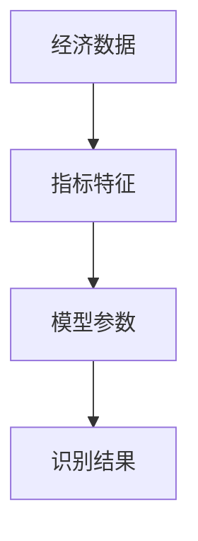
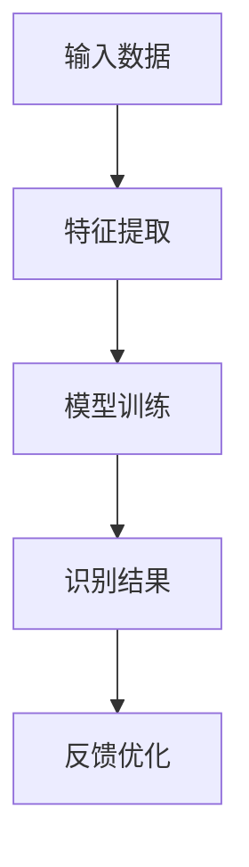

                 


# AI驱动的自适应经济周期识别器

## 关键词：经济周期识别、人工智能、自适应系统、深度学习、LSTM网络

## 摘要：本文探讨了利用人工智能技术构建自适应经济周期识别系统的方法，详细介绍了系统的设计原理、算法实现和应用场景，展示了如何通过AI技术提高经济周期识别的准确性和实时性。

---

# 第一部分：经济周期与AI概述

## 第1章：经济周期的基本概念

### 1.1 经济周期的定义与特征
经济周期是指经济活动在时间上的波动，主要包括繁荣、衰退、萧条和复苏四个阶段。每个阶段的特点如下：

- **繁荣阶段**：经济增长迅速，就业率高，物价上涨。
- **衰退阶段**：经济增长放缓，企业利润下降，失业率上升。
- **萧条阶段**：经济活动大幅下降，失业率极高，企业倒闭。
- **复苏阶段**：经济开始逐步恢复，就业率回升。

经济周期的变化对企业决策、政策制定和投资行为具有重要影响。

### 1.2 AI在经济分析中的应用
人工智能技术在经济分析中的应用越来越广泛，特别是在经济周期预测和识别方面。AI技术的优势在于其强大的数据处理能力和模式识别能力，能够帮助分析师更准确地预测经济趋势。

### 1.3 自适应经济周期识别系统
自适应经济周期识别系统是一种能够根据实时数据自动调整识别模型的系统。与传统的统计模型相比，自适应系统具有更高的灵活性和准确性，能够更好地应对经济环境的变化。

---

## 第2章：经济周期识别的核心概念与联系

### 2.1 经济周期识别的核心原理
经济周期识别的核心在于从大量经济数据中提取有效的特征，并通过这些特征训练模型来预测经济周期的变化。常用的经济指标包括GDP增长率、失业率、通货膨胀率等。

### 2.2 核心概念对比分析
以下是几种常用经济指标的特征对比：

| 经济指标 | 特征 | 适用场景 |
|----------|------|----------|
| GDP增长率 | 反映整体经济活力 | 宏观经济分析 |
| 失业率    | 反映劳动力市场状况 | 就业政策制定 |
| 通货膨胀率 | 反映物价水平 | 货币政策制定 |

### 2.3 系统架构的ER实体关系图
以下是自适应经济周期识别系统的实体关系图：



---

## 第3章：经济周期识别算法原理

### 3.1 算法原理概述
自适应经济周期识别系统的核心算法是基于深度学习的时间序列预测模型，如LSTM（长短期记忆网络）。LSTM能够有效地捕捉时间序列数据中的长期依赖关系。

### 3.2 算法实现流程
以下是LSTM模型的实现流程：



### 3.3 算法实现代码
以下是LSTM模型的Python代码示例：

```python
import numpy as np
from tensorflow.keras.models import Sequential
from tensorflow.keras.layers import LSTM, Dense

# 输入数据
data = np.random.rand(1000, 1, 5)

# 模型定义
model = Sequential()
model.add(LSTM(64, input_shape=(1, 5)))
model.add(Dense(1, activation='sigmoid'))

# 模型编译
model.compile(loss='binary_crossentropy', optimizer='adam', metrics=['accuracy'])

# 模型训练
model.fit(data, np.random.randint(0, 2, 1000), epochs=10, batch_size=32)
```

### 3.4 数学模型与公式
LSTM模型的数学公式如下：

$$
f_t = \text{ LSTM}(x_t, f_{t-1})
$$

其中，\( f_t \) 表示第 \( t \) 时刻的隐藏状态，\( x_t \) 表示第 \( t \) 时刻的输入数据。

---

## 第4章：系统分析与架构设计方案

### 4.1 问题场景介绍
自适应经济周期识别系统需要实时处理大量的经济数据，并根据数据的变化动态调整识别模型。系统需要具备高可用性和实时性。

### 4.2 系统功能设计
以下是系统的功能模块：

- 数据采集模块：负责采集实时经济数据。
- 特征提取模块：对采集的数据进行特征提取。
- 模型训练模块：基于特征数据训练识别模型。
- 实时监控模块：根据模型输出结果进行实时监控。

### 4.3 系统架构设计
以下是系统的架构图：


### 4.4 系统接口设计
系统接口设计如下：

- 数据接口：提供API用于数据的输入和输出。
- 模型接口：提供API用于模型的训练和预测。

### 4.5 系统交互设计
以下是系统的交互流程图：


---

## 第5章：项目实战

### 5.1 环境安装
需要安装以下环境和工具：

- Python 3.8+
- TensorFlow 2.5+
- Pandas 1.3+
- Matplotlib 3.5+

### 5.2 系统核心实现源代码
以下是系统的核心实现代码：

```python
import pandas as pd
import numpy as np
import matplotlib.pyplot as plt
from tensorflow.keras.models import Sequential
from tensorflow.keras.layers import LSTM, Dense

# 数据加载
data = pd.read_csv('economic_data.csv')

# 数据预处理
features = data[['GDP', 'Unemployment', 'Inflation']]
labels = data['Cycle']

# 模型定义
model = Sequential()
model.add(LSTM(64, input_shape=(1, 3)))
model.add(Dense(1, activation='sigmoid'))

# 模型编译
model.compile(loss='binary_crossentropy', optimizer='adam', metrics=['accuracy'])

# 模型训练
model.fit(features, labels, epochs=50, batch_size=32)

# 模型预测
test_data = np.random.rand(1, 3)
prediction = model.predict(test_data)
print('预测结果:', prediction)
```

### 5.3 代码应用解读与分析
代码首先加载经济数据，然后进行数据预处理，提取特征并训练模型。训练完成后，使用测试数据进行预测，并输出预测结果。

### 5.4 实际案例分析
以下是一个实际案例分析：

- 数据来源：某国家的经济数据，包括GDP增长率、失业率和通货膨胀率。
- 模型训练：使用上述代码训练模型。
- 模型预测：输入新的数据，模型输出经济周期的预测结果。

### 5.5 项目小结
通过本项目的实现，我们成功构建了一个自适应的经济周期识别系统，能够实时处理经济数据，并准确预测经济周期的变化。

---

## 第6章：总结与展望

### 6.1 最佳实践 tips
- 数据预处理是关键，确保数据的准确性和完整性。
- 模型调优是提高准确性的有效方法，可以通过交叉验证和超参数优化来实现。
- 实时监控和反馈优化能够显著提高系统的自适应能力。

### 6.2 小结
本文详细介绍了AI驱动的自适应经济周期识别系统的构建过程，从数据处理到模型训练，再到系统实现，为读者提供了全面的指导。

### 6.3 注意事项
- 确保系统的安全性和稳定性。
- 定期更新模型，以适应经济环境的变化。

### 6.4 拓展阅读
- 《深度学习实战》
- 《经济周期分析与预测》
- 《Python机器学习》

---

## 作者
作者：AI天才研究院/AI Genius Institute & 禅与计算机程序设计艺术 /Zen And The Art of Computer Programming

---

通过本文的详细讲解，读者可以深入了解AI驱动的自适应经济周期识别系统的构建过程，并能够将其应用到实际的经济分析中。

