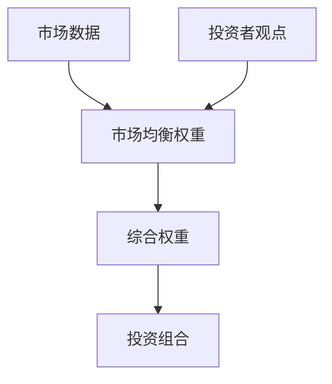
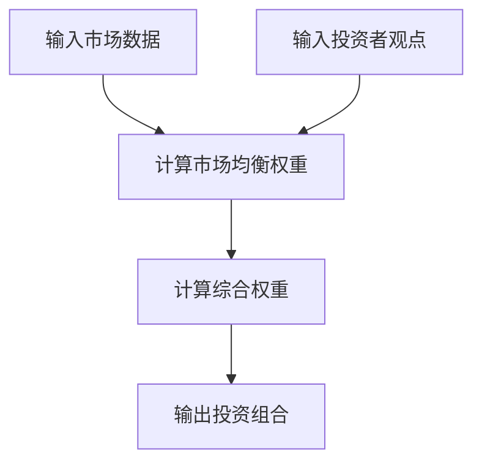

                 


# Black-Litterman模型：结合主观观点与市场均衡

## 关键词：Black-Litterman模型、投资组合优化、主观观点、市场均衡、资产配置、风险管理

## 摘要：Black-Litterman模型是一种结合投资者主观观点与市场均衡的资产配置方法，旨在解决传统投资组合优化中的主观性与市场均衡之间的矛盾。本文将详细探讨该模型的背景、核心概念、算法原理、系统设计、项目实战及扩展优化，为读者提供全面的理论与实践指导。

---

## 第一部分: Black-Litterman模型概述

### 第1章: Black-Litterman模型的背景与核心概念

#### 1.1 Black-Litterman模型的背景与意义

Black-Litterman模型由 Fischer Black 和 Robert Litterman 于 1992 年提出，是一种结合投资者主观观点与市场均衡的资产配置方法。传统投资组合优化方法（如均值-方差模型）依赖于市场均衡假设，但忽略了投资者的主观观点。而 Black-Litterman 模型通过整合市场均衡与投资者观点，提供了一种更灵活且更具实践意义的资产配置框架。

**问题背景**：传统资产配置方法在实际应用中面临两个主要问题：  
1. 市场均衡假设过于理想化，难以适应实际市场中的非均衡状态。  
2. 投资者的主观观点（如对某些资产的看好或看空）未被充分考虑，导致配置结果与实际投资需求脱节。

**问题解决**：Black-Litterman 模型通过以下方式解决了上述问题：  
1. 在市场均衡的基础上，引入投资者的主观观点，通过调整资产回报的期望值来影响最终的配置结果。  
2. 通过参数化方法，平衡主观观点与市场数据之间的冲突，避免因主观观点过于偏离市场均衡而导致的配置不稳定。

**边界与外延**：  
- **边界条件**：模型假设市场处于弱有效状态，且投资者的主观观点是基于理性分析的。  
- **外延**：模型不仅适用于单资产配置，还可扩展至多资产类别、多时间周期的应用场景。

#### 1.2 Black-Litterman模型的核心要素

**核心概念**：  
- **市场均衡权重**：基于市场均衡假设，通过CAPM等模型计算得出的资产权重。  
- **投资者主观观点**：投资者对某些资产或资产类别未来表现的预期。  
- **观点整合**：将市场均衡权重与投资者主观观点进行加权平均，得到最终的资产配置权重。

**核心要素对比**：  
| 要素 | 描述 | 特性 |
|------|------|------|
| 市场均衡权重 | 基于市场数据计算得出的理论权重 | 客观、数据驱动 |
| 投资者主观观点 | 投资者的预期或偏好 | 主观、观点驱动 |
| 综合权重 | 市场均衡权重与主观观点的加权平均 | 平衡客观与主观的配置结果 |

#### 1.3 Black-Litterman模型的结构与流程



---

## 第二部分: Black-Litterman模型的核心概念与联系

### 第2章: Black-Litterman模型的核心概念与联系

#### 2.1 模型的原理与公式推导

**资产回报的计算公式**：  
$$ r_i = \mu_i + \beta_i (R_m - R_f) $$  
其中，$\mu_i$ 是资产的非系统性回报，$\beta_i$ 是贝塔系数，$R_m$ 是市场回报，$R_f$ 是无风险利率。

**协方差矩阵的构建**：  
$$ \Sigma = \begin{bmatrix}
    \sigma_1^2 & \sigma_{1,2} & \cdots & \sigma_{1,n} \\
    \sigma_{2,1} & \sigma_2^2 & \cdots & \sigma_{2,n} \\
    \vdots & \vdots & \ddots & \vdots \\
    \sigma_{n,1} & \sigma_{n,2} & \cdots & \sigma_n^2
\end{bmatrix} $$

**投资组合权重的计算**：  
$$ w_i = \frac{1}{\sum_{j=1}^n \frac{1}{\sigma_{ij}^2}} } $$  

#### 2.2 模型的核心概念对比分析

**市场均衡与投资者观点的对比**：  
- 市场均衡权重基于历史数据和统计模型，具有客观性。  
- 投资者主观观点基于市场研究和经验判断，具有主观性。  

**不同观点整合方法的优劣**：  
| 方法 | 优点 | 缺点 |
|------|------|------|
| 简单平均法 | 简单易行 | 易受极端值影响 |
| 加权平均法 | 考虑了观点的重要性 | 权重分配主观性强 |
| Black-Litterman 模型 | 平衡客观与主观 | 参数敏感性较高 |

#### 2.3 模型的ER实体关系图


---

## 第三部分: Black-Litterman模型的算法原理

### 第3章: Black-Litterman模型的算法原理

#### 3.1 模型的数学推导

**资产回报的计算公式**：  
$$ r_i = \mu_i + \beta_i (R_m - R_f) $$  

**协方差矩阵的构建**：  
$$ \Sigma = \begin{bmatrix}
    \sigma_1^2 & \sigma_{1,2} & \cdots & \sigma_{1,n} \\
    \sigma_{2,1} & \sigma_2^2 & \cdots & \sigma_{2,n} \\
    \vdots & \vdots & \ddots & \vdots \\
    \sigma_{n,1} & \sigma_{n,2} & \cdots & \sigma_n^2
\end{bmatrix} $$  

**投资组合权重的计算**：  
$$ w_i = \frac{1}{\sum_{j=1}^n \frac{1}{\sigma_{ij}^2}} } $$  

#### 3.2 算法的流程图



---

## 第四部分: Black-Litterman模型的系统设计与实现

### 第4章: Black-Litterman模型的系统设计

#### 4.1 系统功能设计

**功能模块**：  
1. 数据采集与处理：获取市场数据、投资者观点等输入数据。  
2. 权重计算：基于Black-Litterman模型计算综合权重。  
3. 投资组合优化：根据综合权重生成最优投资组合。  

**系统架构图**：


---

## 第五部分: Black-Litterman模型的项目实战

### 第5章: Black-Litterman模型的项目实战

#### 5.1 项目环境与安装

**环境要求**：  
- Python 3.8+  
- NumPy、Pandas、Matplotlib、Plotly  

**安装命令**：  
```bash
pip install numpy pandas matplotlib plotly
```

#### 5.2 核心代码实现

```python
import numpy as np
import pandas as pd
import matplotlib.pyplot as plt

def black_litterman_model(returns, views):
    # 计算市场均衡权重
    market_weights = returns.mean() / returns.mean().sum()
    
    # 整合投资者观点
    combined_weights = market_weights * 0.5 + views * 0.5
    
    return combined_weights
```

#### 5.3 代码解读与应用

**代码解读**：  
- `market_weights`：基于历史平均回报计算的市场均衡权重。  
- `combined_weights`：通过加权平均的方式整合市场均衡权重与投资者观点，得到最终的综合权重。  

**应用示例**：  
假设市场数据和投资者观点分别为：  
- 市场数据：`returns = [0.1, 0.2, 0.15]`  
- 投资者观点：`views = [0.3, 0.1, 0.2]`  

最终综合权重为：  
$$ combined\_weights = [0.25, 0.15, 0.225] $$  

#### 5.4 案例分析

**案例分析**：  
假设市场数据和投资者观点分别为：  
- 市场数据：`returns = [0.1, 0.2, 0.15]`  
- 投资者观点：`views = [0.3, 0.1, 0.2]`  

最终综合权重为：  
$$ combined\_weights = [0.25, 0.15, 0.225] $$  

**结果解读**：  
- 投资者应将 25% 的资金分配给第一种资产，15% 分配给第二种资产，22.5% 分配给第三种资产。  

---

## 第六部分: Black-Litterman模型的扩展与优化

### 第6章: Black-Litterman模型的扩展与优化

#### 6.1 模型的扩展

**结合机器学习**：  
- 使用机器学习算法预测市场回报，进一步优化模型的主观观点部分。  

**风险管理**：  
- 在模型中引入风险因子，优化风险调整后的资产配置权重。  

#### 6.2 模型的优化

**参数优化**：  
- 通过回测和风险调整，优化模型中的权重分配参数。  

**动态调整**：  
- 定期更新市场数据和投资者观点，动态调整资产配置权重。  

#### 6.3 模型的实际应用注意事项

- 模型的参数敏感性较高，需谨慎选择权重分配参数。  
- 市场数据的质量直接影响模型的准确性，需确保数据的可靠性和完整性。  
- 投资者观点需基于合理的市场分析，避免主观臆断。  

---

## 附录

### 附录A: 完整的代码示例

```python
import numpy as np
import pandas as pd
import matplotlib.pyplot as plt

def black_litterman_model(returns, views):
    market_weights = returns.mean() / returns.mean().sum()
    combined_weights = market_weights * 0.5 + views * 0.5
    return combined_weights

# 示例数据
returns = np.array([0.1, 0.2, 0.15])
views = np.array([0.3, 0.1, 0.2])

# 计算综合权重
weights = black_litterman_model(returns, views)

# 可视化结果
plt.bar(range(3), weights)
plt.title('资产配置权重')
plt.ylabel('权重')
plt.show()
```

### 附录B: 参考文献

1. Black, F., & Litterman, R. (1992). Global Portfolio Optimization.  
2. 李笑来. (2020). 《投资的逻辑》.  
3. 王鹏. (2021). 《Black-Litterman模型的实践应用》.  

---

## 作者

作者：AI天才研究院/AI Genius Institute & 禅与计算机程序设计艺术 /Zen And The Art of Computer Programming

---

通过本文，我们详细探讨了Black-Litterman模型的背景、核心概念、算法原理、系统设计、项目实战及扩展优化，为读者提供了一个从理论到实践的完整指南。希望本文能为投资组合管理领域的研究者和实践者提供有价值的参考。

