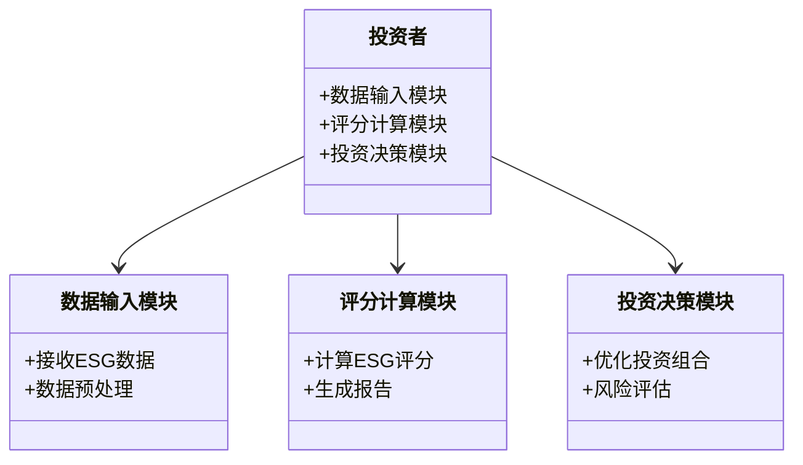
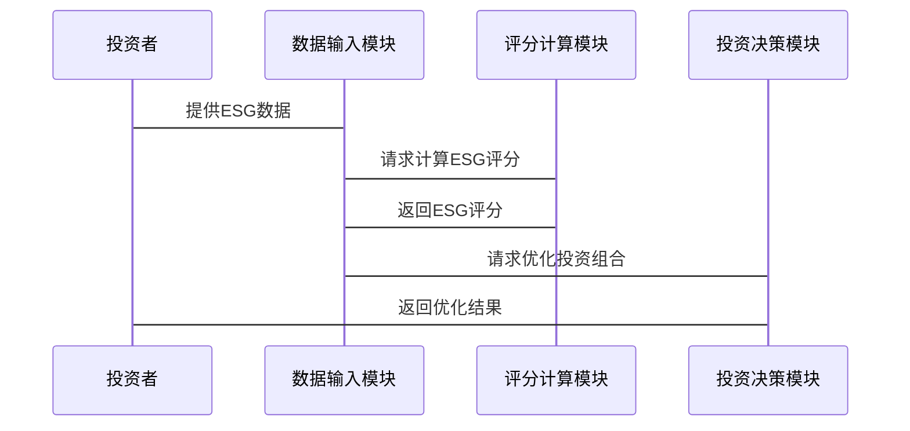

                 


# ESG整合策略：将可持续发展因素纳入投资流程

## 关键词：ESG投资，可持续发展，环境社会治理，投资策略，风险管理

## 摘要：  
随着全球对可持续发展的关注日益增加，ESG（环境、社会、治理）整合策略成为投资领域的重要趋势。本文从ESG整合策略的背景、核心概念、算法原理、系统设计、项目实战等方面进行详细分析，探讨如何将ESG因素纳入投资流程，构建可持续的投资策略。文章结合理论与实践，通过Mermaid图和Python代码示例，深入剖析ESG整合的原理、方法与应用场景，为投资机构和投资者提供参考。

---

# 第一部分: ESG整合策略的背景与概念

## 第1章: ESG整合策略概述

### 1.1 ESG的定义与起源
#### 1.1.1 环境（Environmental）的定义与发展
环境因素关注企业的碳排放、资源使用效率、环境保护措施等，是ESG的核心维度之一。随着全球气候变化问题的加剧，环境因素在投资决策中的重要性日益凸显。

#### 1.1.2 社会责任（Social）的核心要素
社会责任包括员工权益、供应链管理、社区参与等方面。企业是否积极履行社会责任，直接影响其社会形象和长期发展潜力。

#### 1.1.3 公司治理（Governance）的基本原则
公司治理涉及董事会结构、高管薪酬、内部控制等方面。良好的治理机制是企业稳健发展的基石，也是投资者关注的重点。

#### 1.1.4 ESG投资的起源与现状
ESG投资起源于20世纪90年代，随着环境问题和社会责任意识的增强，ESG投资逐渐从 niche市场变为主流趋势。全球越来越多的机构投资者开始将ESG因素纳入投资决策。

---

### 1.2 ESG投资的背景与重要性
#### 1.2.1 全球可持续发展背景下的ESG投资
全球气候变化、社会不平等等问题的加剧，使得可持续发展成为全球关注的焦点。ESG投资不仅是社会责任的体现，也是企业长期价值的保证。

#### 1.2.2 机构投资者对ESG的关注
越来越多的机构投资者意识到，ESG表现优异的企业更具抗风险能力，且更有可能实现长期稳健增长。ESG投资已成为机构投资者的核心策略之一。

#### 1.2.3 ESG投资与企业长期价值的关系
ESG表现优异的企业通常具有更好的风险管理能力、更强的创新能力和更高的员工满意度。这些因素共同作用，为企业创造持续的价值。

#### 1.2.4 ESG投资的监管环境与发展趋势
全球监管机构逐步加强对ESG信息披露的要求，推动企业更加透明地披露环境、社会和治理相关信息。未来，ESG投资将更加规范化、系统化。

---

### 1.3 ESG整合策略的核心概念
#### 1.3.1 ESG整合的定义
ESG整合策略是指在投资决策过程中，将环境、社会和治理因素纳入分析框架，通过全面评估企业综合表现，优化投资组合的风险收益比。

#### 1.3.2 ESG整合的目标与范围
ESG整合的目标是通过识别和评估企业的可持续发展能力，帮助投资者做出更明智的投资决策。其范围涵盖企业运营的各个层面，包括环境表现、社会责任和公司治理。

#### 1.3.3 ESG整合的实施框架与流程
ESG整合的实施流程包括数据收集、指标评估、权重分配、评分计算和结果应用等步骤。通过系统化的流程，确保ESG因素的有效整合。

#### 1.3.4 ESG整合的边界与外延
ESG整合的边界在于企业的直接业务活动和关联方，外延则包括企业的上下游供应链和生态圈。通过扩展分析范围，提升ESG整合的全面性。

---

### 1.4 本章小结
本章通过介绍ESG的定义、背景、重要性及整合策略的核心概念，为后续分析奠定了基础。ESG整合不仅是投资策略的优化，更是企业可持续发展的关键。

---

## 第2章: ESG核心概念的分析

### 2.1 ESG三个维度的对比分析
#### 2.1.1 环境（Environmental）的关键指标
- 碳排放量
- 能源使用效率
- 环境违法记录

#### 2.1.2 社会责任（Social）的核心指标
- 员工满意度
- 社区参与度
- 供应链管理透明度

#### 2.1.3 公司治理（Governance）的关键指标
- 董事会结构
- 内部控制机制
- 高管薪酬与绩效挂钩

#### 2.1.4 ESG三个维度的对比分析表
| 维度   | 环境（Environmental）       | 社会责任（Social）        | 公司治理（Governance）    |
|--------|---------------------------|---------------------------|---------------------------|
| 关注点 | 碳排放、资源使用效率       | 员工权益、供应链管理       | 董事会结构、内部控制       |

---

### 2.2 ESG核心概念的ER实体关系图
```mermaid
er
  actor: 投资者
  entity: 企业
  attribute: ESG指标
  relation: 投资者根据ESG指标评估企业
```

---

### 2.3 本章小结
通过对比分析和ER图的展示，我们清晰地看到ESG三个维度的内在联系及其在投资决策中的作用。

---

# 第二部分: ESG整合的算法原理

## 第3章: ESG评分模型的构建

### 3.1 ESG评分模型的原理
#### 3.1.1 基于因子分析的ESG评分方法
因子分析是一种常用的统计方法，通过提取ESG数据中的共性因子，构建评分模型。这种方法能够有效减少数据维度，提升评分的准确性。

#### 3.1.2 基于机器学习的ESG评分模型
机器学习算法（如随机森林、神经网络）可以用来预测企业的ESG表现，通过训练数据模型，识别关键影响因素。

#### 3.1.3 基于权重分配的ESG评分流程
根据ESG三个维度的重要性，赋予不同的权重，通过加权计算得出最终的ESG评分。

---

### 3.2 ESG评分模型的实现
#### 3.2.1 数据预处理与特征选择
```python
import pandas as pd
import numpy as np

# 数据加载与预处理
data = pd.read_csv('esg_data.csv')
data = data.dropna()  # 删除缺失值
data = pd.get_dummies(data)  # 独热编码
```

#### 3.2.2 基于Python的ESG评分代码实现
```python
def calculate_esg_score(data):
    # 特征选择
    selected_features = ['environmental_factors', 'social_factors', 'governance_factors']
    data_selected = data[selected_features]
    
    # 计算ESG评分（假设各维度等权重）
    score = np.mean(data_selected, axis=1)
    return score

# 示例计算
esg_scores = calculate_esg_score(data)
print(esg_scores)
```

---

### 3.3 ESG评分模型的数学公式
#### 3.3.1 基于因子分析的数学模型
$$ESG\_score = \sum_{i=1}^{n} w_i \cdot x_i$$
其中，$w_i$ 是第 $i$ 个因子的权重，$x_i$ 是第 $i$ 个因子的得分。

#### 3.3.2 基于机器学习的回归模型
$$ESG\_score = \beta_0 + \beta_1x_1 + \beta_2x_2 + \ldots + \beta_kx_k + \epsilon$$
其中，$\beta_i$ 是各特征的系数，$x_i$ 是特征变量，$\epsilon$ 是误差项。

---

### 3.4 本章小结
本章通过介绍ESG评分模型的原理、实现和数学公式，展示了如何将ESG因素量化，为后续系统设计和项目实战奠定基础。

---

## 第4章: ESG评分模型的优化与验证

### 4.1 基于因子分析的优化策略
通过因子分析提取关键因子，优化模型的计算效率和准确性。

### 4.2 基于机器学习的模型验证
使用交叉验证等方法，评估模型的预测精度和稳定性。

### 4.3 模型的可解释性分析
通过特征重要性分析，识别影响ESG评分的关键因素。

---

## 第5章: ESG评分模型的行业适用性分析

### 5.1 不同行业的ESG评分差异
不同行业在环境、社会和治理方面的表现差异显著，需根据行业特点调整评分模型。

### 5.2 行业适用性的数学模型
$$ESG\_score_i = \alpha_i + \beta_i \cdot X_i + \gamma_i \cdot Y_i + \delta_i \cdot Z_i$$
其中，$\alpha_i$ 是行业调整系数，$X_i, Y_i, Z_i$ 是环境、社会、治理因素的指标。

---

# 第三部分: ESG整合的系统设计与实现

## 第6章: 系统功能设计

### 6.1 问题场景介绍
投资者需要一个系统化的工具，将ESG因素纳入投资决策，优化投资组合的风险收益比。

### 6.2 系统功能设计


---

## 第7章: 系统架构设计

### 7.1 系统架构设计图


---

## 第8章: 系统接口设计

### 8.1 系统接口设计
- 数据输入接口：接收ESG数据并进行预处理。
- 评分计算接口：根据输入数据计算ESG评分。
- 投资决策接口：根据评分结果优化投资组合。

### 8.2 系统交互序列图


---

## 第9章: 项目实战

### 9.1 环境安装与配置
安装Python、Pandas、NumPy等依赖库，搭建开发环境。

### 9.2 系统核心实现
实现数据输入、评分计算和投资决策模块。

### 9.3 代码实现与解读
```python
# 数据输入模块
def preprocess_data(data):
    data = data.dropna()
    data = pd.get_dummies(data)
    return data

# 评分计算模块
def calculate_esg_score(data):
    selected_features = ['environmental_factors', 'social_factors', 'governance_factors']
    data_selected = data[selected_features]
    score = np.mean(data_selected, axis=1)
    return score

# 投资决策模块
def optimize_portfolio(scores, returns):
    # 示例：简单平均法
    weights = np.array([1/3, 1/3, 1/3])
    optimized_weights = weights * scores
    return optimized_weights
```

### 9.4 案例分析与解读
通过具体案例分析，展示如何将ESG评分应用于投资组合优化。

---

## 第10章: 最佳实践与注意事项

### 10.1 最佳实践
- 数据来源的可靠性
- 模型的可解释性
- 投资组合的动态调整

### 10.2 小结
通过本文的分析与实践，我们了解到ESG整合策略的核心要素及其在投资中的应用。

### 10.3 注意事项
- 数据的完整性和准确性
- 模型的适用性与局限性
- 投资组合的风险管理

### 10.4 拓展阅读
推荐相关书籍和文献，供读者深入学习。

---

## 第四部分: 结语

### 11章: 结语
ESG整合策略不仅是投资决策的优化工具，更是企业可持续发展的重要推动力。通过本文的分析与实践，我们期待更多的投资者和企业能够关注ESG因素，共同推动全球可持续发展。

---

## 作者：AI天才研究院/AI Genius Institute & 禅与计算机程序设计艺术 /Zen And The Art of Computer Programming

