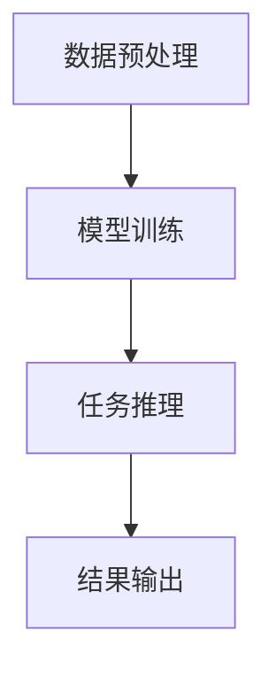
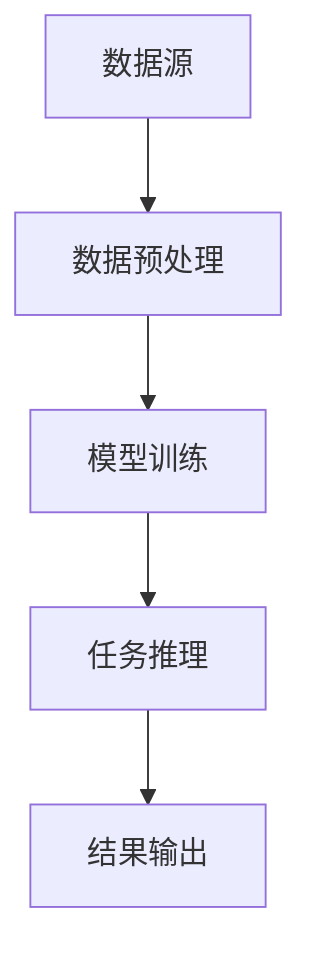

                 


# 减少训练数据需求：LLM的few-shot学习解析

## 关键词：Large Language Model, few-shot learning, 数据需求, 机器学习, 迁移学习

## 摘要：  
本文深入探讨了在大语言模型（LLM）中应用few-shot学习来减少训练数据需求的方法。通过分析few-shot学习的核心概念、算法原理和实际应用，文章旨在为读者提供清晰的理解和实用的指导，帮助他们在数据有限的情况下高效训练和优化LLM。

---

# 减少训练数据需求：LLM的few-shot学习解析

## 第一章: few-shot学习的背景与概念

### 1.1 问题背景  
在现代机器学习领域，数据是训练模型的核心要素。传统的深度学习模型，尤其是大型语言模型（LLM），通常需要数百万级别的标注数据进行训练。这种对大量数据的依赖不仅增加了训练成本，还限制了模型在数据稀缺领域（如医学、法律）的应用。此外，数据获取的成本（如标注成本、隐私保护等）也成为了实际应用中的障碍。  

### 1.2 问题描述  
few-shot学习的核心目标是通过最小化对训练数据的需求，使模型能够在小样本数据上实现有效的学习和推理。与传统的数据驱动方法不同，few-shot学习强调模型的泛化能力，即在仅有少量甚至单个样本的情况下，模型仍能准确完成特定任务。  

### 1.3 核心概念  
- **few-shot学习**：一种允许模型在小样本数据上进行高效学习的技术。  
- **元学习（Meta-Learning）**：通过学习如何快速适应新任务，减少对数据的需求。  
- **任务迁移**：将一个任务中学到的知识应用到另一个相关任务中，减少新任务的训练数据需求。  

### 1.4 本章小结  
通过理解few-shot学习的核心概念和目标，我们可以为后续章节的深入分析打下基础。

---

## 第二章: few-shot学习的核心原理

### 2.1 支持元学习的机制  
元学习通过训练模型在多个任务之间快速迁移，从而减少每个任务所需的训练数据。例如，Meta-LSTM通过在任务间共享参数，使模型能够快速适应新任务。  

#### 元学习的工作流程：
1. **预训练阶段**：在多个任务上训练模型，使模型学会如何快速调整参数以适应新任务。  
2. **任务推理阶段**：针对具体任务，利用预训练的参数快速调整模型以完成任务。  

### 2.2 few-shot学习的算法框架  

#### Meta-LSTM算法  
- **输入**：支持多个任务的小样本数据集。  
- **输出**：针对每个任务的预测结果。  
- **流程**：  
  1. 在预训练阶段，模型通过LSTM结构处理多个任务的数据，学习跨任务的特征。  
  2. 在推理阶段，针对新任务，模型快速调整LSTM参数以生成预测结果。  

#### Matching Networks算法  
- **输入**：小样本数据集。  
- **输出**：基于匹配的预测结果。  
- **流程**：  
  1. 对每个查询样本，计算其与训练集中所有样本的相似性。  
  2. 根据相似性加权聚合训练样本的标签，生成预测结果。  

### 2.3 核心算法对比  
下表对比了Meta-LSTM和Matching Networks的核心特点：  

| **算法名称** | **核心思想** | **优势** |  
|--------------|---------------|-----------|  
| Meta-LSTM    | 元学习，任务间共享参数 | 快速适应新任务 |  
| Matching Networks | 基于相似性匹配 | 鲁棒性高，适合小样本 |  

### 2.4 本章小结  
通过分析few-shot学习的核心算法，我们可以理解其在减少数据需求方面的优势。

---

## 第三章: few-shot学习的系统分析与架构设计

### 3.1 问题场景分析  
以医疗诊断为例，医生需要快速判断罕见病的诊断，而罕见病的数据通常非常有限。通过few-shot学习，模型可以在少量病例数据上快速学习并辅助诊断。  

### 3.2 系统功能设计  
下图展示了few-shot学习系统的功能模块：  



### 3.3 系统架构设计  
下图展示了系统的整体架构：  



### 3.4 系统接口设计  
系统主要接口包括：  
1. **数据输入接口**：接收小样本数据集。  
2. **模型训练接口**：训练few-shot学习模型。  
3. **任务推理接口**：根据输入查询，返回预测结果。  

### 3.5 本章小结  
通过系统分析与架构设计，我们可以更好地理解few-shot学习在实际中的应用。

---

## 第四章: few-shot学习的项目实战

### 4.1 环境安装  
1. **Python 3.8+**  
2. **TensorFlow/Keras**  
3. **Numpy**  

### 4.2 核心代码实现  

#### Meta-LSTM实现  
```python
import tensorflow as tf
from tensorflow.keras import layers

class MetaLSTM:
    def __init__(self, input_dim, hidden_dim):
        self.input_dim = input_dim
        self.hidden_dim = hidden_dim
        self.W_z = layers.Dense(hidden_dim, activation='sigmoid')
        self.U_z = layers.Dense(hidden_dim, activation='sigmoid')
        
    def call(self, inputs):
        z = self.W_z(inputs) + self.U_z(inputs)
        return z
```

#### Matching Networks实现  
```python
import tensorflow as tf
from tensorflow.keras import layers

class MatchingNetwork:
    def __init__(self, input_dim, hidden_dim):
        self.input_dim = input_dim
        self.hidden_dim = hidden_dim
        self.similarity = layers.Dense(1, activation='sigmoid')
        
    def call(self, query, support):
        # query: [batch_size, input_dim]
        # support: [batch_size, support_size, input_dim]
        support_size = support.shape[1]
        tiled_query = tf.tile(query[:, tf.newaxis], [1, support_size, 1])
        similarities = self.similarity(tf.concat([tiled_query, support], axis=2))
        return similarities
```

### 4.3 代码解读与优化  
- **Meta-LSTM**：通过共享参数实现任务间的快速迁移。  
- **Matching Networks**：通过计算输入与训练样本的相似性进行预测，适用于小样本数据。  

### 4.4 实际案例分析  
以医疗诊断为例，假设我们有一个罕见病的数据集，通过few-shot学习，模型可以在少量病例数据上快速学习并辅助诊断。  

### 4.5 本章小结  
通过实战项目，我们可以更好地理解few-shot学习的实现和应用。

---

## 第五章: few-shot学习的最佳实践与注意事项

### 5.1 最佳实践  
1. **选择合适的模型架构**：根据任务需求选择适合的算法（如Meta-LSTM或Matching Networks）。  
2. **数据增强**：通过数据增强技术增加数据的多样性。  
3. **模型调优**：通过超参数调整和优化算法提高模型性能。  

### 5.2 小结与展望  
few-shot学习在减少数据需求方面具有显著优势，未来可以在更多领域中得到广泛应用。

### 5.3 注意事项  
1. **数据质量**：即使数据量小，数据质量仍需保证。  
2. **模型泛化能力**：避免过拟合，确保模型的泛化能力。  
3. **计算资源**：few-shot学习通常需要大量的计算资源进行预训练。  

---

## 第六章: 结论与展望

### 6.1 结论  
通过分析和实践，我们可以看到few-shot学习在减少LLM训练数据需求方面的巨大潜力。  

### 6.2 展望  
未来，随着算法的不断优化和计算能力的提升，few-shot学习将在更多领域中发挥重要作用。

---

## 参考文献  
1. Meta-LSTM: Learning to Learn with Long Short-Term Memory Networks  
2. Matching Networks: Few-shot Learning with CNNs  

## 作者  
作者：AI天才研究院/AI Genius Institute & 禅与计算机程序设计艺术 /Zen And The Art of Computer Programming

