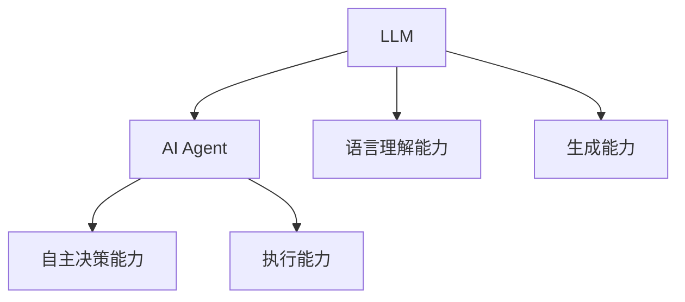
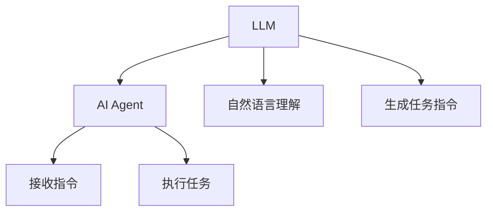
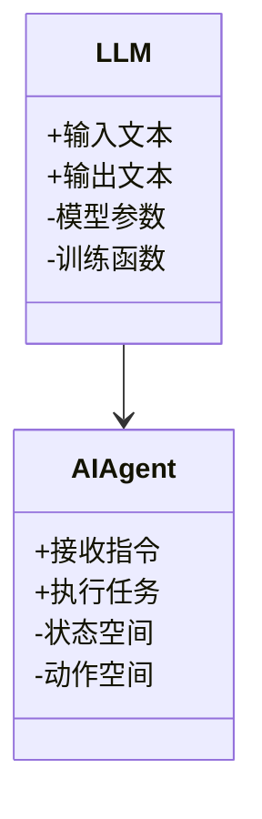
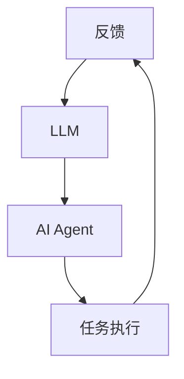

                 


# LLM驱动的AI Agent创新产品设计

---

## 关键词  
LLM, AI Agent, 大语言模型, 人工智能代理, 产品设计, 系统架构, 创新技术  

---

## 摘要  
随着大语言模型（LLM）的快速发展，AI Agent（人工智能代理）作为人机交互和任务自动化的重要形式，正在成为技术创新的核心方向。本文从LLM与AI Agent的核心概念出发，详细分析其算法原理、系统架构，并通过实际案例展示如何设计和实现基于LLM的AI Agent。文章最后总结了最佳实践和未来发展方向，为技术从业者提供深度参考。

---

## 第一部分: LLM与AI Agent概述

### 第1章: LLM与AI Agent背景介绍  

#### 1.1 LLM与AI Agent的定义  
- **大语言模型（LLM）**：基于深度学习的自然语言处理模型，能够理解并生成人类语言。  
- **AI Agent（人工智能代理）**：一种智能系统，能够感知环境、自主决策并执行任务。  

#### 1.2 LLM驱动AI Agent的背景与发展趋势  
- **技术背景**：LLM的普及使得AI Agent具备强大的语言理解和生成能力。  
- **发展趋势**：AI Agent正在从单一任务执行向多任务协同方向发展。  

#### 1.3 LLM与AI Agent的核心概念与问题背景  
- **问题背景**：LLM与AI Agent的结合需要解决实时性、准确性、可解释性等问题。  

---

### 第2章: LLM与AI Agent的核心概念分析  

#### 2.1 LLM与AI Agent的核心原理  
- **LLM的核心原理**：基于Transformer架构，通过自注意力机制实现语言建模。  
- **AI Agent的决策机制**：基于状态空间和动作空间的强化学习策略。  

#### 2.2 LLM与AI Agent的核心属性对比  


#### 2.3 LLM与AI Agent的联系与区别  
- **联系**：LLM为AI Agent提供语言能力，AI Agent为LLM提供应用场景。  
- **区别**：LLM专注于语言处理，AI Agent专注于任务执行。  

---

## 第二部分: LLM驱动AI Agent的算法原理  

### 第3章: LLM的算法原理  

#### 3.1 LLM的训练过程  
- **数据预处理**：对大规模文本数据进行清洗和格式化。  
- **模型训练**：使用自监督学习，基于交叉熵损失函数优化模型参数。  

$$ \text{交叉熵损失函数} = -\frac{1}{N}\sum_{i=1}^{N}\sum_{j=1}^{M} y_{ij}\log p(y_{ij}|x_i) $$  

- **优化算法**：常用Adam优化器，学习率逐步衰减。  

#### 3.2 AI Agent的决策机制  
- **状态空间**：环境中的所有可能状态。  
- **动作空间**：AI Agent可以执行的所有动作。  
- **策略函数**：将状态映射到动作的函数。  

$$ P(a|s) = \text{softmax}(\theta s + b) $$  

#### 3.3 LLM与AI Agent的协同算法  


---

## 第三部分: LLM驱动AI Agent的系统架构  

### 第4章: 系统分析与架构设计  

#### 4.1 项目背景与目标  
- **项目背景**：设计一个基于LLM的智能助手AI Agent，实现自然语言交互和任务执行。  
- **项目目标**：提升用户体验，降低开发成本，实现智能化服务。  

#### 4.2 系统功能设计  


#### 4.3 系统架构设计  


#### 4.4 接口设计与交互流程  
- **接口设计**：RESTful API，支持自然语言理解和任务执行。  
- **交互流程**：用户输入指令，LLM解析并生成任务，AI Agent执行并返回结果。  

---

## 第四部分: 项目实战  

### 第5章: 项目实战  

#### 5.1 环境安装与配置  
```bash
pip install transformers
pip install torch
pip install matplotlib
```

#### 5.2 核心代码实现  
```python
import torch
from transformers import AutoTokenizer, AutoModelForCausalLM

# 初始化LLM模型与tokenizer
tokenizer = AutoTokenizer.from_pretrained("gpt2")
model = AutoModelForCausalLM.from_pretrained("gpt2")

# AI Agent决策函数
def agent_decision(prompt):
    inputs = tokenizer.encode(prompt, return_tensors="pt")
    outputs = model.generate(inputs, max_length=50)
    return tokenizer.decode(outputs[0], skip_special_tokens=True)
```

#### 5.3 代码解读与分析  
- **LLM模型初始化**：加载预训练模型和分词器。  
- **决策函数**：将用户指令输入模型，生成响应。  

#### 5.4 实际案例分析  
- **案例1**：用户输入“预订机票”，系统生成具体操作步骤。  
- **案例2**：用户输入“解决数学题”，系统生成详细解题思路。  

---

## 第五部分: 总结与展望  

### 第6章: 总结与展望  

#### 6.1 最佳实践 tips  
- **模型优化**：定期更新LLM模型，提升生成质量。  
- **任务扩展**：逐步增加AI Agent的任务类型。  

#### 6.2 本章小结  
本文详细介绍了LLM驱动的AI Agent设计与实现，从理论到实践，为技术从业者提供了系统性参考。  

---

## 附录  

### 术语表  
- **LLM**：大语言模型  
- **AI Agent**：人工智能代理  
- **Transformer**：一种深度学习模型  

### 参考文献  
1. Vaswani, A., et al. "Attention Is All You Need."  
2. Brown, T., et al. "Language Models Are Few-Shot Learners."  

---

## 作者  
作者：AI天才研究院 & 禅与计算机程序设计艺术

