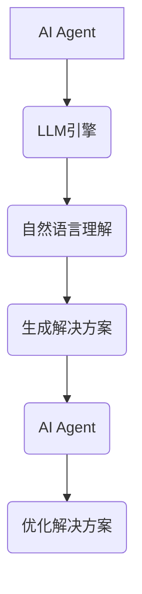
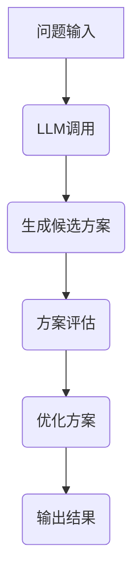
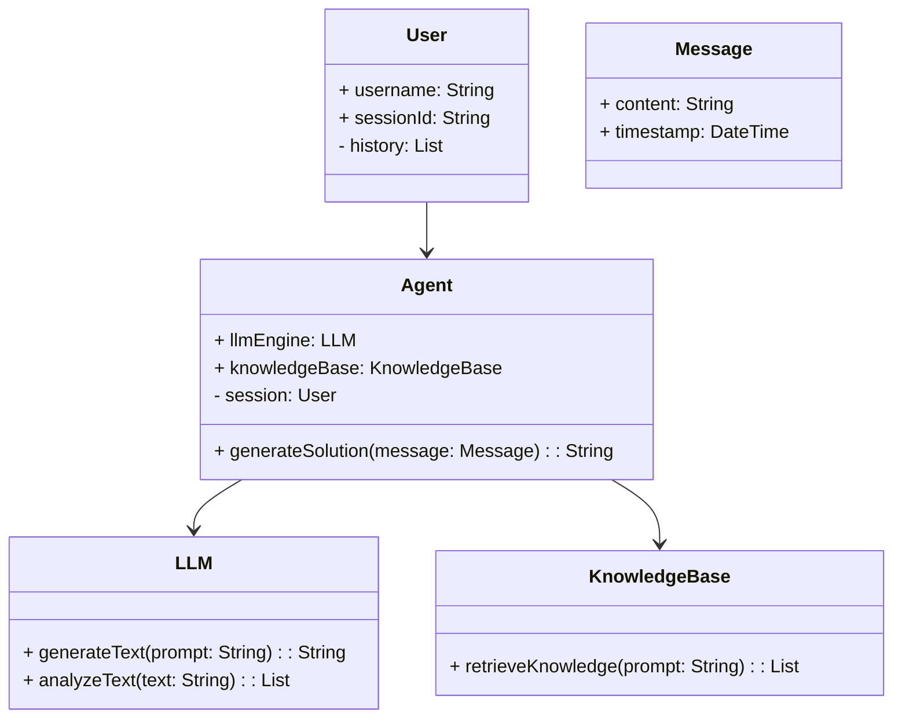

                 


# LLM驱动的AI Agent创造性问题解决框架

> **关键词**：LLM、AI Agent、创造性问题解决、大语言模型、系统架构、算法原理  
>
> **摘要**：本文探讨了如何利用大语言模型（LLM）驱动的AI代理（AI Agent）来实现创造性问题解决。通过分析LLM与AI Agent的核心概念，设计了一个基于LLM的AI Agent框架，详细阐述了其算法原理、系统架构，并通过实际案例展示了该框架的应用和效果。本文还总结了在设计和实现过程中需要注意的最佳实践和未来发展方向。

---

## 第一部分：引言

### 第1章：背景介绍

#### 1.1 问题背景

随着人工智能技术的快速发展，大语言模型（LLM）在自然语言处理领域取得了显著成果。然而，如何将LLM与AI代理（AI Agent）结合，使其具备创造性问题解决的能力，仍是一个重要挑战。创造性问题解决需要AI不仅能够处理结构化的问题，还要能够生成创新性的解决方案，这需要AI具备更高的灵活性和适应性。

#### 1.2 问题描述

创造性问题解决的核心在于生成多样化的解决方案，并选择最优解。传统的基于规则的AI系统在处理复杂问题时往往显得力不从心，而LLM的引入为AI代理提供了强大的自然语言理解和生成能力。然而，如何设计一个高效的框架，使得LLM与AI代理能够协同工作，仍是一个未被充分解决的问题。

#### 1.3 框架的设计目标

本文提出了一种基于LLM的AI代理框架，旨在实现以下目标：
- 提供一个灵活的架构，支持多种问题解决场景。
- 结合LLM的强大生成能力，增强AI代理的创造性。
- 提供高效的交互机制，确保问题解决过程的实时性和有效性。

#### 1.4 框架的核心要素与组成

框架的核心要素包括：
1. **LLM引擎**：负责自然语言的理解与生成。
2. **AI代理模块**：负责问题分析、解决方案生成和优化。
3. **交互界面**：提供用户与AI代理之间的交互渠道。
4. **知识库**：存储问题相关的背景知识和历史数据。

---

## 第二部分：核心概念与联系

### 第2章：LLM与AI Agent的核心概念

#### 2.1 LLM的定义与原理

**大语言模型（LLM）**是指经过大规模数据训练的深度学习模型，通常基于Transformer架构。LLM能够理解和生成人类语言，适用于多种任务，如文本生成、问答系统和机器翻译等。

#### 2.2 AI Agent的定义与特点

**AI代理（AI Agent）**是一个智能系统，能够感知环境、理解问题并采取行动以实现目标。AI代理的关键特点包括：
- **自主性**：能够在没有外部干预的情况下运行。
- **反应性**：能够实时感知环境并做出反应。
- **目标导向性**：具有明确的目标，并采取行动以实现这些目标。

#### 2.3 LLM与AI Agent的关系

LLM作为AI代理的核心组件，负责提供自然语言处理能力。AI代理则利用LLM的能力来理解和生成文本，从而实现更复杂的任务。两者结合，使得AI代理能够处理更加复杂和多样化的任务。

---

### 第2.4 LLM与AI Agent的对比分析

| **特性**         | **LLM**                          | **AI Agent**                     |
|-------------------|---------------------------------|----------------------------------|
| **核心功能**      | 自然语言理解和生成             | 问题解决、任务执行              |
| **输入输出**      | 文本输入，文本输出              | 多种数据类型输入，多种操作输出  |
| **决策能力**      | 依赖预训练参数，无法自主决策   | 具备自主决策能力                |
| **应用场景**      | 文本生成、问答系统等            | 机器人控制、智能助手等          |

---

### 第2.5 LLM与AI Agent的协同机制

通过Mermaid图展示LLM与AI Agent的协同流程：



---

## 第三部分：算法原理

### 第3章：算法原理

#### 3.1 大语言模型的训练过程

**训练过程**：
1. **数据准备**：收集和整理大规模的文本数据。
2. **模型构建**：基于Transformer架构构建模型。
3. **预训练**：使用无监督学习方法进行预训练。
4. **微调**：根据具体任务对模型进行微调。

**数学模型**：
- **自注意力机制**：
  $$ \text{Attention}(Q, K, V) = \text{softmax}\left(\frac{QK^T}{\sqrt{d_k}}\right)V $$
- **前馈网络**：
  $$ f(x) = \text{ReLU}(Wx + b) $$

---

### 第3.2 LLM驱动的AI Agent算法流程

通过Mermaid图展示算法流程：



---

## 第四部分：系统分析与架构设计方案

### 第4章：系统架构设计

#### 4.1 问题场景介绍

假设我们正在设计一个智能客服系统，该系统需要能够理解用户的问题并生成解决方案。

#### 4.2 系统功能设计

通过Mermaid类图展示系统功能模块：



---

#### 4.3 系统架构设计

通过Mermaid架构图展示系统架构：


---

## 第五部分：项目实战

### 第5章：项目实战

#### 5.1 环境安装

安装必要的依赖：
```bash
pip install transformers
pip install torch
pip install mermaid
```

#### 5.2 核心代码实现

```python
import torch
from transformers import AutoTokenizer, AutoModelForCausalLM

class LLMEngine:
    def __init__(self, model_name):
        self.tokenizer = AutoTokenizer.from_pretrained(model_name)
        self.model = AutoModelForCausalLM.from_pretrained(model_name)
    
    def generate(self, prompt, max_length=50):
        inputs = self.tokenizer.encode(prompt, return_tensors='pt')
        outputs = self.model.generate(inputs, max_length=max_length)
        return self.tokenizer.decode(outputs[0], skip_special_tokens=True)

class Agent:
    def __init__(self, llm_engine):
        self.llm = llm_engine
    
    def generate_solution(self, problem):
        prompt = f"Please solve the problem: {problem}\n\nSolution:"
        return self.llm.generate(prompt)
```

#### 5.3 实际案例分析

案例：解决用户提出的问题“如何优化代码性能？”

1. **问题输入**：用户输入“如何优化代码性能？”
2. **LLM调用**：生成多个解决方案。
3. **方案评估**：选择最优方案。
4. **输出结果**：返回优化建议。

---

## 第六部分：最佳实践与小结

### 第6章：最佳实践

- **数据质量**：确保训练数据的质量和多样性。
- **模型优化**：定期优化模型参数以提高生成效果。
- **用户反馈**：收集用户反馈以改进系统。

### 6.2 小结

本文详细介绍了如何利用LLM驱动的AI代理实现创造性问题解决，并通过实际案例展示了该框架的应用。未来，随着技术的进步，该框架将进一步优化，以支持更多复杂任务。

### 6.3 注意事项

- 确保数据安全和隐私保护。
- 定期更新模型以适应新的需求。

---

## 第七部分：总结与展望

### 7.1 总结

本文提出的框架结合了LLM的强大生成能力和AI代理的自主决策能力，为创造性问题解决提供了一个高效的解决方案。

### 7.2 未来展望

未来，随着技术的进一步发展，该框架将支持更多复杂场景，并与更多领域结合，推动人工智能技术的广泛应用。

---

## 作者

作者：AI天才研究院/AI Genius Institute & 禅与计算机程序设计艺术 /Zen And The Art of Computer Programming

