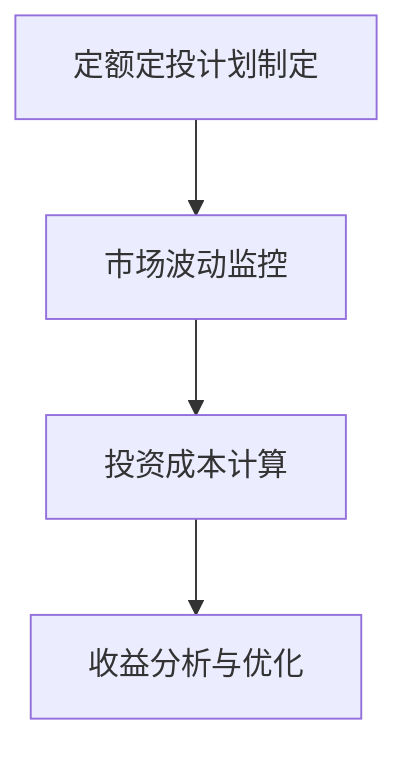
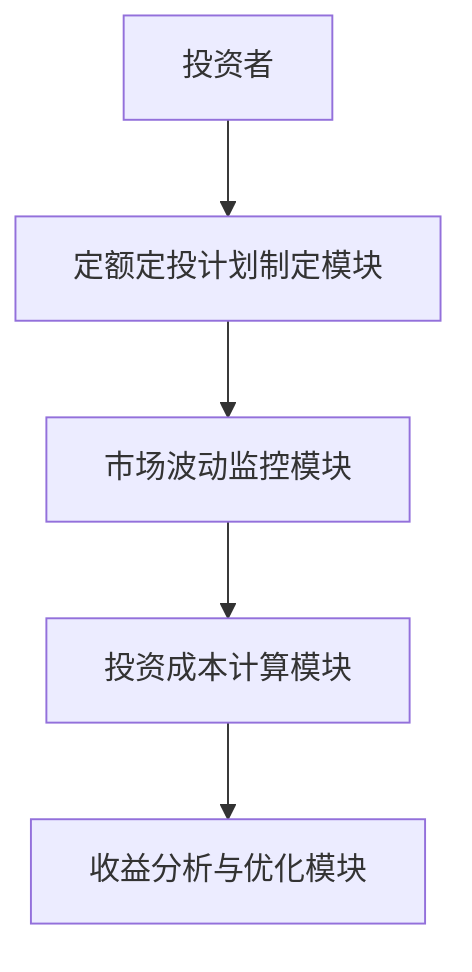

                 


# Dollar-Cost Averaging：在波动市场中的优势

> **关键词**：Dollar-Cost Averaging, 投资策略, 波动市场, 定额定投, 投资收益

> **摘要**：本文详细探讨了Dollar-Cost Averaging（DCA）在波动市场中的优势。通过分析DCA的定义、核心原理、数学模型及其在不同市场环境下的表现，本文旨在帮助投资者理解如何在波动市场中利用DCA策略优化投资组合。文章还结合实际案例和系统设计，展示了DCA策略的应用效果。

---

# 第1章: Dollar-Cost Averaging 概述

## 1.1 什么是 Dollar-Cost Averaging

### 1.1.1 定额定投的定义与核心理念

Dollar-Cost Averaging（DCA）是一种投资策略，通过定期投资固定金额来分散投资成本，从而在市场波动中降低风险。其核心理念是“以固定金额投资，摊低成本”。

**定义**：  
DCA是一种定期定额的投资方式，投资者在固定时间间隔内投入固定金额，无论市场价格如何波动。这种方法通过平均成本，避免了一次性投资在市场高点的风险。

**核心理念**：  
- 分散投资成本：通过定期投资，投资者在市场高点和低点分别购买不同数量的资产，从而降低整体投资成本。
- 风险分散：在波动市场中，DCA通过持续投资来平滑市场波动带来的影响。

### 1.1.2 定额定投的历史与发展

DCA策略起源于20世纪初，随着投资理论的发展逐渐被广泛应用于个人和机构投资者的资产配置中。其核心思想是通过时间分散风险，而非依赖市场预测。

**发展背景**：  
- 20世纪初：DCA策略开始被系统性地研究和应用。
- 20世纪80年代：随着量化投资的兴起，DCA策略被进一步理论化和系统化。
- 21世纪：DCA在算法交易和被动投资中的应用日益广泛。

### 1.1.3 定额定投在投资组合中的地位

DCA是一种被动投资策略，适用于无法准确预测市场走势的投资者。它通过纪律性投资，帮助投资者在长期中实现资产增值。

---

## 1.2 定额定投的核心优势

### 1.2.1 分散投资成本的作用机制

DCA的核心优势在于其分散投资成本的能力。通过定期投资，投资者在市场波动中以平均成本购买资产，从而降低整体投资成本。

**作用机制**：  
- 市场上涨时：以固定金额投资，购买较少的资产，减少成本上升的压力。
- 市场下跌时：以固定金额投资，购买更多的资产，摊薄整体成本。

### 1.2.2 减少市场波动对投资的影响

DCA通过持续投资，避免了集中投资在市场高点的风险。在波动市场中，DCA策略能够有效降低短期波动对投资组合的影响。

**优势分析**：  
- 抗波动性：DCA通过分散投资时间，避免了市场短期波动对投资成本的冲击。
- 长期收益：通过长期持有，DCA能够在市场周期中实现资产的平均增长。

### 1.2.3 长期投资的纪律性与一致性

DCA策略强调纪律性投资，帮助投资者避免情绪化决策。在市场波动中，投资者容易受到市场恐慌或贪婪的影响，而DCA策略通过固定计划，保持投资的纪律性。

---

## 1.3 定额定投的适用场景与边界

### 1.3.1 波动市场的定义与特征

波动市场是指市场价格波动较大、不确定性较高的市场环境。波动市场的特征包括：

- **高波动性**：市场价格频繁波动，难以预测。
- **不确定性**：市场走势难以准确预测，投资者面临较高的不确定性。
- **周期性**：市场波动通常与经济周期相关，表现出周期性特征。

### 1.3.2 定额定投的适用市场环境

DCA策略在波动市场中表现尤为突出。以下是其适用的市场环境：

- **长期趋势不明朗**：当市场长期趋势不明确时，DCA策略通过持续投资，逐步构建投资组合。
- **高波动性市场**：在高波动市场中，DCA通过分散投资成本，降低波动对投资组合的影响。
- **无法预测市场短期走势**：对于无法准确预测市场短期走势的投资者，DCA策略提供了一种稳健的投资方式。

### 1.3.3 定额定投的局限性与注意事项

尽管DCA策略在波动市场中具有诸多优势，但也存在一定的局限性：

- **市场单边上涨**：在市场持续上涨的情况下，DCA策略的投资成本会高于一次性投资的成本。
- **高交易成本**：如果每次投资的金额较小，交易成本可能对整体收益产生较大影响。
- **策略执行难度**：需要纪律性地执行投资计划，特别是在市场波动较大时，投资者可能面临情绪上的挑战。

---

## 1.4 本章小结

### 1.4.1 定额定投的核心概念总结

- DCA是一种通过定期投资固定金额来分散投资成本的投资策略。
- 其核心优势在于减少市场波动对投资组合的影响，通过平均成本实现稳健收益。

### 1.4.2 波动市场中的优势与挑战

- 优势：分散投资成本，降低波动性影响，适合长期投资。
- 挑战：市场单边上涨可能导致收益较低，高交易成本可能影响整体收益。

---

# 第2章: 定额定投的核心概念与数学模型

## 2.1 定额定投的数学模型

### 2.1.1 定额定投的平均成本计算公式

DCA策略的核心是通过定期投资固定金额，计算平均成本。假设投资者在每次投资时的购买价格为 \( p_i \)，投资金额为 \( A \)，则每次购买的数量为 \( n_i = \frac{A}{p_i} \)。

**平均成本计算公式**：  
$$
\text{平均成本} = \frac{\text{总投入金额}}{\text{总购买数量}} = \frac{\sum A}{\sum \frac{A}{p_i}} = \frac{\sum A}{\sum \frac{A}{p_i}} = \frac{\sum A}{\frac{A}{p_1} + \frac{A}{p_2} + \dots + \frac{A}{p_n}} = \frac{1}{\frac{1}{p_1} + \frac{1}{p_2} + \dots + \frac{1}{p_n}}
$$

### 2.1.2 波动市场中定额定投的收益计算

假设投资者在 \( n \) 次投资中，每次投资金额为 \( A \)，购买价格分别为 \( p_1, p_2, \dots, p_n \)，则总购买数量为 \( N = \sum_{i=1}^{n} \frac{A}{p_i} \)。

**总投入金额**：  
$$
\text{总投入金额} = n \times A
$$

**总购买数量**：  
$$
N = \sum_{i=1}^{n} \frac{A}{p_i}
$$

**平均成本**：  
$$
\text{平均成本} = \frac{\text{总投入金额}}{N} = \frac{nA}{\sum_{i=1}^{n} \frac{A}{p_i}} = \frac{n}{\sum_{i=1}^{n} \frac{1}{p_i}}
$$

**投资收益**：  
假设最终资产价格为 \( P \)，则投资收益为：  
$$
\text{收益} = (P - \text{平均成本}) \times N
$$

### 2.1.3 波动性对定额定投收益的影响

波动性越大，DCA策略的表现越优异。在波动市场中，DCA通过平均成本，能够在市场低点积累更多份额，从而在市场回升时获得更高收益。

---

## 2.2 波动性与定额定投的关系

### 2.2.1 市场波动对定额定投收益的影响

市场波动越大，DCA策略的表现越好。在波动市场中，DCA通过分批投资，能够在市场低点购买更多资产，从而在市场回升时获得更高的收益。

### 2.2.2 波动性与投资期限的交互作用

投资期限越长，DCA策略的效果越显著。长期投资能够充分分散市场波动的影响，从而实现稳健收益。

### 2.2.3 波动性对定额定投策略的有效性评估

波动性越高，DCA策略的有效性越强。在高波动市场中，DCA通过持续投资，能够在市场低点积累更多资产，从而在市场回升时获得更高的收益。

---

## 2.3 定额定投的数学模型与波动性分析

### 2.3.1 波动性对平均成本的影响

波动性对平均成本的影响可以通过以下公式分析：

$$
\text{平均成本} = \frac{\sum A}{\sum \frac{A}{p_i}} = \frac{n}{\sum \frac{1}{p_i}}
$$

在波动市场中，价格 \( p_i \) 波动较大，因此 \( \sum \frac{1}{p_i} \) 会受到较大影响，进而影响平均成本。

### 2.3.2 定额定投在不同波动环境下的表现对比

通过对比不同波动环境下的DCA策略表现，可以发现：

- **低波动市场**：DCA策略表现与一次性投资相近。
- **高波动市场**：DCA策略表现优于一次性投资，尤其是在市场波动剧烈的情况下。

---

## 2.4 本章小结

### 2.4.1 定额定投的数学模型总结

- DCA策略的核心是通过分批投资，计算平均成本。
- 平均成本的计算公式为：  
$$
\text{平均成本} = \frac{\sum A}{\sum \frac{A}{p_i}} = \frac{n}{\sum \frac{1}{p_i}}
$$

### 2.4.2 波动性对定额定投策略的影响分析

- 波动性越大，DCA策略的效果越显著。
- 投资期限越长，DCA策略的表现越稳健。

---

# 第3章: 波动市场的特性与定额定投策略

## 3.1 波动市场的定义与分类

### 3.1.1 市场波动的来源与特征

市场波动的来源包括经济周期、政策变化、市场情绪等多种因素。波动市场的特征包括高波动性、不确定性和周期性。

### 3.1.2 不同类型波动市场的投资策略

根据波动市场的类型，投资者可以采取不同的DCA策略：

- **短期波动**：频繁的小幅波动，适合采用短期DCA策略。
- **长期波动**：长期趋势不明朗，适合采用长期DCA策略。

### 3.1.3 波动性对投资者心理的影响

市场波动对投资者心理的影响较大，容易导致情绪化决策。DCA策略通过纪律性投资，帮助投资者避免情绪化决策。

---

## 3.2 定额定投在波动市场中的优势

### 3.2.1 分散投资成本的机制

DCA通过分批投资，分散投资成本，避免一次性投资在市场高点的风险。

### 3.2.2 平均成本法的长期收益优势

DCA通过平均成本，能够在市场波动中实现长期稳健收益。

### 3.2.3 抗波动性的具体表现

在波动市场中，DCA策略能够有效降低短期波动对投资组合的影响，实现稳健收益。

---

## 3.3 定额定投策略的优化与调整

### 3.3.1 根据市场波动调整定投频率

在高波动市场中，可以适当增加定投频率，以更好地分散投资成本。

### 3.3.2 动态调整定投金额的策略

根据市场波动情况，动态调整定投金额，优化投资成本。

### 3.3.3 波动性加剧时的定投策略优化

在波动性加剧时，可以适当增加定投金额，利用市场低点积累更多资产。

---

## 3.4 本章小结

### 3.4.1 波动市场的特性总结

- 市场波动的来源多样，包括经济周期、政策变化和市场情绪等。
- 波动市场的特征包括高波动性、不确定性和周期性。

### 3.4.2 定额定投策略的优化与调整

- 根据市场波动调整定投频率和金额。
- 在波动性加剧时，优化定投策略，利用市场低点积累更多资产。

---

# 第4章: 定额定投的系统分析与架构设计

## 4.1 问题场景介绍

### 4.1.1 投资者面临的挑战

- 市场波动大，难以预测。
- 投资者情绪化决策，影响投资效果。
- 缺乏纪律性投资计划，难以长期坚持。

### 4.1.2 采用定额定投策略的目的

- 通过系统化投资，分散市场波动风险。
- 实现长期稳健收益，避免情绪化决策。

### 4.1.3 定额定投策略的应用场景

- 长期投资：适用于无法预测市场短期走势的投资者。
- 波动市场：在高波动市场中，DCA策略能够有效降低波动对投资组合的影响。

---

## 4.2 系统功能设计

### 4.2.1 系统功能模块

- **定额定投计划制定**：根据投资者的财务状况和投资目标，制定定额定投计划。
- **市场波动监控**：实时监控市场波动，调整定投策略。
- **投资成本计算**：计算投资成本，评估投资效果。
- **收益分析与优化**：分析投资收益，优化定投策略。

### 4.2.2 系统功能模块设计图



---

## 4.3 系统架构设计

### 4.3.1 系统架构图



### 4.3.2 系统接口设计

- **定额定投计划制定模块接口**：接收投资者的财务状况和投资目标，输出定额定投计划。
- **市场波动监控模块接口**：接收市场数据，输出市场波动情况。
- **投资成本计算模块接口**：接收投资数据，输出投资成本。
- **收益分析与优化模块接口**：接收收益数据，输出优化建议。

---

## 4.4 本章小结

### 4.4.1 系统分析总结

- 定额定投系统通过功能模块化设计，实现系统化投资。
- 系统架构设计清晰，功能模块之间相互协同，确保投资策略的有效执行。

### 4.4.2 系统架构设计总结

- 系统架构图展示了投资者、功能模块和市场波动之间的关系。
- 接口设计确保了系统各模块之间的高效协同。

---

# 第5章: 定额定投的项目实战

## 5.1 环境安装

### 5.1.1 安装Python环境

- 安装Python 3.8及以上版本。
- 安装Jupyter Notebook或其他Python IDE。

### 5.1.2 安装必要的库

- **pandas**：数据处理库。
- **numpy**：数值计算库。
- **matplotlib**：数据可视化库。
- **backtrader**：回测框架。

---

## 5.2 系统核心实现源代码

### 5.2.1 定额定投策略实现

以下是Python代码实现DCA策略：

```python
import numpy as np
import pandas as pd

# 定义定额定投函数
def dollar_cost_averaging(prices, amount, periods):
    # 计算每次投资的数量
    quantities = amount / prices
    # 计算平均成本
    average_cost = amount / quantities
    return average_cost

# 示例数据
prices = np.array([100, 90, 110, 80, 120])
amount = 1000  # 每次投资金额
periods = 5  # 投资周期数

# 计算平均成本
average_cost = dollar_cost_averaging(prices, amount, periods)
print("平均成本为：", average_cost[-1])
```

### 5.2.2 波动性模拟与分析

以下是波动性模拟的Python代码：

```python
import numpy as np
import pandas as pd
import matplotlib.pyplot as plt

# 生成模拟价格数据
np.random.seed(42)
prices = np.random.normal(100, 20, 100)

# 定额定投策略
def dca_strategy(prices, amount, periods):
    quantities = amount / prices
    average_cost = amount / quantities
    return average_cost

# 计算平均成本
average_cost = dca_strategy(prices, 1000, 100)

# 绘制价格和平均成本图
plt.plot(prices, label='Prices')
plt.plot(average_cost, label='Average Cost')
plt.xlabel('Time')
plt.ylabel('Price')
plt.legend()
plt.show()
```

### 5.2.3 代码功能解读与分析

- **定额定投函数**：计算每次投资的数量和平均成本。
- **波动性模拟**：生成模拟价格数据，展示DCA策略的平均成本曲线。

---

## 5.3 实际案例分析

### 5.3.1 投资者案例

假设投资者计划每月投资1000美元，市场价格如下：

| 时间 | 价格 |
|------|------|
| 1    | 100  |
| 2    | 90   |
| 3    | 110  |
| 4    | 80   |
| 5    | 120  |

**计算平均成本**：  
每次投资数量为 \( \frac{1000}{p_i} \)，总数量为 \( \sum \frac{1000}{p_i} \)，平均成本为 \( \frac{5000}{\sum \frac{1000}{p_i}} \)。

通过计算，平均成本为：  
$$
\frac{5000}{10 + 11.11 + 9.09 + 12.5 + 8.33} \approx 96.15
$$

### 5.3.2 投资收益分析

假设最终资产价格为120美元，投资收益为：  
$$
(120 - 96.15) \times \text{总数量} \approx 23.85 \times 43.03 \approx 1025.60 \text{美元}
$$

---

## 5.4 本章小结

### 5.4.1 代码实现总结

- 定额定投策略通过分批投资，计算平均成本。
- 波动性模拟展示了DCA策略在不同市场环境下的表现。

### 5.4.2 实际案例分析总结

- 通过实际案例分析，验证了DCA策略在波动市场中的优势。
- 投资者可以通过DCA策略实现稳健收益。

---

# 第6章: 总结与展望

## 6.1 总结

### 6.1.1 定额定投的核心优势

- 分散投资成本，降低波动性影响。
- 纪律性投资，避免情绪化决策。
- 长期稳健收益，适合波动市场。

### 6.1.2 波动市场中的策略应用

- 通过DCA策略，投资者能够在波动市场中实现稳健收益。
- 系统化投资帮助投资者避免情绪化决策，实现长期目标。

## 6.2 未来展望

### 6.2.1 定额定投策略的进一步优化

- 结合机器学习算法，优化定投策略。
- 利用大数据分析，预测市场波动，调整定投计划。

### 6.2.2 波动市场中的投资策略创新

- 研究不同市场环境下的DCA策略优化。
- 探索DCA与其他投资策略的结合，提高投资收益。

---

# 作者：AI天才研究院/AI Genius Institute & 禅与计算机程序设计艺术 /Zen And The Art of Computer Programming

---

本文通过系统化分析，展示了Dollar-Cost Averaging在波动市场中的优势。从核心概念到数学模型，从系统设计到项目实战，本文为投资者提供了全面的指导。未来，随着技术的进步，DCA策略将更加智能化和个性化，为投资者创造更多价值。

