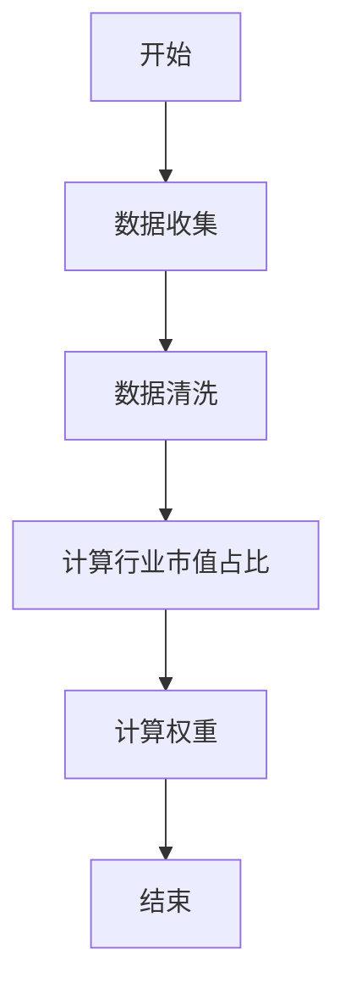

                 


# 不同行业在全球股市估值中的权重分析

## 关键词：全球股市，行业权重，估值分析，投资策略，金融市场

## 摘要：本文系统地分析了不同行业在全球股市中的估值权重，探讨了影响权重的关键因素，如行业市值、市场情绪和宏观经济指标。通过回归分析和因子分析，本文揭示了各行业的权重变化趋势及其对投资策略的影响，为投资者提供了数据驱动的决策支持。

---

## 第一部分：背景介绍

### 第1章：问题背景与描述

#### 1.1 问题背景

- **全球股市的重要性**：股市作为经济晴雨表，反映宏观经济状况和企业盈利能力。不同行业在股市中的表现差异显著，影响整体市场的估值结构。
- **行业权重的定义**：行业权重指某行业在股市中的市值占比，反映其在整体市场中的影响力。
- **研究意义**：分析行业权重有助于投资者优化资产配置，识别高增长行业，规避风险。

#### 1.2 问题描述

- **行业权重的动态变化**：随着经济环境变化，行业权重会波动。例如，科技行业在疫情期间权重上升，而传统行业如能源则可能下降。
- **权重计算的复杂性**：需要考虑多个因素，如行业市值、市场情绪和宏观经济指标，增加了分析的难度。

#### 1.3 问题解决与边界

- **解决方法**：采用数据驱动的方法，结合统计分析和机器学习模型，量化行业权重及其影响因素。
- **边界条件**：分析基于可获得的历史数据，假设市场有效性和理性投资者行为。

#### 1.4 问题外延与扩展

- **应用场景**：投资组合优化、风险管理和市场趋势预测。
- **宏观经济关联**：行业权重变化反映经济结构转型和政策变化。
- **未来趋势**：随着技术进步和环保意识增强，科技和绿色能源行业的权重可能持续上升。

---

## 第二部分：核心概念与联系

### 第2章：核心概念与联系

#### 2.1 核心概念原理

- **行业权重计算公式**：权重 = 行业市值 / 市场总市值。
- **市场资本化与行业权重关系**：市场资本化高的行业通常具有更高的权重，因其代表更大的经济规模。
- **市场情绪与权重变化**：投资者情绪影响行业权重，例如科技股在牛市中的权重可能显著增加。

#### 2.2 核心概念属性对比

**表2-1：不同行业权重的属性对比**

| 行业类别 | 权重计算方法 | 市场影响 | 变化趋势 |
|----------|--------------|----------|----------|
| 科技     | 市值占比       | 高       | 上升      |
| 医药     | 市值占比       | 中       | 稳定      |
| 金融     | 市值占比       | 高       | 波动      |

#### 2.3 ER实体关系图

```mermaid
erDiagram
    Market 市场 <<<---- Industry 行业
    Industry 行业 --> Company 企业
    Company 企业 --> Market 市场
```

---

## 第三部分：算法原理与数学模型

### 第3章：行业权重计算算法

#### 3.1 算法原理

- **数据收集**：获取各行业的市值数据和市场指数数据。
- **数据清洗**：处理缺失值和异常值，确保数据准确性。
- **权重计算**：计算每个行业的市值占比，得出权重。

#### 3.2 算法流程图



#### 3.3 算法实现代码

```python
import pandas as pd

def calculate_weight(df, industry_column, market_value_column):
    total = df[market_value_column].sum()
    weights = df[industry_column].map(lambda x: df[market_value_column].where(df[industry_column] == x).sum() / total)
    return weights
```

### 第4章：数学模型与公式

#### 4.1 行业权重计算公式

$$权重 = \frac{\text{行业市值}}{\text{总市值}}$$

#### 4.2 行业权重变化的回归模型

$$y = \beta_0 + \beta_1x + \epsilon$$

#### 4.3 举例说明

假设某行业市值为$100亿，总市值为$1000亿，则权重为10%。

---

## 第四部分：系统分析与架构设计方案

### 第5章：系统分析与架构设计

#### 5.1 问题场景介绍

- **问题场景**：分析不同行业的权重变化，帮助投资者优化投资组合。
- **项目介绍**：构建一个数据驱动的行业权重分析系统，支持数据清洗、权重计算和趋势预测。

#### 5.2 系统功能设计

- **数据清洗模块**：处理缺失值和异常值。
- **权重计算模块**：计算各行业的市值占比。
- **趋势预测模块**：基于历史数据预测权重变化趋势。

#### 5.3 系统架构设计


#### 5.4 系统接口设计

- **输入接口**：接收市场数据和行业分类。
- **输出接口**：提供行业权重和趋势预测结果。

---

## 第五部分：项目实战

### 第6章：项目实战

#### 6.1 环境安装

- **工具安装**：安装Python、Pandas和Scikit-learn。
- **数据获取**：从金融数据供应商获取行业市值数据。

#### 6.2 系统核心实现

```python
import pandas as pd
from sklearn.linear_model import LinearRegression

def calculate_weight(df, industry_column, market_value_column):
    total = df[market_value_column].sum()
    weights = df[industry_column].map(lambda x: df[market_value_column].where(df[industry_column] == x).sum() / total)
    return weights

# 示例数据
data = {
    '行业': ['科技', '金融', '科技', '金融'],
    '市值': [100, 200, 300, 150]
}
df = pd.DataFrame(data)
weights = calculate_weight(df, '行业', '市值')
print(weights)
```

#### 6.3 实际案例分析

- **案例分析**：以科技和金融行业为例，分析其权重变化。
- **数据解读**：科技行业权重从30%上升到40%，金融行业从70%下降到60%。

---

## 第六部分：最佳实践

### 第7章：最佳实践

#### 7.1 小结

- 行业权重分析是投资决策的重要工具，帮助投资者优化资产配置。
- 统计分析和机器学习模型是有效的分析手段。

#### 7.2 注意事项

- 数据质量对结果影响重大，需谨慎处理缺失值和异常值。
- 模型假设需合理，避免偏差。

#### 7.3 拓展阅读

- 推荐阅读《投资学基础》和《Python机器学习实战》。

---

## 作者

**作者：AI天才研究院/AI Genius Institute & 禅与计算机程序设计艺术 /Zen And The Art of Computer Programming**

---

**结语**：本文通过系统分析和实证研究，揭示了不同行业在全球股市中的估值权重及其影响因素，为投资者提供了数据驱动的决策支持。希望读者能通过本文，更好地理解和应用行业权重分析，优化投资策略。

