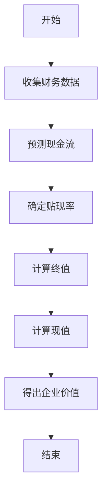
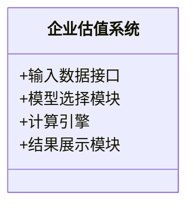
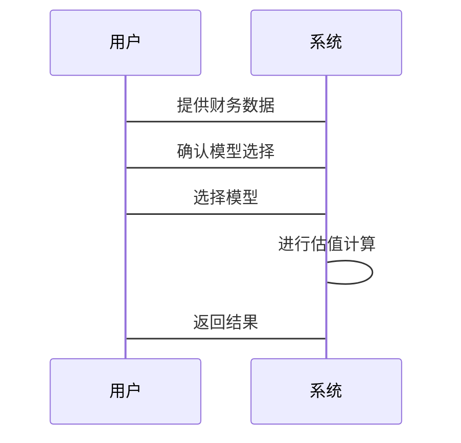

                 


# 不同行业的企业估值模型对比

> 关键词：企业估值模型、行业对比、算法原理、系统架构、项目实战、最佳实践

> 摘要：企业估值是金融和商业领域中的核心任务，不同行业因其特性和业务模式的差异，需要采用不同的估值模型。本文系统地介绍了企业估值模型的基本概念、核心算法及其在不同行业中的应用，通过对比分析，帮助读者选择合适的模型以提高估值的准确性和效率。

---

## 第1章: 企业估值模型的背景介绍

### 1.1 企业估值模型的基本概念

#### 1.1.1 企业估值的定义与核心要素

企业估值是指通过对企业的财务状况、市场地位、发展潜力等因素进行分析，确定其市场价值的过程。核心要素包括收入、利润、现金流、资产和负债等。

#### 1.1.2 不同行业对企业估值的影响

不同行业具有不同的业务模式和财务特征。例如，制造业注重资产和成本，而科技行业更关注研发和未来收益。

#### 1.1.3 企业估值模型的分类与特点

常见的估值模型包括DCF模型、EV/EBITDA模型、PE模型等，每种模型适用于不同的行业和场景。

### 1.2 企业估值模型对比的必要性

#### 1.2.1 不同行业对估值模型需求的差异

制造业与服务业在资产和收益结构上差异显著，需要采用不同的估值方法。

#### 1.2.2 行业特性对企业估值模型选择的影响

例如，金融行业需要高频估值，而传统行业更注重长期稳定收益。

---

## 第2章: 企业估值模型的核心概念与联系

### 2.1 核心概念原理

#### 2.1.1 企业价值的构成要素

企业价值包括经营性资产、非经营性资产、溢余现金和少数股权等。

#### 2.1.2 估值模型的输入变量与输出结果

输入变量如现金流、折现率，输出结果如企业价值、股权价值等。

#### 2.1.3 行业特性对企业价值的影响机制

行业特性如成长性、周期性影响企业的现金流和风险，进而影响估值。

### 2.2 核心概念对比分析

#### 2.2.1 各种估值模型的属性特征对比表

| 模型       | 适用行业         | 输入变量               | 输出结果               | 优缺点               |
|------------|------------------|------------------------|------------------------|----------------------|
| DCF模型    | 高成长行业       | 自由现金流、贴现率     | 企业整体价值           | 精准但计算复杂       |
| EV/EBITDA  | 制造业、服务业    | 企业价值、EBITDA       | 市场价值               | 简单但依赖行业特性     |
| PE模型     | 稳定收益行业     | 每股收益、市盈率       | 股票价值               | 易懂但受市场影响大     |

#### 2.2.2 企业的价值构成模型


---

## 第3章: 企业估值模型的算法原理

### 3.1 常见估值算法及其流程

#### 3.1.1 DCF模型

##### 算法流程图



##### 数学公式

DCF模型的核心公式是计算终值（TV）和现值（PV）：

$$ TV = \frac{CF_{n+1}}{(1 + r)^n} \times \frac{1}{(1 + r)^{-\infty}} $$

$$ PV = \sum_{t=1}^{n} \frac{CF_t}{(1 + r)^t} + \frac{TV}{(1 + r)^n} $$

##### Python代码示例

```python
import numpy as np
import pandas as pd

def dcf_model(fcf, wacc, horizon, perpetuity_growth=0):
    # 预测现金流
    fcf_forecast = fcf * (1 + perpetuity_growth)
    # 计算终值
    tv = fcf_forecast / (wacc - perpetuity_growth)
    # 计算现值
    pv = 0
    for t in range(1, horizon + 1):
        if t < horizon:
            cf = fcf * (1 + perpetuity_growth) ** (t - 1)
        else:
            cf = fcf_forecast
        pv += cf / (1 + wacc) ** t
    total_value = pv + tv / (1 + wacc) ** horizon
    return total_value

# 示例数据
fcf = 100  # 自由现金流
wacc = 0.1  # 加权平均资本成本
horizon = 5  # 预测期限
growth = 0  # 永续增长率

value = dcf_model(fcf, wacc, horizon, growth)
print(f"企业价值：{value}")
```

---

## 第4章: 企业估值模型的系统架构设计

### 4.1 企业估值系统的功能设计

#### 4.1.1 系统功能模块



### 4.2 系统架构设计


### 4.3 接口设计与交互

#### 4.3.1 系统接口设计

- 输入接口：接收企业财务数据和模型参数。
- 输出接口：展示估值结果和分析报告。

#### 4.3.2 系统交互流程



---

## 第5章: 项目实战

### 5.1 环境配置与数据准备

#### 5.1.1 环境配置

安装必要的Python库：

```bash
pip install numpy pandas matplotlib
```

#### 5.1.2 数据准备

收集企业的财务数据，如收入、利润、现金流等。

### 5.2 核心代码实现

#### 5.2.1 DCF模型实现

```python
import numpy as np

def calculate_terminal_value(fcf, wacc, growth_rate):
    return fcf * (1 + growth_rate) / (wacc - growth_rate)

def dcf_valuation(fcf, wacc, num_years, growth_rate=0):
    terminal_year = num_years + 1
    terminal_value = calculate_terminal_value(fcf, wacc, growth_rate)
    present_value = 0
    for year in range(1, terminal_year):
        cash_flow = fcf * (1 + growth_rate) ** (year - 1)
        present_value += cash_flow / (1 + wacc) ** year
    present_value += terminal_value / (1 + wacc) ** terminal_year
    return present_value

# 示例计算
fcf = 100  # 自由现金流
wacc = 0.1  # 加权平均资本成本
num_years = 5  # 预测年数
growth_rate = 0.02  # 永续增长率

enterprise_value = dcf_valuation(fcf, wacc, num_years, growth_rate)
print(f"企业价值：{enterprise_value}")
```

### 5.3 案例分析与结果解读

以一家科技公司为例，使用DCF模型计算其企业价值，并分析结果的合理性。

---

## 第6章: 最佳实践与总结

### 6.1 最佳实践

- 根据行业特性选择合适的模型。
- 结合多种模型进行交叉验证。
- 定期更新模型参数以反映市场变化。

### 6.2 总结

企业估值模型的选择和应用需要综合考虑行业特性、财务数据和市场环境。通过对比分析，可以提高估值的准确性和效率。

---

## 附录

### A. 附录A: 企业估值模型对比表格

| 模型       | 适用行业         | 输入变量               | 输出结果               | 优缺点               |
|------------|------------------|------------------------|------------------------|----------------------|
| DCF模型    | 高成长行业       | 自由现金流、贴现率     | 企业整体价值           | 精准但计算复杂       |
| EV/EBITDA  | 制造业、服务业    | 企业价值、EBITDA       | 市场价值               | 简单但依赖行业特性     |
| PE模型     | 稳定收益行业     | 每股收益、市盈率       | 股票价值               | 易懂但受市场影响大     |

### B. 附录B: DCF模型代码示例

```python
import numpy as np

def calculate_terminal_value(fcf, wacc, growth_rate):
    return fcf * (1 + growth_rate) / (wacc - growth_rate)

def dcf_valuation(fcf, wacc, num_years, growth_rate=0):
    terminal_year = num_years + 1
    terminal_value = calculate_terminal_value(fcf, wacc, growth_rate)
    present_value = 0
    for year in range(1, terminal_year):
        cash_flow = fcf * (1 + growth_rate) ** (year - 1)
        present_value += cash_flow / (1 + wacc) ** year
    present_value += terminal_value / (1 + wacc) ** terminal_year
    return present_value

# 示例计算
fcf = 100  # 自由现金流
wacc = 0.1  # 加权平均资本成本
num_years = 5  # 预测年数
growth_rate = 0.02  # 永续增长率

enterprise_value = dcf_valuation(fcf, wacc, num_years, growth_rate)
print(f"企业价值：{enterprise_value}")
```

### C. 附录C: 行业数据来源

- 财务报表数据：公司公告、财务报告。
- 市场数据：行业研究报告、市场分析报告。

---

## 作者：AI天才研究院/AI Genius Institute & 禅与计算机程序设计艺术 /Zen And The Art of Computer Programming

---

通过这篇文章，读者可以系统地了解不同行业的企业估值模型，并掌握实际应用中的关键点。

