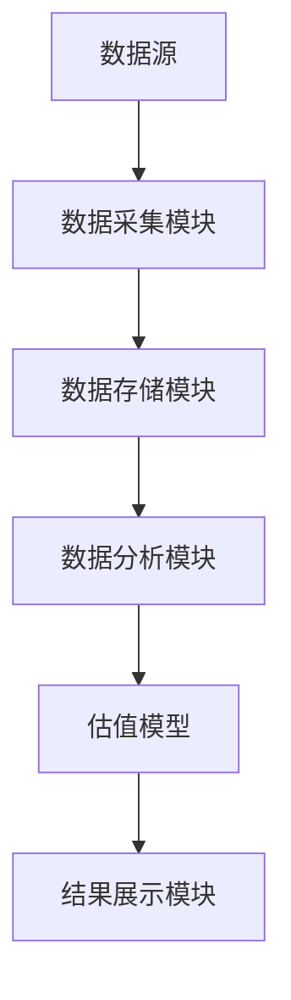
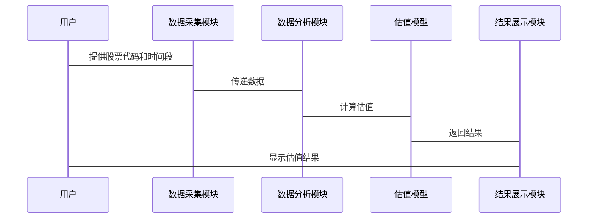

                 


# 中国香港股市估值:国际金融中心的市场特点

## 关键词:
中国香港股市、股市估值、国际金融中心、市场特点、金融分析、投资策略、金融模型

## 摘要:
中国香港股市作为全球重要的金融中心之一，具有独特的市场特点和估值方式。本文将从背景介绍、核心概念、估值方法、数学模型、系统架构以及项目实战等多个角度，详细分析中国香港股市的估值特点和实际应用。通过对市场波动性、宏观经济环境、政策因素等影响的深入探讨，结合具体案例分析，帮助投资者和研究者更好地理解中国香港股市的估值逻辑和实践技巧。

---

# 第一部分: 中国香港股市估值的背景与核心概念

## 第1章: 中国香港股市概述

### 1.1 中国香港股市的定义与特点
#### 1.1.1 中国香港股市的定义
中国香港股市，全称“香港股票市场”，是全球最重要的股票市场之一，由香港交易所（Hong Kong Exchanges and Clearing Limited，HKEX）运营。它以开放性、国际化和自由化为特点，是全球资本流动的重要枢纽。

#### 1.1.2 中国香港股市的独特性
- **国际化程度高**：香港是全球最大的离岸人民币市场和亚洲最大的外汇市场，吸引了大量国际投资者。
- **政策稳定性**：香港实行“一国两制”政策，拥有独立的法律体系和货币政策，市场规则透明且稳定。
- **市场参与者多元化**：包括国内外机构投资者、散户、企业等。

#### 1.1.3 中国香港股市的参与者
- **机构投资者**：包括基金公司、保险公司、银行等。
- **散户投资者**：香港本地和海外个人投资者。
- **上市公司**：涵盖金融、科技、地产等多个行业。

### 1.2 中国香港股市的市场特点
#### 1.2.1 金融中心的定位
香港不仅是中国的金融中心，也是全球三大金融中心之一，与纽约、伦敦并列。其地位使其成为跨国公司和投资者的重要投资地。

#### 1.2.2 市场结构与运作机制
- **多层次市场**：包括主板、创业板和香港科创板。
- **交易机制**：采用T+0交易制度，且无涨跌幅限制（部分新股除外）。
- **监管框架**：由香港证监会（SFC）监管，遵循严格的上市规则和信息披露制度。

#### 1.2.3 市场参与者的行为特征
- **机构投资者主导**：机构投资者在市场中占据主导地位，尤其是海外机构投资者。
- **市场波动性高**：由于国际化程度高，市场容易受到全球宏观经济波动和政策变化的影响。

## 第2章: 股票估值的核心概念

### 2.1 股票估值的基本原理
#### 2.1.1 股票估值的定义
股票估值是指通过对公司财务数据、市场环境、行业竞争状况等因素的分析，确定股票的内在价值，以指导投资决策。

#### 2.1.2 股票估值的分类
- **相对估值法**：基于市场数据（如市盈率、市净率等）进行比较。
- **绝对估值法**：基于公司基本面数据（如现金流、收益等）进行计算。
- **情景分析法**：考虑不同市场环境下的估值。

#### 2.1.3 股票估值的核心要素
- **公司基本面**：收入、利润、资产、负债等。
- **市场环境**：宏观经济、行业趋势、政策变化等。
- **投资者情绪**：市场参与者的心理预期和行为。

### 2.2 中国香港股市估值的特殊性
#### 2.2.1 市场波动性的影响
香港股市波动性较高，尤其是在地缘政治和宏观经济政策变化时，市场反应更为敏感。

#### 2.2.2 宏观经济环境的作用
香港作为国际金融中心，其股市受到全球经济波动、美元指数、原油价格等宏观因素的显著影响。

#### 2.2.3 政治与政策因素的影响
- **政策稳定性**：香港实行“一国两制”，政策相对稳定，但也受到中央政府的政策影响。
- **地缘政治风险**：中美关系、中港关系的变化可能对股市估值产生重大影响。

---

# 第二部分: 中国香港股市估值的算法与数学模型

## 第4章: 估值算法原理

### 4.1 常用估值算法
#### 4.1.1 市盈率法
市盈率（P/E）是股票价格与每股收益的比率，公式为：
$$ P/E = \frac{\text{股价}}{\text{每股收益}} $$

#### 4.1.2 市净率法
市净率（P/B）是股票价格与每股净资产的比率，公式为：
$$ P/B = \frac{\text{股价}}{\text{每股净资产}} $$

#### 4.1.3 股息率法
股息率（Dividend Yield）是股票的股息与股价的比率，公式为：
$$ \text{股息率} = \frac{\text{每股股息}}{\text{股价}} \times 100\% $$

#### 4.1.4 内在价值法
内在价值法通过现金流折现模型（DCF）计算公司的真实价值，公式为：
$$ V = \sum_{t=1}^{n} \frac{\text{现金流}}{(1+r)^t} $$

### 4.2 中国香港股市估值的特殊方法
#### 4.2.1 行业估值差异
不同行业具有不同的估值标准，例如金融行业可能更关注市净率，科技行业可能更关注市盈率。

#### 4.2.2 跨市场比较法
将香港市场的估值与全球其他主要市场进行对比，找出差异和机会。

#### 4.2.3 宏观经济因素调整法
根据宏观经济指标（如GDP增长率、利率、通胀率）对估值进行调整。

---

## 第5章: 数学模型与公式

### 5.1 常用估值公式
#### 5.1.1 市盈率公式
$$ P = E \times \text{市盈率} $$

#### 5.1.2 市净率公式
$$ P = B \times \text{市净率} $$

#### 5.1.3 内在价值公式
$$ V = \sum_{t=1}^{n} \frac{CF_t}{(1+r)^t} $$

### 5.2 中国香港股市估值的特殊公式
#### 5.2.1 跨市场比较公式
$$ V = V_{\text{基准}} \times \text{调整系数} $$

#### 5.2.2 宏观经济影响公式
$$ V = V_{\text{基础}} \times (1 + \beta \times \text{宏观经济指标变化}) $$

---

# 第三部分: 系统分析与架构设计方案

## 第6章: 系统分析与架构设计

### 6.1 问题场景介绍
本文将构建一个基于中国香港股市数据的估值系统，用于分析和预测股票的内在价值。

### 6.2 系统功能设计
- **数据采集**：获取股票的历史数据、财务数据和宏观经济指标。
- **数据分析**：计算各种估值指标，如市盈率、市净率等。
- **模型构建**：基于数学模型进行估值。
- **结果展示**：以图表形式展示估值结果。

### 6.3 系统架构设计


### 6.4 系统接口设计
- **输入接口**：股票代码、时间段。
- **输出接口**：估值结果、图表。

### 6.5 系统交互设计


---

# 第四部分: 项目实战

## 第7章: 项目实战

### 7.1 环境安装
- **工具**：Python、Pandas、Matplotlib、Scikit-learn。
- **数据源**：Yahoo Finance API。

### 7.2 系统核心实现源代码
```python
import pandas as pd
import yfinance as yf
import matplotlib.pyplot as plt

# 下载数据
data = yf.download('腾讯控股', '2020-01-01', '2023-12-31')

# 计算市盈率和市净率
data['PE'] = data['Close'] / data['EPS']
data['PB'] = data['Close'] / data['Book Value per Share']

# 绘制图表
plt.figure(figsize=(12, 6))
plt.plot(data.index, data['PE'], label='PE')
plt.plot(data.index, data['PB'], label='PB')
plt.title('腾讯控股 PE 和 PB 趋势图')
plt.xlabel('日期')
plt.ylabel('比率')
plt.legend()
plt.show()
```

### 7.3 代码应用解读与分析
上述代码展示了如何利用Python和Yahoo Finance API下载数据，并计算市盈率和市净率。通过绘制趋势图，可以直观地观察估值指标的变化。

### 7.4 实际案例分析
以腾讯控股为例，分析其市盈率和市净率的变化趋势，并结合宏观经济指标进行调整。

### 7.5 项目小结
通过实战项目，读者可以掌握如何利用Python进行数据下载、分析和可视化，从而更好地理解中国香港股市的估值方法。

---

# 第五部分: 总结与展望

## 第8章: 总结与展望

### 8.1 总结
本文详细分析了中国香港股市的估值特点和实际应用，结合数学模型和系统设计，为投资者和研究者提供了系统的估值方法和工具。

### 8.2 展望
未来，随着人工智能和大数据技术的发展，股市估值将更加精准和智能化。建议投资者和研究者关注以下领域：
- **人工智能在估值中的应用**。
- **ESG因素对估值的影响**。
- **区块链技术在数据安全中的应用**。

---

# 作者: AI天才研究院/AI Genius Institute & 禅与计算机程序设计艺术 /Zen And The Art of Computer Programming

