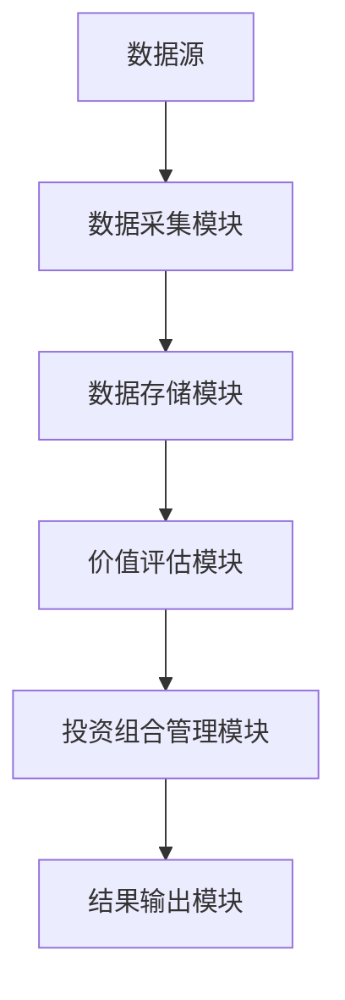

                 


# 《乔尔·格林布拉特的价值投资实践指南》

**关键词**：价值投资、格林布拉特、安全边际、内在价值、投资组合优化、风险管理、数学模型

**摘要**：  
本文深入探讨了乔尔·格林布拉特的价值投资方法，从其核心理念到具体实践策略进行了系统性分析。通过数学模型和实际案例，文章详细讲解了如何计算内在价值、确定安全边际以及构建高效的投资组合。同时，本文还结合了风险管理、税务优化和投资心理控制等关键因素，为读者提供了全面的价值投资实践指南。

---

# 第一章: 价值投资的背景与核心理念

## 1.1 价值投资的定义与背景

### 1.1.1 价值投资的定义  
价值投资是一种基于对企业内在价值分析的投资策略，旨在通过购买价格低于内在价值的股票，实现长期收益。其核心在于寻找市场低估的优质企业。

### 1.1.2 价值投资的核心理念  
1. **安全边际**：买入价格远低于内在价值的股票，以降低投资风险。  
2. **长期视角**：关注企业的长期盈利能力，而非短期市场波动。  
3. **逆向思维**：在市场恐慌时寻找机会，避免追涨杀跌。

### 1.1.3 价值投资与其他投资策略的区别  
- **技术分析**：依赖价格和成交量的短期波动，而非企业基本面。  
- **趋势投资**：基于市场趋势进行投资，风险较高且波动性大。  
- **价值投资**：注重企业的内在价值，强调长期稳健的回报。

## 1.2 价值投资的历史演变

### 1.2.1 价值投资的起源与发展  
价值投资起源于20世纪初，由本杰明·格雷厄姆和戴维·多德提出，强调购买低于清算价值的股票。  

### 1.2.2 格林布拉特价值投资方法的形成  
乔尔·格林布拉特在格雷厄姆的基础上，结合现代金融理论，提出了一套更系统化、量化的价值投资方法。

## 1.3 价值投资的核心要素

### 1.3.1 企业基本面分析  
1. **财务指标**：市盈率（P/E）、市净率（P/B）、股息率等。  
2. **盈利能力**：ROE（净资产收益率）、净利润增长率等。  

### 1.3.2 安全边际的概念  
安全边际 = 内在价值 - 市场价格。安全边际越大，投资风险越小。

### 1.3.3 市场情绪与估值的关系  
市场恐慌时，股票价格可能被低估，此时是买入的好时机。

---

# 第二章: 格林布拉特价值投资方法的核心框架

## 2.1 格林布拉特投资模型的构成

### 2.1.1 核心要素的识别与权重分配  
格林布拉特模型将企业的财务指标、行业地位、管理团队等因素纳入考量。

### 2.1.2 模型的数学表达式  
内在价值的计算公式如下：

$$ V = \frac{E}{P} + \frac{R}{C} $$  

其中：  
- \( V \) 为内在价值  
- \( E \) 为企业的盈利预期  
- \( P \) 为市盈率  
- \( R \) 为股息率  
- \( C \) 为市净率  

---

## 2.2 格林布拉特模型的优缺点分析

### 2.2.1 模型的优点  
1. **量化分析**：通过数学模型量化企业的内在价值。  
2. **易于操作**：适合普通投资者进行分析。  

### 2.2.2 模型的局限性  
1. **过于简化**：忽略了宏观经济和行业风险。  
2. **数据依赖**：依赖于准确的财务数据，数据误差可能影响结果。  

---

## 2.3 格林布拉特模型与其他价值投资模型的对比

### 2.3.1 市盈率模型  
基于市盈率（P/E）评估企业的内在价值，简单但不够全面。  

### 2.3.2 现金流折现模型  
通过现金流折现计算企业的未来现金流，较为复杂但准确。  

### 2.3.3 市净率模型  
基于市净率（P/B）评估企业价值，适用于资产密集型行业。  

---

## 2.4 本章小结  
格林布拉特模型结合了量化分析和基本面研究，为投资者提供了一种系统化、可操作的价值投资方法。

---

# 第三章: 投资组合管理与风险管理

## 3.1 投资组合的构建与优化

### 3.1.1 分散化投资的重要性  
通过投资不同行业和地区的股票，降低投资风险。

### 3.1.2 个股权重的合理分配  
根据企业的内在价值和风险偏好，合理分配个股权重。

---

## 3.2 投资组合的动态调整

### 3.2.1 定期复盘与评估  
每季度复盘投资组合，评估收益与风险是否符合预期。

### 3.2.2 根据市场变化调整持仓  
当市场环境或企业基本面发生变化时，及时调整投资组合。

---

## 3.3 投资组合的风险管理

### 3.3.1 风险的定义与分类  
- **市场风险**：整体市场波动带来的投资风险。  
- **流动性风险**：资产难以快速变现的风险。  
- **信用风险**：企业违约带来的损失风险。  

### 3.3.2 风险的量化与控制  
1. **波动率分析**：通过标准差衡量资产的波动性。  
2. **止损策略**：设定止损点，避免重大损失。  

---

## 3.4 本章小结  
通过科学的投资组合管理和风险管理，投资者可以有效降低投资风险，实现稳健收益。

---

# 第四章: 价值投资的实战应用

## 4.1 价值投资的选股标准与流程

### 4.1.1 财务指标的筛选  
1. **低市盈率（P/E < 15）**  
2. **高股息率（股息率 > 3%）**  
3. **健康的资产负债表**  

### 4.1.2 行业选择与公司分析  
选择具有稳定增长潜力的行业，分析企业的竞争优势。

---

## 4.2 价值评估的具体步骤

### 4.2.1 计算内在价值  
使用格林布拉特模型或其他价值模型计算企业的内在价值。

### 4.2.2 确定安全边际  
比较市场价格与内在价值，确定安全边际是否足够。

---

## 4.3 投资组合的实战案例

### 4.3.1 环境安装  
1. **工具选择**：使用Excel或Python进行财务数据分析。  
2. **数据获取**：通过Yahoo Finance获取股票数据。  

### 4.3.2 核心实现代码  
```python
import pandas as pd
import numpy as np

# 假设df为包含股票数据的DataFrame
def calculate_intrinsic_value(df):
    df['内在价值'] = df['净利润'] / df['市盈率']
    df['安全边际'] = df['内在价值'] - df['股价']
    return df

# 示例数据
data = {
    '股价': [50, 60, 40],
    '净利润': [10, 15, 8],
    '市盈率': [15, 10, 12]
}
df = pd.DataFrame(data)
result = calculate_intrinsic_value(df)
print(result)
```

### 4.3.3 案例分析  
以某公司为例，计算其内在价值和安全边际，判断是否值得投资。

---

## 4.4 本章小结  
通过实战案例，读者可以掌握价值投资的具体操作步骤和实际应用。

---

# 第五章: 系统架构与投资心理控制

## 5.1 系统架构设计

### 5.1.1 系统功能设计  
- **数据采集**：获取股票数据和财务报表。  
- **价值评估**：计算内在价值和安全边际。  
- **组合管理**：优化投资组合并实时监控。  

### 5.1.2 系统架构图  


### 5.1.3 系统接口设计  
- **数据接口**：与数据源（如Yahoo Finance）对接。  
- **用户界面**：提供友好的操作界面。  

---

## 5.2 投资心理控制

### 5.2.1 心理控制的重要性  
1. **避免情绪化决策**：不因市场波动而盲目买卖。  
2. **长期坚持**：即使短期亏损，也要坚持长期策略。  

### 5.2.2 保持纪律性  
严格按照投资计划执行，避免贪婪和恐惧的影响。

---

## 5.3 本章小结  
系统的架构设计和心理控制是实现价值投资成功的重要保障。

---

# 第六章: 价值投资的税务规划与成本控制

## 6.1 税务规划的重要性

### 6.1.1 税法的基本知识  
了解股票交易的税务政策，合理规划税务负担。

### 6.1.2 税务优化策略  
1. **长期投资**：长期持有的股票资本利得税较低。  
2. **分红策略**：合理利用股息收入降低税务负担。  

---

## 6.2 成本控制的技巧

### 6.2.1 降低交易成本  
选择低佣金的交易平台，减少频繁交易。

### 6.2.2 长期持有  
通过长期持有降低交易成本和税务负担。

---

## 6.3 本章小结  
合理的税务规划和成本控制可以显著提升投资收益。

---

# 第七章: 项目实战与最佳实践

## 7.1 项目实战

### 7.1.1 环境安装  
1. **安装Python**：确保Python 3.8及以上版本。  
2. **安装库**：`pip install pandas numpy matplotlib`  

### 7.1.2 核心实现代码  
```python
import pandas as pd
import numpy as np

def main():
    # 示例数据
    data = {
        '公司名称': ['A', 'B', 'C'],
        '股价': [50, 60, 40],
        '净利润': [10, 15, 8],
        '市盈率': [15, 10, 12]
    }
    df = pd.DataFrame(data)
    
    # 计算内在价值和安全边际
    df['内在价值'] = df['净利润'] / df['市盈率']
    df['安全边际'] = df['内在价值'] - df['股价']
    
    # 输出结果
    print("公司名称 | 股价 | 净利润 | 市盈率 | 内在价值 | 安全边际")
    print("---------|-----|--------|--------|----------|-----------")
    for index, row in df.iterrows():
        print(f"{row['公司名称']} | {row['股价']} | {row['净利润']} | {row['市盈率']} | {row['内在价值']:.2f} | {row['安全边际']:.2f}")

if __name__ == "__main__":
    main()
```

### 7.1.3 案例分析  
通过上述代码计算某公司的内在价值和安全边际，判断是否值得投资。

---

## 7.2 最佳实践 tips

### 7.2.1 小结  
1. **持续学习**：关注市场动态和企业基本面。  
2. **保持纪律**：严格按照投资计划执行。  
3. **分散投资**：降低投资风险。  

### 7.2.2 注意事项  
1. **数据准确性**：确保财务数据的准确性。  
2. **模型局限性**：认识到模型的简化可能导致偏差。  
3. **市场风险**：市场波动可能影响投资收益。  

### 7.2.3 拓展阅读  
推荐阅读格林布拉特的《证券分析》和《聪明的投资者》。

---

# 第八章: 总结与展望

## 8.1 总结  
乔尔·格林布拉特的价值投资方法为投资者提供了一套系统化、可操作的策略，强调内在价值和安全边际的重要性。

## 8.2 展望  
随着金融市场的不断发展，价值投资将继续演变，结合大数据和人工智能技术，未来将更加精准和高效。

---

# 作者：AI天才研究院/AI Genius Institute & 禅与计算机程序设计艺术 /Zen And The Art of Computer Programming

