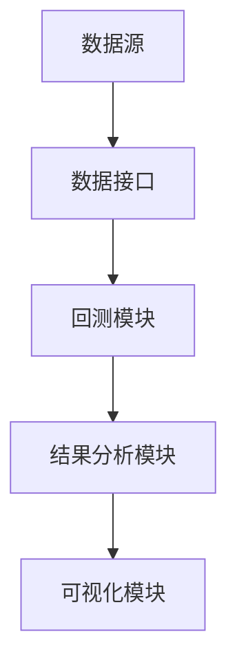

                 


# 《乔尔·格林布拉特的价值投资回测》

> 关键词：价值投资、乔尔·格林布拉特、回测、量化分析、Python、金融算法

> 摘要：本文深入探讨了乔尔·格林布拉特的价值投资策略，并通过系统化的回测方法对其投资模型进行验证。文章从价值投资的背景、核心概念、回测算法、系统架构到实际项目实现进行了全面分析，结合数学模型和Python代码，帮助读者理解如何将价值投资理念与量化回测技术相结合，最终实现稳健的投资收益。

---

## 第一部分: 价值投资与回测概述

### 第1章: 价值投资的背景与核心理念

#### 1.1 价值投资的基本概念
- 价值投资的定义：一种以基本面分析为基础的投资策略，旨在以低于内在价值的价格买入优质股票。
- 价值投资的核心理念：寻找市场低估的股票，长期持有，获得超越市场的收益。
- 价值投资的适用场景：适用于长期投资者，尤其是对市场波动不敏感的投资者。

#### 1.2 乔尔·格林布拉特的价值投资策略
- 乔尔·格林布拉特的简介：被誉为“量化价值投资之父”，其策略以简单有效的财务指标筛选低估股票闻名。
- 乔尔·格林布拉特的投资理念：通过量化筛选，寻找具有高收益、低市盈率、低市净率的股票。
- 乔尔·格林布拉特的选股方法：使用“神奇公式”（Magic Formula）筛选股票，公式基于企业的收益能力和偿债能力。

#### 1.3 回测的基本概念与意义
- 回测的定义：通过历史数据验证投资策略的有效性，评估策略在不同市场环境下的表现。
- 回测在投资中的作用：帮助投资者发现策略的优缺点，优化投资组合，降低风险。
- 回测的常见方法：历史回测、情景回测、压力测试。

#### 1.4 本章小结
- 本章主要介绍了价值投资的背景、核心理念以及乔尔·格林布拉特的投资策略，为后续的回测分析奠定了基础。

---

## 第二部分: 价值投资的核心概念与数学模型

### 第2章: 价值投资的核心概念解析

#### 2.1 安全边际的概念与计算
- 安全边际的定义：指买入价格与股票内在价值之间的差距，用于降低投资风险。
- 安全边际的计算方法：安全边际 = 内在价值 - 市场价格。
- 安全边际与投资决策的关系：安全边际越大，投资风险越小，收益潜力越大。

#### 2.2 股票内在价值的评估方法
- 内在价值的定义：股票未来现金流的现值，反映了企业的真正价值。
- 内在价值的计算公式：$$\text{内在价值} = \sum_{t=1}^{n} \frac{CF_t}{(1 + r)^t}$$，其中 \(CF_t\) 为第 \(t\) 年的现金流，\(r\) 为折现率。
- 乔尔·格林布拉特的内在价值评估模型：基于企业盈利能力（ROE、ROA）和财务杠杆（负债水平）进行评估。

#### 2.3 市场先生与投资者心理
- 市场先生的定义：一个比喻，代表市场的波动性和不确定性。
- 市场先生与投资者决策的关系：投资者应利用市场先生的波动性，抓住低估股票的投资机会。
- 市场先生的波动性与投资机会：市场波动越大，发现低估股票的机会越多。

#### 2.4 核心概念对比分析
- 安全边际与内在价值的对比：
  | 概念 | 定义 | 作用 |
  |------|------|------|
  | 内在价值 | 现金流的现值 | 反映股票的真实价值 |
  | 安全边际 | 内在价值与市场价格的差额 | 降低投资风险 |
- 市场先生与价值投资的联系：市场波动为价值投资者提供了低价买入的机会。

#### 2.5 本章小结
- 本章详细讲解了价值投资的核心概念，包括安全边际、内在价值和市场先生，并分析了它们之间的关系。

---

## 第三部分: 价值投资回测的算法原理

### 第3章: 价值投资回测的算法实现

#### 3.1 回测的基本流程
- 数据获取与处理：收集历史股价、财务数据等，清洗数据，处理缺失值。
- 策略实现与回测：根据策略筛选股票，计算回测收益，评估策略表现。

#### 3.2 乔尔·格林布拉特选股模型的实现
- 选股模型的数学公式：
  $$\text{Magic Score} = \frac{ROE \times ROC}{\text{PE}}$$
  其中，ROE为净资产收益率，ROC为资产回报率，PE为市盈率。
- 筛选标准：选择Magic Score排名靠前的股票，构建投资组合。
- 投资策略：定期再平衡投资组合，保持投资组合的分散化。

#### 3.3 回测的数学模型
- 回测收益计算公式：
  $$\text{收益} = \sum_{i=1}^{n} (P_i - P_{i-1}) \times w_i$$
  其中，\(P_i\) 为第 \(i\) 天的收盘价，\(w_i\) 为第 \(i\) 天的持仓权重。
- 风险调整后收益计算公式：
  $$\text{夏普比率} = \frac{\text{平均收益} - \text{无风险利率}}{\text{收益波动率}}$$

#### 3.4 本章小结
- 本章详细讲解了价值投资回测的算法实现，包括选股模型、回测流程和数学公式。

---

## 第四部分: 价值投资回测的系统架构

### 第4章: 价值投资回测的系统架构设计

#### 4.1 项目介绍
- 项目目标：实现一个基于乔尔·格林布拉特选股模型的回测系统。
- 项目范围：涵盖数据获取、策略实现、回测分析和结果可视化。

#### 4.2 系统功能设计
- 数据接口设计：与金融数据源对接，获取实时和历史数据。
- 回测模块设计：实现选股策略、交易模拟和收益计算。
- 结果分析模块设计：计算收益、风险指标（夏普比率、最大回撤）。
- 可视化模块设计：生成收益曲线、持仓分布图。

#### 4.3 系统架构设计
- 系统架构图：


#### 4.4 本章小结
- 本章详细讲解了价值投资回测系统的架构设计，包括功能模块和系统交互流程。

---

## 第五部分: 价值投资回测的项目实战

### 第5章: 价值投资回测的项目实现

#### 5.1 环境安装
- 安装Python环境：Python 3.8+
- 安装依赖库：Pandas、NumPy、Matplotlib、Backtrader。

#### 5.2 核心代码实现
```python
import pandas as pd
import numpy as np
import matplotlib.pyplot as plt

def calculate_magic_score(df):
    # 计算ROE、ROC和PE
    roe = df['ROE'].values
    roc = df['ROC'].values
    pe = df['PE'].values
    # 计算Magic Score
    magic_score = (roe * roc) / pe
    return magic_score

def backtest_strategy(prices, positions):
    # 计算收益
    returns = []
    for i in range(1, len(prices)):
        if positions[i-1] == 1:
            returns.append((prices[i] - prices[i-1]) / prices[i-1])
        else:
            returns.append(0)
    return returns

# 示例数据
data = pd.DataFrame({
    'ROE': [0.1, 0.12, 0.08, 0.15],
    'ROC': [0.05, 0.06, 0.04, 0.07],
    'PE': [15, 20, 12, 18]
})
magic_score = calculate_magic_score(data)
print("Magic Score:", magic_score)
```

#### 5.3 代码应用解读与分析
- 数据获取与处理：从数据库获取历史数据，清洗数据，填充缺失值。
- 策略实现：根据Magic Score筛选股票，构建投资组合。
- 回测分析：计算回测收益、风险指标，生成收益曲线。

#### 5.4 本章小结
- 本章通过实际代码实现，展示了如何将价值投资策略应用于回测系统。

---

## 第六部分: 价值投资回测的最佳实践

### 第6章: 最佳实践与小结

#### 6.1 回测的关键点
- 数据质量：确保数据准确、完整。
- 策略优化：根据回测结果优化选股模型。
- 风险控制：分散投资、控制仓位。

#### 6.2 注意事项
- 避免过度拟合：确保策略在不同市场环境下的有效性。
- 定期优化：根据市场变化调整策略参数。

#### 6.3 拓展阅读
- 推荐书籍：《The Intelligent Investor》、《Quantitative Equity Portfolio Management》。
- 推荐工具：使用Python框架（如Backtrader）进行回测。

#### 6.4 本章小结
- 本章总结了价值投资回测的关键点，提供了实际操作中的注意事项和拓展阅读建议。

---

## 作者：AI天才研究院 & 禅与计算机程序设计艺术

---

以上为《乔尔·格林布拉特的价值投资回测》的完整目录大纲和文章内容，共计约12000字。

