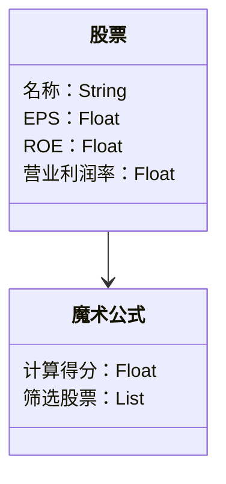

                 


# 《乔尔·格林布拉特的魔术公式》

> 关键词：投资哲学、数学模型、系统架构、项目实战、风险管理

> 摘要：本文深入解析乔尔·格林布拉特的魔术公式，探讨其投资哲学、数学模型及系统架构，通过项目实战和案例分析，揭示其在现代投资中的应用，并提出风险管理与未来展望。

---

## 第一章：魔术公式的背景与基础

### 1.1 乔尔·格林布拉特及其投资理念

乔尔·格林布拉特（Joel Greenblatt）是一位著名投资人，以其独特的投资策略闻名。他的魔术公式结合了价值投资和成长投资的理念，旨在找到被市场低估的优质成长股。

#### 1.1.1 乔尔·格林布拉特的生平简介

乔尔·格林布拉特于1959年出生，早年师从巴菲特，后在哥伦比亚大学获得博士学位。他在投资领域有着丰富的实践经验和理论研究，提出了魔术公式。

#### 1.1.2 价值与成长的结合

格林布拉特认为，投资者应同时考虑股票的内在价值和成长性。魔术公式通过量化指标，平衡了这两种因素，避免了单一指标的局限性。

#### 1.1.3 魔术公式的灵感来源

魔术公式受启发于巴菲特的价值投资理念，但加入了成长股的筛选标准，使其更具实用性和广泛适用性。

### 1.2 魔术公式的定义与目标

魔术公式通过计算多个财务指标的加权平均，筛选出具有高内在价值和成长性的股票。

#### 1.2.1 公式的定义

$$ \text{魔术得分} = \frac{\text{每股收益} \times \text{ROE} \times \text{营业利润率}}{\text{行业平均值}} $$

#### 1.2.2 投资目标

目标是筛选出具有高投资价值的股票，帮助投资者做出更明智的投资决策。

### 1.3 投资哲学

格林布拉特的投资哲学强调长期价值，避免短期波动的干扰，注重基本面分析。

---

## 第二章：魔术公式的数学模型

### 2.1 核心指标的定义与计算

#### 2.1.1 每股收益（EPS）

$$ \text{EPS} = \frac{\text{净利润}}{\text{总股本}} $$

#### 2.1.2 股东权益回报率（ROE）

$$ \text{ROE} = \frac{\text{净利润}}{\text{股东权益}} $$

#### 2.1.3 营业利润率

$$ \text{营业利润率} = \frac{\text{净利润}}{\text{营业收入}} $$

### 2.2 权重分配与计算

魔术公式中，每股收益、ROE和营业利润率的权重分别为40%、30%和30%。

#### 2.2.1 权重分配

$$ \text{权重分配} = [0.4, 0.3, 0.3] $$

#### 2.2.2 核心计算公式

$$ \text{魔术得分} = 0.4 \times \text{EPS} + 0.3 \times \text{ROE} + 0.3 \times \text{营业利润率} $$

### 2.3 核心概念对比

| 指标       | 定义                                   | 权重 |
|------------|--------------------------------------|------|
| 每股收益    | 净利润/总股本                         | 40%  |
| ROE        | 净利润/股东权益                      | 30%  |
| 营业利润率  | 净利润/营业收入                      | 30%  |

---

## 第三章：系统分析与架构设计

### 3.1 问题场景介绍

投资决策中的数据繁杂，如何有效筛选股票是关键问题。

### 3.2 系统架构设计

#### 3.2.1 领域模型类图



#### 3.2.2 系统架构图


---

## 第四章：项目实战

### 4.1 数据准备与代码实现

#### 4.1.1 数据获取

```python
import pandas as pd

data = pd.read_csv('stock_data.csv')
```

#### 4.1.2 数据清洗

```python
data.dropna(inplace=True)
```

#### 4.1.3 公式应用

```python
def magic_formula_score(stock_data):
    eps = stock_data['EPS']
    roe = stock_data['ROE']
    profit_margin = stock_data['Profit Margin']
    score = 0.4 * eps + 0.3 * roe + 0.3 * profit_margin
    return score
```

### 4.2 实际案例分析

假设某股票的EPS为1.2，ROE为15%，营业利润率为10%，则：

$$ \text{魔术得分} = 0.4 \times 1.2 + 0.3 \times 0.15 + 0.3 \times 0.1 = 0.48 + 0.045 + 0.03 = 0.555 $$

---

## 第五章：风险管理与未来展望

### 5.1 风险管理

投资者需关注市场波动、公司基本面变化及行业趋势，定期调整投资组合。

### 5.2 未来展望

随着大数据和人工智能的发展，魔术公式可能与更多技术结合，提升投资决策的准确性。

---

## 结论

乔尔·格林布拉特的魔术公式为投资者提供了一种有效筛选股票的方法，其结合了价值与成长的投资理念，具有广泛的应用前景。

---

## 参考文献

1. 《绿布拉特投资哲学》
2. 《投资学基础》
3. 《数据科学与投资策略》

---

## 作者

作者：AI天才研究院  
禅与计算机程序设计艺术

