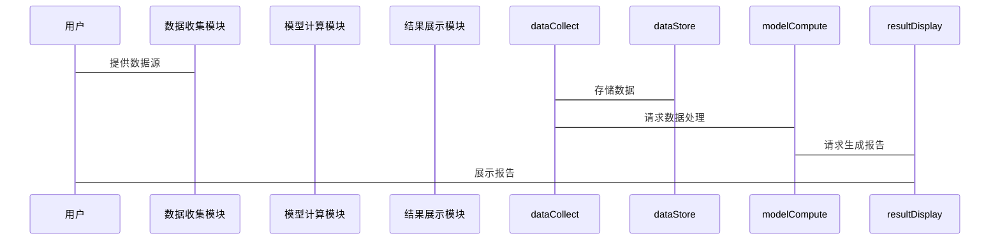

                 


```markdown
# 人口结构变化对全球股市估值的长期影响

> 关键词：人口结构变化，股市估值，长期影响，数学模型，数据分析，经济预测

> 摘要：本文系统分析了人口结构变化如何影响全球股市估值的长期趋势。通过构建数学模型和实证分析，探讨了不同人口结构特征对股市估值的具体影响机制，包括劳动力供给、消费结构、利率政策等多个方面。结合实际案例和系统架构设计，本文为投资者和政策制定者提供了有益的参考。

---

# 第1章: 人口结构变化与股市估值的背景介绍

## 1.1 人口结构变化的核心概念
### 1.1.1 人口结构的定义与分类
- 人口结构是指一个国家或地区人口按年龄、性别、职业等特征的分布情况。
- 主要分类包括年龄结构、性别比例、劳动年龄人口比例等。

### 1.1.2 股市估值的基本概念
- 股市估值是通过对上市公司财务状况和市场环境的分析，对其股票价格进行合理评估的过程。
- 主要影响因素包括企业盈利、利率水平、市场情绪等。

### 1.1.3 人口结构变化与股市估值的关系
- 人口结构变化直接影响劳动力供给和消费结构，从而间接影响企业盈利和股市估值。

## 1.2 问题背景与重要性
### 1.2.1 人口老龄化与劳动力市场的挑战
- 老龄化社会导致劳动力供给减少，增加企业用工成本。
- 劳动力结构变化影响企业的生产效率和创新能力。

### 1.2.2 经济增长与投资需求的关联
- 经济增长推动企业盈利上升，吸引更多资金流入股市。
- 投资需求受人口结构影响，年轻人口多的国家更倾向于高风险投资。

### 1.2.3 股市估值长期波动的驱动因素
- 长期来看，股市估值受经济基本面、政策环境和人口结构变化的共同影响。

## 1.3 问题解决与研究方法
### 1.3.1 定量分析与定性研究的结合
- 使用定量方法分析人口结构数据与股市估值的关系。
- 结合定性研究探讨政策变化对股市的潜在影响。

### 1.3.2 数据来源与研究框架的构建
- 数据来源包括各国统计局的人口数据和金融市场的历史数据。
- 构建包含人口结构、经济增长、政策环境等多个变量的分析框架。

### 1.3.3 研究假设与验证方法
- 假设：劳动年龄人口比例的变化对股市估值有显著影响。
- 验证方法：通过回归分析和时间序列分析验证假设。

## 1.4 本章小结
- 本章介绍了人口结构变化和股市估值的基本概念，分析了两者之间的关系，并提出了研究方法和假设。

---

# 第2章: 人口结构变化对经济与股市的影响机制

## 2.1 人口结构变化对经济增长的影响
### 2.1.1 劳动力供给的变动
- 劳动年龄人口比例下降导致劳动力供给减少，可能抑制经济增长。
- 非劳动年龄人口比例上升可能增加社会福利支出，影响政府财政状况。

### 2.1.2 消费结构的调整
- 年轻人口比例高的国家消费结构偏向教育、住房等领域。
- 老龄化国家消费结构偏向医疗、养老服务等，影响企业盈利分布。

### 2.1.3 技术进步与资本分配
- 劳动力短缺推动企业技术升级，提高生产效率。
- 资本从劳动力密集型产业转向技术密集型产业，影响股市行业分布。

## 2.2 人口结构变化对股市估值的影响路径
### 2.2.1 投资需求的周期性变化
- 年轻人口比例上升推动风险投资增加，抬高股市估值。
- 老龄化国家投资需求趋于保守，股市估值可能承压。

### 2.2.2 利率政策与股市估值的关系
- 人口老龄化可能导致央行实施宽松的货币政策，降低借贷成本，利好股市。
- 利率下降通过影响企业融资成本和市场流动性间接影响股市估值。

### 2.2.3 消费者行为对股市的间接影响
- 消费结构变化影响企业收入，进而影响股市估值。
- 消费者偏好变化可能导致某些行业股票估值波动。

## 2.3 经济周期与人口结构的交互作用
### 2.3.1 经济周期的定义与阶段划分
- 经济周期包括衰退、复苏、过热和滞胀四个阶段。

### 2.3.2 人口结构在经济周期中的角色
- 在经济衰退期，人口结构变化可能加剧就业市场的压力。
- 在经济过热期，人口结构变化可能导致劳动力短缺，推动工资上涨。

### 2.3.3 经济周期与股市估值的动态关系
- 经济周期与人口结构变化共同作用，影响股市估值的短期和长期趋势。

## 2.4 本章小结
- 本章分析了人口结构变化对经济增长和股市估值的具体影响机制，强调了经济周期与人口结构的交互作用。

---

# 第3章: 人口结构变化对股市估值的数学模型与分析

## 3.1 模型构建的基本原理
### 3.1.1 模型的假设与简化
- 假设：劳动年龄人口比例对股市估值的影响是线性的。
- 简化：忽略其他因素（如政策变化、国际局势）的影响。

### 3.1.2 模型的变量选择
- 自变量：劳动年龄人口比例、老龄化程度、年轻人比例。
- 因变量：股市估值指数。

### 3.1.3 模型的数学表达
$$
\text{Stock Valuation} = \beta_0 + \beta_1 \times \text{Labor Force Ratio} + \beta_2 \times \text{Aging Factor} + \epsilon
$$

其中：
- $\text{Labor Force Ratio}$ 表示劳动年龄人口比例。
- $\text{Aging Factor}$ 表示老龄化程度的指标。
- $\beta_i$ 表示回归系数。
- $\epsilon$ 表示误差项。

## 3.2 人口结构指标的量化
### 3.2.1 年龄分布的标准化处理
- 将人口按年龄分组，计算各年龄段人口比例。

### 3.2.2 劳动力参与率的计算方法
- 劳动力参与率 = （劳动年龄人口数 / 总人口数） × 100%

### 3.2.3 消费指数的构建与应用
- 根据人口结构特征构建消费指数，反映不同年龄段的消费偏好。

## 3.3 经济增长与股市估值的回归分析
### 3.3.1 回归模型的建立
- 使用多元回归模型分析人口结构对股市估值的影响。

### 3.3.2 变量的系数解释
- 劳动年龄人口比例的回归系数为正，表明其对股市估值有正向影响。
- 老龄化程度的回归系数为负，表明其对股市估值有负面影响。

### 3.3.3 模型的验证与修正
- 检验模型的显著性，调整回归方程，剔除不显著变量。

## 3.4 人口结构变化的长期影响预测
### 3.4.1 时间序列分析方法
- 使用ARIMA模型预测未来的人口结构变化和股市估值走势。

### 3.4.2 预测结果的可视化
- 通过折线图展示预测的股市估值变化趋势。

### 3.4.3 模型的局限性与改进方向
- 局限性：模型假设可能过于简化，忽略了一些重要因素。
- 改进方向：引入更多变量，如政策变化、技术创新等。

## 3.5 本章小结
- 本章构建了数学模型，分析了人口结构变化对股市估值的影响，并对未来走势进行了预测。

---

# 第4章: 系统分析与架构设计方案

## 4.1 问题场景介绍
- 需求：分析不同国家的人口结构变化对股市估值的影响。
- 目标：构建一个可扩展的分析系统，支持多国数据的对比分析。

## 4.2 系统功能设计
### 4.2.1 数据收集模块
- 数据来源：各国统计局、金融数据平台。
- 数据清洗：处理缺失值、异常值。

### 4.2.2 模型计算模块
- 实现回归分析和时间序列预测。
- 提供交互式界面，方便用户调整模型参数。

### 4.2.3 结果展示模块
- 生成可视化图表，展示分析结果。
- 提供数据表格和报告输出功能。

## 4.3 系统架构设计


## 4.4 系统交互设计


## 4.5 本章小结
- 本章设计了一个完整的系统架构，能够支持人口结构变化对股市估值的长期影响分析。

---

# 第5章: 项目实战与案例分析

## 5.1 环境安装与数据准备
### 5.1.1 环境安装
- 安装Python、Pandas、Matplotlib、Scikit-learn等工具。

### 5.1.2 数据准备
- 下载各国人口数据和股市估值数据。
- 数据清洗与预处理。

## 5.2 核心代码实现
### 5.2.1 数据加载与可视化
```python
import pandas as pd
import matplotlib.pyplot as plt

data = pd.read_csv('population_and_stock.csv')
data.plot(x='Year', y='Stock Valuation', kind='line')
plt.show()
```

### 5.2.2 模型训练与预测
```python
from sklearn.linear_model import LinearRegression

model = LinearRegression()
model.fit(data[['Labor Force Ratio', 'Aging Factor']], data['Stock Valuation'])
print(model.coef_)
```

## 5.3 案例分析与结果解读
### 5.3.1 案例选择
- 分析老龄化严重的国家（如日本）和年轻人口比例高的国家（如印度）。

### 5.3.2 模型应用
- 使用训练好的模型预测未来10年的股市估值变化。

### 5.3.3 结果解读
- 日本的股市估值可能因老龄化而长期低迷。
- 印度的股市估值可能因年轻人口比例高而持续增长。

## 5.4 本章小结
- 本章通过实际案例展示了模型的应用，验证了理论分析的可行性。

---

# 第6章: 总结与展望

## 6.1 主要发现与结论
- 人口结构变化对股市估值有显著影响，劳动年龄人口比例和老龄化程度是关键因素。
- 经济周期与人口结构的交互作用不可忽视。

## 6.2 未来研究方向
- 引入更多变量，如政策变化、技术创新等。
- 开发更复杂的模型，如机器学习算法，提高预测精度。

## 6.3 最佳实践 tips
- 投资者应关注人口结构变化对特定行业的影响。
- 政府应制定相应政策，应对人口结构变化带来的挑战。

## 6.4 注意事项
- 模型假设可能过于简化，需结合实际情况调整。
- 数据质量对分析结果影响较大，需确保数据来源可靠。

## 6.5 拓展阅读
- 推荐阅读相关领域的学术论文和研究报告。

## 6.6 本章小结
- 本章总结了全文的主要结论，并提出了未来的研究方向和实践建议。

---

# 作者：AI天才研究院/AI Genius Institute & 禅与计算机程序设计艺术 /Zen And The Art of Computer Programming
```

