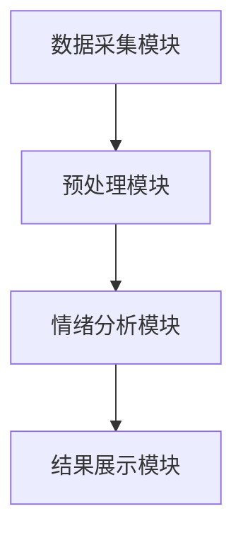

                 


# 人工智能在实时市场情绪分析中的应用

## 关键词：
实时市场情绪分析，人工智能，自然语言处理，金融数据分析，深度学习

## 摘要：
本文探讨了人工智能在实时市场情绪分析中的应用，分析了其核心概念、算法原理和系统架构。文章从市场情绪分析的背景入手，详细讲解了文本预处理、特征提取、情绪分类算法，并通过项目实战展示了系统的实现过程。最后，文章总结了当前的挑战和未来发展方向。

---

# 人工智能在实时市场情绪分析中的应用

## 引言

市场情绪分析是金融领域的重要工具，用于评估市场参与者的情绪状态，从而帮助投资者做出更明智的决策。随着人工智能技术的快速发展，实时市场情绪分析变得越来越精确和高效。本文将详细探讨人工智能在这一领域的应用，从基础概念到实际系统设计，为读者提供全面的了解。

## 第一部分：市场情绪分析的背景与应用

### 第1章：市场情绪分析的基本概念

#### 1.1 市场情绪分析的定义与重要性

市场情绪分析是指通过分析新闻、社交媒体、论坛等来源，评估市场参与者的情绪状态。这种分析可以帮助投资者预测市场趋势，识别潜在风险，并制定相应的投资策略。实时市场情绪分析尤其重要，因为它能够捕捉到最新的市场动态，提供及时的反馈。

#### 1.2 问题背景与描述

传统市场分析主要依赖于价格走势和技术指标，但情绪分析提供了额外的信息维度。市场情绪可以影响投资者的决策，进而影响资产价格。然而，手动分析大量的市场数据耗时且效率低下，因此人工智能的引入极大地提高了分析的效率和准确性。

## 第二部分：人工智能在市场情绪分析中的核心概念

### 第2章：文本预处理与特征提取

#### 2.1 文本预处理方法

在进行情绪分析之前，需要对文本数据进行预处理。这包括分词处理、去除停用词、词干提取和词性标注。例如，中文分词可以使用jieba库，而英文数据可以使用NLTK库。

```python
# 示例代码：使用jieba进行中文分词
import jieba
text = "今天市场表现强劲，投资者信心十足"
words = jieba.lcut(text)
print(words)  # 输出：['今天', '市场', '表现', '强劲', '投资者', '信心', '十足']
```

#### 2.2 特征提取技术

特征提取是将文本数据转换为可训练的特征向量。常用的方法包括TF-IDF和词嵌入技术如Word2Vec、GloVe。词嵌入能够捕捉到词语的语义信息，比TF-IDF更高效。

### 第3章：情绪分类算法

#### 3.1 传统机器学习算法

传统的机器学习算法如支持向量机（SVM）、随机森林和K近邻算法（KNN）常用于情绪分类。SVM适用于小规模数据，而随机森林适合处理高维数据。

```python
# 示例代码：使用SVM进行情绪分类
from sklearn.svm import SVC
from sklearn.feature_extraction.text import TfidfVectorizer
# 假设X_train和y_train是训练数据和标签
vectorizer = TfidfVectorizer()
X_train_vec = vectorizer.fit_transform(X_train)
model = SVC()
model.fit(X_train_vec, y_train)
```

#### 3.2 深度学习模型

深度学习模型如RNN、LSTM和Transformer在处理长文本时表现优异。LSTM能够捕捉长距离依赖关系，适合处理时间序列数据。

```python
# 示例代码：使用LSTM进行情绪分类
from tensorflow.keras.models import Sequential
from tensorflow.keras.layers import LSTM, Dense
model = Sequential()
model.add(LSTM(64, input_shape=(max_len, 1)))
model.add(Dense(1, activation='sigmoid'))
model.compile(loss='binary_crossentropy', optimizer='adam', metrics=['accuracy'])
```

## 第三部分：系统设计与架构

### 第4章：系统架构设计

#### 4.1 系统功能模块

实时市场情绪分析系统通常包括数据采集、预处理、分析和展示模块。数据采集模块负责获取实时数据，预处理模块对数据进行清洗和转换，分析模块应用算法进行情绪分类，展示模块将结果可视化。

#### 4.2 系统架构图



### 第5章：接口与交互设计

#### 5.1 数据接口设计

系统需要与数据源（如新闻网站、社交媒体）接口，获取实时数据。接口设计通常采用RESTful API，数据格式为JSON或XML。

## 第四部分：项目实战

### 第6章：环境搭建与核心实现

#### 6.1 环境安装

安装必要的库，如jieba、NLTK、scikit-learn、TensorFlow等。

```bash
pip install jieba scikit-learn tensorflow
```

#### 6.2 核心实现代码

实现一个简单的实时市场情绪分析工具，从社交媒体获取数据，进行预处理，应用模型进行分类，并展示结果。

```python
# 示例代码：情绪分析工具
import requests
import jieba
from sklearn.feature_extraction.text import TfidfVectorizer
from sklearn.svm import SVC

# 数据采集
response = requests.get('https://api.example.com/market_data')
data = response.json()

# 数据预处理
texts = [item['content'] for item in data]
tokens = [jieba.lcut(text) for text in texts]

# 特征提取
vectorizer = TfidfVectorizer()
X = vectorizer.fit_transform([' '.join(t) for t in tokens])

# 情绪分类
model = SVC()
model.fit(X, [item['label'] for item in data])

# 展示结果
print("模型训练完成，准确率为：", model.score(X, [item['label'] for item in data]))
```

## 第五部分：总结与展望

### 第7章：总结与挑战

实时市场情绪分析是一项复杂的任务，涉及多个技术领域。当前的挑战包括处理多语言数据、提高模型实时性和准确性。未来，随着技术的进步，情绪分析将更加智能化和个性化。

## 作者信息

作者：AI天才研究院/AI Genius Institute  
联系邮箱：contact@aicourse.com  
版权声明：本文版权归作者所有，转载请注明出处。

---

以上是《人工智能在实时市场情绪分析中的应用》的详细大纲和内容。通过系统的分析和实战案例，读者可以全面了解人工智能在实时市场情绪分析中的应用和实现过程。

