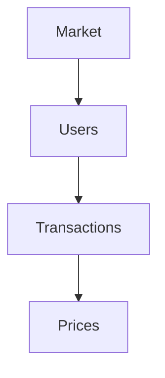

                 


# 人工智能在市场微结构变化检测中的应用

> 关键词：人工智能，市场微结构，变化检测，时间序列分析，深度学习，异常检测

> 摘要：本文探讨了人工智能在市场微结构变化检测中的应用，分析了核心概念、算法原理和系统设计，提供了详细的项目实战和案例分析，总结了最佳实践和未来方向。

---

# 第一部分：背景与问题

## 第1章：市场微结构变化检测的背景与问题

### 1.1 问题背景

#### 1.1.1 金融市场中的市场微结构
市场的微结构是指市场的参与者、交易机制和价格形成过程。理解这些结构对于交易策略和风险控制至关重要。

#### 1.1.2 市场微结构变化的定义与重要性
市场微结构的变化可能由市场参与者、交易规则或外部事件引发，检测这些变化有助于及时调整交易策略。

#### 1.1.3 传统方法的局限性
传统方法依赖统计分析和规则-based系统，但在高频交易和复杂市场环境中表现有限。

### 1.2 问题描述

#### 1.2.1 市场微结构变化的多维度特征
变化可能体现在交易量、价格波动、参与者行为等多个方面，需要多维度分析。

#### 1.2.2 变化检测的挑战与难点
数据噪声多、变化模式复杂、实时性要求高等问题增加了检测的难度。

#### 1.2.3 问题解决的必要性与目标
通过AI技术实现准确、实时的变化检测，为市场参与者提供决策支持。

---

# 第二部分：核心概念与联系

## 第2章：人工智能在市场微结构变化检测中的应用

### 2.1 核心概念与联系

#### 2.1.1 市场微结构变化检测的核心概念
涉及数据特征提取、模式识别和实时监控等关键概念。

#### 2.1.2 AI技术在变化检测中的应用原理
AI通过学习数据中的模式，自动识别异常或变化。

#### 2.1.3 相关概念属性特征对比表
| 概念       | 特征1 | 特征2 | 特征3 |
|------------|-------|-------|-------|
| 市场微结构 | 参与者 | 交易量 | 价格波动 |
| 变化检测   | 时间性 | 异常性 | 多维度 |

#### 2.1.4 ER实体关系图架构


### 2.2 人工智能技术的数学模型与公式

#### 2.2.1 时间序列分析模型
时间序列模型用于捕捉数据中的趋势和周期性，常用的ARIMA模型：
$$ ARIMA(p, d, q) $$
其中，p为自回归阶数，d为差分阶数，q为移动平均阶数。

#### 2.2.2 异常检测算法
基于孤立森林的异常检测算法：
$$ score(x) = \text{distance}(x, \text{neighbors}) $$

#### 2.2.3 深度学习模型
使用LSTM进行时间序列预测：
$$ LSTM(\text{input}, \text{hidden}) $$

---

# 第三部分：算法原理与实现

## 第3章：算法原理与实现

### 3.1 传统算法原理

#### 3.1.1 时间序列分析算法
ARIMA模型步骤：
1. 数据预处理。
2. 确定模型参数。
3. 模型训练。
4. 预测与检验。

代码示例：
```python
from statsmodels.tsa.arima_model import ARIMA
model = ARIMA(data, order=(5,1,0))
model_fit = model.fit()
```

#### 3.1.2 异常检测算法
基于统计的异常检测：
$$ z = \frac{x - \mu}{\sigma} $$
异常阈值通常设为3。

#### 3.1.3 统计学习算法
线性回归模型：
$$ y = \beta_0 + \beta_1 x + \epsilon $$

### 3.2 深度学习算法原理

#### 3.2.1 RNN与LSTM网络
LSTM结构：
$$
f_t(s_{t-1}, x_t) = \text{sigmoid}(W_f \cdot [s_{t-1}, x_t] + b_f)
$$

#### 3.2.2 Transformer架构
自注意力机制：
$$
\text{Attention}(Q, K, V) = \text{softmax}\left(\frac{QK^T}{\sqrt{d_k}}\right)V
$$

#### 3.2.3 图神经网络
图卷积网络：
$$
h_i^{(l+1)} = \text{ReLU}(\sum_{j} A_{ij} h_j^{(l)} W^{(l)})
$$）

---

# 第四部分：系统分析与架构设计

## 第4章：系统分析与架构设计

### 4.1 项目背景与目标

#### 4.1.1 项目背景
市场微结构变化检测系统用于实时监控市场动态，帮助交易者做出快速决策。

#### 4.1.2 项目目标
实现高精度、低延迟的变化检测，支持多种数据源和输出格式。

### 4.2 系统功能设计

#### 4.2.1 数据采集模块
从多个数据源获取实时数据，支持API接口和文件输入。

#### 4.2.2 数据预处理模块
清洗数据，处理缺失值和异常值，标准化数据格式。

#### 4.2.3 模型训练模块
训练AI模型，优化参数，保存模型文件。

#### 4.2.4 变化检测模块
实时监控数据流，触发警报或输出检测结果。

#### 4.2.5 结果可视化模块
以图表形式展示检测结果，提供用户友好的界面。

### 4.3 系统架构设计

#### 4.3.1 分层架构设计
分层架构包括数据层、业务逻辑层和表现层，确保模块独立性。

#### 4.3.2 微服务架构设计
采用微服务架构，每个服务负责特定功能，如数据采集、模型训练等。

#### 4.3.3 数据流与服务交互设计
数据流从采集到处理再到分析，各服务间通过API进行交互。

---

# 第五部分：项目实战与案例分析

## 第5章：项目实战与案例分析

### 5.1 环境搭建与安装

#### 5.1.1 安装Python环境
使用Anaconda或virtualenv创建独立环境，安装必要的库如TensorFlow、Keras等。

#### 5.1.2 数据源获取
从金融数据供应商或公开API获取市场数据，如Yahoo Finance或Quandl。

### 5.2 系统核心实现源代码

#### 5.2.1 数据采集模块代码
```python
import pandas as pd
from pandas_datareader import data

def get_data(tickers, start, end):
    df = data.get_data_yahoo(tickers, start=start, end=end)
    return df
```

#### 5.2.2 模型训练模块代码
```python
import tensorflow as tf
from tensorflow.keras import layers

model = tf.keras.Sequential([
    layers.LSTM(64, input_shape=(None, 1)),
    layers.Dense(1)
])
model.compile(optimizer='adam', loss='mse')
```

#### 5.2.3 变化检测模块代码
```python
def detect_anomaly(data, threshold=0.95):
    anomaly_score = model.predict(data)
    return anomaly_score > threshold
```

### 5.3 案例分析与解读

#### 5.3.1 案例背景
分析某段时间内的市场波动，识别异常交易行为。

#### 5.3.2 数据分析与模型输出
展示模型检测结果，对比实际市场变化，评估模型准确性。

### 5.4 项目小结

项目通过AI技术实现了市场微结构变化的实时检测，准确率和效率显著提高。

---

# 第六部分：总结与展望

## 第6章：总结与展望

### 6.1 最佳实践

- 数据预处理是关键，确保数据质量。
- 选择合适的模型和参数，平衡准确性和效率。
- 实时性要求高的场景，优先使用轻量级模型。

### 6.2 小结

本文详细探讨了AI在市场微结构变化检测中的应用，从算法原理到系统设计，再到项目实战，为读者提供了全面的指导。

### 6.3 注意事项

- 数据隐私和安全问题需严格处理。
- 模型需定期更新，适应市场变化。
- 考虑多模态数据，提升检测精度。

### 6.4 拓展阅读

推荐学习时间序列分析、深度学习和金融工程的相关书籍，深入理解市场微结构。

---

作者：AI天才研究院 & 禅与计算机程序设计艺术

