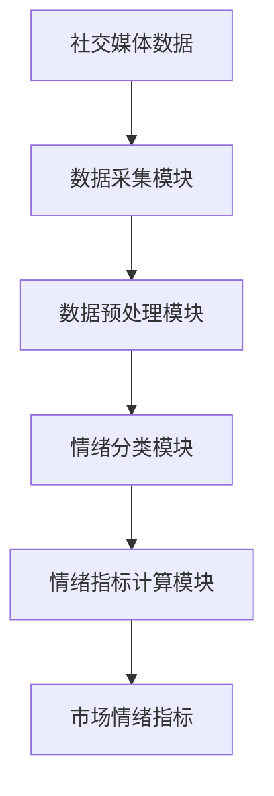
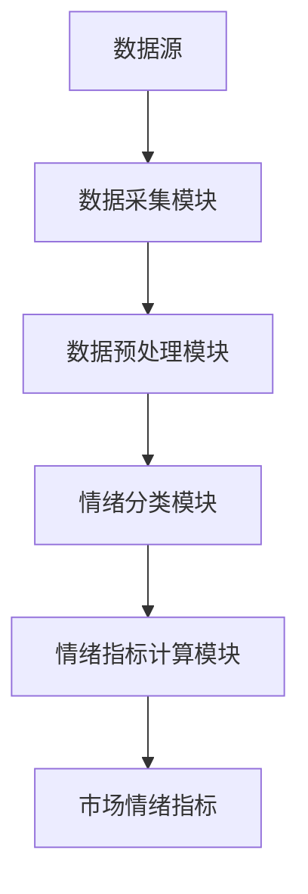
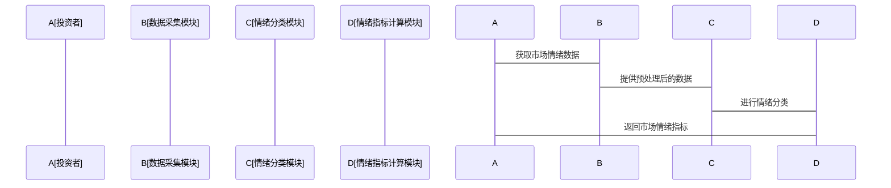

                 


# 人工智能在市场情绪指标构建中的应用

> 关键词：人工智能、市场情绪指标、自然语言处理、情绪分析、深度学习

> 摘要：本文将详细探讨人工智能在市场情绪指标构建中的应用，从市场情绪指标的定义与重要性出发，分析文本挖掘与自然语言处理技术的核心原理，深入讲解基于机器学习和深度学习的情绪分析模型，探讨市场情绪指标的构建与评估方法，并通过实际案例展示如何利用这些技术构建高效的市场情绪指标。文章内容涵盖从理论到实践的完整流程，旨在为读者提供全面的技术见解。

---

## 第一部分：市场情绪指标构建的背景与概念

### 第1章：市场情绪指标的定义与重要性

#### 1.1 市场情绪指标的定义与内涵
市场情绪指标是用来量化市场参与者情绪状态的量化指标，反映了市场参与者的乐观、悲观、恐慌等情绪状态。这些指标可以帮助投资者、交易员和研究人员更好地理解市场行为，预测市场趋势，并做出更明智的投资决策。

市场情绪指标的核心作用在于将非结构化的市场参与者情绪（如社交媒体评论、新闻文章、市场调研数据等）转化为结构化的数据，从而为量化分析提供基础。市场情绪指标可以应用于多种场景，包括股票交易、外汇交易、加密货币交易等。

---

#### 1.2 市场情绪的多维度分析

市场情绪是多维度的，可以从以下几个方面进行分析：
1. **情绪强度**：情绪的强弱程度，例如“极度乐观”、“轻微悲观”等。
2. **情绪类型**：分为积极情绪、消极情绪和中性情绪。
3. **情绪分布**：情绪在时间、空间和市场参与者中的分布情况。
4. **情绪一致性**：市场参与者情绪的一致性程度，例如“市场情绪高度一致”或“市场情绪分散”。

---

### 第2章：人工智能技术在情绪指标构建中的优势

#### 2.1 传统市场情绪分析的局限性
传统的市场情绪分析方法主要依赖于统计分析和简单的文本关键词匹配，存在以下问题：
1. **数据处理能力有限**：传统方法难以处理大规模的非结构化数据，且容易受到数据噪声的影响。
2. **情绪识别精度低**：传统的关键词匹配方法难以准确捕捉复杂的情绪变化，容易出现误判。
3. **实时性不足**：传统方法在实时情绪分析中的表现较差，难以满足高频交易的需求。

#### 2.2 人工智能技术的核心优势
人工智能技术，尤其是机器学习和深度学习，为市场情绪指标的构建带来了以下优势：
1. **强大的数据处理能力**：人工智能可以处理大规模的非结构化数据，并从中提取有用的特征。
2. **高精度的情绪识别**：基于深度学习的情感分类模型能够准确识别复杂的情绪变化。
3. **实时性与可扩展性**：人工智能技术可以实现实时情绪分析，并能够快速扩展到更大的数据规模。

#### 2.3 当前市场情绪指标构建的需求
随着金融市场的复杂化和数据量的爆炸式增长，市场情绪指标的构建需求日益迫切：
1. **投资者对实时情绪数据的需求**：投资者需要实时了解市场参与者的心理状态，以便做出快速决策。
2. **机构投资者对情绪指标的应用需求**：机构投资者需要通过市场情绪指标优化投资组合和风险控制。
3. **学术研究对市场情绪量化的需求**：学术界需要市场情绪指标来验证市场行为理论和投资策略。

---

## 第二部分：市场情绪指标构建的核心技术

### 第3章：文本挖掘与自然语言处理技术

#### 3.1 文本挖掘的基本概念
文本挖掘是通过对非结构化文本数据的处理，提取有用信息的过程。在市场情绪指标的构建中，文本挖掘技术主要用于从社交媒体评论、新闻文章、市场调研数据等来源中提取情绪信息。

##### 3.1.1 文本挖掘的流程
1. **数据清洗**：去除噪音数据，如特殊字符、停用词等。
2. **分词**：将文本分割成有意义的词汇或短语。
3. **特征提取**：提取文本中的情感特征，如关键词、情感词汇等。
4. **向量化**：将文本数据转化为向量形式，以便后续分析。

##### 3.1.2 常见文本挖掘工具与框架
- **Python中的文本挖掘库**：如NLTK、spaCy、TextBlob等。
- **深度学习框架**：如TensorFlow、Keras、PyTorch等。

---

#### 3.2 自然语言处理技术的核心原理
自然语言处理（NLP）是文本挖掘的核心技术，旨在让计算机能够理解、分析和生成人类语言。

##### 3.2.1 词袋模型与词嵌入技术
词袋模型是一种简单但有效的文本表示方法，将文本表示为一个词语的集合。词嵌入技术（如Word2Vec、GloVe）通过将词语映射到高维向量空间，捕捉词语之间的语义关系。

##### 3.2.2 基于深度学习的自然语言处理模型
- **循环神经网络（RNN）**：适用于处理序列数据，如情感分类任务。
- **长短期记忆网络（LSTM）**：能够捕捉长距离依赖关系，适合处理复杂的情感分析任务。
- **Transformer模型**：基于自注意力机制，能够并行处理大规模数据。

##### 3.2.3 情感分析任务中的特征提取方法
情感分析任务需要从文本中提取与情绪相关的特征，如情感词汇、语气特征、语境特征等。

---

#### 3.3 市场情绪文本数据的预处理方法
##### 3.3.1 数据清洗与去噪
数据清洗是文本挖掘的第一步，主要包括去除特殊字符、停用词、标点符号等。

##### 3.3.2 分词与停用词处理
分词是将文本分割成有意义的词汇或短语，停用词处理是去除对情感分析无贡献的词语。

##### 3.3.3 文本向量化与特征提取
文本向量化是将文本数据转化为向量形式，常用的向量化方法包括词袋模型、TF-IDF和词嵌入技术。

---

### 第4章：市场情绪分析模型

#### 4.1 基于机器学习的情绪分类模型
##### 4.1.1 支持向量机（SVM）
支持向量机是一种常用的分类算法，适用于小规模数据的情感分类任务。

##### 4.1.2 随机森林
随机森林是一种基于树模型的集成学习算法，具有较高的分类精度和鲁棒性。

##### 4.1.3 朴素贝叶斯
朴素贝叶斯是一种基于概率论的分类算法，适用于文本分类任务。

#### 4.2 基于深度学习的情绪分析模型
##### 4.2.1 循序模型（RNN）
循环神经网络适用于处理序列数据，如情感分类任务。

##### 4.2.2 长短期记忆网络（LSTM）
LSTM能够捕捉长距离依赖关系，适合处理复杂的情感分析任务。

##### 4.2.3 Transformer模型
Transformer模型基于自注意力机制，能够并行处理大规模数据。

#### 4.3 情绪强度预测与主题分析
##### 4.3.1 情绪强度预测的数学模型
情绪强度预测可以通过回归模型实现，常用的回归算法包括线性回归、支持向量回归（SVR）和随机森林回归。

##### 4.3.2 主题建模（LDA）
主题建模用于分析文本中的主题分布，帮助理解市场情绪的主题构成。

##### 4.3.3 情感情感轴模型
情感轴模型（如AFINN、VADER）是一种基于情感极性的量化模型，能够将文本的情感强度量化为具体的数值。

---

### 第5章：市场情绪指标的构建与评估

#### 5.1 情绪指标的构建流程
1. **数据采集**：从社交媒体、新闻网站等渠道获取市场参与者的情绪数据。
2. **数据预处理**：对数据进行清洗、分词和向量化。
3. **模型训练**：基于机器学习或深度学习算法训练情绪分类模型。
4. **情绪指标计算**：根据模型输出的结果，计算市场情绪指标。

#### 5.2 情绪指标的评估方法
1. **准确率与召回率**：用于评估情绪分类模型的性能。
2. **F1分数**：综合考虑准确率和召回率的指标。
3. **情绪强度预测的均方误差（MSE）**：用于评估情绪强度预测模型的性能。

---

## 第三部分：项目实战与系统架构设计

### 第6章：基于社交媒体数据的市场情绪指标构建

#### 6.1 项目背景与目标
本项目旨在利用社交媒体数据，构建一个实时市场情绪指标，帮助投资者了解市场参与者的心理状态。

#### 6.2 系统功能设计
1. **数据采集模块**：从社交媒体平台获取市场参与者的情绪数据。
2. **数据预处理模块**：对数据进行清洗、分词和向量化。
3. **情绪分类模块**：基于深度学习模型对情绪数据进行分类。
4. **情绪指标计算模块**：根据模型输出计算市场情绪指标。

#### 6.3 系统架构设计


#### 6.4 代码实现与解读
##### 6.4.1 环境安装
```bash
pip install numpy pandas scikit-learn tensorflow
```

##### 6.4.2 核心代码实现
```python
import numpy as np
import pandas as pd
from sklearn.model_selection import train_test_split
from sklearn.svm import SVC
from sklearn.metrics import accuracy_score

# 数据预处理
def preprocess_data(data):
    # 假设data为包含文本数据的DataFrame
    # 分词
    data['tokens'] = data['text'].apply(lambda x: x.split())
    return data

# 情绪分类模型
class SVMClassifier:
    def __init__(self):
        self.model = SVC()

    def train(self, X_train, y_train):
        self.model.fit(X_train, y_train)

    def predict(self, X_test):
        return self.model.predict(X_test)

# 数据加载与预处理
data = pd.read_csv('market_sentiment.csv')
processed_data = preprocess_data(data)

# 数据分割
X = processed_data['tokens'].values
y = processed_data['label'].values
X_train, X_test, y_train, y_test = train_test_split(X, y, test_size=0.2)

# 模型训练
model = SVMClassifier()
model.train(X_train, y_train)

# 模型预测
y_pred = model.predict(X_test)
print('准确率:', accuracy_score(y_test, y_pred))
```

---

### 第7章：系统架构与接口设计

#### 7.1 系统架构设计


#### 7.2 系统接口设计
1. **数据接口**：提供REST接口，用于获取市场情绪指标数据。
2. **模型接口**：提供API接口，用于调用情绪分类模型进行实时预测。

#### 7.3 系统交互流程


---

## 第四部分：总结与展望

### 第8章：总结与最佳实践

#### 8.1 总结
人工智能技术为市场情绪指标的构建提供了强大的工具和方法。通过文本挖掘、自然语言处理和深度学习技术，我们可以高效地构建市场情绪指标，帮助投资者和机构做出更明智的决策。

#### 8.2 最佳实践
1. **数据质量控制**：确保数据的准确性和完整性。
2. **模型调优**：通过交叉验证和超参数优化提升模型性能。
3. **实时性优化**：采用分布式计算和流数据处理技术提升实时性。

#### 8.3 小结
市场情绪指标的构建是一个复杂但 rewarding 的过程，人工智能技术的应用为这一领域带来了新的机遇和挑战。

---

## 作者：AI天才研究院/AI Genius Institute & 禅与计算机程序设计艺术 /Zen And The Art of Computer Programming

---

**注**：由于篇幅限制，上述目录大纲和内容仅为示例，实际文章将更加详细，并包含完整的代码实现、数学公式推导和系统架构设计。

