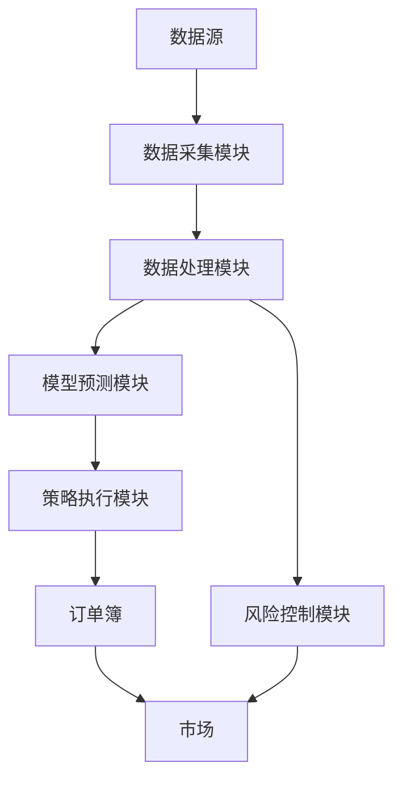
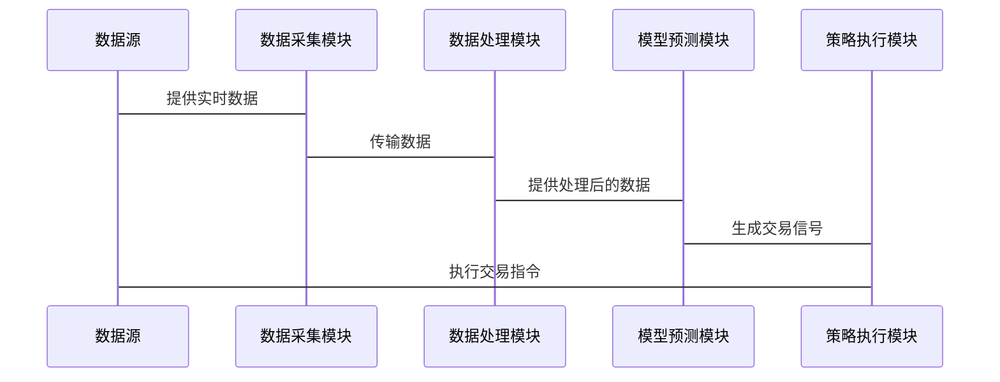

                 


# 人工智能在市场流动性提供策略中的应用

> 关键词：人工智能，市场流动性，提供策略，算法交易，机器学习，强化学习，时间序列分析

> 摘要：本文探讨了人工智能在市场流动性提供策略中的应用，从背景介绍、核心概念、算法原理、系统架构到项目实战，全面分析了人工智能如何优化流动性策略。通过具体案例和数学模型，展示了如何利用机器学习、强化学习和时间序列分析等技术，提升流动性管理的效率和准确性。

---

# 第一部分: 人工智能在市场流动性提供中的背景与基础

## 第1章: 市场流动性与提供策略概述

### 1.1 市场流动性基本概念

#### 1.1.1 市场流动性的定义与特征

市场流动性是指资产在金融市场中可以迅速转化为现金而不产生显著价格损失的能力。流动性强的资产具有高交易量、低买卖价差和深度订单簿等特点。

#### 1.1.2 流动性提供者的角色与类型

流动性提供者包括做市商、高频交易者和机构投资者等。他们通过提供买卖报价，维持市场的流动性，确保交易的顺利进行。

#### 1.1.3 流动性在金融市场中的重要性

流动性是市场功能正常运转的基础，直接影响市场的价格发现、风险管理和资源配置效率。缺乏流动性会导致市场波动加剧，交易成本上升。

### 1.2 人工智能在金融领域的应用背景

#### 1.2.1 人工智能在金融市场的应用现状

人工智能技术在金融领域的应用日益广泛，涵盖交易执行、风险管理、市场预测等多个方面。尤其是高频交易和算法交易，AI技术的应用显著提升了交易效率。

#### 1.2.2 人工智能技术的核心优势

- **数据处理能力**：AI能够处理海量数据，发现隐藏的模式和趋势。
- **实时决策能力**：通过机器学习模型，AI可以在极短时间内做出交易决策。
- **自适应能力**：强化学习等技术使模型能够根据市场变化动态调整策略。

#### 1.2.3 人工智能在流动性管理中的潜力

AI技术可以帮助流动性提供者更准确地预测市场波动，优化订单簿管理，降低交易成本，提高收益。

---

## 第2章: 人工智能与市场流动性提供策略的结合

### 2.1 人工智能在流动性策略中的作用

#### 2.1.1 数据驱动的流动性预测

通过分析历史交易数据和市场微观结构特征，AI可以预测未来市场的流动性状况，帮助交易者制定更有效的策略。

#### 2.1.2 自动化交易策略优化

基于机器学习和强化学习的AI模型，可以自动生成和优化交易策略，实现自动化交易，提高效率。

#### 2.1.3 风险控制与市场微观结构分析

AI技术能够实时监控市场风险，分析市场微观结构，帮助流动性提供者做出更明智的决策。

### 2.2 市场流动性提供策略的核心问题

#### 2.2.1 流动性需求预测的挑战

市场的不确定性、高频交易的影响和突发事件的冲击，使得流动性需求预测具有高度挑战性。

#### 2.2.2 交易成本与收益的平衡

流动性提供者需要在交易成本和收益之间找到平衡点，既要保证足够的流动性，又要避免过高的成本。

#### 2.2.3 市场波动性对流动性策略的影响

市场波动性会显著影响流动性，AI需要能够快速适应市场变化，动态调整策略。

### 2.3 人工智能在流动性策略中的具体应用

#### 2.3.1 基于机器学习的流动性预测模型

使用机器学习模型（如随机森林和LSTM）预测市场的流动性状况，帮助交易者提前做好准备。

#### 2.3.2 自然语言处理在市场情绪分析中的应用

通过NLP技术分析新闻、社交媒体等文本数据，评估市场情绪，辅助流动性策略的制定。

#### 2.3.3 强化学习在动态交易策略中的应用

强化学习模型通过与市场的互动，不断优化交易策略，适应市场变化。

---

# 第二部分: 人工智能驱动的流动性提供策略核心概念

## 第3章: 人工智能在流动性策略中的核心算法

### 3.1 常见的机器学习算法及其特点

#### 3.1.1 线性回归与逻辑回归

线性回归用于预测连续变量，如流动性预测；逻辑回归用于分类问题，如判断市场是上升还是下降。

#### 3.1.2 支持向量机（SVM）

SVM适用于小样本数据的分类和回归问题，常用于市场的二分类任务。

#### 3.1.3 随机森林与梯度提升树

随机森林和梯度提升树是基于树的集成方法，适合处理高维数据和非线性关系，常用于特征重要性分析和预测。

#### 3.1.4 神经网络与深度学习

神经网络能够处理复杂的非线性关系，深度学习在处理时间序列数据方面表现尤为突出。

### 3.2 基于强化学习的交易策略

#### 3.2.1 强化学习的基本原理

强化学习通过智能体与环境的互动，学习最优策略，最大化累积奖励。

#### 3.2.2 状态空间与动作空间的定义

- **状态空间**：市场的当前状态，如价格、订单簿数据等。
- **动作空间**：智能体可以执行的动作，如买入、卖出或持有。

#### 3.2.3 奖励函数的设计与优化

奖励函数定义了智能体在每一步行动后的奖励，通常与交易收益和风险控制相关。

### 3.3 基于时间序列分析的流动性预测

#### 3.3.1 时间序列的基本特征

时间序列数据具有趋势性、周期性和随机性等特征，常用ARIMA和LSTM模型进行建模。

#### 3.3.2 ARIMA模型与LSTM网络

- **ARIMA模型**：适用于线性时间序列数据，通过自相关性和偏自相关性分析确定参数。
- **LSTM网络**：适合处理非线性时间序列数据，能够捕捉长期依赖关系。

#### 3.3.3 被遗忘的门控机制（Forget Gate）

LSTM中的Forget Gate用于控制细胞状态中哪些信息需要遗忘，是LSTM处理长序列数据的关键。

---

## 第4章: 流动性策略中的数据特征与模型选择

### 4.1 流动性相关数据特征

#### 4.1.1 市场深度与订单簿数据

订单簿数据包括买单、卖单、最优价和成交量等，反映了市场的流动性状况。

#### 4.1.2 市场微观结构特征

微观结构特征包括订单簿深度、订单撤销率和订单簿 imbalance 等，用于评估市场的流动性风险。

#### 4.1.3 市场情绪与新闻数据

市场情绪影响投资者的行为，新闻数据可以通过NLP技术进行分析，辅助流动性策略的制定。

### 4.2 数据特征的工程化处理

#### 4.2.1 数据清洗与预处理

包括处理缺失值、异常值和标准化/归一化数据。

#### 4.2.2 特征选择与降维

使用特征重要性分析和主成分分析（PCA）等方法，选择关键特征并降低维度。

#### 4.2.3 时间序列特征的构建

从时间序列数据中提取统计特征，如均值、标准差、自相关系数等。

### 4.3 模型选择与评估指标

#### 4.3.1 分类与回归模型的选择

根据问题类型选择合适的模型，如回归模型用于预测流动性，分类模型用于判断市场趋势。

#### 4.3.2 模型评估指标

- **准确率**：预测正确的比例。
- **召回率**：实际为正样本中被正确预测的比例。
- **F1值**：准确率和召回率的调和平均数。

#### 4.3.3 回测与策略绩效评估

通过回测评估策略的绩效，包括夏普比率、最大回撤和收益风险比等指标。

---

# 第三部分: 流动性提供策略的系统架构

## 第5章: 系统架构设计

### 5.1 问题场景介绍

流动性提供系统需要实时处理市场数据，动态调整订单簿，优化交易策略。

### 5.2 系统功能设计

#### 5.2.1 数据采集模块

实时采集市场数据，包括订单簿、成交数据和市场新闻。

#### 5.2.2 数据处理模块

对数据进行清洗、特征提取和转换，为模型提供输入。

#### 5.2.3 模型预测模块

使用机器学习或强化学习模型预测流动性状况，生成交易信号。

#### 5.2.4 策略执行模块

根据模型预测结果，执行交易指令，调整订单簿。

#### 5.2.5 风险控制模块

监控交易风险，确保策略在允许的风险范围内运行。

### 5.3 系统架构图



### 5.4 系统接口设计

- 数据接口：与数据源（如交易所API）对接，获取实时数据。
- 模型接口：与预测模型对接，获取交易信号。
- 执行接口：与交易系统对接，执行交易指令。

### 5.5 系统交互流程图



---

## 第6章: 项目实战

### 6.1 环境安装

安装必要的Python库，如Pandas、NumPy、Scikit-learn、Keras和TensorFlow。

### 6.2 核心代码实现

#### 6.2.1 数据处理代码

```python
import pandas as pd
import numpy as np

# 数据加载
data = pd.read_csv('market_data.csv')

# 数据清洗
data.dropna(inplace=True)
data['date'] = pd.to_datetime(data['date'])

# 特征提取
features = data[['bid_volume', 'ask_volume', 'spread']]
labels = data['liquidity']

# 数据分割
from sklearn.model_selection import train_test_split

X_train, X_test, y_train, y_test = train_test_split(features, labels, test_size=0.2, random_state=42)
```

#### 6.2.2 模型训练代码

```python
from sklearn.ensemble import RandomForestClassifier
from sklearn.metrics import accuracy_score

model = RandomForestClassifier(n_estimators=100, random_state=42)
model.fit(X_train, y_train)

y_pred = model.predict(X_test)
print("准确率:", accuracy_score(y_test, y_pred))
```

### 6.3 案例分析

通过回测分析模型的性能，评估其在不同市场条件下的表现。

### 6.4 项目小结

总结项目的实现过程，提出改进建议，如引入强化学习模型进一步优化策略。

---

# 第四部分: 最佳实践与总结

## 第7章: 最佳实践与总结

### 7.1 小结

人工智能在市场流动性提供策略中的应用显著提升了交易效率和准确性。通过机器学习、强化学习和时间序列分析等技术，流动性提供者能够更好地应对市场波动，优化交易策略。

### 7.2 注意事项

- 数据质量是模型性能的关键，需确保数据的完整性和准确性。
- 模型需要不断更新和优化，以适应市场变化。
- 风险控制是策略实施的重要部分，需实时监控和调整。

### 7.3 拓展阅读

建议读者深入学习强化学习、时间序列分析和分布式系统相关知识，以进一步提升流动性策略的性能。

---

# 作者：AI天才研究院/AI Genius Institute & 禅与计算机程序设计艺术 /Zen And The Art of Computer Programming

---

这篇文章从市场流动性提供策略的背景、人工智能的核心算法、系统架构设计到项目实战，全面探讨了人工智能在流动性策略中的应用。通过具体的代码实现和案例分析，展示了如何利用AI技术优化交易策略，提升市场流动性管理的效率和准确性。

