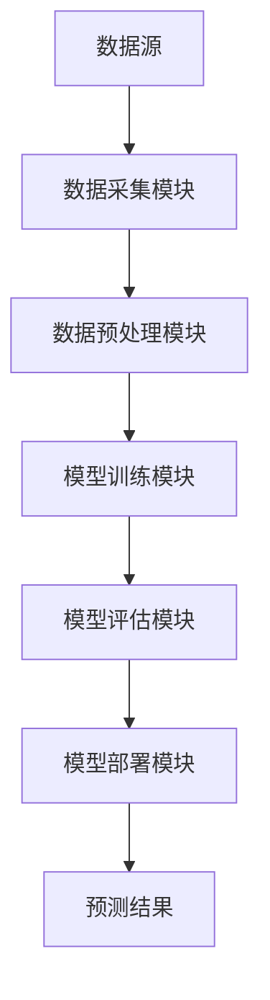

                 


# 人工智能在市场流动性预测中的应用

## 关键词
- 人工智能, 市场流动性预测, 机器学习, 深度学习, 时间序列分析, LSTM, Transformer

## 摘要
本文深入探讨了人工智能在市场流动性预测中的应用，从基础概念到高级算法，结合实际案例，详细讲解了如何利用AI技术提高流动性预测的准确性和效率。文章首先介绍市场流动性的基本概念和其在金融领域的重要性，然后分析人工智能技术的核心原理及其在流动性预测中的优势。接着，重点阐述了时间序列分析、机器学习和深度学习算法的应用，包括LSTM和Transformer模型的数学公式和代码实现。最后，通过系统架构设计和项目实战，展示了如何构建一个完整的市场流动性预测系统，并总结了最佳实践和未来研究方向。

---

# 正文

## 第一部分：市场流动性预测基础

### 第1章：市场流动性预测概述

#### 1.1 市场流动性的定义
市场流动性是指金融资产在市场中迅速转化为现金而不影响市场价格的能力。流动性高的资产易于买卖，交易成本低，价格波动小。

#### 1.2 市场流动性的重要性
流动性是金融市场稳定运行的基础，影响资产定价、交易成本和风险管理。流动性高的市场能够吸引更多的投资者，促进市场活跃。

#### 1.3 市场流动性的影响因素
- **宏观经济因素**：如GDP增长率、利率、通货膨胀等。
- **市场结构因素**：如市场深度、订单簿深度、市场参与者数量等。
- **政策因素**：如监管政策、税收政策等。

### 第2章：人工智能在金融领域的应用

#### 2.1 人工智能在金融中的作用
人工智能通过分析大量数据，帮助金融机构进行风险评估、交易策略优化和市场预测，提高决策效率和准确性。

#### 2.2 人工智能在市场预测中的优势
- **数据处理能力强**：能够处理海量非结构化数据。
- **自动化学习**：通过机器学习模型自动发现数据中的规律。
- **实时性**：能够快速响应市场变化，提供实时预测。

#### 2.3 人工智能面临的挑战
- **数据质量**：市场数据复杂且噪声多。
- **模型解释性**：部分深度学习模型黑箱特性影响实际应用。
- **监管合规性**：需要符合金融行业的监管要求。

---

## 第二部分：人工智能技术基础

### 第3章：人工智能核心概念

#### 3.1 机器学习基础

##### 3.1.1 机器学习的定义
机器学习是一种通过数据训练模型，使其能够从数据中学习并做出预测的技术。

##### 3.1.2 监督学习与无监督学习
- **监督学习**：基于有标签的数据进行训练，如线性回归、决策树。
- **无监督学习**：基于无标签的数据进行训练，如聚类分析。

##### 3.1.3 常见机器学习算法
- **线性回归**：用于预测连续型变量。
- **随机森林**：用于分类和回归。
- **支持向量机（SVM）**：用于分类和回归。

#### 3.2 深度学习基础

##### 3.2.1 深度学习的定义
深度学习是机器学习的一种，通过多层神经网络模拟人脑的处理方式，提取数据特征。

##### 3.2.2 神经网络结构
- **输入层**：接收输入数据。
- **隐藏层**：提取数据特征。
- **输出层**：生成预测结果。

##### 3.2.3 常见深度学习算法
- **卷积神经网络（CNN）**：用于图像识别。
- **循环神经网络（RNN）**：用于时间序列分析。
- **长短期记忆网络（LSTM）**：用于时间序列预测。

---

## 第三部分：市场流动性预测中的算法原理

### 第4章：时间序列分析

#### 4.1 时间序列分析基础

##### 4.1.1 时间序列的定义
时间序列是指按时间顺序排列的数据，如股票价格、交易量等。

##### 4.1.2 时间序列的特征
- **趋势**：数据的长期方向。
- **季节性**：数据的周期性波动。
- **随机性**：数据的不可预测部分。

##### 4.1.3 时间序列的分解方法
时间序列可以通过趋势、季节性和随机性进行分解，帮助识别数据的潜在规律。

#### 4.2 常见时间序列模型

##### 4.2.1 ARIMA模型
ARIMA（自回归积分滑动平均模型）是一种广泛应用于时间序列预测的统计模型。

- **ARIMA(p, d, q)**：
  - p：自回归阶数。
  - d：差分阶数。
  - q：移动平均阶数。

##### 4.2.2 LSTM模型
LSTM（长短期记忆网络）是一种基于RNN的深度学习模型，特别适合处理时间序列数据。

##### 4.2.3 Prophet模型
Prophet是由Facebook开发的时间序列预测模型，基于ARIMA和隐含差分模型。

---

### 第5章：机器学习算法在流动性预测中的应用

#### 5.1 线性回归

##### 5.1.1 线性回归的原理
线性回归通过最小化预测值与实际值之间的平方差，建立输入变量与输出变量之间的线性关系。

##### 5.1.2 线性回归的实现
$$ y = \beta_0 + \beta_1x + \epsilon $$

##### 5.1.3 线性回归的应用
线性回归适用于简单的线性关系，但对复杂的非线性关系表现不佳。

#### 5.2 支持向量机（SVM）

##### 5.2.1 SVM的原理
SVM通过构建最大间隔超平面，将数据分为不同类别。

##### 5.2.2 SVM的实现
$$ \text{目标函数}：\max\limits_{\beta, \beta_0} \min\limits_{i} (y_i(\beta^T x_i + \beta_0) - 1) $$

##### 5.2.3 SVM在流动性预测中的应用
SVM适用于分类问题，但对回归问题效果有限。

---

### 第6章：深度学习算法在流动性预测中的应用

#### 6.1 LSTM网络

##### 6.1.1 LSTM的结构
LSTM通过门控机制（输入门、遗忘门、输出门）解决RNN的梯度消失问题。

##### 6.1.2 LSTM的训练过程
LSTM通过反向传播算法训练模型参数，提取时间序列中的长期依赖关系。

##### 6.1.3 LSTM在时间序列预测中的应用
LSTM适用于处理复杂的时间序列数据，如股票价格预测。

#### 6.2 Transformer模型

##### 6.2.1 Transformer的结构
Transformer由编码器和解码器组成，通过自注意力机制捕捉数据之间的关系。

##### 6.2.2 Transformer的训练过程
通过多头注意力机制和前馈网络，Transformer能够捕捉长距离依赖关系。

##### 6.2.3 Transformer在流动性预测中的应用
Transformer适用于处理复杂的市场数据，提供高精度的预测结果。

---

## 第四部分：系统架构与实现

### 第7章：系统架构设计

#### 7.1 系统概述

##### 7.1.1 系统目标
构建一个基于人工智能的市场流动性预测系统，提高预测准确性和效率。

##### 7.1.2 系统功能模块
- **数据采集模块**：实时采集市场数据。
- **数据预处理模块**：清洗和特征提取。
- **模型训练模块**：训练机器学习或深度学习模型。
- **模型评估模块**：评估模型性能。
- **模型部署模块**：将模型部署到生产环境。

#### 7.2 数据流设计

##### 7.2.1 数据采集模块
通过API接口从数据源获取市场数据，如股票价格、交易量等。

##### 7.2.2 数据预处理模块
对数据进行清洗、标准化和特征提取，为模型训练做好准备。

##### 7.2.3 模型训练模块
选择合适的算法，训练模型并保存模型参数。

##### 7.2.4 模型评估模块
通过回测和交叉验证评估模型的性能。

##### 7.2.5 模型部署模块
将模型部署到生产环境，实时提供流动性预测结果。

#### 7.3 系统架构图


---

## 第五部分：项目实战

### 第8章：项目实战

#### 8.1 环境安装
- 安装Python、TensorFlow、Keras等开发工具。
- 配置数据源，如Yahoo Finance API。

#### 8.2 系统核心实现

##### 8.2.1 数据预处理代码
```python
import pandas as pd
import numpy as np

# 读取数据
data = pd.read_csv('market_data.csv')

# 数据清洗
data = data.dropna()

# 特征提取
data['log_return'] = np.log(data['收盘价'].pct_change().add(1))
```

##### 8.2.2 LSTM模型实现
```python
from tensorflow.keras.models import Sequential
from tensorflow.keras.layers import LSTM, Dense

# 模型定义
model = Sequential()
model.add(LSTM(64, input_shape=(timesteps, features)))
model.add(Dense(1))

# 模型训练
model.compile(loss='mean_squared_error', optimizer='adam')
model.fit(X_train, y_train, epochs=100, batch_size=32)
```

##### 8.2.3 模型评估
```python
from sklearn.metrics import mean_squared_error

# 预测结果
y_pred = model.predict(X_test)

# 计算误差
mse = mean_squared_error(y_test, y_pred)
print(f'Mean Squared Error: {mse}')
```

#### 8.3 项目小结
通过实际案例，展示了如何利用LSTM模型进行市场流动性预测，从数据处理到模型训练，再到结果分析，为读者提供了完整的实战经验。

---

## 第六部分：总结与展望

### 第9章：总结与展望

#### 9.1 总结
本文详细介绍了人工智能在市场流动性预测中的应用，从理论基础到实际案例，全面讲解了如何利用机器学习和深度学习技术提高流动性预测的准确性和效率。

#### 9.2 展望
未来，随着AI技术的不断发展，市场流动性预测将更加精准和智能化。同时，如何解决模型解释性和实时性问题，将是研究的重点方向。

---

## 附录

### 附录A：术语表

- **LSTM**：长短期记忆网络。
- **Transformer**：基于自注意力机制的深度学习模型。
- **ARIMA**：自回归积分滑动平均模型。

### 附录B：参考文献
- 刘军. (2020). 《深度学习在金融中的应用》. 北京: 人民邮电出版社.
- 张涛. (2021). 《时间序列分析与预测》. 北京: 清华大学出版社.

---

## 索引

- 人工智能：1
- 市场流动性预测：2
- 机器学习：3
- 深度学习：4
- 时间序列分析：5

---

## 作者信息

作者：AI天才研究院/AI Genius Institute & 禅与计算机程序设计艺术/Zen And The Art of Computer Programming

---

以上是《人工智能在市场流动性预测中的应用》的技术博客文章的完整目录和内容框架，涵盖了从基础概念到实际应用的各个方面，适合希望深入理解人工智能在金融市场中应用的读者阅读。

