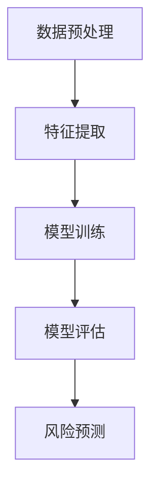
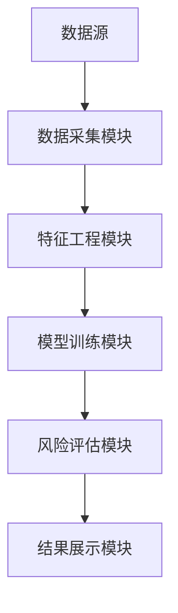
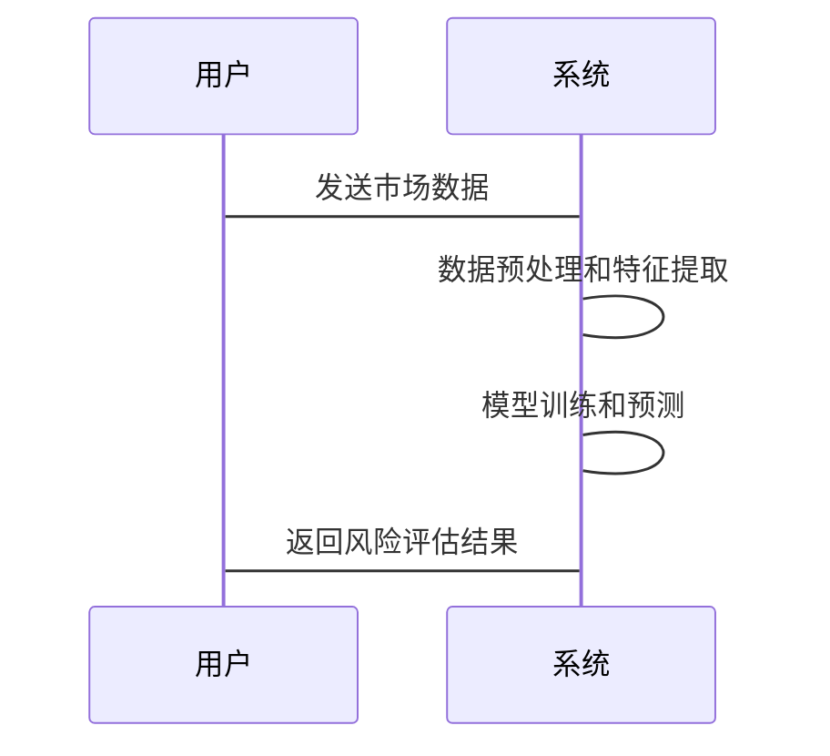

                 


# 人工智能在市场流动性风险评估中的应用

## 关键词：人工智能，流动性风险，机器学习，深度学习，金融数据分析

## 摘要：  
本文探讨了人工智能技术在市场流动性风险评估中的应用，分析了流动性风险的核心要素，介绍了基于机器学习和深度学习的模型，并展示了如何通过系统架构设计和项目实战实现风险评估。文章结合理论与实践，深入剖析了人工智能在金融风险管理中的优势和挑战，为金融从业者和数据科学家提供了有价值的参考。

---

## 第一部分: 背景介绍

### 第1章: 市场流动性风险与人工智能概述

#### 1.1 市场流动性风险的定义与特征
市场流动性风险是指资产在不损失价值的情况下快速变现的能力。其核心特征包括：
1. **变现能力**：资产能否快速转化为现金。
2. **价格稳定性**：变现过程中价格波动是否可控。
3. **交易深度**：市场中是否有足够的交易量支持快速变现。

#### 1.2 人工智能在金融领域的应用背景
1. **人工智能技术的发展历程**：从简单的规则引擎到复杂的深度学习模型，人工智能技术在金融领域的应用日益广泛。
2. **人工智能在金融领域的应用现状**：广泛应用于风险管理、交易决策、市场预测等领域。
3. **人工智能在流动性风险评估中的优势**：能够处理非线性关系，捕捉复杂市场动态，提供实时风险评估。

#### 1.3 本章小结
流动性风险是金融市场的重要风险类型，人工智能技术凭借其强大的数据处理和模式识别能力，为流动性风险评估提供了新的解决方案。

---

## 第二部分: 核心概念与联系

### 第2章: 流动性风险评估的核心要素

#### 2.1 数据特征与模型输入
1. **市场数据特征**：包括价格、成交量、波动率等。
2. **资产特征**：包括资产类型、规模、持有期限等。
3. **交易行为特征**：包括交易频率、交易量、交易时间分布等。

#### 2.2 模型选择与评估指标
1. **模型选择的依据**：数据特征、模型复杂度、评估目标。
2. **评估指标的定义**：包括准确率、召回率、F1值、AUC值等。
3. **指标之间的关系**：不同指标适用于不同的评估场景。

#### 2.3 数据与模型的ER实体关系图
```mermaid
erDiagram
    market_data {
        id : int
        timestamp : datetime
        volume : float
        price : float
    }
    asset {
        id : int
        type : string
        size : float
    }
    transaction_behavior {
        id : int
        user_id : int
        time : datetime
        amount : float
    }
    risk_assessment {
        id : int
        risk_level : int
        timestamp : datetime
    }
    market_data --|> risk_assessment : "驱动风险评估"
    asset --|> risk_assessment : "影响风险评估"
    transaction_behavior --|> risk_assessment : "影响风险评估"
```

---

## 第三部分: 算法原理

### 第3章: 基于机器学习的流动性风险评估模型

#### 3.1 机器学习算法选择与原理
1. **随机森林**：通过构建多棵决策树，减少过拟合，提高泛化能力。
2. **支持向量机（SVM）**：适用于高维数据分类，能够处理非线性关系。
3. **逻辑回归**：适用于二分类问题，能够输出概率值。

#### 3.2 算法流程图


#### 3.3 模型实现代码
```python
import pandas as pd
from sklearn.ensemble import RandomForestClassifier
from sklearn.metrics import accuracy_score

# 数据加载
data = pd.read_csv('market_data.csv')

# 特征提取
features = data[['volume', 'price', 'transaction_frequency']]
target = data['risk_level']

# 模型训练
model = RandomForestClassifier()
model.fit(features, target)

# 模型评估
 predictions = model.predict(features)
 print("准确率:", accuracy_score(target, predictions))
```

#### 3.4 模型优化与调优
1. **超参数优化**：使用网格搜索或随机搜索优化模型参数。
2. **特征重要性分析**：通过特征重要性排序，筛选关键特征。
3. **模型融合**：结合多个模型的预测结果，提高准确性。

---

## 第四部分: 系统架构与设计

### 第4章: 流动性风险评估系统架构

#### 4.1 系统功能设计
1. **数据采集模块**：从金融市场获取实时数据。
2. **特征工程模块**：对数据进行清洗、特征提取和转换。
3. **模型训练模块**：构建和训练机器学习模型。
4. **风险评估模块**：对市场流动性风险进行实时评估。
5. **结果展示模块**：以可视化形式展示评估结果。

#### 4.2 系统架构图


#### 4.3 系统接口设计
1. **数据接口**：提供API接口，供其他系统调用。
2. **模型接口**：提供预测接口，支持实时风险评估。
3. **结果接口**：提供可视化接口，展示评估结果。

#### 4.4 系统交互图


---

## 第五部分: 项目实战

### 第5章: 基于AI的流动性风险评估系统开发

#### 5.1 项目背景与目标
1. **项目背景**：金融市场中流动性风险的日益重要性。
2. **项目目标**：开发一个基于AI的流动性风险评估系统，实现实时风险评估和可视化展示。

#### 5.2 项目核心实现
1. **环境配置**：安装必要的开发工具和库，如Python、TensorFlow、Keras等。
2. **数据处理**：清洗、转换和增强数据，提取关键特征。
3. **模型实现**：选择合适的算法，训练模型并进行调优。
4. **结果分析**：通过可视化工具展示评估结果，并分析模型表现。

#### 5.3 项目代码示例
```python
import numpy as np
import pandas as pd
from sklearn.model_selection import train_test_split
from sklearn.metrics import classification_report

# 数据加载
data = pd.read_csv('market_data.csv')

# 特征工程
features = data[['volume', 'price', 'transaction_frequency']]
target = data['risk_level']

# 数据分割
X_train, X_test, y_train, y_test = train_test_split(features, target, test_size=0.2, random_state=42)

# 模型训练
model = RandomForestClassifier()
model.fit(X_train, y_train)

# 模型预测
y_pred = model.predict(X_test)

# 模型评估
print(classification_report(y_test, y_pred))
```

#### 5.4 项目小结
通过项目实战，读者可以掌握从数据处理到模型实现的全过程，同时能够理解如何将AI技术应用于实际的流动性风险评估中。

---

## 第六部分: 总结与展望

### 第6章: 总结与最佳实践

#### 6.1 本章总结
本文详细探讨了人工智能在市场流动性风险评估中的应用，从理论到实践，全面介绍了相关技术和方法。

#### 6.2 最佳实践 tips
1. **数据预处理**：数据清洗和特征工程是模型表现的关键。
2. **模型调优**：合理选择模型参数，优化模型性能。
3. **实时监控**：建立实时监控机制，及时发现和应对风险。

#### 6.3 未来研究方向
1. **更复杂模型**：探索使用深度学习模型，如LSTM，处理时间序列数据。
2. **多模态数据**：结合文本数据、社交媒体数据等，进行多维度风险评估。
3. **实时分析**：优化系统架构，支持实时数据分析和风险评估。

---

## 作者：AI天才研究院/AI Genius Institute & 禅与计算机程序设计艺术 /Zen And The Art of Computer Programming

---

这篇文章详细介绍了人工智能在市场流动性风险评估中的应用，从背景到算法，从系统设计到项目实战，内容全面且深入。通过本文，读者可以全面理解AI技术在金融风险管理中的潜力和应用价值。

