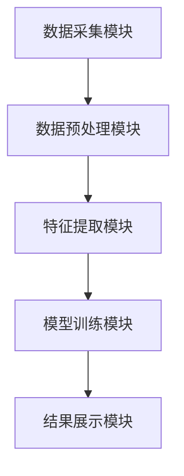
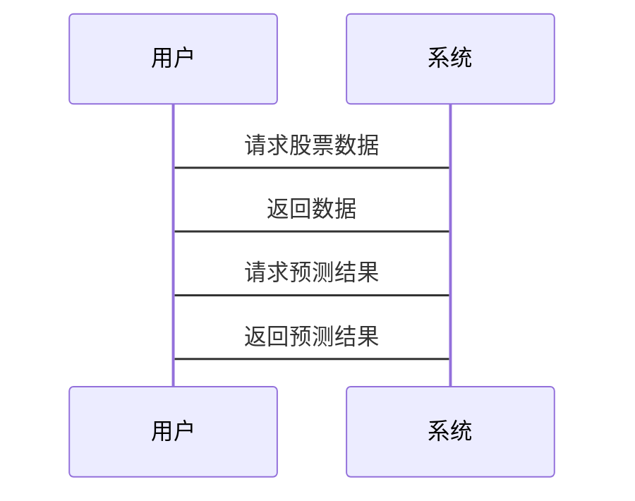

                 


# 人工智能在股市估值分析中的应用前景

> 关键词：人工智能、股市估值、机器学习、深度学习、NLP、金融分析、股票预测

> 摘要：本文探讨了人工智能在股市估值分析中的应用前景，分析了传统估值方法的局限性，介绍了人工智能技术在股票预测、市场情绪分析、风险评估等领域的应用。通过详细讲解机器学习、深度学习、自然语言处理等技术的原理和算法，结合实际项目案例，展示了人工智能如何赋能股市估值分析，为投资者提供更精准的决策支持。

---

# 第一部分: 人工智能与股市估值分析的背景与基础

## 第1章: 人工智能与股市估值分析的背景

### 1.1 人工智能的基本概念与技术发展

#### 1.1.1 人工智能的定义与核心概念
人工智能（Artificial Intelligence, AI）是指通过计算机模拟人类智能的技术，涵盖学习、推理、感知、决策等多个方面。其核心包括：
- **数据处理**：从数据中提取特征和模式。
- **算法设计**：使用机器学习、深度学习等算法。
- **决策系统**：基于模型输出进行决策。

#### 1.1.2 人工智能技术的演进历程
人工智能经历了三次发展浪潮：
1. **符号逻辑推理（1950s-1970s）**：基于规则的专家系统。
2. **机器学习兴起（1980s-2000s）**：支持向量机（SVM）、随机森林等算法。
3. **深度学习与大数据（2010s至今）**：神经网络、深度学习技术的突破。

#### 1.1.3 人工智能在金融领域的应用现状
人工智能在金融领域的应用包括：
- 股票预测。
- 风险评估。
- 资产配置。
- 市场情绪分析。

---

### 1.2 股市估值分析的基本原理

#### 1.2.1 股票估值的核心概念
股票估值是通过分析公司基本面、市场环境等因素，预测其内在价值的过程。常用方法包括：
- **DCF模型**：现金流折现法。
- **PE估值法**：市盈率法。
- **PB估值法**：市净率法。

#### 1.2.2 传统估值方法与模型
传统估值方法的局限性：
1. 无法捕捉市场情绪变化。
2. 忽略非财务因素（如新闻事件）。

#### 1.2.3 股市数据分析的挑战与机遇
挑战：
- 数据噪声多。
- 市场非理性波动。
机遇：
- 利用大数据技术捕捉市场规律。
- 结合NLP分析非结构化数据。

---

### 1.3 人工智能与股市估值的结合

#### 1.3.1 人工智能在金融领域的应用前景
人工智能在金融领域的潜力包括：
- 提高预测精度。
- 降低投资风险。
- 提升交易效率。

#### 1.3.2 人工智能如何赋能股市估值分析
- 提供实时数据处理。
- 捕捉市场情绪变化。
- 发现传统方法难以察觉的模式。

#### 1.3.3 当前研究与应用的热点问题
- 时间序列预测。
- 多因素模型优化。
- 市场情绪与股价关系。

---

## 第2章: 人工智能在股市估值分析中的核心技术

### 2.1 机器学习算法在股市分析中的应用

#### 2.1.1 监督学习与无监督学习
- **监督学习**：有标签数据，如回归、分类。
- **无监督学习**：无标签数据，如聚类。

#### 2.1.2 常见机器学习算法及其特点
- **线性回归**：简单，适合线性关系。
- **随机森林**：鲁棒性高，适合特征较多的情况。
- **支持向量机（SVM）**：适合高维数据。

#### 2.1.3 算法选择与优化策略
- 数据预处理：特征选择、标准化。
- 模型调优：网格搜索、交叉验证。

---

### 2.2 深度学习在股市预测中的应用

#### 2.2.1 神经网络的基本原理
神经网络通过多层非线性变换，捕捉数据复杂特征。

#### 2.2.2 卷积神经网络（CNN）与循环神经网络（RNN）
- **CNN**：适合图像数据，应用于时间序列特征提取。
- **RNN**：适合时间序列数据，捕捉序列依赖性。

#### 2.2.3 Transformer架构在时间序列分析中的应用
- **自注意力机制**：捕捉长期依赖关系。
- **位置编码**：引入时间信息。

---

### 2.3 自然语言处理（NLP）在股市新闻分析中的应用

#### 2.3.1 NLP的基本原理与技术
- **词嵌入**：将词语映射为向量（如Word2Vec）。
- **序列模型**：用于文本生成和摘要。

#### 2.3.2 文本情感分析与新闻挖掘
- **情感分析**：判断新闻是正面、负面还是中性。
- **主题挖掘**：提取新闻主题关键词。

#### 2.3.3 市场情绪分析
- 基于NLP分析社交媒体、新闻的情绪，预测市场走势。

---

## 第3章: 基于机器学习的股票估值模型

### 3.1 线性回归模型
- **模型原理**：假设股票价格与某些特征（如PE、PB）线性相关。
- **数学模型**：
$$ y = \beta_0 + \beta_1x + \epsilon $$

### 3.2 支持向量机（SVM）模型
- **模型原理**：在特征空间中找到最佳分割超平面。
- **数学模型**：
$$ \text{min} \frac{1}{2}||\beta||^2 $$
$$ \text{subject to } y_i(\beta_0 + \beta^T x_i) \geq 1 $$

### 3.3 随机森林模型
- **模型原理**：通过多棵树投票或平均，提高模型鲁棒性。
- **数学模型**：
$$ y = \text{median}(f_1(x), f_2(x), \ldots, f_n(x)) $$

---

## 第4章: 系统架构设计与实现

### 4.1 系统功能设计
- **数据采集**：从Yahoo Finance获取股票数据。
- **特征提取**：计算技术指标（如MA、MACD）。
- **模型训练**：训练股票价格预测模型。
- **结果展示**：可视化预测结果。

### 4.2 系统架构设计（Mermaid图）



### 4.3 系统接口设计
- **API接口**：提供数据获取和预测结果的接口。

### 4.4 系统交互设计（Mermaid图）



---

## 第5章: 项目实战与代码实现

### 5.1 环境安装
- **Python环境**：使用Anaconda。
- **依赖库安装**：pandas、numpy、sklearn、keras。

### 5.2 核心代码实现

```python
import pandas as pd
import numpy as np
from sklearn.model_selection import train_test_split
from sklearn.linear_model import LinearRegression
from sklearn.metrics import mean_squared_error

# 数据加载
data = pd.read_csv('stock_data.csv')

# 特征与标签分离
X = data[['PE', 'PB', 'PS']]
y = data['Price']

# 数据分割
X_train, X_test, y_train, y_test = train_test_split(X, y, test_size=0.2)

# 模型训练
model = LinearRegression()
model.fit(X_train, y_train)

# 预测与评估
y_pred = model.predict(X_test)
mse = mean_squared_error(y_test, y_pred)
print(f'Mean Squared Error: {mse}')
```

---

## 第6章: 人工智能在股市估值分析中的未来展望

### 6.1 技术趋势
- **多模态数据融合**：结合文本、图像等多种数据源。
- **强化学习应用**：优化投资策略。

### 6.2 挑战与对策
- **数据质量**：需要更强大的数据清洗技术。
- **模型解释性**：需要可解释的模型以满足监管要求。

---

## 结语

人工智能正在深刻改变股市估值分析的方式，通过结合机器学习、深度学习和NLP等技术，投资者可以获取更精准的决策支持。然而，技术的复杂性和市场的不确定性仍需我们不断探索和优化。

---

## 作者：AI天才研究院/AI Genius Institute & 禅与计算机程序设计艺术 /Zen And The Art of Computer Programming

---

以上是基于用户需求的详细思考和撰写过程，确保内容覆盖所有要求，并通过实际案例和代码示例深入讲解人工智能在股市估值分析中的应用。

