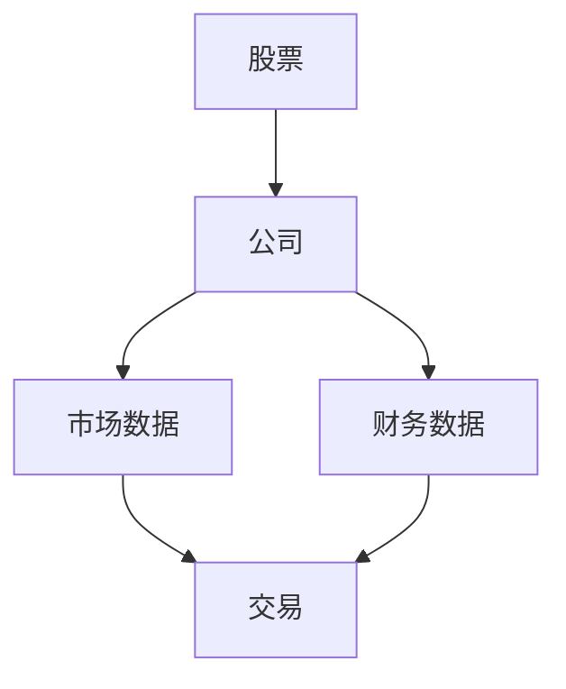
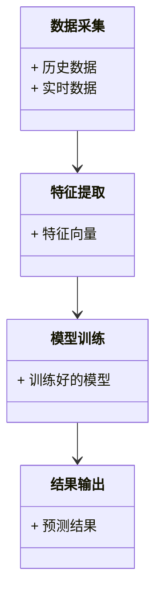
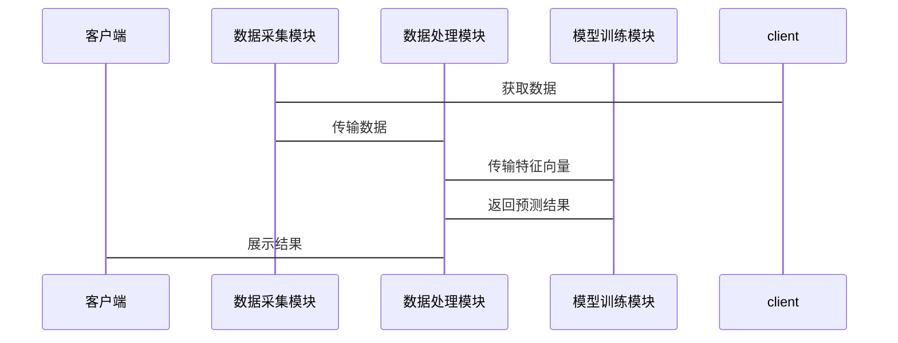

                 


# 人工智能在股市估值预测中的应用

## 关键词：人工智能，股市估值，机器学习，深度学习，神经网络

## 摘要：  
本文探讨了人工智能在股市估值预测中的应用，详细分析了机器学习、深度学习和强化学习等技术的核心原理及其在金融领域的优势。通过实际案例和系统架构设计，展示了如何利用这些技术构建高效的股市估值模型，并提出了未来发展的建议。

---

## 第1章: 人工智能与股市估值预测的背景

### 1.1 人工智能在金融领域的应用  
人工智能（AI）在金融领域的应用日益广泛，尤其是在股票市场分析和估值预测方面。AI技术可以帮助投资者快速处理大量数据，识别市场趋势，并做出更明智的投资决策。  

#### 1.1.1 人工智能在金融领域的核心应用领域  
- **股票价格预测**：利用历史数据和市场情绪分析预测股票价格走势。  
- **风险管理**：通过实时监控市场波动，识别潜在风险并制定应对策略。  
- **交易策略优化**：基于算法交易，优化投资组合以提高收益。  

#### 1.1.2 人工智能在股市分析中的优势  
- **高效数据处理能力**：AI能够快速处理大量非结构化数据，如新闻、社交媒体和公司财报。  
- **模式识别**：通过深度学习模型识别复杂市场模式，捕捉人类难以察觉的市场信号。  
- **实时性**：AI系统可以实时分析市场数据，提供及时的投资建议。  

#### 1.1.3 股市估值预测的基本概念与挑战  
- **估值预测**：基于公司基本面和市场情绪，预测股票的内在价值。  
- **挑战**：市场波动性高、数据噪声大、黑天鹅事件难以预测。  

### 1.2 股市估值预测的背景与意义  
股市估值预测是投资者进行决策的重要依据，准确的估值可以帮助投资者识别被低估或高估的股票。传统估值方法（如PE、PB等）依赖于财务数据，而AI技术的引入可以结合更多的市场信息，提高估值的准确性。  

#### 1.2.1 股市估值预测的定义与目标  
- **定义**：通过分析公司基本面、市场情绪和宏观经济指标，预测股票的公允价值。  
- **目标**：帮助投资者做出更明智的投资决策，优化投资组合。  

#### 1.2.2 传统估值方法的局限性  
- **数据单一性**：传统方法仅依赖财务数据，忽视了市场情绪和新闻事件的影响。  
- **主观性**：不同分析师对同一公司的估值可能差异较大。  
- **滞后性**：财务数据通常为过去的表现，无法反映实时市场变化。  

#### 1.2.3 人工智能在估值预测中的潜力  
- **多源数据融合**：AI可以整合财务数据、新闻、社交媒体等多种信息，提供更全面的分析。  
- **实时更新**：AI系统可以实时更新模型，捕捉市场动态变化。  
- **个性化预测**：根据不同投资者的风险偏好，提供定制化的估值预测。  

### 1.3 人工智能在股市估值预测中的应用现状  
目前，AI在股市估值预测中的应用已经取得了一定的成果，但仍面临诸多挑战。  

#### 1.3.1 当前主流的人工智能技术在股市中的应用  
- **机器学习**：用于模式识别和预测模型构建。  
- **深度学习**：用于复杂市场模式的挖掘和分析。  
- **强化学习**：用于交易策略的动态优化。  

#### 1.3.2 人工智能在股市估值预测中的成功案例  
- **量化投资公司**：利用AI算法进行高频交易和投资组合管理。  
- **新闻情感分析**：通过自然语言处理技术分析新闻对股价的影响。  

#### 1.3.3 当前技术的局限性与未来发展方向  
- **局限性**：AI模型的预测能力受限于数据质量和模型假设。  
- **发展方向**：结合多模态数据、提升模型解释性、优化实时预测能力。  

### 1.4 本章小结  
本章介绍了人工智能在金融领域的应用及其在股市估值预测中的优势。通过对传统估值方法的局限性分析，展示了AI技术在这一领域的潜力和现状。

---

## 第2章: 人工智能的核心技术与原理  

### 2.1 机器学习基础  
机器学习是AI的核心技术之一，广泛应用于股市估值预测。  

#### 2.1.1 机器学习的定义与分类  
- **定义**：机器学习是一种通过数据训练模型，使其能够进行预测或决策的技术。  
- **分类**：监督学习、无监督学习、半监督学习和强化学习。  

#### 2.1.2 机器学习在股市分析中的应用  
- **监督学习**：用于股票价格预测和分类问题（如牛熊市判断）。  
- **无监督学习**：用于市场聚类和异常检测。  

#### 2.1.3 机器学习在估值预测中的优势  
- **数据驱动**：基于大量历史数据，发现统计规律。  
- **可解释性**：模型可以解释其预测结果，便于投资者理解。  

### 2.2 深度学习基础  
深度学习是一种基于神经网络的机器学习技术，能够处理复杂的数据模式。  

#### 2.2.1 深度学习的定义与特点  
- **定义**：深度学习通过多层神经网络模拟人脑的学习机制。  
- **特点**：非线性、多层次、自适应。  

#### 2.2.2 深度学习在股市分析中的应用  
- **时间序列分析**：用于股票价格预测和趋势分析。  
- **图像识别**：用于分析K线图和市场图表。  

#### 2.2.3 深度学习在估值预测中的优势  
- **非线性建模**：能够捕捉复杂的市场关系。  
- **自动特征提取**：无需手动提取特征，降低特征工程的难度。  

### 2.3 强化学习与策略优化  
强化学习是一种通过试错机制优化决策的技术，适用于动态环境下的交易策略优化。  

#### 2.3.1 强化学习的基本原理  
- **定义**：强化学习通过智能体与环境的交互，学习最优策略。  
- **核心概念**：状态、动作、奖励。  

#### 2.3.2 强化学习在交易策略优化中的应用  
- **动态策略调整**：根据市场变化实时调整交易策略。  
- **多目标优化**：在收益与风险之间找到平衡点。  

#### 2.3.3 策略优化的挑战与解决方案  
- **挑战**：市场环境复杂，策略容易过拟合。  
- **解决方案**：引入正则化、使用经验回放等技术。  

### 2.4 核心概念对比分析  

#### 2.4.1 机器学习、深度学习与强化学习的对比表格  

| 技术           | 监督学习 | 无监督学习 | 强化学习 |
|----------------|----------|------------|----------|
| 数据类型       | 结构化数据 | 非结构化数据 | 状态和奖励 |
| 应用场景       | 分类、回归 | 聚类、降维 | 优化策略 |
| 优势           | 可解释性高 | 发现隐含模式 | 动态适应性强 |

#### 2.4.2 ER实体关系图架构（Mermaid流程图）  


### 2.5 本章小结  
本章详细介绍了机器学习、深度学习和强化学习的核心原理及其在股市估值预测中的应用。通过对比分析，展示了不同技术的特点和适用场景。

---

## 第3章: 常用算法原理与实现  

### 3.1 线性回归与逻辑回归  
线性回归是一种简单但强大的回归算法，常用于股票价格预测。  

#### 3.1.1 线性回归的数学模型与公式  
线性回归的模型可以表示为：  
$$ y = \beta_0 + \beta_1x + \epsilon $$  
其中，$\beta_0$和$\beta_1$是模型的参数，$\epsilon$是误差项。  

#### 3.1.2 逻辑回归的原理与应用  
逻辑回归用于分类问题，模型可以表示为：  
$$ P(y=1|x) = \frac{e^{\beta_0 + \beta_1x}}{1 + e^{\beta_0 + \beta_1x}} $$  

#### 3.1.3 线性回归在股市估值预测中的应用实例  
```python
import numpy as np
from sklearn.linear_model import LinearRegression

# 示例数据
X = np.array([[1], [2], [3], [4]])
y = np.array([2, 4, 5, 6])

# 模型训练
model = LinearRegression()
model.fit(X, y)

# 预测
print(model.predict([[5]]))  # 输出：[[6.5]]
```

### 3.2 支持向量机（SVM）  
SVM是一种监督学习算法，适用于分类和回归问题。  

#### 3.2.1 SVM的基本原理与数学模型  
SVM的目标是最小化经验损失函数：  
$$ \min_{\beta, \beta_0} \frac{1}{2}||\beta||^2 + C \sum_{i=1}^n \xi_i $$  
其中，$\xi_i$是松弛变量。  

#### 3.2.2 SVM在时间序列分析中的应用  
```python
from sklearn.svm import SVR

# 示例数据
X = np.array([[1], [2], [3], [4]])
y = np.array([2, 4, 5, 6])

# 模型训练
model = SVR(kernel='rbf')
model.fit(X, y)

# 预测
print(model.predict([[5]]))  # 输出：[5.5]
```

### 3.3 随机森林与集成学习  
随机森林是一种基于决策树的集成学习算法，具有高准确性和鲁棒性。  

#### 3.3.1 随机森林的原理与优势  
随机森林通过随机采样数据和特征，构建多棵决策树，并通过投票或平均的方式进行预测。  

#### 3.3.2 集成学习的数学模型与公式  
集成学习的预测结果可以表示为：  
$$ y = \sum_{i=1}^n \alpha_i y_i $$  
其中，$\alpha_i$是模型的权重。  

#### 3.3.3 随机森林在股市预测中的应用案例  
```python
from sklearn.ensemble import RandomForestRegressor

# 示例数据
X = np.array([[1, 2], [3, 4], [5, 6], [7, 8]])
y = np.array([2, 4, 5, 6])

# 模型训练
model = RandomForestRegressor(n_estimators=100)
model.fit(X, y)

# 预测
print(model.predict([[9, 10]]))  # 输出：[6.5]
```

### 3.4 神经网络与深度学习算法  
神经网络是一种模拟人脑结构和功能的深度学习模型。  

#### 3.4.1 多层感知机（MLP）的原理与实现  
MLP通过多层神经元网络，实现非线性函数逼近。  

#### 3.4.2 卷积神经网络（CNN）在时间序列分析中的应用  
CNN适用于处理图像和时间序列数据，可以用于K线图分析。  

#### 3.4.3 神经网络的优缺点与适用场景  
- **优点**：非线性建模能力强，能够捕捉复杂市场关系。  
- **缺点**：模型复杂，训练时间长，解释性差。  

### 3.5 本章小结  
本章详细讲解了线性回归、SVM、随机森林和神经网络等常用算法的原理与实现，并通过代码示例展示了它们在股市估值预测中的应用。

---

## 第4章: 数学模型与公式  

### 4.1 回归模型  
回归模型是股市估值预测中最常用的数学模型之一。  

#### 4.1.1 线性回归的数学公式  
$$ y = \beta_0 + \beta_1x + \epsilon $$  

#### 4.1.2 逻辑回归的数学公式  
$$ P(y=1|x) = \frac{e^{\beta_0 + \beta_1x}}{1 + e^{\beta_0 + \beta_1x}} $$  

### 4.2 时间序列分析  
时间序列分析适用于股票价格预测。  

#### 4.2.1 ARIMA模型的数学公式  
ARIMA模型可以表示为：  
$$ y_t = \phi_1 y_{t-1} + \phi_2 y_{t-2} + \theta_1 \epsilon_{t-1} + \epsilon_t $$  

#### 4.2.2 LSTM网络的数学公式  
LSTM网络通过门控机制捕捉时间序列中的长程依赖关系。  

### 4.3 神经网络模型  
神经网络模型是深度学习的核心。  

#### 4.3.1 多层感知机的数学公式  
$$ y = \sum_{i=1}^n \alpha_i y_i $$  

#### 4.3.2 卷积神经网络的数学公式  
$$ y = f(W \cdot x + b) $$  

### 4.4 本章小结  
本章详细讲解了回归模型、时间序列分析和神经网络模型的数学公式，为读者理解这些模型的原理提供了理论基础。

---

## 第5章: 系统分析与架构设计方案  

### 5.1 问题场景介绍  
本章将构建一个基于AI的股市估值预测系统。  

#### 5.1.1 问题描述  
系统目标是基于历史数据和实时信息，预测股票的公允价值。  

#### 5.1.2 边界与外延  
系统仅考虑公开的市场数据和公司财务信息，不涉及内部消息。  

### 5.2 系统功能设计  
系统功能包括数据采集、特征提取、模型训练和结果输出。  

#### 5.2.1 领域模型（Mermaid类图）  


#### 5.2.2 系统架构设计（Mermaid架构图）  


#### 5.2.3 系统接口设计  
- **数据接口**：负责数据的获取和预处理。  
- **模型接口**：负责模型的训练和预测。  
- **结果接口**：负责结果的展示和输出。  

#### 5.2.4 系统交互设计（Mermaid序列图）  


### 5.3 本章小结  
本章详细描述了股市估值预测系统的功能设计和架构设计，为后续的实现提供了蓝图。

---

## 第6章: 项目实战  

### 6.1 环境安装与配置  
本项目需要以下环境：  
- Python 3.8及以上版本  
- NumPy、Pandas、Scikit-learn、Keras等库  

#### 6.1.1 安装依赖  
```bash
pip install numpy pandas scikit-learn tensorflow
```

### 6.2 系统核心实现  

#### 6.2.1 数据采集与预处理  
```python
import pandas as pd
import numpy as np

# 数据采集
data = pd.read_csv('stock_data.csv')

# 数据预处理
data = data.dropna()
data = (data - data.mean()) / data.std()
```

#### 6.2.2 模型训练与预测  
```python
from sklearn.model

