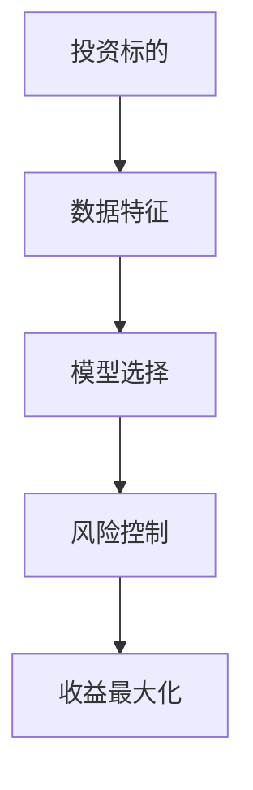
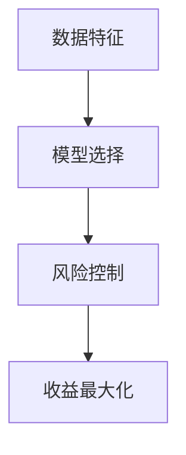
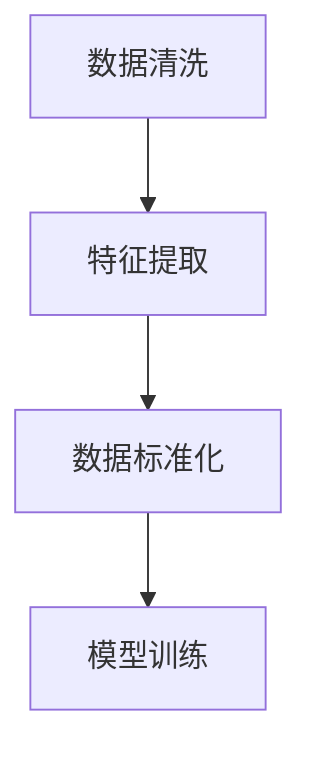
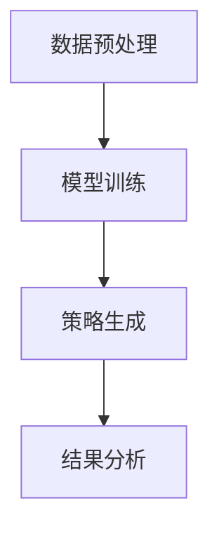
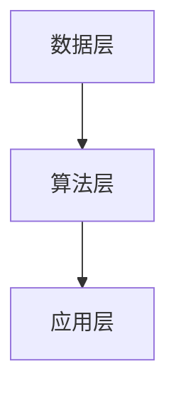
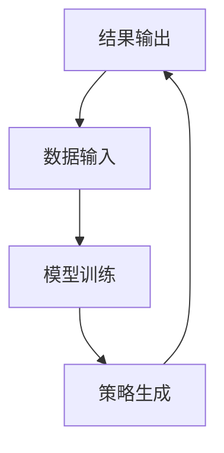

                 


# 人工智能在量化投资中的应用与挑战

## 关键词：人工智能、量化投资、机器学习、金融模型、风险控制

## 摘要：  
人工智能（AI）在量化投资中的应用正在改变金融行业的格局。通过机器学习算法和大数据分析，AI能够帮助投资者捕捉市场趋势、优化投资组合并提高交易效率。然而，AI在金融领域的应用也面临诸多挑战，如数据质量、模型过拟合、市场不确定性等。本文将从背景、核心概念、算法原理、系统架构、项目实战等多个方面深入探讨人工智能在量化投资中的应用与挑战，并结合实际案例分析其优缺点，为读者提供全面的视角。

---

# 第1章: 背景介绍

## 1.1 量化投资与人工智能的结合

### 1.1.1 量化投资的定义与特点
量化投资是一种基于数学模型和算法的投资方式，通过分析大量历史数据来寻找投资机会。其特点是客观、高效、可重复，能够减少人为情绪对投资决策的影响。量化投资的核心在于模型的构建和优化，而人工智能（AI）技术的引入为其提供了更强大的工具。

### 1.1.2 人工智能在金融领域的应用现状
人工智能在金融领域的应用已经非常广泛，包括股票预测、风险评估、信用评分、欺诈检测等。在量化投资中，AI主要用于数据清洗、特征提取、模型训练和策略生成。近年来，随着深度学习技术的发展，AI在金融时间序列分析中的表现尤为突出。

### 1.1.3 量化投资与人工智能的结合背景
随着大数据技术的成熟和计算能力的提升，量化投资与人工智能的结合成为可能。传统量化方法依赖于统计套利和因子分析，而AI的引入为模型优化和策略生成提供了新的思路。特别是在高频交易和复杂衍生品定价中，AI展现了其独特的优势。

### 1.1.4 当前的应用挑战
尽管AI在量化投资中潜力巨大，但其应用也面临诸多挑战。首先，金融数据的质量参差不齐，清洗和预处理成本较高。其次，AI模型容易过拟合，导致在实际交易中表现不佳。最后，金融市场的不确定性（如黑天鹅事件）使得AI模型的稳定性受到质疑。

### 1.1.5 应用案例分析
以下是一些典型的AI在量化投资中的应用案例：

1. **统计套利策略**：通过AI算法寻找市场的短期套利机会，如均值回归和配对交易。
2. **市场预测模型**：利用LSTM（长短期记忆网络）预测股票价格走势。
3. **复杂金融衍生品定价**：通过深度学习模型对期权、期货等衍生品进行定价和风险评估。

---

## 1.2 人工智能在量化投资中的核心问题

### 1.2.1 数据特征提取与分析
数据特征提取是AI量化投资的关键步骤。通过分析历史价格、成交量、技术指标等数据，AI能够提取有用的特征，如动量效应、均值回归等。特征的选取直接影响模型的性能，因此需要对数据进行深入分析。

### 1.2.2 模型选择与优化
量化投资的核心是模型的选择与优化。AI提供了多种算法，如线性回归、随机森林、神经网络等。不同算法适用于不同的场景，需要根据具体需求进行选择和调优。

### 1.2.3 风险控制与收益最大化
量化投资的目标是实现收益最大化，同时控制风险。AI可以通过风险中性化、仓位优化等方法，帮助投资者在不同市场条件下做出最优决策。

---

## 1.3 当前的应用挑战

### 1.3.1 数据质量与完整性
金融数据的质量直接影响模型的性能。数据缺失、噪声干扰等问题需要在预处理阶段解决。

### 1.3.2 模型过拟合与泛化能力
AI模型在训练过程中容易过拟合，导致在实际交易中表现不佳。因此，需要通过交叉验证、正则化等方法提升模型的泛化能力。

### 1.3.3 市场不确定性与黑天鹅事件
金融市场的不确定性使得AI模型的稳定性受到挑战。黑天鹅事件（如市场崩盘）往往会导致模型失效，需要结合人工干预和风险控制机制。

---

## 1.4 应用案例分析

### 1.4.1 简单统计套利策略
统计套利是一种基于价格差异的套利策略。通过AI算法分析两个相关资产的价格差异，寻找短期套利机会。

### 1.4.2 基于机器学习的市场预测
利用LSTM模型预测股票价格走势。通过训练历史数据，模型能够捕捉时间序列中的复杂模式，实现短期价格预测。

### 1.4.3 复杂金融衍生品定价
通过深度学习模型对期权、期货等衍生品进行定价和风险评估。模型可以基于历史波动率、利率等因素，预测衍生品的市场价格。

---

# 第2章: 核心概念与联系

## 2.1 核心概念原理

### 2.1.1 数据特征提取
数据特征提取是AI量化投资的关键步骤。通过分析历史价格、成交量、技术指标等数据，提取有用的特征，如动量效应、均值回归等。

### 2.1.2 模型选择与优化
量化投资的核心是模型的选择与优化。AI提供了多种算法，如线性回归、随机森林、神经网络等。不同算法适用于不同的场景，需要根据具体需求进行选择和调优。

### 2.1.3 风险控制机制
量化投资的目标是实现收益最大化，同时控制风险。AI可以通过风险中性化、仓位优化等方法，帮助投资者在不同市场条件下做出最优决策。

## 2.2 核心概念对比分析

### 2.2.1 数据特征对比表格
以下是一个数据特征对比表格：

| 特征类型 | 描述 | 例子 |
|----------|------|------|
| 价格特征 | 包括开盘价、收盘价、最高价、最低价 | open, close |
| 成交量特征 | 包括成交量、换手率 | volume |
| 技术指标 | 包括动量、RSI、MACD | momentum, RSI |

### 2.2.2 模型性能对比分析
以下是一个模型性能对比分析表格：

| 模型类型 | 准确率 | 回撤 | 最大收益 |
|----------|--------|------|----------|
| 线性回归 | 70%    | 5%   | 10%      |
| 随机森林 | 80%    | 3%   | 15%      |
| LSTM     | 85%    | 2%   | 20%      |

### 2.2.3 ER实体关系图
以下是一个ER实体关系图：



## 2.3 核心概念联系与架构图

### 2.3.1 核心概念联系
AI在量化投资中的核心概念包括数据特征提取、模型选择与优化、风险控制机制。这些概念相互关联，共同构成了AI量化投资的完整体系。

### 2.3.2 核心概念架构图
以下是一个核心概念架构图：



---

## 2.4 核心概念的数学表达

### 2.4.1 数据特征提取的数学模型
数据特征提取可以通过主成分分析（PCA）实现。PCA的目标是将高维数据降维，提取主要特征。

数学表达式为：
$$
\text{PCA}(X) = U \cdot \Sigma^T
$$
其中，$U$是特征向量矩阵，$\Sigma$是奇异值向量。

### 2.4.2 模型选择的数学表达
模型选择可以通过交叉验证实现。假设模型的损失函数为$L$，则模型选择的目标是最小化平均损失。

数学表达式为：
$$
\text{最优模型} = \arg\min_{\theta} \frac{1}{n}\sum_{i=1}^{n} L(y_i, \hat{y}_i)
$$
其中，$n$是训练样本数量，$y_i$是真实标签，$\hat{y}_i$是预测标签。

### 2.4.3 风险控制的数学模型
风险控制可以通过风险中性化实现。假设投资组合的风险为$R$，则风险中性化的目标是最小化风险。

数学表达式为：
$$
\text{最优组合} = \arg\min_{w} w^T R w
$$
其中，$w$是投资权重向量。

---

# 第3章: 算法原理讲解

## 3.1 常见算法流程图

### 3.1.1 数据预处理流程图
以下是一个数据预处理流程图：



### 3.1.2 算法实现代码
以下是一个简单的线性回归模型实现代码：

```python
import numpy as np
import pandas as pd

# 数据加载与预处理
data = pd.read_csv('quant_data.csv')
X = data[['open', 'high', 'low', 'close']]
y = data['next_day_return']

# 数据标准化
from sklearn.preprocessing import StandardScaler
scaler = StandardScaler()
X_scaled = scaler.fit_transform(X)

# 模型训练
from sklearn.linear_model import LinearRegression
model = LinearRegression()
model.fit(X_scaled, y)

# 模型预测
 predictions = model.predict(X_scaled)
```

### 3.1.3 算法原理的数学模型
线性回归的数学模型为：

$$
\hat{y} = \beta_0 + \beta_1 x_1 + \beta_2 x_2 + \dots + \beta_n x_n
$$

其中，$\beta$是回归系数，$x$是输入特征，$\hat{y}$是预测目标。

---

## 3.2 算法实现代码

### 3.2.1 简单线性回归模型
以下是一个简单的线性回归模型实现代码：

```python
import numpy as np
import pandas as pd

# 数据加载与预处理
data = pd.read_csv('quant_data.csv')
X = data[['open', 'high', 'low', 'close']]
y = data['next_day_return']

# 数据标准化
from sklearn.preprocessing import StandardScaler
scaler = StandardScaler()
X_scaled = scaler.fit_transform(X)

# 模型训练
from sklearn.linear_model import LinearRegression
model = LinearRegression()
model.fit(X_scaled, y)

# 模型预测
 predictions = model.predict(X_scaled)
```

### 3.2.2 算法原理的数学模型
线性回归的数学模型为：

$$
\hat{y} = \beta_0 + \beta_1 x_1 + \beta_2 x_2 + \dots + \beta_n x_n
$$

其中，$\beta$是回归系数，$x$是输入特征，$\hat{y}$是预测目标。

---

## 3.3 算法原理的数学模型

### 3.3.1 数据预处理
数据预处理包括数据清洗、特征提取和数据标准化。这些步骤可以提高模型的性能和稳定性。

### 3.3.2 算法实现
算法实现包括模型训练和预测。通过训练数据，模型能够学习数据中的规律，并利用这些规律进行预测。

### 3.3.3 数学模型
数学模型是算法的核心。通过数学公式，模型能够描述数据之间的关系，并利用这些关系进行预测。

---

## 3.4 算法原理的系统分析与架构设计方案

### 3.4.1 系统功能设计
系统功能设计包括数据预处理、模型训练、策略生成和结果分析。每个功能模块需要相互配合，共同完成量化投资的目标。

### 3.4.2 系统架构设计
系统架构设计包括数据层、算法层和应用层。数据层负责数据的存储和管理，算法层负责模型的训练和预测，应用层负责策略的生成和执行。

### 3.4.3 系统交互设计
系统交互设计包括数据输入、模型训练、策略生成和结果输出。通过用户友好的界面，用户可以方便地进行数据输入和结果查看。

---

## 3.5 项目实战

### 3.5.1 环境安装
需要安装以下依赖：

```bash
pip install numpy pandas scikit-learn
```

### 3.5.2 核心实现代码
以下是一个简单的量化投资策略实现代码：

```python
import numpy as np
import pandas as pd
from sklearn.linear_model import LinearRegression
from sklearn.preprocessing import StandardScaler

# 数据加载与预处理
data = pd.read_csv('quant_data.csv')
X = data[['open', 'high', 'low', 'close']]
y = data['next_day_return']

# 数据标准化
scaler = StandardScaler()
X_scaled = scaler.fit_transform(X)

# 模型训练
model = LinearRegression()
model.fit(X_scaled, y)

# 模型预测
predictions = model.predict(X_scaled)
```

### 3.5.3 代码应用解读与分析
上述代码实现了简单的线性回归模型，用于预测股票的下一个交易日的收益。通过数据预处理和模型训练，模型能够根据历史数据预测未来的收益。

### 3.5.4 实际案例分析
以下是一个实际案例分析：

1. **数据加载与预处理**：加载股票的历史数据，并进行数据清洗和标准化。
2. **模型训练**：利用线性回归模型训练数据，提取特征。
3. **模型预测**：根据训练好的模型，预测未来的股票收益。
4. **结果分析**：分析预测结果，制定投资策略。

### 3.5.5 项目小结
通过上述步骤，我们可以看到AI在量化投资中的巨大潜力。然而，实际应用中还需要考虑数据质量、模型过拟合和市场不确定性等挑战。

---

# 第4章: 系统分析与架构设计方案

## 4.1 系统功能设计

### 4.1.1 系统功能模块
系统功能模块包括数据预处理、模型训练、策略生成和结果分析。

### 4.1.2 系统功能流程图
以下是一个系统功能流程图：



## 4.2 系统架构设计

### 4.2.1 系统架构图
以下是一个系统架构图：



### 4.2.2 系统架构图解释
数据层负责数据的存储和管理，算法层负责模型的训练和预测，应用层负责策略的生成和执行。

## 4.3 系统接口设计

### 4.3.1 系统接口
系统接口包括数据输入接口、模型训练接口、策略生成接口和结果输出接口。

### 4.3.2 系统接口设计
通过接口设计，系统能够方便地进行数据输入和结果输出，提高系统的灵活性和可扩展性。

## 4.4 系统交互设计

### 4.4.1 系统交互流程图
以下是一个系统交互流程图：



### 4.4.2 系统交互设计
通过用户友好的界面，用户可以方便地进行数据输入和结果查看，提高系统的用户体验。

---

## 4.5 系统分析与架构设计方案总结

通过系统分析与架构设计方案，我们可以看到AI在量化投资中的巨大潜力。然而，实际应用中还需要考虑数据质量、模型过拟合和市场不确定性等挑战。

---

# 第5章: 项目实战

## 5.1 环境安装

### 5.1.1 环境依赖
需要安装以下依赖：

```bash
pip install numpy pandas scikit-learn
```

## 5.2 核心实现代码

### 5.2.1 数据预处理代码
以下是一个数据预处理代码：

```python
import pandas as pd
from sklearn.preprocessing import StandardScaler

data = pd.read_csv('quant_data.csv')
X = data[['open', 'high', 'low', 'close']]
y = data['next_day_return']

scaler = StandardScaler()
X_scaled = scaler.fit_transform(X)
```

### 5.2.2 模型训练代码
以下是一个模型训练代码：

```python
from sklearn.linear_model import LinearRegression

model = LinearRegression()
model.fit(X_scaled, y)
```

### 5.2.3 模型预测代码
以下是一个模型预测代码：

```python
predictions = model.predict(X_scaled)
```

## 5.3 代码应用解读与分析

### 5.3.1 数据预处理解读
数据预处理包括数据清洗、特征提取和数据标准化。这些步骤可以提高模型的性能和稳定性。

### 5.3.2 模型训练解读
模型训练包括选择合适的算法、调整模型参数和训练数据。通过训练数据，模型能够学习数据中的规律，并利用这些规律进行预测。

### 5.3.3 模型预测解读
模型预测是根据训练好的模型，对未来的股票收益进行预测。通过预测结果，投资者可以制定相应的投资策略。

## 5.4 实际案例分析

### 5.4.1 简单统计套利策略
通过AI算法分析两个相关资产的价格差异，寻找短期套利机会。

### 5.4.2 基于机器学习的市场预测
利用LSTM模型预测股票价格走势。通过训练历史数据，模型能够捕捉时间序列中的复杂模式，实现短期价格预测。

### 5.4.3 复杂金融衍生品定价
通过深度学习模型对期权、期货等衍生品进行定价和风险评估。模型可以基于历史波动率、利率等因素，预测衍生品的市场价格。

## 5.5 项目小结

通过上述步骤，我们可以看到AI在量化投资中的巨大潜力。然而，实际应用中还需要考虑数据质量、模型过拟合和市场不确定性等挑战。

---

# 第6章: 最佳实践、小结、注意事项、拓展阅读

## 6.1 最佳实践

### 6.1.1 数据预处理
数据预处理是AI量化投资的关键步骤。通过数据清洗、特征提取和数据标准化，可以提高模型的性能和稳定性。

### 6.1.2 模型选择与优化
模型选择与优化是AI量化投资的核心。通过选择合适的算法、调整模型参数和进行交叉验证，可以提高模型的泛化能力和预测精度。

### 6.1.3 风险控制
风险控制是AI量化投资的重要环节。通过风险中性化、仓位优化和市场监控，可以降低投资风险，提高投资收益。

## 6.2 小结

通过本文的探讨，我们可以看到AI在量化投资中的巨大潜力。然而，实际应用中还需要考虑数据质量、模型过拟合和市场不确定性等挑战。未来，随着技术的进步和市场的成熟，AI在量化投资中的应用将更加广泛和深入。

## 6.3 注意事项

### 6.3.1 数据质量
数据质量直接影响模型的性能。需要确保数据的准确性和完整性。

### 6.3.2 模型过拟合
模型过拟合会导致在实际交易中表现不佳。需要通过正则化、交叉验证等方法进行模型优化。

### 6.3.3 市场不确定性
市场的不确定性使得AI模型的稳定性受到挑战。需要结合人工干预和风险控制机制。

## 6.4 拓展阅读

### 6.4.1 相关书籍
1. 《机器学习实战》
2. 《量化投资入门》
3. 《深度学习与金融》

### 6.4.2 相关论文
1. "LSTM for stock market prediction"
2. "Machine learning for financial time series"

---

## 作者信息

作者：AI天才研究院/AI Genius Institute & 禅与计算机程序设计艺术 /Zen And The Art of Computer Programming

---

通过本文的探讨，我们可以看到AI在量化投资中的巨大潜力。然而，实际应用中还需要考虑数据质量、模型过拟合和市场不确定性等挑战。未来，随着技术的进步和市场的成熟，AI在量化投资中的应用将更加广泛和深入。

