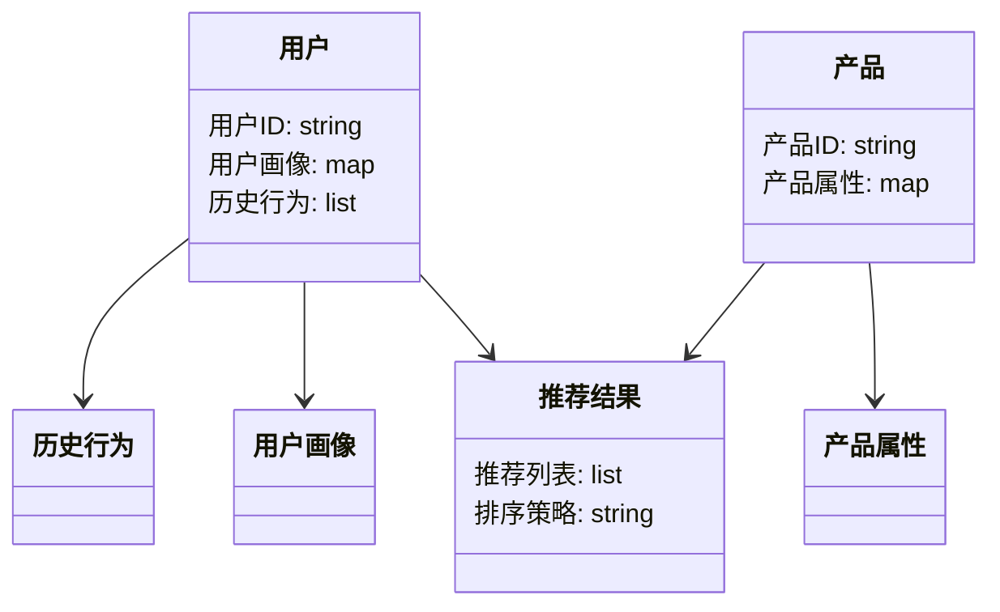
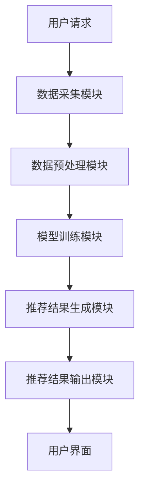
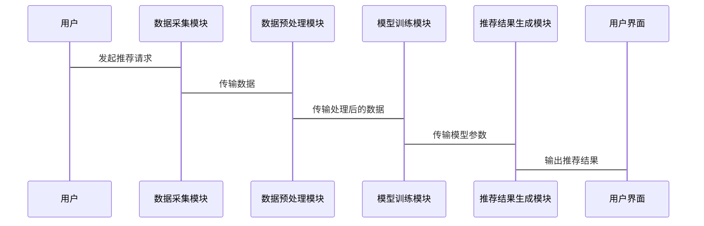

                 


# 人工智能在金融产品个性化推荐中的应用

> **关键词**：人工智能，金融推荐，协同过滤，深度学习，知识图谱，个性化推荐，金融产品

> **摘要**：  
> 本文深入探讨了人工智能技术在金融产品个性化推荐中的应用。首先，我们介绍了金融推荐系统的背景、目标和核心概念。接着，详细分析了基于协同过滤、深度学习和知识图谱的推荐算法及其原理。然后，我们从系统架构的角度，探讨了推荐系统的实现过程，包括数据采集、特征提取、模型训练和结果输出等环节。最后，通过一个实际案例展示了基于协同过滤算法的金融推荐系统实现，并总结了当前技术的优缺点及未来发展方向。

---

## 第1章 人工智能与金融推荐系统概述

### 1.1 人工智能在金融领域的应用背景

人工智能技术的快速发展，为金融行业的数字化转型提供了强大的技术支撑。金融行业作为数据密集型行业，每天都会产生大量交易数据、用户行为数据和市场数据。如何从这些海量数据中提取有价值的信息，为用户提供个性化的金融产品推荐，成为金融机构的核心竞争力之一。

**金融行业的数字化转型**  
金融机构通过数字化转型，可以更高效地服务于客户，提升客户体验，降低运营成本。人工智能技术的应用，使得金融机构能够实时分析用户行为，预测用户需求，并提供个性化的金融产品推荐。

**个性化推荐在金融产品中的重要性**  
个性化推荐能够帮助金融机构更好地匹配客户需求与产品，提高客户满意度和忠诚度。通过推荐系统，用户可以快速找到适合自己的金融产品，而金融机构也可以通过推荐系统实现精准营销，提高销售效率。

**人工智能技术的核心作用**  
人工智能技术，尤其是机器学习和深度学习技术，能够从海量数据中挖掘出隐含的模式和规律，为金融推荐系统提供强大的技术支持。

---

### 1.2 金融产品推荐系统的定义与目标

**金融产品推荐系统的定义**  
金融产品推荐系统是一种基于人工智能技术的推荐系统，旨在根据用户的历史行为、偏好和市场数据，推荐适合用户的金融产品，如理财产品、基金、保险等。

**推荐系统的分类与特点**  
推荐系统可以分为基于协同过滤、基于内容的推荐和基于知识图谱的推荐等多种类型。金融推荐系统通常结合多种推荐方法，以提高推荐的准确性和多样性。

**个性化推荐的目标与价值**  
个性化推荐的目标是为每个用户提供最适合的金融产品推荐。通过个性化推荐，金融机构可以提高客户满意度，增强客户粘性，同时降低营销成本。

---

### 1.3 人工智能在推荐系统中的应用现状

**当前主流技术分析**  
目前，基于协同过滤和深度学习的推荐算法是金融推荐系统中的主流技术。协同过滤算法通过分析用户行为数据，找到相似用户的推荐；深度学习算法则通过建模用户和产品之间的关系，实现更精准的推荐。

**金融行业推荐系统的挑战**  
金融推荐系统面临数据稀疏性、实时性要求高、用户隐私保护等挑战。此外，金融产品的复杂性和多样性也增加了推荐系统的实现难度。

**未来发展趋势与潜力**  
随着人工智能技术的不断发展，金融推荐系统将更加智能化和个性化。未来，基于知识图谱的推荐、强化学习等技术将得到更广泛的应用。

---

## 第2章 个性化推荐的核心概念

### 2.1 推荐系统的基本原理

**推荐系统的输入与输出**  
推荐系统的输入包括用户信息（如用户画像）、产品信息（如产品属性）和用户行为数据。输出是针对用户的个性化推荐列表。

**推荐系统的评价指标**  
推荐系统的评价指标包括准确率、召回率、F1值、用户满意度等。这些指标可以帮助我们评估推荐系统的性能。

**推荐系统的性能优化**  
推荐系统的性能优化可以从数据预处理、算法优化和系统架构优化等方面入手，以提高推荐系统的效率和准确性。

---

### 2.2 人工智能在推荐系统中的核心作用

**数据驱动的推荐**  
数据驱动的推荐方法通过分析海量数据，挖掘出用户的潜在需求，从而实现精准推荐。

**模型驱动的推荐**  
模型驱动的推荐方法通过构建机器学习模型，分析用户和产品的特征，实现推荐。

**结合业务场景的推荐优化**  
结合具体的业务场景，如风险控制、用户体验优化等，可以进一步优化推荐系统的效果。

---

### 2.3 金融推荐系统的特殊性

**金融数据的特点**  
金融数据具有高维性、时序性和复杂性等特点。这些特点使得金融推荐系统的实现更加复杂。

**金融推荐的合规性要求**  
金融推荐系统需要符合相关法律法规和监管要求，如数据隐私保护、反洗钱等。

**金融用户行为的复杂性**  
金融用户的行为受到多种因素的影响，如市场波动、用户情绪等，这增加了推荐系统的实现难度。

---

## 第3章 基于协同过滤的推荐算法

### 3.1 协同过滤的基本原理

**基于用户的协同过滤**  
基于用户的协同过滤算法通过找到与目标用户行为相似的其他用户，将这些用户的偏好作为推荐依据。

**基于物品的协同过滤**  
基于物品的协同过滤算法通过分析产品的相似性，将相似产品的用户行为作为推荐依据。

**混合协同过滤模型**  
混合协同过滤模型结合了基于用户和基于物品的协同过滤方法，以提高推荐的准确性和多样性。

---

### 3.2 协同过滤的实现步骤

**数据预处理**  
数据预处理包括数据清洗、数据归一化等步骤，以确保数据的质量和一致性。

**相似度计算**  
相似度计算是协同过滤的核心步骤。常用的相似度计算方法包括余弦相似度、杰卡德相似度等。

**推荐结果生成**  
根据用户和产品的相似度，生成推荐列表，并根据推荐结果的排序策略进行排序。

---

### 3.3 协同过滤的优缺点

**优点分析**  
协同过滤的优点包括实现简单、易于解释、能够处理数据稀疏性等。

**缺点分析**  
协同过滤的缺点包括计算复杂度高、推荐结果的多样性不足、难以处理冷启动问题等。

**改进方向**  
针对协同过滤的缺点，可以通过引入深度学习技术、结合知识图谱等方法进行改进。

---

## 第4章 基于深度学习的推荐算法

### 4.1 深度学习在推荐系统中的应用

**神经网络的基本原理**  
神经网络通过多层感知机（MLP）构建用户和产品的隐式表示，从而实现推荐。

**深度学习的优势**  
深度学习的优势包括能够处理高维数据、捕捉非线性关系、自动提取特征等。

**深度学习在推荐中的挑战**  
深度学习在推荐中的挑战包括计算资源消耗大、模型解释性差、数据稀疏性等。

---

### 4.2 常见的深度学习推荐模型

**基于神经网络的协同过滤**  
基于神经网络的协同过滤模型通过构建用户和产品的嵌入向量，实现推荐。

**基于注意力机制的推荐**  
基于注意力机制的推荐模型通过关注用户行为中的重要部分，提高推荐的准确性。

**基于知识图谱的推荐**  
基于知识图谱的推荐模型通过构建金融产品的知识图谱，实现基于语义的推荐。

---

### 4.3 深度学习推荐算法的实现

**算法实现步骤**  
深度学习推荐算法的实现步骤包括数据预处理、模型训练、模型评估和推荐结果生成。

**数学模型与公式**  
深度学习推荐模型的数学模型通常涉及多层感知机、注意力机制等。例如，基于协同过滤的深度学习模型可以表示为：

$$
y = f(x_u, x_i)
$$

其中，$x_u$ 表示用户 $u$ 的特征向量，$x_i$ 表示产品 $i$ 的特征向量，$f$ 是深度学习模型。

---

## 第5章 系统分析与架构设计

### 5.1 问题场景介绍

**金融推荐系统的应用场景**  
金融推荐系统可以应用于银行、证券、保险等多个领域。例如，在证券领域，推荐系统可以为用户推荐适合的股票或基金产品。

**系统功能设计**  
金融推荐系统的核心功能包括数据采集、特征提取、模型训练、结果输出等。

---

### 5.2 系统功能设计

**领域模型设计**  
领域模型设计包括用户、产品、推荐结果等核心实体。以下是领域模型的类图（使用 Mermaid 表示）：



---

### 5.3 系统架构设计

**系统架构设计**  
金融推荐系统的架构通常包括数据层、模型层和应用层。以下是系统架构图（使用 Mermaid 表示）：



---

### 5.4 系统交互设计

**系统交互设计**  
金融推荐系统的交互设计通常包括用户请求、数据处理、模型计算和结果展示等步骤。以下是系统交互图（使用 Mermaid 表示）：



---

## 第6章 项目实战：基于协同过滤的推荐系统实现

### 6.1 环境安装

**环境要求**  
推荐系统实现需要安装 Python、Pandas、Scikit-learn 等库。以下是环境安装代码：

```bash
pip install numpy pandas scikit-learn
```

---

### 6.2 系统核心实现源代码

**数据处理代码**  
以下是协同过滤算法的数据处理代码：

```python
import pandas as pd

# 数据加载
data = pd.read_csv('user_ratings.csv')

# 数据预处理
data = data.pivot(index='user_id', columns='product_id', values='rating')
data = data.fillna(0)
```

---

### 6.3 代码应用解读与分析

**代码解读**  
上述代码将用户评分数据从长格式转换为宽格式，并用 0 填充缺失值。这种数据格式适合协同过滤算法的实现。

---

### 6.4 实际案例分析

**案例分析**  
假设我们有一个用户评分数据集，其中包含用户对不同金融产品的评分。通过协同过滤算法，我们可以找到与目标用户行为相似的其他用户，并基于这些用户的评分，推荐相似的金融产品。

---

## 第7章 最佳实践与总结

### 7.1 小结

**总结与回顾**  
本文详细介绍了人工智能在金融产品个性化推荐中的应用，包括推荐系统的背景、核心概念、算法原理和系统架构等内容。

---

### 7.2 注意事项

**注意事项**  
在实际应用中，需要注意数据隐私保护、模型解释性问题以及系统的实时性要求。

---

### 7.3 拓展阅读

**推荐书籍**  
1. 《集体智慧编程》（Programming Collective Intelligence）  
2. 《机器学习实战》（Hands-On Machine Learning with Scikit-Learn, Keras, and TensorFlow）

---

## 作者

**作者：** AI天才研究院/AI Genius Institute & 禅与计算机程序设计艺术 /Zen And The Art of Computer Programming

---

**注**：由于篇幅限制，本文档未展示全部内容，完整文章请参考相关技术资料或书籍。

