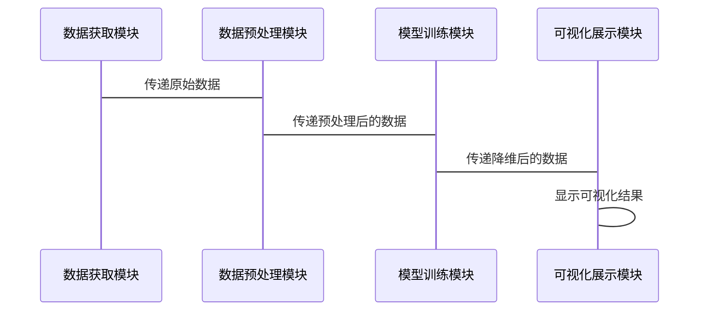

                 


# 人工智能在高维金融数据可视化中的应用

---

## 关键词：
人工智能，高维数据，金融数据可视化，降维算法，数据预处理，机器学习

---

## 摘要：
本文深入探讨人工智能在高维金融数据可视化中的应用，从高维数据的特性与挑战出发，结合机器学习算法，详细分析降维技术、特征提取和数据预处理方法。通过系统架构设计和项目实战，展示如何利用人工智能技术实现高维金融数据的高效可视化。文章内容涵盖理论与实践，为金融数据分析和可视化的研究与应用提供参考。

---

## 第一部分：高维金融数据可视化与人工智能的背景

### 第1章：高维金融数据可视化与人工智能的背景

#### 1.1 高维数据的概念与挑战

##### 1.1.1 高维数据的定义
高维数据是指具有多个特征或维度的数据，通常在金融领域中，高维数据可以表示为股票价格、交易量、市场指数等多维时间序列数据。例如，一只股票的走势可能包含开盘价、收盘价、最高价、最低价等多个维度的特征。

##### 1.1.2 高维数据的特点
- **维度高**：金融数据通常包含数百个特征，例如股票市场的技术指标、市场情绪指标等。
- **数据稀疏性**：高维数据中，许多特征可能相关性较低，导致数据稀疏。
- **数据噪声**：金融数据中存在大量噪声，例如市场波动、突发事件等。

##### 1.1.3 高维数据在金融领域的应用
- **股票价格预测**：通过分析历史价格数据，预测未来的价格走势。
- **风险评估**：利用多维数据评估投资组合的风险。
- **市场情绪分析**：通过社交媒体数据、新闻数据等多源数据，分析市场情绪。

#### 1.2 人工智能与金融数据可视化的结合

##### 1.2.1 人工智能在金融领域的应用
人工智能技术广泛应用于金融领域，包括：
- **股票价格预测**：利用机器学习模型预测股票价格走势。
- **风险管理**：通过算法识别市场风险。
- **智能投顾**：为投资者提供个性化的投资建议。

##### 1.2.2 数据可视化在金融分析中的重要性
数据可视化可以帮助金融分析师更好地理解数据，发现隐藏的模式和趋势。例如，通过可视化技术，可以将复杂的多维数据映射到二维或三维空间，便于分析和决策。

##### 1.2.3 人工智能与数据可视化结合的必要性
高维数据的复杂性使得传统的可视化方法难以处理。通过人工智能技术，可以自动提取数据特征，并将高维数据映射到低维空间，从而实现高效的可视化。

#### 1.3 本章小结
本章介绍了高维数据的概念、特点以及在金融领域的应用，同时强调了人工智能与数据可视化结合的重要性。

---

## 第二部分：高维金融数据处理与分析

### 第2章：高维金融数据预处理

#### 2.1 数据清洗与标准化

##### 2.1.1 数据清洗的必要性
高维金融数据中可能包含缺失值、异常值等，这些数据会影响后续的分析和可视化。因此，数据清洗是必要的。

##### 2.1.2 数据标准化与归一化
- **标准化**：将数据按比例缩放到同一范围内，例如将数据标准化到0-1范围。
- **归一化**：将数据按比例缩放到标准差为1的正态分布。

##### 2.1.3 数据缺失值的处理方法
- **删除法**：直接删除包含缺失值的样本或特征。
- **均值/中位数填充**：使用特征的均值或中位数填充缺失值。
- **回归法**：利用机器学习模型预测缺失值。

#### 2.2 数据降维技术

##### 2.2.1 主成分分析（PCA）
- **原理**：PCA是一种线性降维技术，通过找到数据的主要成分，将高维数据映射到低维空间。
- **数学模型**：PCA的目标是最大化方差，公式为：
  $$\text{最大化} \sum_{i=1}^{n} (y_i - \bar{y})^2$$
  其中，$y_i$ 是降维后的数据，$\bar{y}$ 是其均值。

##### 2.2.2 t-SNE算法
- **原理**：t-SNE是一种非线性降维算法，通过概率密度模型将高维数据映射到二维或三维空间。
- **优缺点**：t-SNE能够较好地保留数据的局部结构，但计算复杂度较高。

##### 2.2.3 其他降维方法
- **UMAP**：一种基于图论的降维算法，适用于高维数据的可视化。
- **LLE**：局部线性嵌入算法，适用于局部结构的保持。

#### 2.3 特征提取与选择

##### 2.3.1 基于统计的特征选择
- **相关性分析**：通过计算特征之间的相关系数，选择相关性较高的特征。
- **方差分析**：选择方差较大的特征。

##### 2.3.2 基于机器学习的特征选择
- **Lasso回归**：通过L1正则化系数，自动选择重要特征。
- **随机森林**：通过特征重要性系数，选择重要特征。

##### 2.3.3 特征重要性评估
- **特征重要性评分**：通过机器学习模型计算特征的重要性评分。
- **方差分析法**：通过方差分析确定特征的重要性。

#### 2.4 本章小结
本章介绍了高维金融数据预处理的关键技术，包括数据清洗、标准化、降维和特征选择。

---

## 第三部分：人工智能算法与高维数据可视化

### 第3章：降维算法与可视化

#### 3.1 线性降维算法

##### 3.1.1 主成分分析（PCA）的数学模型
- **步骤**：
  1. 标准化数据。
  2. 计算协方差矩阵。
  3. 计算协方差矩阵的特征值和特征向量。
  4. 选择前k个特征向量，作为降维后的基向量。
  5. 将原始数据投影到新的基向量上。

##### 3.1.2 线性判别分析（LDA）
- **原理**：LDA是一种基于类别信息的降维技术，适用于分类问题。
- **数学模型**：
  $$\text{最大化} \sum_{i=1}^{k} \sum_{j=1}^{n_i} (y_i - \bar{y}_j)^2$$
  其中，$y_i$ 是类别标签，$\bar{y}_j$ 是第j类的均值。

#### 3.2 非线性降维算法

##### 3.2.1 t-SNE算法的原理与实现
- **步骤**：
  1. 将高维数据转换为概率分布。
  2. 使用KL散度优化低维数据的分布。
  3. 输出低维数据点。

##### 3.2.2 展开：层次聚类
- **层次聚类**：通过构建层次化的树状结构，将数据分成不同的层次。
- **数学模型**：层次聚类基于距离矩阵，使用聚类算法构建树状结构。

#### 3.3 聚类算法与可视化

##### 3.3.1 K-means算法
- **原理**：K-means是一种基于距离的聚类算法，适用于球形簇的数据。
- **数学模型**：
  $$\text{最小化} \sum_{i=1}^{k} \sum_{j=1}^{n_i} (x_j - c_i)^2$$
  其中，$x_j$ 是数据点，$c_i$ 是第i个簇的中心。

##### 3.3.2 DBSCAN算法
- **原理**：DBSCAN是一种基于密度的聚类算法，适用于噪声数据。
- **数学模型**：
  $$\text{密度}(x) = \sum_{y \in D(x, \epsilon)} 1$$
  其中，$D(x, \epsilon)$ 表示x的$\epsilon$邻域内的点。

##### 3.3.3 展开：层次聚类
- **层次聚类**：通过构建层次化的树状结构，将数据分成不同的层次。
- **数学模型**：层次聚类基于距离矩阵，使用聚类算法构建树状结构。

#### 3.4 本章小结
本章详细讲解了降维算法和聚类算法的原理与实现，并结合具体案例展示了如何将高维数据映射到低维空间。

---

## 第四部分：高维金融数据可视化系统架构

### 第4章：系统架构与设计

#### 4.1 系统功能模块划分

##### 4.1.1 数据获取模块
- **功能**：从数据源获取高维金融数据，例如股票价格、市场指数等。
- **实现**：使用API接口获取实时数据，例如使用Yahoo Finance API。

##### 4.1.2 数据预处理模块
- **功能**：对获取的高维数据进行清洗、标准化和降维处理。
- **实现**：使用Python的pandas库进行数据清洗，使用scikit-learn库进行降维。

##### 4.1.3 模型训练模块
- **功能**：训练机器学习模型，提取数据特征。
- **实现**：使用scikit-learn库训练PCA、t-SNE等降维模型。

##### 4.1.4 可视化展示模块
- **功能**：将降维后的数据可视化，例如使用t-SNE算法将数据映射到二维空间，并使用matplotlib进行可视化。

#### 4.2 系统架构设计

##### 4.2.1 分层架构设计
- **数据层**：存储原始数据。
- **业务逻辑层**：处理数据预处理和模型训练。
- **表现层**：展示可视化结果。

##### 4.2.2 微服务架构设计
- **数据获取服务**：负责数据获取。
- **数据处理服务**：负责数据预处理和降维。
- **可视化服务**：负责数据可视化。

#### 4.3 系统接口设计

##### 4.3.1 数据接口
- **输入接口**：从数据源获取原始数据。
- **输出接口**：输出预处理后的数据。

##### 4.3.2 模型接口
- **输入接口**：接收预处理后的数据，训练模型。
- **输出接口**：输出降维后的数据。

##### 4.3.3 可视化接口
- **输入接口**：接收降维后的数据。
- **输出接口**：输出可视化图表。

#### 4.4 系统交互流程图


#### 4.5 本章小结
本章设计了一个高维金融数据可视化系统的架构，包括功能模块划分、系统架构设计和系统接口设计。

---

## 第五部分：项目实战

### 第5章：高维金融数据可视化项目实战

#### 5.1 项目背景与目标
- **背景**：通过分析股票价格数据，识别股票的分类。
- **目标**：将高维股票价格数据降维后，进行可视化，识别股票的聚类。

#### 5.2 项目环境配置

##### 5.2.1 Python环境配置
- **安装Python**：安装最新版本的Python，例如Python 3.9。
- **安装依赖库**：
  ```bash
  pip install numpy pandas scikit-learn matplotlib
  ```

#### 5.3 核心代码实现

##### 5.3.1 数据获取与预处理
```python
import pandas as pd
import numpy as np
from sklearn.preprocessing import StandardScaler
from sklearn.decomposition import PCA

# 获取数据
data = pd.read_csv('stock_data.csv')

# 数据清洗
data.dropna(inplace=True)

# 标准化处理
scaler = StandardScaler()
scaled_data = scaler.fit_transform(data)

# PCA降维
pca = PCA(n_components=2)
pca_data = pca.fit_transform(scaled_data)
```

##### 5.3.2 数据可视化
```python
import matplotlib.pyplot as plt

# 绘制PCA降维后的数据
plt.scatter(pca_data[:, 0], pca_data[:, 1], c='blue', marker='o')
plt.title('PCA Visualization')
plt.xlabel('PC1')
plt.ylabel('PC2')
plt.show()
```

##### 5.3.3 聚类分析
```python
from sklearn.cluster import KMeans

# 聚类分析
kmeans = KMeans(n_clusters=3)
kmeans.fit(pca_data)

# 绘制聚类结果
plt.scatter(pca_data[:, 0], pca_data[:, 1], c=kmeans.labels_, cmap='viridis')
plt.title('K-means Clustering')
plt.xlabel('PC1')
plt.ylabel('PC2')
plt.show()
```

#### 5.4 项目结果分析
通过PCA降维和K-means聚类分析，可以将股票分成不同的类别，例如：
- **类别1**：高增长股票
- **类别2**：稳定增长股票
- **类别3**：低增长股票

#### 5.5 本章小结
本章通过一个具体的项目案例，展示了如何利用人工智能技术实现高维金融数据的可视化，包括数据预处理、降维和聚类分析。

---

## 第六部分：最佳实践与总结

### 第6章：最佳实践与总结

#### 6.1 最佳实践

##### 6.1.1 数据预处理
- **数据清洗**：确保数据的完整性和准确性。
- **标准化处理**：将数据缩放到同一范围内。

##### 6.1.2 算法选择
- **降维算法**：根据数据的特性选择合适的降维算法，例如PCA适用于线性数据，t-SNE适用于非线性数据。
- **聚类算法**：根据数据的分布选择合适的聚类算法，例如K-means适用于球形簇，DBSCAN适用于噪声数据。

##### 6.1.3 可视化工具
- **Matplotlib**：适用于简单的二维可视化。
- **Seaborn**：适用于复杂的统计可视化。
- **Plotly**：适用于交互式可视化。

#### 6.2 小结
人工智能技术为高维金融数据的可视化提供了强大的工具，通过数据预处理、降维和聚类分析，可以将复杂的高维数据映射到低维空间，便于分析和决策。

#### 6.3 注意事项
- **数据隐私**：在处理金融数据时，需要注意数据隐私问题。
- **模型解释性**：在选择模型时，需要考虑模型的解释性，以便更好地理解数据。
- **计算资源**：高维数据处理需要大量的计算资源，需要选择合适的硬件和算法。

#### 6.4 拓展阅读
- **《Python机器学习实战》**：学习机器学习算法的实现和应用。
- **《深度学习》**：深入了解深度学习技术在数据处理和可视化的应用。
- **《数据可视化与分析》**：学习数据可视化的基本原理和技巧。

---

## 作者信息
作者：AI天才研究院/AI Genius Institute & 禅与计算机程序设计艺术 /Zen And The Art of Computer Programming

---

这篇文章详细讲解了人工智能在高维金融数据可视化中的应用，从理论到实践，内容涵盖了数据预处理、降维算法、系统架构设计和项目实战。通过本文的学习，读者可以掌握如何利用人工智能技术处理高维金融数据，并实现高效的可视化分析。

