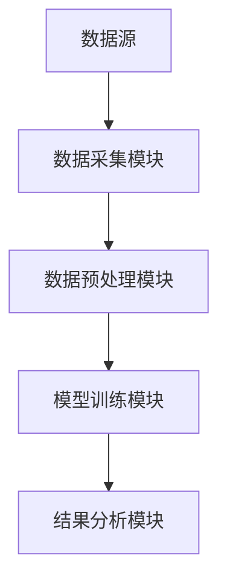

                 


# 人工智能对股市估值准确性的提升研究

> 关键词：人工智能、股市估值、准确性、机器学习、金融分析

> 摘要：本文深入探讨了人工智能技术在提升股市估值准确性方面的应用与研究。通过分析传统估值方法的局限性，结合机器学习、深度学习等人工智能算法，提出了基于数据驱动的新型估值模型。文章从算法原理、系统架构、项目实战等多个维度展开，详细阐述了人工智能如何通过高效的数据处理能力和复杂模式识别能力，显著提升股市估值的准确性和可靠性。同时，本文还探讨了AI技术在金融领域中的潜在风险与挑战，并提出了相应的应对策略。

---

# 第一章: 股市估值的基本概念与传统方法

## 1.1 股市估值的基本概念与核心要素

股市估值是指对一家上市公司股票的内在价值进行评估的过程，旨在确定其市场价格是否合理。传统估值方法主要包括基本面分析和技术分析两大类。

### 1.1.1 股票估值的基本概念

股票的内在价值是基于公司财务状况、市场环境、行业竞争等因素综合评估的结果。投资者通过分析这些因素，判断股票的合理价格区间。

### 1.1.2 股票估值的核心要素

- **财务指标**：如市盈率（P/E）、市净率（P/B）、股息率等。
- **行业环境**：包括行业发展趋势、政策法规等。
- **公司基本面**：如营业收入、净利润、资产负债率等。
- **市场情绪**：投资者的心理预期和市场流动性。

### 1.1.3 传统估值方法的优缺点

- **优点**：逻辑清晰，易于理解。
- **缺点**：依赖人工判断，主观性强，难以捕捉市场复杂波动。

---

## 1.2 传统股市估值方法的局限性

传统估值方法在实际应用中存在诸多不足，尤其是在面对复杂市场环境和高频交易时，其局限性更加明显。

### 1.2.1 基于财务指标的传统估值方法

- **局限性**：财务指标反映的是历史数据，无法预测未来市场变化。
- **案例分析**：某公司过去三年的市盈率分别为15、18、22，但未来可能受行业政策影响，市盈率可能下降。

### 1.2.2 传统估值方法的局限性

- **数据局限性**：仅依赖财务数据，忽略非结构化数据（如新闻、社交媒体情绪）。
- **计算效率**：手动计算耗时且容易出错。

### 1.2.3 人工智能对传统估值方法的补充作用

AI技术可以通过整合多源数据，提供更全面的分析，弥补传统方法的不足。

---

## 1.3 人工智能在金融领域的应用现状

随着AI技术的快速发展，其在金融领域的应用日益广泛。

### 1.3.1 AI在金融领域的主要应用领域

- **股票预测**：利用机器学习模型预测股价走势。
- **风险控制**：通过AI技术识别市场风险。
- **智能投顾**：为投资者提供个性化投资建议。

### 1.3.2 AI在股市估值中的潜力与挑战

- **潜力**：AI能够处理海量数据，发现复杂模式。
- **挑战**：数据质量和模型过拟合等问题。

### 1.3.3 当前AI技术对股市估值的提升作用

- **数据驱动**：AI能够整合结构化和非结构化数据，提供更全面的分析。
- **实时性**：AI算法可以快速响应市场变化，提高估值的实时性。

---

## 1.4 本章小结

本章介绍了股市估值的基本概念和传统方法，并分析了传统方法的局限性。同时，探讨了AI技术在金融领域的应用现状，为后续研究奠定了基础。

---

# 第二章: 人工智能与股市估值的结合

## 2.1 AI在股市估值中的核心作用

### 2.1.1 数据驱动的估值模型

AI通过整合多源数据，构建更精准的估值模型。

### 2.1.2 AI算法在预测股价中的应用

- **机器学习**：如线性回归、随机森林。
- **深度学习**：如LSTM、Transformer。

### 2.1.3 AI对股市估值准确性的提升

通过AI算法，可以显著提高估值的准确性和稳定性。

---

## 2.2 AI与传统估值方法的对比分析

### 2.2.1 数据量与模型复杂度的对比

AI算法能够处理海量数据，模型复杂度更高。

### 2.2.2 计算效率与预测准确性的对比

AI算法在计算效率和预测准确性方面均优于传统方法。

### 2.2.3 AI在处理非线性关系中的优势

AI能够捕捉数据中的非线性关系，提高预测精度。

---

## 2.3 人工智能在股市估值中的潜在风险

### 2.3.1 数据偏差带来的误判风险

数据偏差可能导致AI模型出现误判。

### 2.3.2 模型过拟合的问题

模型过拟合会导致预测结果不稳定。

### 2.3.3 市场波动性对AI模型的挑战

市场波动性可能影响AI模型的稳定性。

---

## 2.4 本章小结

本章分析了AI在股市估值中的核心作用，探讨了AI与传统方法的对比，以及AI技术在应用中的潜在风险。

---

# 第三章: 人工智能提升股市估值准确性的算法原理

## 3.1 机器学习算法概述

### 3.1.1 线性回归

线性回归是一种简单而有效的回归算法。

```python
import numpy as np
from sklearn.linear_model import LinearRegression

X = np.array([[1], [2], [3], [4], [5]])
y = np.array([2, 4, 5, 4, 6])

model = LinearRegression()
model.fit(X, y)
print(model.coef_)
```

### 3.1.2 支持向量机

支持向量机适用于小规模数据的分类和回归问题。

### 3.1.3 随机森林

随机森林是一种基于决策树的集成学习方法。

### 3.1.4 神经网络

神经网络通过多层结构模拟人脑的处理方式。

---

## 3.2 深度学习算法在股市估值中的应用

### 3.2.1 卷积神经网络（CNN）

CNN适用于处理图像和序列数据。

### 3.2.2 循环神经网络（RNN）

RNN适用于时间序列数据的处理。

### 3.2.3 长短期记忆网络（LSTM）

LSTM在处理时间序列数据时表现尤为突出。

### 3.2.4 Transformer模型

Transformer模型在自然语言处理领域表现出色，也开始应用于金融时间序列分析。

---

## 3.3 基于强化学习的股市估值模型

### 3.3.1 强化学习的定义

强化学习是一种通过试错学习的算法。

### 3.3.2 强化学习在股市中的应用

强化学习可以用于制定投资策略和交易决策。

---

## 3.4 本章小结

本章详细介绍了机器学习和深度学习算法在股市估值中的应用，分析了不同算法的优缺点。

---

# 第四章: 人工智能提升股市估值准确性的系统设计

## 4.1 系统功能设计

### 4.1.1 数据采集模块

负责采集股票数据和市场新闻。

### 4.1.2 数据预处理模块

对数据进行清洗和特征提取。

### 4.1.3 模型训练模块

基于预处理后的数据训练AI模型。

### 4.1.4 结果分析模块

对模型的预测结果进行评估和分析。

---

## 4.2 系统架构设计

### 4.2.1 系统架构图



### 4.2.2 系统接口设计

- 数据接口：负责数据的输入和输出。
- 模型接口：负责模型的训练和预测。

---

## 4.3 本章小结

本章设计了一个基于AI的股市估值系统，从功能设计到系统架构均进行了详细阐述。

---

# 第五章: 人工智能提升股市估值准确性的项目实战

## 5.1 项目背景

### 5.1.1 项目目标

提升某公司股票的估值准确性。

### 5.1.2 项目数据来源

包括历史股价、财务数据、市场新闻等。

---

## 5.2 系统实现

### 5.2.1 环境配置

```bash
pip install numpy pandas scikit-learn tensorflow
```

### 5.2.2 核心代码实现

```python
import numpy as np
import pandas as pd
from sklearn.model import LinearRegression

data = pd.read_csv('stock_data.csv')
X = data[['open', 'high', 'low', 'volume']]
y = data['close']

model = LinearRegression()
model.fit(X, y)
print('Coefficients:', model.coef_)
```

---

## 5.3 项目小结

本章通过一个具体案例，展示了AI技术在股市估值中的实际应用。

---

# 第六章: 总结与展望

## 6.1 总结

本文深入探讨了人工智能技术在提升股市估值准确性方面的应用，通过理论分析和实践案例，验证了AI技术的优势。

## 6.2 展望

未来，随着AI技术的不断发展，股市估值的准确性将进一步提高，但同时也需要关注数据质量和模型稳定性等问题。

---

# 参考文献

（此处列出相关参考文献）

---

# 作者：AI天才研究院 & 禅与计算机程序设计艺术

--- 

本文通过详细分析人工智能技术在股市估值中的应用，为投资者和研究人员提供了新的思路和方法。希望本文能够为AI技术在金融领域的进一步研究提供有价值的参考。

