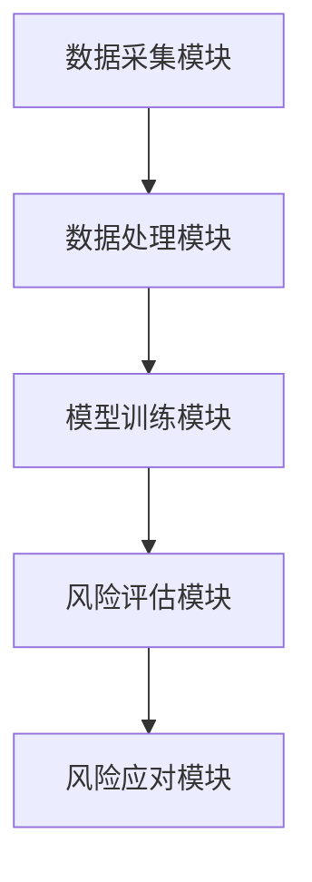
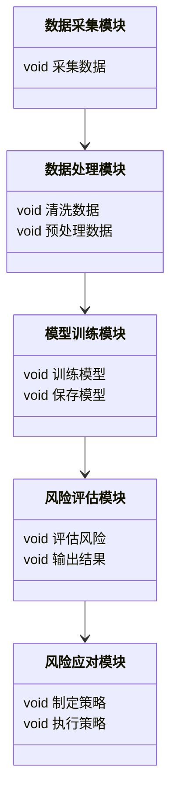
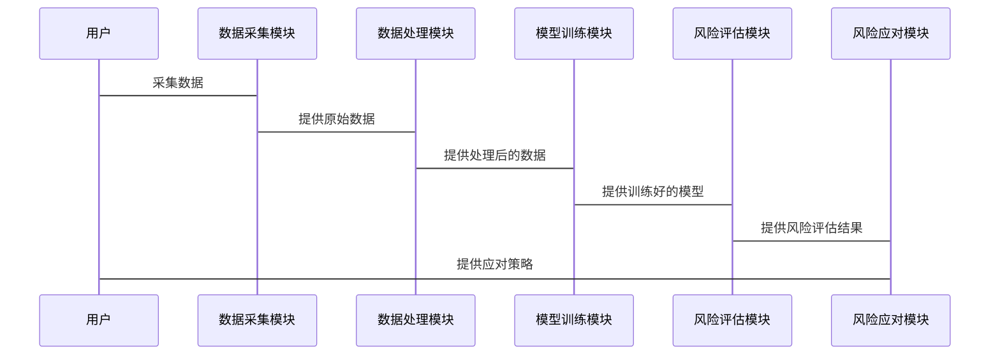

                 


# 人工智能辅助的风险管理系统设计

> **关键词**: 人工智能, 风险管理, 系统设计, 算法原理, 项目实战

> **摘要**: 本文探讨了人工智能在风险管理中的应用，从核心概念到算法原理，再到系统架构和项目实战，详细分析了如何利用AI技术提升风险管理的效率和准确性。文章通过具体案例展示了AI在风险管理中的实际应用，帮助读者理解如何设计和实现一个高效的AI辅助风险管理系统。

---

# 第1章: 风险管理与人工智能的结合

## 1.1 风险管理的基本概念

### 1.1.1 风险的定义与分类

**风险**是指在特定条件下，某一事件可能发生的概率及其可能带来的损失或收益。根据不同的应用场景，风险可以分为以下几类：

1. **市场风险**: 由于市场波动导致的资产损失风险。
2. **信用风险**: 由于债务人或交易对手违约导致的损失风险。
3. **操作风险**: 由于内部操作失误或外部事件导致的损失风险。
4. **流动性风险**: 由于资产无法迅速变现而导致的流动性不足风险。
5. **声誉风险**: 由于企业声誉受损导致的潜在损失风险。

### 1.1.2 风险管理的目标与流程

**风险管理的目标**是通过识别、评估和应对风险，降低潜在损失，确保组织的稳健运行。风险管理的流程通常包括以下几个步骤：

1. **风险识别**: 确定可能影响组织的所有潜在风险。
2. **风险评估**: 分析风险的发生概率和影响程度。
3. **风险应对**: 制定并实施应对策略，降低风险发生的可能性或影响。
4. **风险监控**: 持续监控风险的变化，并根据需要调整应对策略。

### 1.1.3 传统风险管理的局限性

传统的风险管理方法通常依赖于人工分析和经验判断，存在以下局限性：

1. **效率低**: 需要手动收集和分析大量数据，耗时且效率低。
2. **主观性高**: 风险评估结果可能受到主观因素的影响，缺乏客观性。
3. **覆盖范围有限**: 传统方法难以应对复杂多变的市场环境，覆盖范围有限。
4. **响应速度慢**: 在风险发生时，传统方法难以快速做出反应。

## 1.2 人工智能在风险管理中的作用

### 1.2.1 AI技术如何赋能风险管理

人工智能（AI）技术通过以下方式赋能风险管理：

1. **数据驱动的决策**: AI能够从海量数据中提取有价值的信息，帮助组织做出更科学的决策。
2. **实时监控与预警**: AI可以实时监控风险因素的变化，并及时发出预警。
3. **自动化处理**: AI能够自动识别和分类风险，减少人工干预，提高效率。
4. **预测与模拟**: AI可以通过历史数据和机器学习模型，预测未来可能出现的风险，并模拟不同应对策略的效果。

### 1.2.2 AI在风险识别、评估与应对中的应用

1. **风险识别**: AI可以通过自然语言处理（NLP）技术分析文本数据，识别潜在风险。
2. **风险评估**: AI可以利用机器学习模型对风险进行量化评估，预测风险的发生概率和影响程度。
3. **风险应对**: AI可以基于评估结果，推荐最优的应对策略，帮助组织做出决策。

### 1.2.3 人工智能辅助风险管理的优势与挑战

**优势**:
- **高效性**: AI能够快速处理大量数据，提高风险管理的效率。
- **准确性**: AI通过数据驱动的方法，可以更准确地识别和评估风险。
- **智能化**: AI能够根据实时数据动态调整风险管理策略。

**挑战**:
- **数据质量**: AI算法对数据质量要求较高，数据不足或不准确会影响模型的效果。
- **模型解释性**: 复杂的AI模型（如深度学习模型）通常缺乏可解释性，难以被业务人员理解和信任。
- **技术门槛**: AI技术的应用需要专业人员的支持，对中小型企业来说可能是一个挑战。

## 1.3 人工智能辅助风险管理的现状与趋势

### 1.3.1 当前AI在风险管理中的应用案例

1. **金融行业**: 利用AI技术进行信用评估、市场预测和欺诈检测。
2. **企业运营**: 通过AI实时监控供应链风险、操作风险。
3. **网络安全**: 利用AI识别潜在的安全威胁，预测网络安全风险。

### 1.3.2 未来风险管理的发展方向

1. **智能化**: 风险管理将更加依赖AI技术，实现从数据收集到决策的全自动化。
2. **实时化**: 随着AI技术的进步，风险管理将更加注重实时监控和动态调整。
3. **协同化**: AI将与人类专家协同工作，结合人类的判断力和AI的数据处理能力，提高风险管理的效果。

### 1.3.3 技术进步对风险管理的影响

AI技术的进步将推动风险管理向着更高效、更精准的方向发展。未来的风险管理将更加依赖数据驱动的方法，同时结合人类的智慧，实现人机协同的管理模式。

## 1.4 本章小结

本章介绍了人工智能在风险管理中的作用，分析了传统风险管理的局限性，探讨了AI技术如何赋能风险管理。通过具体案例展示了AI在风险管理中的实际应用，并总结了当前的风险管理现状与未来的发展趋势。

---

# 第2章: 风险管理的核心要素与AI结合原理

## 2.1 风险识别的核心要素

### 2.1.1 风险来源的分析

风险来源可以分为内部风险和外部风险：

1. **内部风险**: 包括操作失误、员工失误等。
2. **外部风险**: 包括市场波动、政策变化等。

### 2.1.2 风险识别的关键步骤

1. **数据收集**: 收集与风险相关的数据，包括历史数据和实时数据。
2. **数据清洗**: 对收集到的数据进行清洗，去除噪声数据。
3. **特征提取**: 从数据中提取有助于识别风险的关键特征。
4. **风险识别**: 利用AI算法对风险进行识别和分类。

### 2.1.3 数据采集与处理方法

**数据采集方法**:
- **结构化数据**: 如数据库中的交易数据。
- **非结构化数据**: 如文本数据、图像数据。

**数据处理方法**:
- **数据清洗**: 去除重复、错误或无效的数据。
- **数据转换**: 将数据转换为适合模型输入的格式。
- **数据增强**: 对数据进行增强处理，提高模型的泛化能力。

## 2.2 风险评估的核心要素

### 2.2.1 风险概率与影响分析

**风险概率**: 风险发生的可能性大小。
**风险影响**: 风险发生后可能带来的损失或影响。

### 2.2.2 风险评估模型的构建

**模型构建步骤**:
1. 确定模型输入特征。
2. 选择合适的机器学习算法。
3. 训练模型并进行验证。
4. 部署模型并进行实时监控。

### 2.2.3 数据分析与特征提取

**数据分析方法**:
- **描述性分析**: 通过统计方法分析数据的分布情况。
- **预测性分析**: 利用机器学习模型预测风险。

**特征提取方法**:
- **传统特征提取**: 如主成分分析（PCA）。
- **自动特征提取**: 如深度学习模型中的自动编码器（Autoencoder）。

## 2.3 风险应对策略的核心要素

### 2.3.1 风险缓解与转移策略

**风险缓解**: 通过降低风险发生的概率或影响来减少风险。
**风险转移**: 将风险转移给第三方，如购买保险。

### 2.3.2 风险应对的动态调整

根据风险的变化情况，动态调整应对策略，确保风险管理的有效性。

### 2.3.3 应急预案的制定与执行

**应急预案**: 预先制定的应对策略，确保在风险发生时能够快速响应。

**预案执行**: 在风险发生时，按照应急预案进行应对。

## 2.4 AI在风险管理核心要素中的应用

### 2.4.1 数据驱动的风险识别

利用AI技术从海量数据中提取关键特征，实现数据驱动的风险识别。

### 2.4.2 智能化风险评估模型

通过机器学习算法构建智能化风险评估模型，提高风险评估的准确性和效率。

### 2.4.3 自适应风险应对策略

利用AI技术动态调整风险应对策略，确保风险管理的灵活性和高效性。

## 2.5 本章小结

本章详细分析了风险管理的核心要素，包括风险识别、风险评估和风险应对。同时，探讨了AI技术在这些核心要素中的应用，展示了如何利用AI技术提升风险管理的效率和准确性。

---

# 第3章: 人工智能辅助风险管理的算法原理

## 3.1 机器学习算法在风险管理中的应用

### 3.1.1 监督学习算法（如决策树、随机森林）

**决策树**: 通过构建树状结构，对数据进行分类和回归。
**随机森林**: 通过构建多个决策树，提高模型的准确性和鲁棒性。

### 3.1.2 无监督学习算法（如聚类分析）

**聚类分析**: 将相似的数据点聚集成簇，发现潜在的风险群。

### 3.1.3 强化学习算法的应用场景

**强化学习**: 通过与环境的交互，学习最优策略，应用于风险应对策略的选择。

## 3.2 深度学习算法在风险管理中的应用

### 3.2.1 神经网络在风险预测中的应用

**神经网络**: 通过多层感知机（MLP）对风险进行预测。

### 3.2.2 卷积神经网络（CNN）的应用

**CNN**: 用于处理图像数据，如金融市场的K线图分析。

### 3.2.3 循环神经网络（RNN）的应用

**RNN**: 用于处理时间序列数据，如股票价格预测。

## 3.3 算法实现与案例分析

### 3.3.1 风险分类的机器学习实现

```python
# 使用决策树进行风险分类的示例代码
from sklearn.tree import DecisionTreeClassifier
from sklearn.model_selection import train_test_split
import pandas as pd

# 数据加载与预处理
data = pd.read_csv('risk_data.csv')
X = data.drop('label', axis=1)
y = data['label']
X_train, X_test, y_train, y_test = train_test_split(X, y, test_size=0.2, random_state=42)

# 模型训练
model = DecisionTreeClassifier()
model.fit(X_train, y_train)

# 模型预测
y_pred = model.predict(X_test)

# 模型评估
print("Accuracy:", accuracy_score(y_test, y_pred))
print("Confusion Matrix:", confusion_matrix(y_test, y_pred))
```

### 3.3.2 风险预测的深度学习实现

```python
# 使用Keras构建神经网络模型进行风险预测
import keras
from keras.models import Sequential
from keras.layers import Dense

# 模型构建
model = Sequential()
model.add(Dense(64, activation='relu', input_dim=X_train.shape[1]))
model.add(Dense(32, activation='relu'))
model.add(Dense(1, activation='sigmoid'))

model.compile(optimizer='adam', loss='binary_crossentropy', metrics=['accuracy'])

# 模型训练
model.fit(X_train, y_train, epochs=10, batch_size=32, validation_data=(X_test, y_test))
```

## 3.4 本章小结

本章详细介绍了机器学习和深度学习算法在风险管理中的应用，通过具体案例展示了如何利用这些算法进行风险分类和预测。同时，给出了相应的Python代码实现，帮助读者理解算法的实现过程。

---

# 第4章: 人工智能辅助风险管理的系统架构设计

## 4.1 系统功能设计

### 4.1.1 系统功能模块划分

1. **数据采集模块**: 负责采集与风险相关的数据。
2. **数据处理模块**: 对数据进行清洗和预处理。
3. **模型训练模块**: 利用机器学习算法训练风险模型。
4. **风险评估模块**: 基于训练好的模型进行风险评估。
5. **风险应对模块**: 根据评估结果制定和执行应对策略。

### 4.1.2 系统功能流程图



## 4.2 系统架构设计

### 4.2.1 系统架构图



## 4.3 系统接口设计

### 4.3.1 系统接口设计

1. **数据接口**: 提供数据的输入和输出接口。
2. **模型接口**: 提供模型的训练和预测接口。
3. **用户接口**: 提供用户与系统的交互界面。

### 4.3.2 系统交互流程图



## 4.4 本章小结

本章详细设计了人工智能辅助风险管理系统的架构，包括功能模块划分、系统架构图和系统接口设计。通过mermaid图表展示了系统的整体结构和交互流程，为后续的系统实现提供了清晰的指导。

---

# 第5章: 人工智能辅助风险管理的项目实战

## 5.1 项目背景与目标

### 5.1.1 项目背景

本项目旨在利用人工智能技术，构建一个智能化的风险管理系统，帮助组织更好地识别、评估和应对风险。

### 5.1.2 项目目标

1. 实现风险数据的采集与处理。
2. 构建风险分类和预测模型。
3. 实现风险评估与应对策略的自动化。

## 5.2 系统核心实现

### 5.2.1 环境配置

```python
# 安装所需的依赖库
pip install pandas scikit-learn keras tensorflow
```

### 5.2.2 核心代码实现

```python
# 风险分类模型的实现
from sklearn.ensemble import RandomForestClassifier
from sklearn.metrics import accuracy_score
from sklearn.model_selection import train_test_split
import pandas as pd

# 数据加载与预处理
data = pd.read_csv('risk_data.csv')
X = data.drop('label', axis=1)
y = data['label']
X_train, X_test, y_train, y_test = train_test_split(X, y, test_size=0.2, random_state=42)

# 模型训练
model = RandomForestClassifier()
model.fit(X_train, y_train)

# 模型预测
y_pred = model.predict(X_test)

# 模型评估
print("Accuracy:", accuracy_score(y_test, y_pred))
print("Confusion Matrix:", confusion_matrix(y_test, y_pred))
```

### 5.2.3 代码解读与分析

1. **数据加载与预处理**: 使用pandas库加载数据，并进行数据的清洗和预处理。
2. **模型训练**: 使用随机森林算法训练风险分类模型。
3. **模型预测**: 对测试数据进行预测，并评估模型的准确性和性能。

## 5.3 案例分析

### 5.3.1 实际案例分析

以金融行业为例，利用构建的风险管理系统对股票市场进行风险预测和评估。

### 5.3.2 案例实现与结果展示

通过实际数据的输入和模型的运行，展示风险评估的结果和应对策略。

## 5.4 项目小结

本章通过一个具体的项目案例，展示了如何利用人工智能技术构建一个智能化的风险管理系统。通过实际操作，读者可以掌握从数据处理到模型训练再到系统实现的全过程。

---

# 第6章: 总结与展望

## 6.1 本章总结

本文详细探讨了人工智能在风险管理中的应用，从核心概念到算法原理，再到系统架构和项目实战，全面分析了如何利用AI技术提升风险管理的效率和准确性。通过具体案例展示了AI在风险管理中的实际应用，帮助读者理解如何设计和实现一个高效的AI辅助风险管理系统。

## 6.2 未来展望

随着AI技术的不断发展，风险管理将更加智能化和自动化。未来的风险管理将更加依赖数据驱动的方法，同时结合人类的智慧，实现人机协同的管理模式。AI技术的应用将推动风险管理向着更高效、更精准的方向发展。

## 6.3 最佳实践 tips

1. 在实际应用中，建议结合具体业务场景选择合适的AI算法。
2. 数据质量是AI模型性能的关键，需要高度重视数据的清洗和预处理。
3. 在模型部署和应用中，需要注意模型的可解释性和可维护性。

## 6.4 小结

人工智能技术正在深刻改变风险管理的方式，未来的风险管理将更加依赖AI技术。通过本文的探讨，希望读者能够更好地理解AI在风险管理中的应用，并能够将其应用到实际工作中。

---

# 作者：AI天才研究院/AI Genius Institute & 禅与计算机程序设计艺术 /Zen And The Art of Computer Programming

