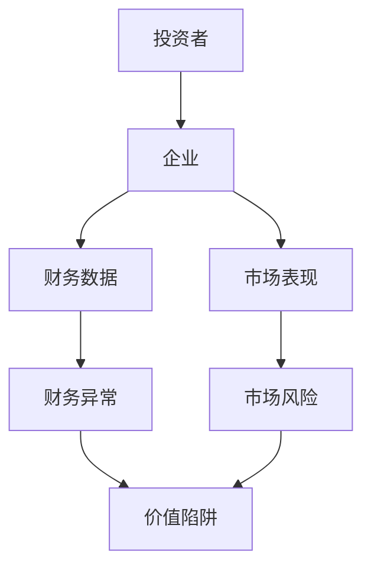
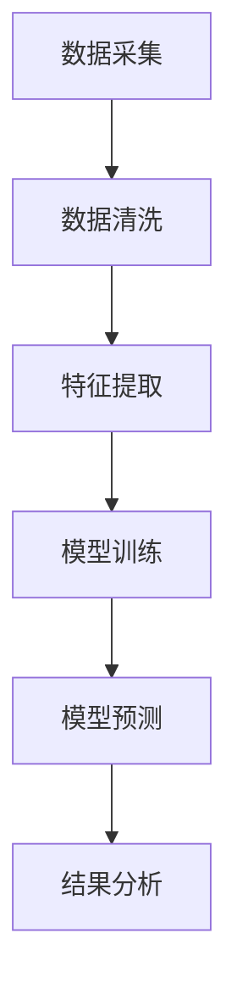
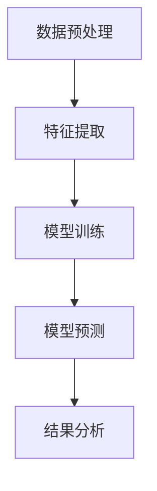
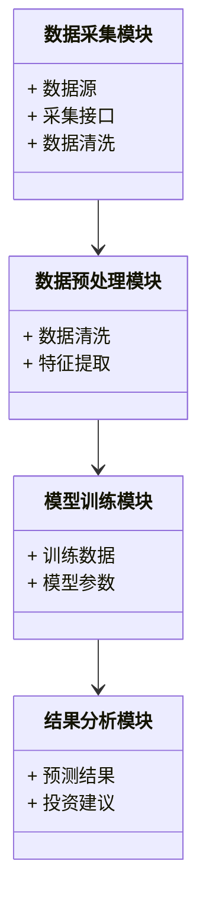
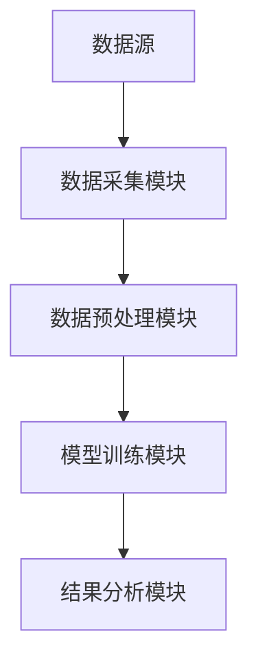

                 


# 人工智能辅助识别价值陷阱

> **关键词**：人工智能，价值陷阱，投资分析，算法原理，系统架构，深度学习，价值识别

> **摘要**：本文探讨了人工智能在识别价值陷阱中的应用，通过分析其核心概念、算法原理、系统架构以及项目实战，详细讲解了如何利用AI技术辅助投资决策，避免价值陷阱带来的风险。

---

## 第1章：价值陷阱的定义与问题背景

### 1.1 价值陷阱的定义与核心概念

#### 1.1.1 价值陷阱的定义与核心概念
价值陷阱是指在投资过程中，投资者可能被表面的高回报所吸引，而忽视了潜在的风险或问题。这种陷阱通常出现在公司财务状况不佳、行业前景不明朗或市场环境变化的情况下。识别价值陷阱需要综合分析多个因素，包括财务数据、市场趋势、公司治理等。

#### 1.1.2 价值陷阱的常见类型
价值陷阱可以分为以下几种类型：
- **财务造假**：公司通过虚报收入、隐藏债务等方式误导投资者。
- **行业衰退**：所在行业面临技术革新或政策变化，导致公司难以持续发展。
- **管理问题**：公司高层决策失误或治理不善，影响企业长期发展。

#### 1.1.3 价值陷阱的识别与分析
识别价值陷阱的关键在于全面分析企业的财务状况、行业地位、管理团队以及市场环境。投资者需要具备敏锐的洞察力和丰富的行业知识，才能有效识别并规避这些陷阱。

---

### 1.2 问题背景与问题描述

#### 1.2.1 价值陷阱的形成原因
价值陷阱的形成通常与市场信息不对称、投资者情绪化决策以及企业内部管理问题有关。在信息爆炸的时代，投资者可能因为获取的信息不全面或不准确，导致误判企业的价值。

#### 1.2.2 价值陷阱对企业与投资者的影响
价值陷阱对企业和投资者都有负面影响。企业可能因财务造假或管理不善而面临退市或破产的风险，投资者则可能因投资决策失误而遭受经济损失。

#### 1.2.3 人工智能在识别价值陷阱中的作用
人工智能通过分析大量的数据，能够帮助投资者快速识别潜在的价值陷阱。AI技术可以对企业的财务数据、市场表现、行业趋势等进行深度挖掘，发现隐藏的问题和风险。

---

### 1.3 问题解决与边界

#### 1.3.1 人工智能如何解决价值陷阱识别问题
人工智能通过机器学习算法，能够从海量数据中提取有用的特征，识别潜在的风险因素。例如，使用自然语言处理技术分析公司财报，识别财务造假的迹象。

#### 1.3.2 价值陷阱识别的边界与外延
价值陷阱识别的边界在于数据的完整性和模型的准确性。如果数据不足或模型设计不合理，可能会导致误判。此外，价值陷阱识别还受到法律法规和市场环境的限制。

#### 1.3.3 人工智能识别价值陷阱的局限性
尽管人工智能在识别价值陷阱方面具有优势，但也存在局限性。例如，模型的泛化能力有限，可能无法应对新的市场环境或突发事件。

---

## 第2章：人工智能与价值陷阱识别的核心概念

### 2.1 人工智能的核心原理

#### 2.1.1 人工智能的基本概念
人工智能是指计算机系统模拟人类智能的能力，包括学习、推理、感知和决策等。在投资领域，人工智能主要用于数据分析、风险评估和投资决策。

#### 2.1.2 人工智能的主要技术与方法
人工智能的主要技术包括机器学习、深度学习、自然语言处理和计算机视觉。这些技术可以帮助投资者分析复杂的市场数据，识别潜在的风险和机会。

#### 2.1.3 人工智能在金融领域的应用
在金融领域，人工智能主要用于股票预测、风险管理、信用评估和投资组合优化。通过AI技术，投资者可以更高效地处理数据，做出更明智的投资决策。

---

### 2.2 价值陷阱识别的关键特征

#### 2.2.1 价值陷阱的特征分析
价值陷阱通常具有以下特征：
- 财务数据异常：如收入与利润不匹配，应收账款激增等。
- 市场表现不佳：如股价持续低迷，成交量萎缩等。
- 管理层问题：如频繁更换高层管理人员，股东纠纷等。

#### 2.2.2 人工智能识别特征的对比分析
人工智能通过机器学习算法，可以识别这些特征，并进行量化分析。与传统的人工分析相比，AI技术具有更高的效率和准确性。

#### 2.2.3 价值陷阱识别的特征表
以下是一个价值陷阱识别的特征表，展示了各个特征的权重和影响：

| 特征         | 权重 | 影响 |
|--------------|------|------|
| 财务数据异常  | 40%  | 高   |
| 市场表现不佳  | 30%  | 中   |
| 管理层问题    | 20%  | 高   |
| 行业风险      | 10%  | 中   |

---

### 2.3 实体关系图与流程图

#### 2.3.1 价值陷阱识别的实体关系图
以下是一个价值陷阱识别的实体关系图，展示了各个实体之间的关系：



#### 2.3.2 人工智能识别价值陷阱的流程图
以下是一个人工智能识别价值陷阱的流程图：



---

## 第3章：人工智能算法在价值陷阱识别中的应用

### 3.1 算法原理概述

#### 3.1.1 人工智能算法的基本原理
人工智能算法通过学习数据中的模式和特征，进行分类、回归或聚类。在价值陷阱识别中，通常使用监督学习算法，如随机森林和深度学习模型。

#### 3.1.2 价值陷阱识别的算法选择
选择算法时需要考虑数据的特性和任务的需求。对于复杂的金融数据，深度学习模型（如LSTM）可能更适合。

#### 3.1.3 常用算法的优缺点分析
以下是一个算法优缺点对比表：

| 算法     | 优点                           | 缺点                           |
|----------|--------------------------------|--------------------------------|
| 随机森林 | 高准确性，易于实现             | 对特征工程依赖较高             |
| LSTM     | 能捕捉时间序列数据中的模式     | 训练时间较长，参数调整复杂       |

---

### 3.2 算法流程图

#### 3.2.1 价值陷阱识别的算法流程图
以下是一个价值陷阱识别的算法流程图：



---

### 3.3 算法实现与数学模型

#### 3.3.1 深度学习模型的实现
以下是一个使用LSTM模型识别价值陷阱的代码示例：

```python
import numpy as np
import pandas as pd
from tensorflow.keras.models import Sequential
from tensorflow.keras.layers import LSTM, Dense

# 数据预处理
data = pd.read_csv('financial_data.csv')
X = data[['收入', '利润', '应收账款']]
y = data['是否价值陷阱']

# 数据标准化
from sklearn.preprocessing import StandardScaler
scaler = StandardScaler()
X_scaled = scaler.fit_transform(X)

# 构建模型
model = Sequential()
model.add(LSTM(64, input_shape=(None, 3)))
model.add(Dense(1, activation='sigmoid'))

model.compile(loss='binary_crossentropy', optimizer='adam', metrics=['accuracy'])

# 训练模型
model.fit(X_scaled, y, epochs=10, batch_size=32)
```

#### 3.3.2 数学模型与公式
LSTM模型的数学公式如下：

$$
f(t) = \text{LSTM}(x_t, h_{t-1}, c_{t-1})
$$

其中，$x_t$ 是输入数据，$h_{t-1}$ 和 $c_{t-1}$ 是前一时刻的隐藏状态和单元状态。

---

## 第4章：系统分析与架构设计方案

### 4.1 系统功能设计

#### 4.1.1 系统功能模块
价值陷阱识别系统主要包括以下功能模块：
- 数据采集模块：从数据库或网络获取企业财务数据和市场数据。
- 数据预处理模块：清洗数据，处理缺失值和异常值。
- 特征提取模块：从数据中提取有用的特征，如收入增长率、利润波动率等。
- 模型训练模块：使用机器学习算法训练模型，识别价值陷阱。
- 结果分析模块：输出模型预测结果，并提供投资建议。

#### 4.1.2 系统功能模块的Mermaid类图
以下是一个系统功能模块的类图：



---

### 4.2 系统架构设计

#### 4.2.1 系统架构图
以下是一个价值陷阱识别系统的架构图：



---

## 第5章：项目实战

### 5.1 项目环境安装与数据采集

#### 5.1.1 项目环境安装
安装所需的库：

```bash
pip install numpy pandas scikit-learn tensorflow
```

#### 5.1.2 数据采集
从CSV文件中读取数据：

```python
import pandas as pd
data = pd.read_csv('financial_data.csv')
```

---

### 5.2 系统核心实现

#### 5.2.1 特征提取与模型训练
对数据进行特征提取，并训练模型：

```python
from sklearn.ensemble import RandomForestClassifier

model = RandomForestClassifier()
model.fit(X_train, y_train)
```

#### 5.2.2 模型评估与优化
评估模型的性能，并进行优化：

```python
from sklearn.metrics import accuracy_score

y_pred = model.predict(X_test)
print(accuracy_score(y_test, y_pred))
```

---

### 5.3 项目小结

通过本项目，我们成功地利用人工智能技术识别了价值陷阱，并为投资者提供了有效的投资建议。未来，可以通过优化模型和增加更多的特征来进一步提高识别的准确性。

---

## 第6章：最佳实践

### 6.1 小结与总结

人工智能在识别价值陷阱方面具有巨大的潜力。通过合理选择算法和优化模型，投资者可以更有效地识别潜在的风险，并做出更明智的投资决策。

### 6.2 注意事项与建议

- 在使用人工智能进行投资决策时，需要结合市场环境和行业趋势，避免过度依赖模型。
- 定期更新模型和数据，以适应市场变化。
- 注意数据的完整性和准确性，确保模型的可靠性。

### 6.3 拓展阅读与学习方向

- 深度学习在金融领域的应用
- 自然语言处理在投资分析中的应用
- 时间序列分析与预测

---

## 作者信息

**作者：AI天才研究院/AI Genius Institute & 禅与计算机程序设计艺术/Zen And The Art of Computer Programming**

---

通过以上思考和分析，我们系统地探讨了人工智能在识别价值陷阱中的应用，从理论到实践，为投资者提供了有效的工具和方法，帮助他们在复杂多变的市场中做出明智的投资决策。

