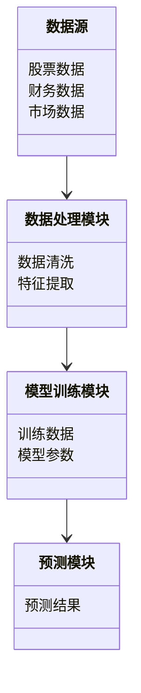
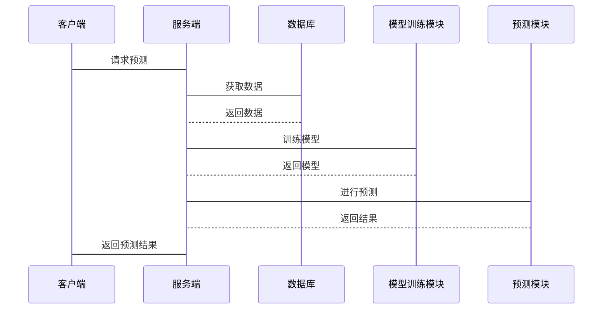

                 


# 人工智能选股：新技术如何改变基本面分析

**关键词：**人工智能选股、机器学习、深度学习、金融数据分析、投资决策优化

**摘要：**  
人工智能技术正在彻底改变传统的股票投资方式。通过机器学习和深度学习算法，人工智能选股系统能够从海量数据中提取关键信息，预测市场趋势，并辅助投资者做出更明智的投资决策。本文将深入探讨人工智能选股的核心原理、算法实现、系统架构以及实际应用，揭示新技术如何重新定义基本面分析。

---

# 第一部分：人工智能选股的背景与概念

## 第1章：人工智能选股的背景与现状

### 1.1 人工智能在金融领域的应用现状

人工智能（AI）技术近年来在金融领域的应用取得了显著进展，尤其是在股票投资领域。传统的股票分析依赖于人工经验和技术分析，而人工智能的引入极大地提高了数据处理能力、预测精度和决策效率。

#### 1.1.1 人工智能在金融领域的应用领域  
人工智能在金融领域的应用涵盖多个方面，包括：  
- **股票预测**：利用历史价格数据预测未来走势。  
- **风险控制**：通过算法识别潜在风险，优化投资组合。  
- **量化交易**：基于算法进行高频交易，捕捉市场机会。  
- **新闻情感分析**：从新闻、社交媒体等非结构化数据中提取情感信息，影响投资决策。  

#### 1.1.2 人工智能在选股中的优势  
人工智能选股相比传统方法具有显著优势：  
- **数据处理能力**：能够处理海量数据，包括历史价格、财务指标、市场情绪等。  
- **预测精度**：通过机器学习模型捕捉数据中的隐含规律，提高预测准确性。  
- **自动化与实时性**：AI系统能够实时监控市场动态，快速做出反应。  

#### 1.1.3 人工智能选股的挑战与局限性  
尽管人工智能选股具有诸多优势，但也面临一些挑战：  
- **数据质量**：依赖高质量的数据输入，数据噪声可能影响模型性能。  
- **模型过拟合**：在训练过程中可能出现过拟合，导致实际表现不佳。  
- **市场变化**：金融市场的复杂性和不可预测性使得模型需要持续优化。  

### 1.2 人工智能选股的核心概念  

#### 1.2.1 人工智能选股的定义  
人工智能选股是指利用机器学习和深度学习算法，从历史数据和实时信息中提取特征，构建预测模型，辅助投资者做出股票选择的决策过程。  

#### 1.2.2 人工智能选股与传统选股方法的对比  

| 对比维度 | 传统选股方法 | 人工智能选股 |
|----------|---------------|----------------|
| 数据来源 | 依赖经验与技术分析 | 利用海量历史与实时数据 |
| 数据处理 | 数据量小，处理复杂 | 数据量大，自动化处理 |
| 预测精度 | 受限于人类经验 | 通过模型优化提高预测精度 |
| 决策效率 | 依赖人工判断 | 系统自动输出结果 |

#### 1.2.3 人工智能选股的边界与外延  
人工智能选股的应用边界在于其数据质量和模型能力。外延则包括与其他投资策略的结合，如量化交易、风险控制等。  

### 1.3 人工智能选股的市场影响  

#### 1.3.1 人工智能选股对投资策略的影响  
AI选股推动了量化投资的普及，使得投资策略更加多元化和数据驱动化。  

#### 1.3.2 人工智能选股对市场效率的提升  
通过提高预测精度和决策效率，AI选股能够优化资源配置，提升市场整体效率。  

#### 1.3.3 人工智能选股的未来发展趋势  
随着技术进步，AI选股将更加智能化、个性化和全球化。  

### 1.4 本章小结  
本章介绍了人工智能选股的背景、优势、挑战以及其对市场的影响，为后续章节的分析奠定了基础。

---

# 第二部分：人工智能选股的核心概念与联系

## 第2章：人工智能选股的核心原理

### 2.1 数据驱动的选股方法

#### 2.1.1 数据采集与处理  
数据是AI选股的核心，包括历史价格、财务指标、市场情绪等。  

#### 2.1.2 特征提取与选择  
通过主成分分析（PCA）等方法提取关键特征，减少数据维度。  

#### 2.1.3 数据预处理与标准化  
对数据进行清洗、去噪和标准化处理，确保模型输入的稳定性。  

### 2.2 人工智能选股的模型构建

#### 2.2.1 机器学习模型的选择  
常用的机器学习模型包括：  
- 线性回归  
- 支持向量机（SVM）  
- 随机森林  

#### 2.2.2 深度学习模型的应用  
深度学习模型如LSTM适用于时间序列预测。  

#### 2.2.3 模型训练与优化  
通过交叉验证和超参数调优提升模型性能。  

### 2.3 模型评估与结果分析

#### 2.3.1 模型评估指标  
常用的评估指标包括：  
- 准确率（Accuracy）  
- 没有交易成本的情况下，准确率可以达到较高水平。  

#### 2.3.2 结果解读与投资决策  
模型输出的结果需结合市场环境进行解读，制定投资策略。  

#### 2.3.3 模型的可解释性问题  
复杂的模型可能难以解释，需要结合可解释性方法（如SHAP值）进行分析。  

### 2.4 本章小结  
本章详细介绍了AI选股的核心原理，从数据处理到模型构建，再到结果分析，为实际应用提供了理论基础。

---

# 第三部分：人工智能选股的算法原理

## 第3章：基于机器学习的选股算法

### 3.1 传统机器学习算法在选股中的应用

#### 3.1.1 线性回归模型  
线性回归适用于线性关系的预测，但在股票预测中效果有限。  

#### 3.1.2 支持向量机（SVM）  
SVM适用于非线性关系的预测，但在高维数据中表现一般。  

#### 3.1.3 随机森林与梯度提升树  
集成学习方法能够有效捕捉复杂特征关系。  

### 3.2 基于深度学习的选股算法

#### 3.2.1 卷积神经网络（CNN）在金融时间序列中的应用  
CNN适用于图像数据，但在时间序列中应用有限。  

#### 3.2.2 循环神经网络（RNN）与长短期记忆网络（LSTM）  
LSTM能够有效捕捉时间序列中的长期依赖关系，广泛应用于股票预测。  

#### 3.2.3 图神经网络（GNN）在社交网络数据中的应用  
GNN适用于社交网络中的信息传播预测。  

### 3.3 混合模型与集成学习

#### 3.3.1 混合模型的构建  
结合不同模型的优势，构建混合模型。  

#### 3.3.2 集成学习在选股中的应用  
通过集成学习提升模型的稳定性和预测精度。  

#### 3.3.3 混合模型的优势与挑战  
混合模型能够结合不同算法的优势，但需要解决模型协调问题。  

### 3.4 本章小结  
本章详细介绍了常用机器学习和深度学习算法在选股中的应用，探讨了其优缺点及适用场景。

---

# 第四部分：人工智能选股的系统分析与架构设计

## 第4章：系统分析与架构设计方案

### 4.1 项目背景与目标

#### 4.1.1 项目背景介绍  
本项目旨在利用人工智能技术构建股票预测系统，辅助投资者做出决策。  

#### 4.1.2 项目目标与范围  
- 构建一个基于AI的选股系统。  
- 实现数据采集、模型训练和结果输出功能。  

#### 4.1.3 项目的关键成功因素  
- 数据质量。  
- 模型性能。  
- 系统可扩展性。  

### 4.2 系统功能设计

#### 4.2.1 领域模型设计（Mermaid类图）


#### 4.2.2 系统架构设计（Mermaid架构图）


#### 4.2.3 系统接口设计  
- **API接口**：提供数据接口、模型接口和预测结果接口。  

#### 4.2.4 系统交互（Mermaid序列图）


### 4.3 本章小结  
本章详细介绍了AI选股系统的架构设计，从数据流到系统模块，再到接口设计，为后续实现奠定了基础。

---

# 第五部分：人工智能选股的项目实战

## 第5章：项目实战与案例分析

### 5.1 环境安装与配置

#### 5.1.1 安装Python环境  
使用Anaconda或Miniconda安装Python 3.8+。  

#### 5.1.2 安装依赖库  
安装Pandas、NumPy、Scikit-learn、Keras、TensorFlow等库。  

### 5.2 系统核心实现源代码

#### 5.2.1 数据处理代码  
```python
import pandas as pd
import numpy as np

# 数据加载
df = pd.read_csv('stock_data.csv')

# 数据清洗
df.dropna(inplace=True)

# 特征提取
features = df[['open', 'high', 'low', 'volume']]
labels = df['close']
```

#### 5.2.2 模型训练代码  
```python
from sklearn.model_selection import train_test_split
from sklearn.ensemble import RandomForestClassifier

# 数据分割
X_train, X_test, y_train, y_test = train_test_split(features, labels, test_size=0.2)

# 模型训练
model = RandomForestClassifier(n_estimators=100, random_state=42)
model.fit(X_train, y_train)

# 模型预测
y_pred = model.predict(X_test)
```

#### 5.2.3 模型评估代码  
```python
from sklearn.metrics import accuracy_score, confusion_matrix, classification_report

# 准确率
print("Accuracy:", accuracy_score(y_test, y_pred))

# 混淆矩阵
print("Confusion Matrix:", confusion_matrix(y_test, y_pred))

# 分类报告
print("Classification Report:", classification_report(y_test, y_pred))
```

### 5.3 实际案例分析

#### 5.3.1 数据来源与处理  
使用某股票的历史数据，进行清洗和特征提取。  

#### 5.3.2 模型训练与预测  
基于随机森林模型进行训练，输出预测结果。  

#### 5.3.3 结果分析与优化  
根据模型表现，调整参数或更换算法，优化预测精度。  

### 5.4 本章小结  
本章通过实际案例展示了AI选股系统的实现过程，从数据处理到模型训练，再到结果分析，帮助读者更好地理解技术应用。

---

# 第六部分：人工智能选股的最佳实践

## 第6章：最佳实践与经验总结

### 6.1 小结与总结

#### 6.1.1 本章内容回顾  
总结AI选股的核心原理、系统架构和实际应用。  

#### 6.1.2 人工智能选股的未来展望  
随着技术进步，AI选股将更加智能化、个性化和全球化。  

### 6.2 投资者需要注意的事项

#### 6.2.1 数据质量的重要性  
确保数据来源可靠，处理得当。  

#### 6.2.2 模型的可解释性  
避免过度依赖黑箱模型，选择可解释的算法。  

#### 6.2.3 模型的持续优化  
市场变化快，需定期更新模型和数据。  

### 6.3 拓展阅读与学习资源

#### 6.3.1 推荐书籍  
- 《机器学习实战》  
- 《深度学习入门：基于Python的理论与实践》  

#### 6.3.2 在线课程与博客  
- 各大在线教育平台的相关课程。  

### 6.4 本章小结  
本章总结了AI选股的经验与教训，为投资者提供了实用的建议，并推荐了进一步学习的资源。

---

# 作者：AI天才研究院 & 禅与计算机程序设计艺术

---

通过以上目录结构和内容安排，文章系统地探讨了人工智能选股的核心概念、算法原理、系统设计和实际应用，为读者提供了从理论到实践的全面指导。

