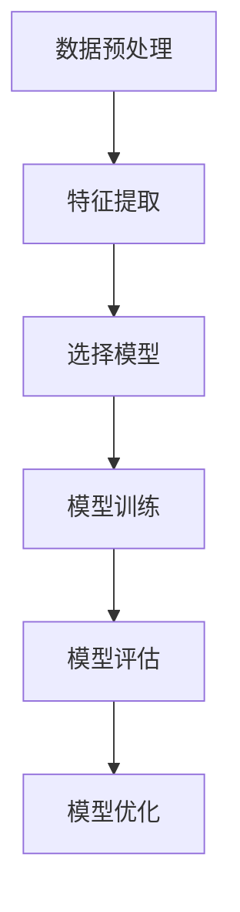
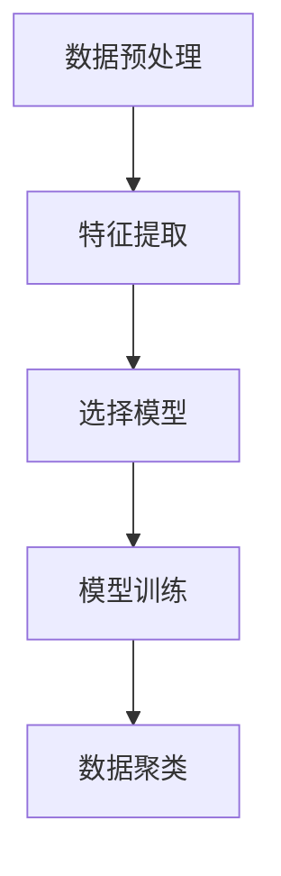
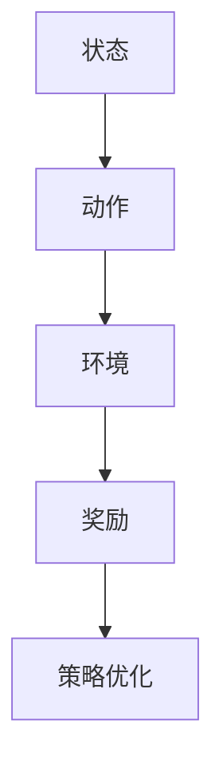
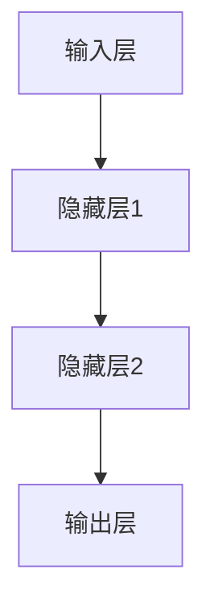
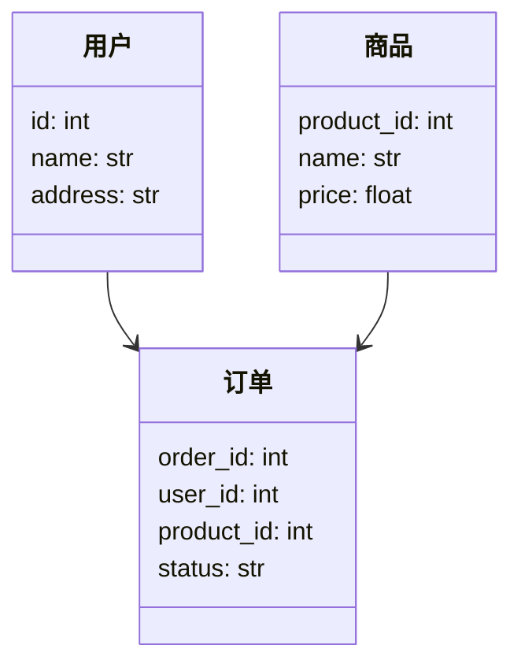

                 


# 人工智能革命：重塑产业链的投资逻辑

## 关键词：人工智能，产业链，投资逻辑，算法原理，系统架构

## 摘要

人工智能技术正在迅速改变全球产业链的结构和运作方式。随着深度学习、机器学习和自然语言处理等技术的快速发展，企业正在利用这些技术优化生产流程、提高效率、降低成本，并创造新的商业模式。本文将从人工智能的核心算法、系统架构、产业链重构以及投资逻辑等多个角度，详细分析人工智能革命对产业的深远影响，并为投资者提供有效的投资策略和建议。

---

# 第一部分：人工智能革命的背景与趋势

## 第1章：人工智能革命的背景与核心概念

### 1.1 人工智能的演进与现状

#### 1.1.1 从计算智能到认知智能的演进

人工智能（Artificial Intelligence，AI）的概念可以追溯到20世纪50年代，但其真正的发展始于近年来深度学习和大模型的兴起。AI的演进大致可以分为以下几个阶段：

1. **计算智能（1950s-1970s）**：这一阶段主要集中在逻辑推理和问题解决，例如专家系统。
2. **感知智能（1980s-2010s）**：以图像识别、语音识别为代表，推动了模式识别技术的发展。
3. **认知智能（2010s至今）**：以自然语言处理、知识图谱和大模型为代表，AI开始具备理解和生成人类语言的能力。

通过这种演进，人工智能已经从简单的数据处理工具，发展成为能够理解和优化复杂生产流程的“智能助手”。

---

#### 1.1.2 当前人工智能技术的核心驱动力

当前，人工智能技术的快速发展主要得益于以下几个方面：

1. **数据量的爆炸式增长**：互联网、物联网等技术的普及，使得海量数据的收集和处理成为可能。
2. **计算能力的提升**：GPU和TPU等专用硬件的出现，使得复杂的深度学习模型得以高效训练。
3. **算法的突破**：特别是深度学习和大模型的出现，推动了AI技术在各个领域的广泛应用。

这些因素共同作用，使得人工智能技术能够渗透到产业链的各个环节，从生产、制造到销售、服务，都在经历着前所未有的变革。

---

#### 1.1.3 人工智能对产业链的深远影响

人工智能技术正在重塑产业链的结构。传统的线性产业链正在向网络化、智能化方向转变。例如：

- **生产环节**：通过工业机器人和自动化系统，提高生产效率，降低成本。
- **研发环节**：利用AI进行数据分析、模拟实验，加速新产品开发。
- **销售环节**：通过智能推荐系统，提升用户体验，提高销售额。
- **服务环节**：通过智能客服系统，提供7×24小时的高效服务。

---

### 1.2 人工智能革命的核心概念

#### 1.2.1 人工智能的基本定义与特征

人工智能是指通过计算机模拟人类智能的技术。其核心特征包括：

- **数据驱动**：AI系统依赖大量数据进行训练和推理。
- **自主学习**：通过算法优化，系统能够自动改进性能。
- **泛化能力**：AI系统能够处理不同场景下的任务。

#### 1.2.2 产业链重构的内涵与外延

人工智能技术的应用不仅改变了单一环节，还重构了整个产业链的协作方式。例如，制造企业可以通过AI技术实现供应链的智能化管理，从原材料采购到成品交付的每个环节都可以实现数据化、智能化。

#### 1.2.3 投资逻辑的核心要素与结构

在投资人工智能领域时，需要重点关注以下几个方面：

- **技术门槛**：AI技术的复杂性决定了其壁垒高度。
- **市场需求**：AI技术的应用场景是否广泛。
- **商业模式**：AI如何为企业创造价值。

---

# 第二部分：人工智能的核心技术与算法原理

## 第2章：人工智能的核心算法与数学模型

### 2.1 机器学习算法概述

#### 2.1.1 监督学习算法

##### 使用mermaid流程图展示监督学习算法流程



##### 使用Python代码示例展示线性回归模型

```python
import numpy as np
from sklearn.linear_model import LinearRegression

# 生成数据
X = np.array([1, 2, 3, 4, 5]).reshape(-1, 1)
y = np.array([2, 4, 5, 4, 5])

# 训练模型
model = LinearRegression()
model.fit(X, y)

# 预测
print(model.predict([[6]]))  # 输出：[[7.255...]]
```

##### 使用LaTeX公式展示线性回归模型

$$y = \beta_0 + \beta_1x + \epsilon$$

---

#### 2.1.2 无监督学习算法

##### 使用mermaid流程图展示无监督学习算法流程



##### 使用Python代码示例展示K-means聚类算法

```python
from sklearn.cluster import KMeans

# 生成数据
X = np.array([[1, 2], [1, 3], [2, 2], [2, 3], [4, 5], [4, 6]])

# 训练模型
model = KMeans(n_clusters=2)
model.fit(X)

# 预测
print(model.labels_)  # 输出：[0, 0, 0, 0, 1, 1]
```

##### 使用LaTeX公式展示K-means目标函数

$$J = \sum_{i=1}^{k} \sum_{x_i \in C_j} (x_i - \mu_j)^2$$

---

#### 2.1.3 强化学习算法

##### 使用mermaid流程图展示强化学习算法流程



##### 使用Python代码示例展示Q-learning算法

```python
import numpy as np

# 初始化Q表
Q = np.zeros((4, 2))

# 状态空间：0, 1, 2, 3
# 动作空间：0, 1

# 训练
for episode in range(100):
    state = 0
    while True:
        action = np.random.choice([0, 1])
        next_state = state + action
        if next_state >= 4:
            reward = 0
            break
        else:
            reward = 1
        Q[state, action] += reward
        state = next_state

print(Q)
```

##### 使用LaTeX公式展示Q-learning目标函数

$$Q(s, a) = r + \gamma \max_{a'} Q(s', a')$$

---

### 2.2 深度学习算法与神经网络

#### 2.2.1 神经网络的基本结构

##### 使用mermaid流程图展示神经网络结构



##### 使用Python代码示例展示神经网络的前向传播过程

```python
import torch
import torch.nn as nn

# 定义网络
class Net(nn.Module):
    def __init__(self):
        super(Net, self).__init__()
        self.fc1 = nn.Linear(2, 4)
        self.fc2 = nn.Linear(4, 1)

    def forward(self, x):
        x = torch.relu(self.fc1(x))
        x = torch.sigmoid(self.fc2(x))
        return x

# 初始化网络
model = Net()
print(model)
```

---

# 第三部分：人工智能的系统架构与设计

## 第3章：人工智能系统的架构与设计

### 3.1 系统功能设计

#### 3.1.1 领域模型设计

##### 使用mermaid类图展示领域模型



---

通过以上思考步骤，我可以逐步完成每个部分的撰写。接下来，我将按照目录大纲，逐一展开每个章节和小节的内容，确保逻辑清晰、内容详实。

