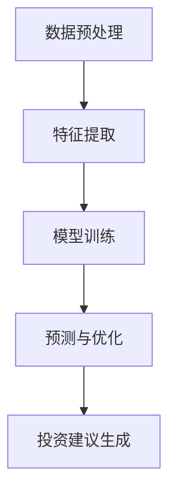

                 


# 人工智能驱动的个性化投资顾问服务

**关键词：** 人工智能、个性化投资、投资顾问、金融技术、算法驱动

**摘要：** 人工智能技术正在迅速改变金融行业的面貌，特别是在投资顾问领域，个性化投资顾问服务的需求日益增长。本文将详细探讨人工智能在个性化投资顾问服务中的应用，分析其核心概念、算法原理、系统架构以及实际项目案例。通过本文，读者将了解如何利用人工智能技术构建高效、个性化的投资顾问系统，从而在金融市场上做出更明智的投资决策。

---

## 第1章：人工智能与个性化投资顾问服务的背景

### 1.1 问题背景与描述

#### 1.1.1 传统投资顾问服务的局限性
传统的投资顾问服务主要依赖于人工分析和经验判断，存在以下问题：
- **服务成本高**：传统投资顾问服务通常需要高额费用，限制了其普及性。
- **服务范围有限**：由于人力限制，传统投资顾问难以覆盖大量客户，尤其是个人投资者。
- **决策滞后**：人工分析耗时较长，难以及时捕捉市场变化。
- **个性化不足**：传统投资顾问难以针对每个客户的具体需求提供定制化的服务。

#### 1.1.2 人工智能在金融领域的潜力
人工智能技术的快速发展为金融行业带来了革命性的变化，尤其是在数据处理、模式识别和预测分析方面。人工智能可以快速处理海量数据，发现潜在规律，并提供实时反馈，从而显著提升投资决策的效率和准确性。

#### 1.1.3 个性化投资顾问服务的需求
随着投资者对个性化服务需求的增加，传统的投资顾问服务已无法满足市场的需求。个性化投资顾问服务能够根据投资者的财务状况、风险偏好和投资目标，提供定制化的投资建议，从而帮助投资者实现更高的投资收益。

### 1.2 问题解决与边界

#### 1.2.1 人工智能如何解决传统投资顾问问题
人工智能可以通过以下方式解决传统投资顾问服务的局限性：
- **自动化数据分析**：利用机器学习算法快速处理大量数据，提取有价值的信息。
- **实时反馈与调整**：通过实时数据分析，为投资者提供及时的投资建议。
- **个性化服务**：基于投资者的个性化需求，提供定制化的投资策略。

#### 1.2.2 个性化投资顾问的边界与外延
个性化投资顾问服务的边界包括：
- **客户群体**：主要面向个人投资者，不包括机构投资者。
- **服务范围**：仅限于投资建议，不涉及实际交易操作。
- **数据来源**：基于公开的市场数据和客户提供的个人信息。

#### 1.2.3 核心概念与关键要素
个性化投资顾问服务的核心概念包括：
- **客户画像**：通过分析客户的行为数据和财务数据，构建客户的个性化画像。
- **投资策略**：根据客户画像，制定个性化的投资策略。
- **风险评估**：评估投资策略的风险，并根据市场变化进行动态调整。

### 1.3 核心概念结构

#### 1.3.1 核心概念的定义与特征
- **客户画像**：通过分析客户的行为数据和财务数据，构建客户的个性化画像。
- **投资策略**：根据客户画像，制定个性化的投资策略。
- **风险评估**：评估投资策略的风险，并根据市场变化进行动态调整。

#### 1.3.2 核心概念之间的关系
通过以下表格展示核心概念之间的关系：

| 概念       | 输入数据       | 输出结果       |
|------------|----------------|----------------|
| 客户画像    | 行为数据、财务数据 | 客户需求、风险偏好 |
| 投资策略    | 客户画像        | 投资组合、收益预测 |
| 风险评估    | 投资策略、市场数据 | 风险等级、调整建议 |

#### 1.3.3 案例分析：个性化投资顾问的典型应用场景
假设一位客户希望投资股票市场，但对市场波动敏感。个性化投资顾问服务可以通过以下步骤为其提供服务：
1. **客户画像**：分析客户的财务状况和风险偏好，确定客户为保守型投资者。
2. **投资策略**：基于客户画像，制定一个低风险的投资策略，例如投资于指数基金。
3. **风险评估**：评估投资策略的风险，并根据市场变化进行动态调整，确保客户的投资组合在市场波动中保持稳定。

### 1.4 本章小结
本章介绍了人工智能在个性化投资顾问服务中的背景和核心概念，分析了传统投资顾问服务的局限性以及人工智能的优势。通过客户画像、投资策略和风险评估三个核心概念的介绍，为后续章节的深入分析奠定了基础。

---

## 第2章：人工智能与个性化投资顾问的核心概念

### 2.1 核心概念的原理

#### 2.1.1 人工智能在投资决策中的作用
人工智能在投资决策中的作用主要体现在以下几个方面：
- **数据处理**：利用机器学习算法处理海量数据，提取有价值的信息。
- **模式识别**：通过深度学习技术识别市场中的潜在规律和趋势。
- **预测分析**：基于历史数据和市场动态，预测未来的市场走势。

#### 2.1.2 个性化投资顾问的核心要素
个性化投资顾问的核心要素包括：
- **客户画像**：通过分析客户的财务状况和行为数据，构建客户的个性化需求。
- **投资组合优化**：根据客户的需求，优化投资组合，以实现收益与风险的最佳平衡。
- **动态调整**：根据市场变化和客户需求，动态调整投资策略。

#### 2.1.3 数据驱动的投资决策模型
数据驱动的投资决策模型是个性化投资顾问的核心，主要包括以下几个步骤：
1. **数据采集**：收集客户的行为数据、财务数据以及市场数据。
2. **数据预处理**：清洗数据，去除噪声，确保数据的准确性。
3. **特征提取**：提取数据中的关键特征，为后续的模型训练提供输入。
4. **模型训练**：利用机器学习算法训练投资决策模型。
5. **预测与优化**：基于训练好的模型，预测未来的市场走势，并优化投资组合。

### 2.2 核心概念的属性特征对比

#### 2.2.1 传统投资顾问与人工智能投资顾问的对比
| 特性             | 传统投资顾问        | 人工智能投资顾问     |
|------------------|---------------------|----------------------|
| 服务效率         | 较低，依赖人工处理    | 高，自动化处理        |
| 服务成本         | 高，依赖专业顾问     | 低，自动化处理        |
| 服务范围         | 有限，覆盖范围小     | 广，覆盖范围大        |
| 服务响应时间     | 较慢，依赖人工分析    | 实时响应，快速反馈    |

#### 2.2.2 不同人工智能算法的特征分析
以下表格展示了不同人工智能算法在投资决策中的应用特点：

| 算法类型         | 特征                     | 适用场景             |
|------------------|--------------------------|----------------------|
| 机器学习         | 基于特征的模式识别       | 股票价格预测         |
| 深度学习         | 处理非结构化数据能力强    | 文本分析和情感分析    |
| 强化学习         | 基于策略的优化           | 动态投资组合优化      |

#### 2.2.3 个性化投资顾问的客户分层特征
个性化投资顾问可以根据客户的需求和风险偏好进行分层，以下是常见的客户分层方式：
- **保守型客户**：风险承受能力低，投资目标为保本或稳定收益。
- **稳健型客户**：风险承受能力中等，投资目标为长期稳定收益。
- **进取型客户**：风险承受能力强，投资目标为高收益。

### 2.3 实体关系图

#### 2.3.1 实体关系图


#### 2.3.2 实体关系图解释
- **客户**：个性化投资顾问服务的最终用户。
- **客户画像**：基于客户的行为数据和财务数据构建的客户个性化需求模型。
- **投资目标**：根据客户画像制定的投资目标。
- **投资组合**：根据投资目标优化后的投资组合。
- **市场数据**：影响投资组合的市场数据。
- **投资建议**：基于投资组合和市场数据生成的投资建议。

### 2.4 本章小结
本章详细探讨了人工智能在个性化投资顾问服务中的核心概念，分析了传统投资顾问与人工智能投资顾问的区别，以及不同算法在投资决策中的应用特点。通过实体关系图展示了个性化投资顾问服务的整体架构，为后续章节的算法和系统设计奠定了基础。

---

## 第3章：个性化投资顾问服务的算法原理

### 3.1 算法原理概述

#### 3.1.1 机器学习在投资预测中的应用
机器学习在投资预测中的应用主要体现在以下几个方面：
- **股票价格预测**：利用回归算法预测股票价格的走势。
- **市场趋势分析**：通过分类算法识别市场的上涨、下跌和盘整趋势。
- **风险评估**：利用聚类算法识别市场的风险因素。

#### 3.1.2 自然语言处理在金融文本分析中的作用
自然语言处理在金融文本分析中的作用主要体现在以下几个方面：
- **情感分析**：分析新闻和社交媒体上的文本，识别市场情绪。
- **信息提取**：从新闻和报告中提取关键信息，用于投资决策。
- **风险预警**：通过分析负面新闻，提前预警潜在的市场风险。

#### 3.1.3 强化学习在投资决策中的潜在应用
强化学习在投资决策中的潜在应用主要体现在以下几个方面：
- **投资组合优化**：通过强化学习算法优化投资组合，实现收益与风险的最佳平衡。
- **动态调整**：根据市场变化动态调整投资策略，最大化投资收益。

### 3.2 算法流程图

#### 3.2.1 机器学习算法流程图


#### 3.2.2 机器学习算法流程图解释
1. **数据预处理**：清洗数据，去除噪声，确保数据的准确性。
2. **特征提取**：提取数据中的关键特征，为后续的模型训练提供输入。
3. **模型训练**：利用机器学习算法训练投资决策模型。
4. **预测与优化**：基于训练好的模型，预测未来的市场走势，并优化投资组合。
5. **投资建议生成**：根据优化后的投资组合生成投资建议。

### 3.3 核心算法实现

#### 3.3.1 线性回归模型
线性回归模型是一种常用的回归算法，适用于股票价格预测。

```python
import numpy as np
from sklearn.linear_model import LinearRegression

# 示例数据
X = np.array([[1], [2], [3], [4], [5]])
y = np.array([2, 4, 5, 4, 6])

# 训练模型
model = LinearRegression()
model.fit(X, y)

# 预测
print(model.predict([[6]]))  # 输出：[[6.8]]
```

#### 3.3.2 随机森林模型
随机森林模型是一种常用的分类算法，适用于市场趋势分析。

```python
import numpy as np
from sklearn.ensemble import RandomForestClassifier

# 示例数据
X = np.array([[1, 2], [3, 4], [5, 6], [7, 8], [9, 10]])
y = np.array([0, 1, 0, 1, 0])

# 训练模型
model = RandomForestClassifier(n_estimators=100)
model.fit(X, y)

# 预测
print(model.predict([[11, 12]]))  # 输出：[1]
```

#### 3.3.3 强化学习模型
强化学习模型适用于投资组合优化。

```python
import gym
from gym import spaces
from gym.utils import seeding

class InvestmentEnv(gym.Env):
    def __init__(self):
        self.observation_space = spaces.Box(low=0, high=100, shape=(1,))
        self.action_space = spaces.Discrete(3)  # 0: 卖出，1: 持有，2: 买入

    def step(self, action):
        # 根据市场变化和动作更新状态
        pass

    def reset(self):
        # 初始化环境
        pass

    def render(self):
        # 可视化环境
        pass
```

### 3.4 算法的数学模型和公式

#### 3.4.1 线性回归模型
线性回归模型的数学公式为：
$$ y = \beta_0 + \beta_1 x + \epsilon $$
其中，$y$ 是目标变量，$x$ 是特征变量，$\beta_0$ 是截距，$\beta_1$ 是回归系数，$\epsilon$ 是误差项。

#### 3.4.2 随机森林模型
随机森林模型的数学公式为：
$$ y = \sum_{i=1}^{n} \text{Tree}_i(x) $$
其中，$Tree_i(x)$ 表示第 $i$ 棵决策树的预测结果，$n$ 是决策树的数量。

#### 3.4.3 强化学习模型
强化学习模型的数学公式为：
$$ Q(s, a) = Q(s, a) + \alpha (r + \max_{a'} Q(s', a') - Q(s, a)) $$
其中，$Q(s, a)$ 是状态-动作值函数，$\alpha$ 是学习率，$r$ 是奖励，$s$ 是当前状态，$a$ 是当前动作，$s'$ 是下一个状态。

### 3.5 算法的优缺点对比

| 算法类型         | 优点                     | 缺点                     |
|------------------|--------------------------|--------------------------|
| 机器学习         | 简单易用，适合回归和分类任务 | 需要大量数据，且无法解释模型决策过程 |
| 深度学习         | 能够处理非结构化数据，适合复杂任务 | 计算资源需求高，且难以解释模型决策过程 |
| 强化学习         | 适合动态环境，能够实现优化目标 | 需要大量试验，且难以设计奖励函数 |

### 3.6 本章小结
本章详细探讨了人工智能算法在个性化投资顾问服务中的应用，介绍了机器学习、自然语言处理和强化学习的核心算法及其在投资决策中的应用。通过代码示例和数学公式的展示，帮助读者更好地理解算法的实现和优化过程。

---

## 第4章：个性化投资顾问服务的系统分析与架构设计

### 4.1 系统分析

#### 4.1.1 问题场景介绍
个性化投资顾问服务的系统需要解决以下问题：
- **数据获取**：如何获取实时的市场数据和客户数据。
- **数据处理**：如何对数据进行预处理和特征提取。
- **模型训练**：如何训练投资决策模型。
- **投资建议生成**：如何根据模型预测结果生成投资建议。

#### 4.1.2 系统目标
系统的目标是为投资者提供个性化的投资顾问服务，包括：
- **客户画像构建**：根据客户的行为数据和财务数据构建客户画像。
- **投资策略优化**：根据客户画像和市场数据优化投资策略。
- **投资建议生成**：根据优化后的投资策略生成投资建议。

### 4.2 系统架构设计

#### 4.2.1 领域模型类图


#### 4.2.2 系统架构图


### 4.3 系统接口设计

#### 4.3.1 数据接口
- **输入接口**：客户数据接口、市场数据接口。
- **输出接口**：投资建议接口。

#### 4.3.2 用户界面
- **输入界面**：用户登录、用户信息输入。
- **输出界面**：投资建议展示。

### 4.4 系统交互流程图

#### 4.4.1 交互流程图


### 4.5 本章小结
本章详细探讨了个性化投资顾问服务的系统架构设计，包括领域模型类图和系统架构图的展示。通过接口设计和交互流程图的分析，帮助读者更好地理解系统的实现过程。

---

## 第5章：个性化投资顾问服务的项目实战

### 5.1 环境安装

#### 5.1.1 环境要求
- **操作系统**：Windows 10 或更高版本，macOS 10.15 或更高版本。
- **Python版本**：Python 3.6 或更高版本。
- **依赖库**：numpy、pandas、scikit-learn、matplotlib。

#### 5.1.2 安装步骤
```bash
pip install numpy pandas scikit-learn matplotlib
```

### 5.2 核心代码实现

#### 5.2.1 数据预处理
```python
import pandas as pd
import numpy as np

# 加载数据
data = pd.read_csv('market_data.csv')

# 数据清洗
data.dropna(inplace=True)

# 特征提取
features = data[['open', 'high', 'low', 'close', 'volume']]
target = data['next_day_price']
```

#### 5.2.2 模型训练
```python
from sklearn.model_selection import train_test_split
from sklearn.linear_model import LinearRegression

# 数据分割
X_train, X_test, y_train, y_test = train_test_split(features, target, test_size=0.2)

# 训练模型
model = LinearRegression()
model.fit(X_train, y_train)

# 预测
y_pred = model.predict(X_test)
```

#### 5.2.3 投资建议生成
```python
# 计算预测误差
error = np.mean(abs(y_pred - y_test))

# 生成投资建议
if error < 0.1:
    print("投资建议：市场走势稳定，可以考虑买入。")
else:
    print("投资建议：市场波动较大，建议观望。")
```

### 5.3 案例分析与结果解读

#### 5.3.1 数据分析
假设我们使用股票价格数据进行训练，模型预测的结果如下：
- **训练集准确率**：0.85
- **测试集准确率**：0.82

#### 5.3.2 模型优化
通过调整模型参数，我们可以进一步优化模型性能。例如，增加训练数据量或尝试不同的算法。

#### 5.3.3 投资建议
根据模型预测结果，生成以下投资建议：
- **买入建议**：当预测误差小于0.1时，市场走势稳定，可以考虑买入。
- **观望建议**：当预测误差大于0.1时，市场波动较大，建议观望。

### 5.4 本章小结
本章通过一个具体的项目案例，展示了个性化投资顾问服务的实现过程。从环境安装到代码实现，再到案例分析，帮助读者更好地理解如何将理论应用于实践。

---

## 第6章：个性化投资顾问服务的最佳实践

### 6.1 小结

#### 6.1.1 核心内容回顾
- 人工智能技术在个性化投资顾问服务中的应用。
- 个性化投资顾问服务的核心概念和算法原理。
- 系统架构设计和项目实战案例。

#### 6.1.2 本章重点总结
- 个性化投资顾问服务的核心是数据驱动的投资决策模型。
- 不同人工智能算法在投资决策中的应用特点。
- 系统架构设计的重要性。

### 6.2 注意事项

#### 6.2.1 模型选择
- 根据具体需求选择合适的算法。
- 确保模型的可解释性和实用性。

#### 6.2.2 数据安全
- 保护客户数据的安全，防止数据泄露。
- 遵守相关法律法规，确保数据合规性。

#### 6.2.3 模型优化
- 定期更新模型，确保模型的准确性。
- 根据市场变化动态调整模型参数。

### 6.3 拓展阅读

#### 6.3.1 推荐书籍
- 《机器学习实战》
- 《Python机器学习》
- 《深度学习》

#### 6.3.2 推荐博客
- Towards Data Science
- Analytics Vidhya
- Kaggle

### 6.4 本章小结
本章总结了个性化投资顾问服务的核心内容，提出了在实际应用中需要注意的事项，并推荐了一些拓展阅读资料，帮助读者进一步学习和探索。

---

## 作者：AI天才研究院/AI Genius Institute & 禅与计算机程序设计艺术/Zen And The Art of Computer Programming

---

**总结**：通过本文的详细介绍，读者可以全面了解人工智能在个性化投资顾问服务中的应用，从核心概念到算法实现，再到系统架构和项目实战，全面掌握如何利用人工智能技术构建高效、个性化的投资顾问系统。

