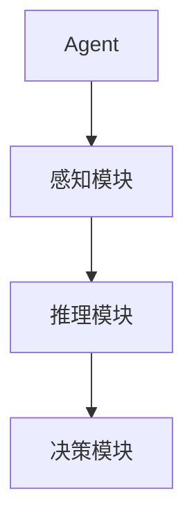
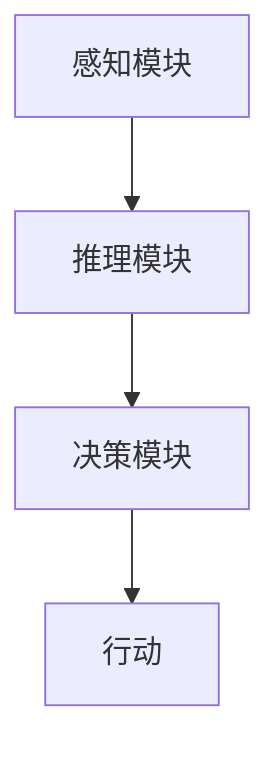

                 


# 从零开始：AI Agent的认知架构设计

## 关键词：AI Agent、认知架构、感知模块、推理模块、决策模块、知识表示、系统架构设计

## 摘要：本文将从AI Agent的认知架构设计的基础概念出发，逐步分析其核心模块、算法原理、系统架构设计，并通过实际项目案例展示如何将这些理论应用于实践。文章将详细阐述感知、推理、决策模块的设计与实现，并结合具体代码和图表，帮助读者全面理解AI Agent的认知架构设计。

---

# 第1章: AI Agent认知架构的背景与问题描述

## 1.1 AI Agent的基本概念

### 1.1.1 什么是AI Agent
AI Agent（人工智能代理）是指能够感知环境、自主决策并执行任务的智能实体。它可以是一个软件程序、机器人或其他智能系统，具备以下核心特征：
- **自主性**：能够在没有外部干预的情况下独立运作。
- **反应性**：能够根据环境的变化实时调整行为。
- **目标导向**：具有明确的目标，并采取行动以实现这些目标。
- **学习能力**：能够通过经验改进自身的性能。

AI Agent可以分为两类：**反应式代理**（基于当前感知做出反应）和**目标式代理**（基于目标和规划采取行动）。

### 1.1.2 AI Agent的核心特征
1. **自主性**：AI Agent不需要外部指令，能够自主决策。
2. **反应性**：能够实时感知环境并做出反应。
3. **目标导向**：具有明确的目标，并采取行动以实现这些目标。
4. **学习能力**：能够通过经验改进自身的性能。

### 1.1.3 AI Agent的分类与应用场景
AI Agent可以根据其智能水平和应用场景分为以下几类：
- **反应式AI Agent**：基于当前感知做出反应，适用于实时任务。
- **目标式AI Agent**：基于目标和规划采取行动，适用于复杂任务。
- **学习型AI Agent**：能够通过学习改进性能，适用于需要自适应的任务。

应用场景包括：
- **智能助手**：如Siri、Alexa等。
- **自动驾驶**：如自动驾驶汽车。
- **智能推荐系统**：如Netflix的推荐算法。

---

## 1.2 认知架构设计的背景

### 1.2.1 传统AI与认知架构的区别
传统AI主要依赖规则和逻辑推理，而认知架构强调模块化设计和动态交互。

### 1.2.2 AI Agent认知架构的重要性
认知架构是AI Agent的核心，决定了其感知、推理和决策能力。

### 1.2.3 当前AI Agent发展的挑战与机遇
- **挑战**：动态环境中的不确定性、复杂任务的高效处理。
- **机遇**：深度学习、强化学习等技术的进步为认知架构设计提供了新的可能性。

---

## 1.3 问题背景与目标

### 1.3.1 AI Agent认知架构设计的核心问题
- 如何设计高效的感知模块？
- 如何实现准确的推理模块？
- 如何制定最优的决策策略？

### 1.3.2 设计目标与边界条件
设计目标：
- 实现高效的感知、推理和决策模块。
- 提供可扩展的架构，支持多种应用场景。

边界条件：
- 限定计算资源和时间复杂度。
- 限定数据输入格式和范围。

### 1.3.3 本章小结
本章介绍了AI Agent的基本概念、核心特征及其在不同场景下的应用。认知架构设计是实现高效AI Agent的关键，后续章节将深入探讨其核心模块的设计与实现。

---

# 第2章: AI Agent认知架构的核心概念与联系

## 2.1 认知架构的核心模块

### 2.1.1 感知模块
感知模块负责从环境中获取信息，并将其转化为可处理的数据。常见的感知方式包括：
- **视觉感知**：通过摄像头获取图像信息。
- **听觉感知**：通过麦克风获取音频信息。
- **触觉感知**：通过传感器获取物理反馈。

### 2.1.2 推理模块
推理模块基于感知模块获取的信息，利用知识库和推理算法进行逻辑推理。常见的推理算法包括：
- **逻辑推理**：基于谓词逻辑的推理。
- **概率推理**：基于概率论的推理。
- **图推理**：基于图结构的推理。

### 2.1.3 决策模块
决策模块根据推理模块的结果，制定最优的行动策略。常见的决策算法包括：
- **基于规则的决策**：根据预定义的规则进行决策。
- **基于模型的决策**：根据模型预测结果进行决策。
- **基于强化学习的决策**：通过强化学习优化决策策略。

---

## 2.2 核心概念的属性对比

### 2.2.1 感知、推理、决策的属性分析
| 模块   | 输入       | 输出       | 功能描述                                         |
|--------|------------|------------|------------------------------------------------|
| 感知   | 环境数据    | 结构化数据  | 将环境数据转化为可处理的结构化数据。             |
| 推理   | 结构化数据  | 推理结果    | 基于知识库和推理算法，得出推理结果。             |
| 决策   | 推理结果    | 行动策略    | 根据推理结果，制定最优的行动策略。             |

### 2.2.2 模块间的关系与依赖
感知模块为推理模块提供数据，推理模块为决策模块提供依据，决策模块指导感知模块和推理模块的后续操作。

### 2.2.3 ER实体关系图


---

## 2.3 本章小结

本章详细介绍了AI Agent认知架构的核心模块，包括感知、推理和决策模块，并通过对比分析和实体关系图展示了它们之间的关系。下一章将深入探讨认知架构的算法原理。

---

# 第3章: AI Agent认知架构的算法原理

## 3.1 知识表示与推理算法

### 3.1.1 知识表示
知识表示是推理模块的基础，常见的知识表示方法包括：
- **谓词逻辑**：使用谓词和逻辑连接词表示知识。
- **语义网络**：通过节点和边表示知识。
- **描述逻辑**：通过描述逻辑语言表示知识。

### 3.1.2 推理算法
- **逻辑推理**：基于谓词逻辑的推理。
- **概率推理**：基于概率论的推理。
- **图推理**：基于图结构的推理。

### 3.1.3 算法实现
以下是一个简单的逻辑推理算法示例：

```python
def logical_reasoning(knowledge_base, query):
    for rule in knowledge_base:
        if rule.matches(query):
            return rule.infer(query)
    return None
```

### 3.1.4 推理算法的优缺点对比
| 算法类型      | 优点               | 缺点               |
|---------------|--------------------|--------------------|
| 逻辑推理      | 结果确定性高         | 计算复杂度高         |
| 概率推理      | 能处理不确定性       | 结果可能存在偏差       |
| 图推理        | 能处理复杂关系       | 对图结构的依赖较高     |

---

## 3.2 知识表示与推理的数学模型

### 3.2.1 知识表示的数学模型
知识表示可以表示为图结构，其中节点表示实体，边表示关系。

### 3.2.2 推理算法的数学模型
逻辑推理的数学模型可以表示为：
$$ \text{如果 } A \text{ 和 } B \text{ 成立，那么 } C \text{ 成立。} $$

### 3.2.3 推理算法的代码实现
以下是一个简单的逻辑推理算法实现：

```python
def logical_reasoning(knowledge_base, query):
    for rule in knowledge_base:
        if rule.matches(query):
            return rule.infer(query)
    return None
```

---

## 3.3 本章小结

本章详细介绍了AI Agent认知架构的知识表示与推理算法，包括逻辑推理、概率推理和图推理等方法，并通过代码和数学公式展示了它们的实现过程。下一章将探讨系统架构设计。

---

# 第4章: AI Agent认知架构的系统架构设计

## 4.1 系统架构设计概述

### 4.1.1 系统架构的目标
系统架构设计的目标是实现高效的感知、推理和决策模块，并确保各模块之间的高效交互。

### 4.1.2 系统架构的组成部分
- **感知模块**：负责环境数据的获取和处理。
- **推理模块**：负责逻辑推理和知识处理。
- **决策模块**：负责制定行动策略。

---

## 4.2 系统功能设计

### 4.2.1 系统功能模块划分
- **感知模块**：视觉感知、听觉感知、触觉感知。
- **推理模块**：逻辑推理、概率推理、图推理。
- **决策模块**：基于规则的决策、基于模型的决策、基于强化学习的决策。

### 4.2.2 系统功能流程


---

## 4.3 系统架构设计

### 4.3.1 系统架构图


### 4.3.2 系统接口设计
- **感知模块接口**：提供获取环境数据的接口。
- **推理模块接口**：提供逻辑推理的接口。
- **决策模块接口**：提供制定行动策略的接口。

---

## 4.4 本章小结

本章详细介绍了AI Agent认知架构的系统架构设计，包括功能模块划分、系统架构图和接口设计等内容。下一章将通过实际项目案例展示如何将这些理论应用于实践。

---

# 第5章: AI Agent认知架构的项目实战

## 5.1 项目背景与目标

### 5.1.1 项目背景
本项目旨在设计一个基于AI Agent的智能助手，能够实现语音交互、信息查询等功能。

### 5.1.2 项目目标
- 实现智能助手的核心功能。
- 验证认知架构设计的有效性。

---

## 5.2 项目核心实现

### 5.2.1 环境安装
需要安装以下环境：
- Python 3.8+
- TensorFlow 2.0+
- Scikit-learn 0.24+

### 5.2.2 系统核心实现

#### 5.2.2.1 感知模块实现
```python
def get_audio():
    # 获取音频数据
    pass
```

#### 5.2.2.2 推理模块实现
```python
def logical_reasoning(knowledge_base, query):
    for rule in knowledge_base:
        if rule.matches(query):
            return rule.infer(query)
    return None
```

#### 5.2.2.3 决策模块实现
```python
def make_decision(options):
    # 制定决策
    pass
```

---

## 5.3 项目功能解读与分析

### 5.3.1 功能解读
- **语音交互**：通过语音识别技术实现人机对话。
- **信息查询**：基于知识库实现信息查询。

### 5.3.2 功能分析
- 语音识别技术的实现依赖于深度学习模型。
- 信息查询功能依赖于高效的推理算法。

---

## 5.4 本章小结

本章通过实际项目案例展示了AI Agent认知架构设计的应用，详细解读了系统的实现过程和功能设计。通过本章的学习，读者可以更好地理解理论知识在实际中的应用。

---

# 第6章: AI Agent认知架构设计的最佳实践

## 6.1 关键技术总结

### 6.1.1 模块化设计
认知架构设计应采用模块化设计，确保各模块的独立性和可扩展性。

### 6.1.2 数据处理
数据处理是认知架构设计的关键，需确保数据的准确性和实时性。

### 6.1.3 模型优化
模型优化是提高系统性能的重要手段，需结合实际需求选择合适的优化方法。

---

## 6.2 项目实施中的注意事项

### 6.2.1 模块间的依赖关系
需明确模块间的依赖关系，避免模块间的冲突。

### 6.2.2 系统的可扩展性
系统设计应具有良好的可扩展性，便于后续功能的添加和优化。

### 6.2.3 系统的鲁棒性
系统设计应考虑各种异常情况，确保系统的鲁棒性。

---

## 6.3 拓展阅读

### 6.3.1 认知架构的最新研究
推荐阅读相关学术论文，了解认知架构领域的最新研究。

### 6.3.2 深度学习在认知架构中的应用
探索深度学习技术在认知架构中的应用，如知识图谱的构建与推理。

---

# 第7章: 总结与展望

## 7.1 本章小结
本文从AI Agent的认知架构设计的基础概念出发，逐步分析了其核心模块、算法原理、系统架构设计，并通过实际项目案例展示了如何将这些理论应用于实践。通过本章的学习，读者可以全面理解AI Agent的认知架构设计。

## 7.2 未来展望
随着人工智能技术的不断发展，认知架构设计将变得更加复杂和多样化。未来的研究方向包括：
- 更高效的感知模块设计。
- 更准确的推理算法。
- 更智能的决策策略。

---

# 作者：AI天才研究院/AI Genius Institute & 禅与计算机程序设计艺术 /Zen And The Art of Computer Programming

