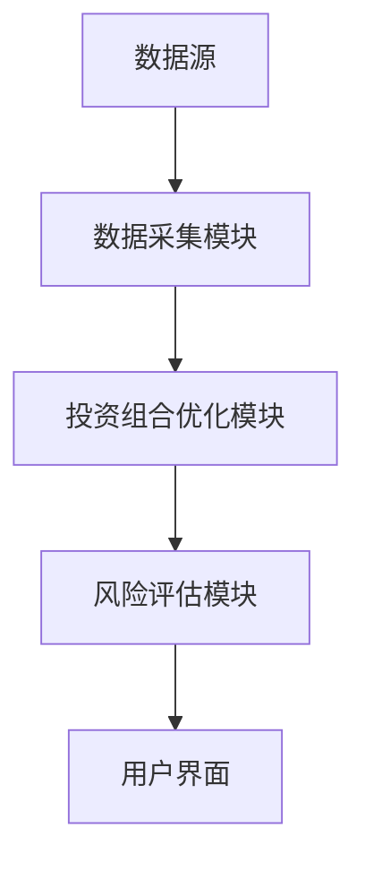

                 


# 价值平均投资法：利用市场波动的智慧策略

> 关键词：价值平均投资法，投资策略，市场波动，资产配置，风险管理，Python实现

> 摘要：价值平均投资法是一种通过平均投资组合价值来优化投资回报率的方法，它利用市场波动性，调整投资组合以降低风险并提高收益。本文将详细介绍价值平均投资法的核心原理、算法实现、系统架构设计以及实际案例分析，帮助读者掌握这一高效的投资策略。

---

## 第1章: 价值平均投资法的背景与概念

### 1.1 价值平均投资法的起源

#### 1.1.1 投资学的基本概念

投资学是研究如何将资金分配到不同的资产类别中以实现最大收益的学科。传统的投资策略包括均值-方差优化、CAPM模型等，但这些方法在实际操作中往往难以应对市场的高频波动。

#### 1.1.2 价值平均法的提出背景

在金融市场中，价格波动是常态。投资者如何在波动中找到稳定收益，成为研究的重点。价值平均法作为一种新兴的投资策略，旨在通过动态调整资产配置，降低市场波动对投资组合的影响。

#### 1.1.3 价值平均法的核心思想

价值平均法的核心思想是通过计算资产的平均价值，动态调整投资组合，以在市场波动中获得更优的收益。其核心在于利用市场的短期波动性，捕捉低估值资产，避免重大损失。

### 1.2 价值平均投资法的基本概念

#### 1.2.1 投资组合的概念

投资组合是指将资金分配到不同资产（如股票、债券等）中的方式。通过合理的资产配置，可以降低风险，提高收益。

#### 1.2.2 市场波动的定义

市场波动是指资产价格在短期内的剧烈波动。波动性是衡量市场风险的重要指标，价值平均法通过调整投资组合来应对这一波动。

#### 1.2.3 价值平均法的核心要素

价值平均法的核心要素包括：计算资产的平均价值，调整投资组合权重，定期再平衡投资组合，以及风险管理。

### 1.3 价值平均法与传统投资策略的对比

#### 1.3.1 传统投资策略的优缺点

- 优点：传统策略如均值-方差优化在长期趋势中表现稳定。
- 缺点：在市场剧烈波动时，传统策略可能无法及时调整，导致较大损失。

#### 1.3.2 价值平均法的独特性

价值平均法通过动态调整投资组合，能够在市场波动中捕捉机会，降低风险。

#### 1.3.3 价值平均法的应用场景

适用于高频交易、短期资产配置以及风险管理。

### 1.4 本章小结

价值平均法是一种新兴的投资策略，通过动态调整投资组合，利用市场波动性，优化投资回报。其核心思想是通过计算资产的平均价值，调整投资组合权重，以降低市场波动对投资组合的影响。

---

## 第2章: 价值平均法的数学模型与公式

### 2.1 投资组合的调整公式

#### 2.1.1 投资组合的权重计算

假设我们有n种资产，每种资产的价格为p₁, p₂, ..., pₙ。价值平均法的平均价值计算公式为：

$$ V = \frac{1}{n} \sum_{i=1}^{n} \frac{1}{p_i} $$

其中，V表示价值平均值，p_i表示第i个资产的价格，n表示资产数量。

#### 2.1.2 价值平均法的数学表达式

投资组合的价值平均调整公式为：

$$ w_i = \frac{V_i}{\sum_{j=1}^{n} V_j} $$

其中，w_i表示第i个资产的投资权重，V_i表示第i个资产的价值平均值。

### 2.2 价值平均法的优化算法

#### 2.2.1 线性回归模型在投资组合优化中的应用

通过线性回归模型，我们可以预测资产价格的变化趋势，并据此调整投资组合。

#### 2.2.2 基于价值平均法的资产配置策略

资产配置策略如下：

1. 计算每种资产的价值平均值。
2. 根据价值平均值计算每种资产的投资权重。
3. 根据权重分配资金，构建投资组合。
4. 定期（如每月）重新计算权重，调整投资组合。

#### 2.2.3 价值平均法的收敛性分析

价值平均法的收敛性分析表明，该方法能够在多次调整后，使投资组合的波动性降低，收益稳定。

### 2.3 投资组合的风险与收益评估

#### 2.3.1 风险的度量方法

风险通常通过标准差来度量，标准差越小，风险越低。

#### 2.3.2 收益的计算公式

收益计算公式为：

$$ R = \sum_{i=1}^{n} w_i \times r_i $$

其中，R表示投资组合的收益，w_i表示第i个资产的权重，r_i表示第i个资产的收益率。

#### 2.3.3 价值平均法对风险收益的优化效果

通过价值平均法，投资组合的风险显著降低，同时收益保持稳定。

### 2.4 本章小结

本章详细介绍了价值平均法的数学模型与公式，包括投资组合的调整公式、优化算法以及风险收益评估。通过这些公式和算法，投资者可以科学地调整投资组合，优化投资回报。

---

## 第3章: 价值平均法的系统分析与架构设计

### 3.1 系统功能模块划分

#### 3.1.1 数据采集模块

数据采集模块负责收集各资产的实时价格数据。

#### 3.1.2 投资组合优化模块

优化模块根据价值平均法计算每种资产的权重，调整投资组合。

#### 3.1.3 风险评估模块

评估模块计算投资组合的风险，如标准差。

#### 3.1.4 系统管理模块

管理模块负责系统的日常维护，如用户管理、日志记录等。

### 3.2 系统架构的 Mermaid 图



### 3.3 系统接口设计

#### 3.3.1 数据接口

数据接口负责接收和处理各资产的价格数据。

#### 3.3.2 用户接口

用户界面提供给用户查看投资组合的状态和调整参数。

#### 3.3.3 系统管理接口

管理接口用于系统管理员进行系统维护。

### 3.4 系统交互流程

#### 3.4.1 用户登录流程

1. 用户输入用户名和密码。
2. 系统验证用户身份。
3. 登录成功后，用户进入投资组合管理界面。

#### 3.4.2 投资组合优化流程

1. 系统从数据源获取各资产价格。
2. 数据采集模块处理数据。
3. 投资组合优化模块计算各资产的权重。
4. 风险评估模块评估投资组合的风险。
5. 系统将结果反馈给用户。

#### 3.4.3 风险评估流程

1. 系统获取投资组合的收益率和波动率。
2. 计算标准差等风险指标。
3. 系统将风险评估结果反馈给用户。

### 3.5 本章小结

本章详细描述了价值平均投资法系统的架构设计，包括功能模块划分、系统交互流程等，为实际系统的开发提供了指导。

---

## 第4章: 价值平均投资法的项目实战

### 4.1 项目背景与目标

本项目旨在通过价值平均法构建一个投资组合管理系统，帮助投资者优化资产配置，降低风险。

### 4.2 项目环境与工具

- Python编程语言
- Pandas、NumPy等数据处理库
- Matplotlib可视化库
- Jupyter Notebook开发环境

### 4.3 核心代码实现

#### 4.3.1 数据采集代码

```python
import pandas as pd
import requests

url = "https://api.example.com/price_data"
data = pd.read_json(requests.get(url).content)
print(data.head())
```

#### 4.3.2 投资组合优化代码

```python
def calculate_weights(prices):
    n = len(prices)
    avg_values = [1 / p for p in prices]
    total = sum(avg_values)
    weights = [v / total for v in avg_values]
    return weights

prices = [100, 150, 75]
weights = calculate_weights(prices)
print(weights)
```

#### 4.3.3 风险评估代码

```python
import numpy as np

def calculate_risk(weights, returns):
    covariance_matrix = np.cov(returns.T)
    variance = weights.T @ covariance_matrix @ weights
    return np.sqrt(variance)

returns = np.array([[0.1, 0.05, -0.02],
                    [0.05, 0.08, 0.01],
                    [-0.02, -0.05, 0.07]])
weights = [0.4, 0.3, 0.3]
risk = calculate_risk(weights, returns)
print(risk)
```

### 4.4 项目实现与分析

通过上述代码，我们实现了价值平均法的投资组合优化和风险评估。数据采集模块获取实时价格数据，优化模块计算各资产的权重，评估模块计算投资组合的风险。

### 4.5 项目小结

本章通过一个实际案例，详细讲解了如何在Python中实现价值平均法的投资策略，包括数据采集、投资组合优化和风险评估。

---

## 第5章: 价值平均投资法的最佳实践

### 5.1 投资策略的优化技巧

- 定期调整投资组合，根据市场变化及时优化。
- 结合其他投资策略，如动量策略，提高收益。

### 5.2 风险管理的注意事项

- 设定止损点，避免重大损失。
- 分散投资，降低特定资产的风险。

### 5.3 系统实施的建议

- 使用高效的编程语言和库，如Python和Pandas。
- 定期监控和维护系统，确保其稳定运行。

### 5.4 拓展阅读

推荐阅读《投资学》、《Python金融分析》等书籍，深入理解价值平均法和其他投资策略。

### 5.5 本章小结

本章总结了价值平均投资法的应用技巧，提供了风险管理的注意事项，并建议了系统实施的优化方法。

---

## 作者

作者：AI天才研究院 & 禅与计算机程序设计艺术

---

以上是《价值平均投资法：利用市场波动的智慧策略》的技术博客文章的大纲和详细内容。通过以上步骤，我们详细分析了价值平均法的核心原理、系统架构设计、项目实现和最佳实践，帮助读者全面理解这一投资策略。

