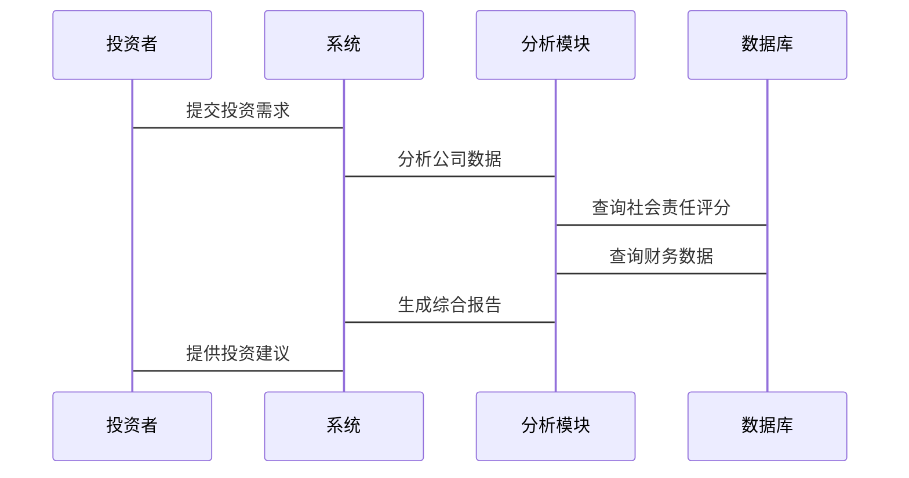

                 


# 价值投资与公司社会责任

## 关键词：价值投资，公司社会责任，投资策略，可持续发展，企业治理，社会影响，风险管理

## 摘要：  
本文探讨了价值投资与公司社会责任之间的关系，分析了价值投资的核心概念、评估方法以及公司社会责任的内涵与框架。通过结合实际案例，本文详细阐述了如何将公司社会责任纳入投资决策中，提出了基于价值投资与社会责任结合的综合评估模型，并给出了具体的数学公式和系统架构设计。最后，本文总结了价值投资与社会责任结合的最佳实践和注意事项。

---

## 第一部分: 价值投资与公司社会责任的概述

### 第1章: 价值投资与公司社会责任的概述

#### 1.1 价值投资的核心概念

##### 1.1.1 价值投资的定义与背景
价值投资是一种长期投资策略，强调以低于内在价值的价格买入优质资产。其核心思想是寻找那些被市场低估的公司，通过长期持有实现超额收益。价值投资的背景可以追溯到本杰明·格雷厄姆和戴维·多德的理论，他们强调安全边际和对公司基本面的深入分析。

##### 1.1.2 价值投资的核心原则
- **安全边际**：买入价格低于内在价值，以降低投资风险。
- **长期视角**：关注企业的长期盈利能力，而非短期市场波动。
- **优质资产**：选择具有强大竞争优势、良好财务状况和管理团队的公司。

##### 1.1.3 价值投资与短期投资的对比
| 对比维度 | 价值投资 | 短期投资 |
|----------|----------|----------|
| 投资目标 | 追求长期超额收益 | 追求短期价格波动 |
| 分析方法 | 深入分析基本面 | 依赖技术分析或市场情绪 |
| 风险管理 | 强调安全边际 | 风险承受能力较高 |

#### 1.2 公司社会责任的定义与内涵

##### 1.2.1 公司社会责任的定义
公司社会责任（Corporate Social Responsibility，简称CSR）是指企业在追求利润的同时，对社会、环境和利益相关者承担的责任。它包括环境保护、员工权益、公平交易、公益支持等多个方面。

##### 1.2.2 公司社会责任的主要维度
- **环境责任（Environmental）**：减少碳排放、节约资源、避免污染。
- **治理责任（Governance）**：公司治理透明、董事会多元化、股东权益保护。
- **社会责任（Social）**：员工福利、社区支持、公平劳动条件。

##### 1.2.3 公司社会责任与企业利润的关系
公司社会责任并非与利润对立，而是通过提升企业形象、降低风险、增强员工凝聚力等方式，间接或直接地促进企业长期利润的增长。

#### 1.3 价值投资与公司社会责任的联系

##### 1.3.1 价值投资视角下的社会责任
在价值投资中，公司社会责任被视为企业内在价值的重要组成部分。一家具有高度社会责任感的公司更有可能获得长期竞争优势，从而提升其内在价值。

##### 1.3.2 社会责任对投资价值的影响
社会责任良好的公司通常具有更强的抗风险能力和社会认可度，这会降低其融资成本，提升市场份额，从而增强投资价值。

##### 1.3.3 价值投资与社会责任的协同发展
通过将社会责任纳入投资筛选标准，投资者可以在追求超额收益的同时，推动社会进步，实现经济效益与社会效益的双赢。

---

### 第2章: 价值投资的评估方法

#### 2.1 价值投资的核心指标

##### 2.1.1 市盈率（P/E）分析
市盈率是股票价格与每股收益的比率，用于衡量股票是否被高估或低估。

$$ P/E = \frac{股票价格}{每股收益} $$

##### 2.1.2 市净率（P/B）分析
市净率是股票价格与每股净资产的比率，用于衡量股票相对于账面价值的高低。

$$ P/B = \frac{股票价格}{每股净资产} $$

##### 2.1.3 股息率与股息支付率
股息率是股票的年股息与股票价格的比率，股息支付率是股息与净利润的比率。

$$ 股息率 = \frac{年股息}{股票价格} $$  
$$ 股息支付率 = \frac{股息}{净利润} $$

#### 2.2 公司基本面分析

##### 2.2.1 收入与利润分析
分析公司的收入构成、增长趋势和利润来源，判断其盈利能力。

##### 2.2.2 资产负债表分析
评估公司的资产结构、负债水平和股东权益，判断其财务健康状况。

##### 2.2.3 现金流量表分析
分析经营活动、投资活动和筹资活动的现金流，判断公司的现金流健康状况。

#### 2.3 股票估值方法

##### 2.3.1 现金流折现模型（DCF）
DCF模型通过将未来现金流折现，计算公司的真实价值。

$$ V = \sum_{t=1}^{n} \frac{CF_t}{(1 + r)^t} + \frac{TV}{(1 + r)^n} $$

##### 2.3.2 相对估值法（可比公司分析）
通过与同行业公司的估值进行对比，判断目标公司的合理估值区间。

##### 2.3.3 市盈率与市净率的对比
通过市盈率和市净率的对比，判断股票的估值高低。

---

### 第3章: 公司社会责任的框架与评估

#### 3.1 公司社会责任的主要维度

##### 3.1.1 环境责任（Environmental）
包括减少碳排放、节约资源、避免污染等方面。

##### 3.1.2 治理责任（Governance）
包括公司治理透明、董事会多元化、股东权益保护等方面。

##### 3.1.3 社会责任（Social）
包括员工福利、社区支持、公平劳动条件等方面。

#### 3.2 公司社会责任的评估指标

##### 3.2.1 环境、社会与治理（ESG）评分
ESG评分是衡量公司社会责任的重要指标，通常由第三方机构进行评估。

##### 3.2.2 碳排放与可持续发展指标
碳排放和可持续发展指标是衡量公司环境责任的重要指标。

##### 3.2.3 社会责任报告与透明度
社会责任报告是公司披露社会责任履行情况的重要文件，透明度越高，社会责任表现越佳。

#### 3.3 公司社会责任对投资决策的影响

##### 3.3.1 社会责任与企业长期价值
具有良好社会责任表现的公司通常具有更强的抗风险能力和社会认可度，从而提升其长期价值。

##### 3.3.2 社会责任与风险评估
社会责任表现差的公司可能面临更高的法律风险和声誉风险，从而影响其投资价值。

##### 3.3.3 社会责任与投资者信任
良好的社会责任表现能够增强投资者对公司的信任，从而提升公司的融资能力和市场地位。

---

### 第4章: 价值投资与公司社会责任的结合

#### 4.1 价值投资中的社会责任考量

##### 4.1.1 社会责任作为投资筛选标准
在价值投资中，社会责任被视为公司内在价值的重要组成部分，因此在投资决策中需要考虑公司社会责任表现。

##### 4.1.2 社会责任对投资组合风险的影响
社会责任良好的公司通常具有更低的经营风险和声誉风险，从而降低投资组合的整体风险。

##### 4.1.3 社会责任与投资收益的长期相关性
研究表明，具有良好社会责任表现的公司通常具有更高的长期收益，尤其是在可持续发展的背景下。

#### 4.2 价值投资与社会责任结合的数学模型

##### 4.2.1 综合评估模型
综合评估模型将公司内在价值和社会责任表现结合起来，计算综合投资价值。

$$ 综合投资价值 = \alpha \times 内在价值 + (1 - \alpha) \times 社会责任评分 $$

其中，$\alpha$ 是内在价值的权重，通常在0.6到0.8之间。

##### 4.2.2 实证分析
通过实证分析验证综合评估模型的有效性，比较基于传统价值投资和基于社会责任的综合投资策略在长期的表现差异。

---

### 第5章: 系统分析与架构设计方案

#### 5.1 问题场景介绍
在价值投资与社会责任结合的背景下，投资者需要一个高效的系统来分析和评估公司的内在价值和社会责任表现。

#### 5.2 系统功能设计

##### 5.2.1 领域模型（mermaid类图）


#### 5.3 系统架构设计（mermaid架构图）


#### 5.4 系统接口设计
- **输入接口**：接收投资者的需求和公司的数据。
- **输出接口**：提供综合评估报告和投资建议。

#### 5.5 系统交互设计（mermaid序列图）


---

### 第6章: 项目实战

#### 6.1 环境安装
- **工具安装**：安装Python、Pandas、Matplotlib、Scikit-learn等工具。
- **数据获取**：获取股票数据和ESG评分数据。

#### 6.2 系统核心实现源代码
```python
import pandas as pd
import numpy as np

def calculate_intrinsic_value(finance_data):
    # 简单的内在价值计算方法
    return finance_data['Revenue'] * 0.5 + finance_data['NetIncome'] * 0.3

def calculate_sustainability_score(esg_data):
    # 简单的社会责任评分计算方法
    return esg_data['Environmental'] * 0.4 + esg_data['Social'] * 0.3 + esg_data['Governance'] * 0.3

def comprehensive_assessment(company_data):
    iv = calculate_intrinsic_value(company_data)
    sr = calculate_sustainability_score(company_data)
    alpha = 0.7
    return alpha * iv + (1 - alpha) * sr

# 示例数据
finance_data = pd.DataFrame({
    'Revenue': [100, 150, 200],
    'NetIncome': [20, 30, 40]
})

esg_data = pd.DataFrame({
    'Environmental': [80, 70, 90],
    'Social': [90, 80, 85],
    'Governance': [75, 85, 70]
})

# 计算综合投资价值
comprehensive_value = comprehensive_assessment(company_data)
print("综合投资价值:", comprehensive_value)
```

#### 6.3 代码应用解读与分析
- **代码功能**：上述代码实现了公司内在价值和社会责任评分的计算，并结合权重计算综合投资价值。
- **实际案例分析**：通过具体公司数据，展示如何利用代码进行投资决策。

#### 6.4 项目小结
通过项目实战，验证了价值投资与社会责任结合的综合评估模型的有效性，为投资者提供了实用的工具和方法。

---

### 第7章: 总结与建议

#### 7.1 最佳实践 tips
- 在投资决策中，建议将公司社会责任表现作为重要筛选标准。
- 使用综合评估模型，平衡内在价值和社会责任表现。
- 定期更新社会责任数据和财务数据，确保评估结果的准确性。

#### 7.2 小结
本文详细探讨了价值投资与公司社会责任的关系，提出了结合两者的方法和数学模型，并通过项目实战验证了其可行性。

#### 7.3 注意事项
- 投资者应根据自身风险偏好和投资目标调整模型参数。
- 数据的准确性和及时性对评估结果至关重要。
- 社会责任表现的评估需要参考多个维度和第三方机构的报告。

#### 7.4 拓展阅读
- 格雷厄姆的《聪明的投资者》
- 约瑟夫·洛温斯坦的《投资中的心理偏差》
- 环境、社会与治理（ESG）相关文献

---

## 作者：AI天才研究院/AI Genius Institute & 禅与计算机程序设计艺术 /Zen And The Art of Computer Programming

