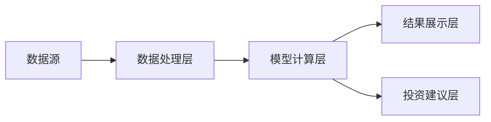

                 


# 价值投资与通货膨胀的关系

## 关键词：
- 价值投资
- 通货膨胀
- 投资策略
- 经济分析
- 数据建模

## 摘要：
本文探讨了价值投资与通货膨胀之间的关系，分析了通货膨胀对价值投资策略的影响，提出了量化通货膨胀对价值投资的影响的算法模型，并通过实际案例展示了如何在通货膨胀背景下优化价值投资策略。

---

## 第一部分：背景介绍

### 第1章：价值投资与通货膨胀的基本概念

#### 1.1 价值投资的定义与核心理念
- **价值投资的定义**：价值投资是一种投资策略，旨在寻找市场低估的资产，通过长期持有实现超额收益。其核心理念是关注企业的内在价值，而非市场的短期波动。
- **价值投资的核心理念**：
  - 购买价格低于内在价值。
  - 长期持有优质资产。
  - 避免情绪化投资。
- **价值投资的选股标准**：
  - 低市盈率（P/E）。
  - 低市净率（P/B）。
  - 高股息率。
  - 强大的财务状况和盈利能力。

#### 1.2 通货膨胀的定义与度量
- **通货膨胀的定义**：通货膨胀是指物价总水平在一段时间内持续上涨，导致货币购买力下降的现象。
- **通货膨胀的度量指标**：
  - 消费者价格指数（CPI）。
  - 生产者价格指数（PPI）。
  - 核心CPI（剔除食品和能源价格的CPI）。
- **通货膨胀对经济的影响**：
  - 消费者购买力下降。
  - 债务的实际负担减轻。
  - 投资者寻求通胀对冲资产。

#### 1.3 价值投资与通货膨胀的关系
- **通货膨胀对价值投资的影响**：
  - 通货膨胀可能导致企业盈利能力下降。
  - 通货膨胀会影响股票的估值指标（如市盈率）。
  - 通货膨胀会推动投资者寻找通胀对冲资产（如房地产、黄金）。
- **通货膨胀与价值投资的相互作用**：
  - 价值投资者需要调整估值模型以考虑通货膨胀因素。
  - 通货膨胀可能改变市场的资金成本和企业盈利预期。

---

## 第二部分：核心概念与联系

### 第2章：价值投资与通货膨胀的核心概念对比

#### 2.1 核心概念的属性对比
| 属性 | 价值投资 | 通货膨胀 |
|------|----------|----------|
| 核心目标 | 寻找低估资产 | 提高物价水平 |
| 主要影响 | 股票估值、企业盈利 | 购买力、债务负担 |
| 关键指标 | 市盈率、市净率 | CPI、PPI |
| 时间维度 | 长期持有 | 短期和长期 |

#### 2.2 价值投资与通货膨胀的关系分析
- **通货膨胀对价值投资的影响**：
  - 通货膨胀可能导致企业成本上升，影响盈利能力。
  - 通货膨胀会推高股价，但未必反映企业真实盈利能力。
- **价值投资对通货膨胀的应对策略**：
  - 选择具有强定价能力的企业。
  - 调整估值模型中的通胀预期。
  - 增加对通胀对冲资产的配置。

#### 2.3 概念关系的 mermaid 图


---

## 第三部分：算法原理

### 第3章：通货膨胀对价值投资的影响的量化模型

#### 3.1 算法原理概述
- **问题背景**：通货膨胀会影响企业的盈利能力和股票估值，价值投资者需要量化这种影响。
- **算法目标**：建立一个模型，量化通货膨胀对股票估值的影响，并优化价值投资策略。

#### 3.2 通货膨胀调整的股票估值模型
- **模型假设**：
  - 企业的收入和成本会受到通货膨胀的影响。
  - 股票的内在价值与通货膨胀率相关。
- **模型公式**：
  $$ V = \frac{E}{k} \times (1 + \pi) $$
  其中：
  - \( V \)：调整后的股票价值。
  - \( E \)：企业的净利润。
  - \( k \)：折现率。
  - \( \pi \)：通货膨胀率。

#### 3.3 通货膨胀对市盈率的影响
- **市盈率公式**：
  $$ P/E = \frac{P}{E} $$
  - 在通货膨胀期间，\( E \) 可能下降，导致 \( P/E \) 上升。
- **调整后的市盈率**：
  $$ P/E_{adj} = \frac{P}{E \times (1 + \pi)} $$

#### 3.4 算法实现
```python
def calculate_inflation_adjusted_value(E, k, pi):
    V = E / k * (1 + pi)
    return V

def calculate_adjusted_pe(P, E, pi):
    pe_adjusted = P / (E * (1 + pi))
    return pe_adjusted

# 示例
E = 100  # 净利润
k = 0.1  # 折现率
pi = 0.02  # 通货膨胀率

V = calculate_inflation_adjusted_value(E, k, pi)
pe_adjusted = calculate_adjusted_pe(20, E, pi)

print(f"调整后的股票价值：{V}")
print(f"调整后的市盈率：{pe_adjusted}")
```

---

## 第四部分：系统分析与架构设计

### 第4章：价值投资与通货 inflation 的系统分析

#### 4.1 系统功能设计
- **领域模型**：企业-金融资产-市场参与者。
- **功能模块**：
  - 数据收集（CPI、企业财务数据）。
  - 模型计算（通货膨胀调整后的股票价值）。
  - 结果输出（投资建议）。

#### 4.2 系统架构设计


---

## 第五部分：项目实战

### 第5章：基于通货膨胀的优化投资策略

#### 5.1 环境安装与数据准备
- **工具安装**：
  - Python 3.x。
  - 数据分析库（pandas、numpy）。
  - 可视化库（matplotlib、seaborn）。
- **数据来源**：
  - CPI 数据：政府统计部门或经济数据库。
  - 股票数据：金融数据服务提供商。

#### 5.2 核心实现
```python
import pandas as pd
import numpy as np

# 示例数据
cpi = pd.Series([100, 102, 105], index=[2020, 2021, 2022])
profit = pd.Series([100, 105, 110], index=[2020, 2021, 2022])

# 计算通胀调整后的净利润
inflation_adjusted_profit = profit / (cpi / 100)

print(inflation_adjusted_profit)
```

#### 5.3 案例分析与结果解读
- **案例分析**：假设某企业在通货膨胀期间的净利润增长率为5%，而CPI增长率为2%。
- **结果解读**：通胀调整后的净利润为5.88%，显示企业的真实盈利能力下降。

---

## 第六部分：最佳实践与小结

### 第6章：最佳实践与投资建议

#### 6.1 投资建议
- **选择具有强定价能力的企业**。
- **调整估值模型中的通胀预期**。
- **配置通胀对冲资产**（如房地产、黄金）。

#### 6.2 小结
- 通货膨胀对价值投资的影响不容忽视。
- 价值投资者需要动态调整策略以应对通胀环境。
- 通过量化模型优化投资决策。

#### 6.3 注意事项
- 数据质量：确保使用可靠的数据源。
- 模型局限性：通胀模型可能无法完全解释市场波动。
- 风险管理：分散投资以降低风险。

---

## 附录

### 附录A：数据来源与工具安装
- 数据来源：政府统计部门、金融数据库。
- 工具安装：Python、Pandas、NumPy。

### 附录B：参考文献
- 文章中引用的文献和数据来源。

---

## 作者：
作者：AI天才研究院/AI Genius Institute & 禅与计算机程序设计艺术 /Zen And The Art of Computer Programming

