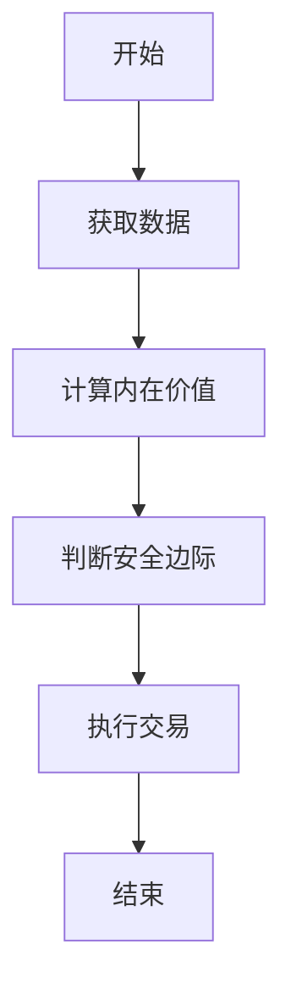
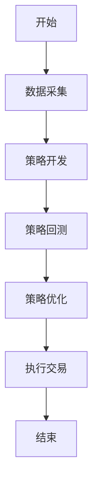
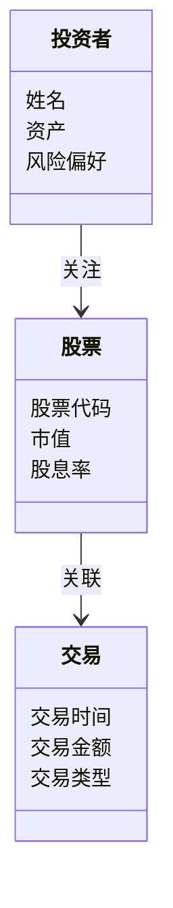
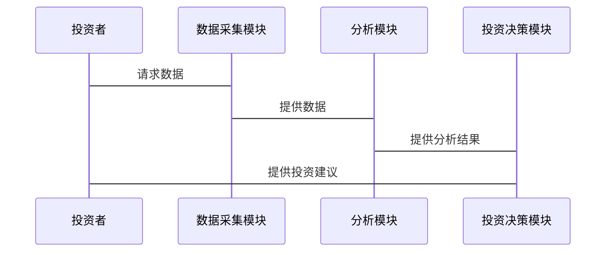

                 


# 价值投资与量化投资的对比

> 关键词：价值投资、量化投资、股票估值、算法交易、投资策略

> 摘要：本文详细对比分析了价值投资与量化投资的核心概念、算法原理、系统架构及项目实战。通过介绍两者的基本概念和核心理念，分析了它们的异同点，探讨了各自的数学模型和算法实现，最后通过实际案例展示了量化投资的具体应用和项目经验。

---

# 第1章: 价值投资与量化投资概述

## 1.1 价值投资的核心概念

### 1.1.1 价值投资的定义与起源

价值投资是一种以基本面分析为基础的投资策略，由本杰明·格雷厄姆和戴维·多德在20世纪初提出。其核心理念是寻找市场价低于内在价值的股票，长期持有，等待价格回归价值。这种方法强调对公司财务状况、行业地位和竞争优势的深入分析，注重安全边际和风险控制。

### 1.1.2 价值投资的核心理念

价值投资的核心理念是通过分析公司的基本面，寻找被市场低估的投资标的。其关键点包括：

1. **内在价值**：通过DCF（Discounted Cash Flow）模型等方法估算公司的内在价值。
2. **安全边际**：买入价格应显著低于内在价值，以降低风险。
3. **长期视角**：关注公司的长期盈利能力，而非短期价格波动。

### 1.1.3 价值投资的适用场景与边界

价值投资适用于市场存在低估机会的情况，特别适合于分析能力强、注重长期收益的投资者。其边界包括：

- 市场高度波动时难以有效应用。
- 对小盘股或新兴行业的适用性较低。

## 1.2 量化投资的核心概念

### 1.2.1 量化投资的定义与起源

量化投资是指利用数学模型和算法进行投资决策的方法，起源于20世纪60年代。它通过大量数据分析，寻找价格与价值的偏离，利用算法交易获利。量化投资强调数据驱动和系统化，适合高频交易和量化对冲基金。

### 1.2.2 量化投资的核心理念

量化投资的核心理念是通过统计套利、因子分析和算法交易等方法，捕捉市场中的短期价格偏差。其关键点包括：

1. **数学模型**：使用因子模型、均值回归等方法进行投资决策。
2. **算法交易**：通过编写程序自动执行交易指令，减少人为干扰。
3. **数据驱动**：依赖大量历史数据和实时数据进行分析。

### 1.2.3 量化投资的适用场景与边界

量化投资适用于市场流动性高、数据透明度高的情况，特别适合于高频交易和程序化交易。其边界包括：

- 市场深度不足时难以有效执行。
- 非线性市场波动可能影响模型的有效性。

## 1.3 价值投资与量化投资的对比分析

### 1.3.1 核心理念的对比

| 对比维度 | 价值投资 | 量化投资 |
|----------|----------|----------|
| 核心理念 | 基于内在价值，寻找低估标的 | 基于统计模型，寻找价格偏差 |
| 投资期限 | 长期持有 | 短期交易 |
| 风险控制 | 侧重安全边际 | 侧重模型回测 |

### 1.3.2 投资策略的对比

| 对比维度 | 价值投资 | 量化投资 |
|----------|----------|----------|
| 分析方法 | 基本面分析 | 数据分析与统计套利 |
| 决策依据 | 内在价值与安全边际 | 数学模型与算法交易 |
| 交易频率 | 低频交易 | 高频交易 |

### 1.3.3 风险与收益的对比

| 对比维度 | 价值投资 | 量化投资 |
|----------|----------|----------|
| 风险来源 | 价值判断失误 | 模型失效与市场波动 |
| 风险控制 | 安全边际 | 系统化交易策略 |
| 收益来源 | 长期价值回归 | 短期价格偏差 |

---

# 第2章: 价值投资与量化投资的核心概念对比

## 2.1 价值投资的核心概念与原理

### 2.1.1 内在价值的计算方法

内在价值是价值投资的核心，通常通过DCF模型计算：

$$ V = \frac{CF}{(1 + r)^n} $$

其中，CF为未来现金流，r为折现率，n为时间跨度。

### 2.1.2 股票估值的关键指标

常用指标包括市盈率（P/E）、市净率（P/B）、股息率（Dividend Yield）等。

### 2.1.3 长期投资与价值发现的结合

价值投资强调长期持有，通过持续的内在价值增长实现收益。

## 2.2 量化投资的核心概念与原理

### 2.2.1 数学模型在投资中的应用

因子模型是量化投资的核心，常用Fama-French三因子模型：

$$ R_i = \alpha + \beta_1 (R_m - R_f) + \beta_2 SMB + \beta_3 HML + \epsilon $$

### 2.2.2 数据驱动的投资决策

量化投资依赖于大量历史数据和实时数据，通过算法分析价格和成交量等指标。

### 2.2.3 算法交易的实现原理

算法交易通过编写程序自动执行交易指令，减少人为干预，提高交易效率。

## 2.3 价值投资与量化投资的对比分析

### 2.3.1 对比表格

| 对比维度 | 价值投资 | 量化投资 |
|----------|----------|----------|
| 分析方法 | 基本面分析 | 数据分析 |
| 决策依据 | 内在价值 | 统计套利 |
| 交易频率 | 低频 | 高频 |

### 2.3.2 ER实体关系图架构

```mermaid
erDiagram
    customer[投资者] {
        <属性>
        姓名
        资产
        风险偏好
    }
    stock[股票] {
        <属性>
        股票代码
        市值
        股息率
    }
    transaction[交易] {
        <属性>
        交易时间
        交易金额
        交易类型
    }
    customer --> transaction : 进行交易
    stock --> transaction : 关联交易
```

### 2.3.3 总结与启示

价值投资和量化投资各有优劣，适合不同的市场环境和投资者类型。价值投资适合长期稳健的投资者，而量化投资适合追求短期收益的技术派。

---

# 第3章: 价值投资的算法原理

## 3.1 价值投资的数学模型

### 3.1.1 内在价值的计算公式

$$ V = \frac{CF_1}{(1 + r)^1} + \frac{CF_2}{(1 + r)^2} + \dots + \frac{CF_n}{(1 + r)^n} $$

### 3.1.2 股票估值的数学模型

使用DCF模型计算自由现金流的现值，考虑增长率和永续增长率：

$$ V = \frac{CF_1}{(r - g)} $$

### 3.1.3 长期投资的收益预测公式

$$ R = \frac{P_1 - P_0}{P_0} \times 100\% $$

## 3.2 价值投资的算法实现

### 3.2.1 数据采集与处理

使用Python的pandas库清洗和处理股票数据：

```python
import pandas as pd

data = pd.read_csv('stock_data.csv')
data_clean = data.dropna()
```

### 3.2.2 股票估值算法

编写函数计算股票的内在价值：

```python
def calculate_intrinsic_value(eps, growth_rate, required_return):
    return eps / (required_return - growth_rate)
```

### 3.2.3 投资决策算法

基于安全边际判断是否买入：

```python
if price < intrinsic_value * 0.8:
    buy()
else:
    hold()
```

## 3.3 价值投资的算法流程图



---

# 第4章: 量化投资的算法原理

## 4.1 量化投资的数学模型

### 4.1.1 因子模型

使用Fama-French三因子模型分析股票收益：

$$ R_i = \alpha + \beta_1 (R_m - R_f) + \beta_2 SMB + \beta_3 HML + \epsilon $$

### 4.1.2 数据驱动的策略

通过统计套利寻找市场无效性，利用均值回归策略进行交易。

## 4.2 量化投资的算法实现

### 4.2.1 数据采集与处理

使用Python的pandas库处理高频交易数据：

```python
import pandas as pd

data = pd.read_csv('quant_data.csv')
data = data.resample('T').mean()
```

### 4.2.2 算法交易策略

编写算法交易的代码：

```python
from backtrader import Strategy

class MyStrategy(Strategy):
    def __init__(self):
        self.sma = sma.SMA(self.datas[0], period=14)
    
    def next(self):
        if self.sma.lines.sma[-1] < self.sma.lines.sma[-2]:
            self.buy()
        else:
            self.sell()
```

### 4.2.3 策略回测与优化

使用回测框架评估策略的有效性，优化参数以提高收益。

## 4.3 量化投资的算法流程图



---

# 第5章: 价值投资与量化投资的系统分析与架构设计

## 5.1 项目介绍

项目旨在对比分析价值投资和量化投资，构建一个综合系统，分析两者的优劣，并提供投资建议。

## 5.2 系统功能设计

### 5.2.1 数据采集模块

- 采集股票数据，清洗数据，处理缺失值。

### 5.2.2 分析模块

- 价值投资分析：计算内在价值，判断安全边际。
- 量化投资分析：因子分析，策略回测。

### 5.2.3 投资决策模块

- 综合分析结果，提供投资建议。

## 5.3 系统架构设计



## 5.4 系统交互设计



---

# 第6章: 项目实战

## 6.1 环境安装

安装必要的Python库：

```bash
pip install pandas numpy matplotlib backtrader
```

## 6.2 核心代码实现

### 6.2.1 价值投资分析代码

```python
import pandas as pd
import numpy as np

def calculate_intrinsic_value(eps, growth_rate, required_return):
    return eps / (required_return - growth_rate)

data = pd.read_csv('stock_data.csv')
intrinsic_values = data['eps'].apply(lambda x: calculate_intrinsic_value(x, 0.05, 0.1))
```

### 6.2.2 量化投资策略代码

```python
from backtrader import Strategy, Cerebro

class MyStrategy(Strategy):
    def __init__(self):
        self.sma = sma.SMA(self.datas[0], period=14)
    
    def next(self):
        if self.sma.lines.sma[-1] < self.sma.lines.sma[-2]:
            self.buy()
        else:
            self.sell()

cerebro = Cerebro()
cerebro.addstrategy(MyStrategy)
cerebro.run()
```

## 6.3 案例分析与解读

分析某只股票的内在价值和量化策略的表现，解读结果并总结经验教训。

## 6.4 项目小结

总结项目经验，分析系统的优缺点，提出改进建议。

---

# 第7章: 最佳实践与总结

## 7.1 小结

价值投资和量化投资各有优劣，适合不同的市场环境和投资者类型。价值投资适合长期稳健的投资者，而量化投资适合追求短期收益的技术派。

## 7.2 注意事项

- 价值投资需要深入的基本面分析，量化投资需要强大的数据处理能力和算法设计能力。
- 风险控制是投资成功的关键，无论是哪种策略都需要严格的风险管理。

## 7.3 拓展阅读

建议阅读《价值投资实战策略》和《量化投资：算法与策略》深入学习。

---

# 作者

作者：AI天才研究院/AI Genius Institute  
联系邮箱：contact@aising genius.com  

---

以上是《价值投资与量化投资的对比》的完整目录和内容框架。按照上述结构和内容要求，您可以开始撰写详细的文章内容。

