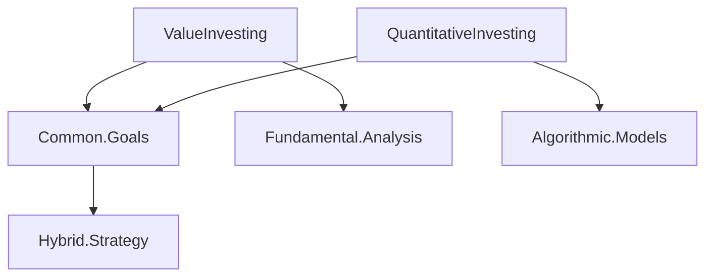
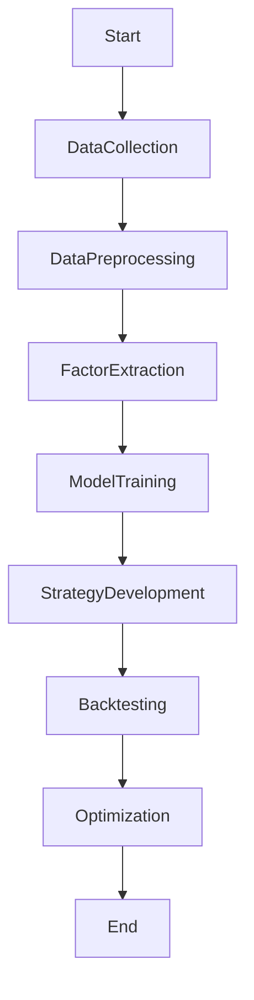
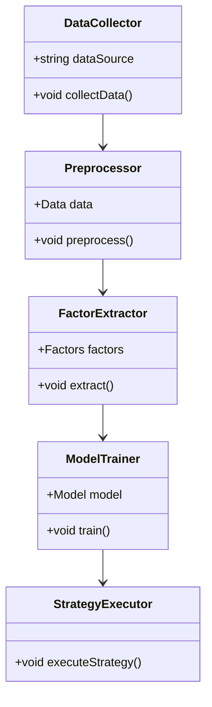

                 


# 价值投资与量化投资的融合

> 关键词：价值投资，量化投资，融合，算法，系统架构，投资策略

> 摘要：本文探讨了价值投资与量化投资的融合，分析了两者的优缺点、融合的必要性以及实现方法。通过构建量化模型和设计融合策略，展示了如何将两者结合以提高投资效果。

---

## 第一部分：价值投资与量化投资的融合概述

### 第一章：价值投资与量化投资的背景与现状

#### 1.1 价值投资的核心理念

- **定义与起源**：价值投资由本杰明·格雷厄姆提出，强调以低于内在价值的价格买入优质股票。
- **核心原则**：关注公司的基本面，如市盈率、ROE，寻找被市场低估的机会。
- **适用场景**：适合长期投资者，尤其在市场恐慌时提供安全边际。

#### 1.2 量化投资的定义与发展

- **定义与特点**：基于数学模型和算法，利用大数据进行交易决策。
- **历史发展**：从简单的技术分析到复杂的机器学习模型。
- **现状与趋势**：量化投资在高频交易和对冲基金中广泛应用。

#### 1.3 融合的背景

- **矛盾与互补**：价值投资依赖基本面分析，而量化投资依赖数据处理。
- **技术推动**：大数据和AI技术使两者结合成为可能。
- **优势结合**：利用量化模型筛选优质标的，减少人为偏差。

### 第二章：价值投资与量化投资的核心概念与联系

#### 2.1 核心概念原理

- **价值投资的内在价值模型**：通过DCF模型评估公司价值。
- **量化投资的因子模型**：使用CAPM模型构建因子，如市值、价值、动量等。
- **融合目标**：实现基本面分析与数据驱动决策的结合。

#### 2.2 对比分析

- **属性对比**：
  | 方面       | 价值投资                     | 量化投资                     |
  |------------|------------------------------|----------------------------|
  | 方法       | 基本面分析                   | 数据驱动                     |
  | 时间框架   | 长期                         | 短期或长期                   |
  | 工具       | 财务报表、行业分析           | 数据集、算法                 |
- **优缺点对比**：
  - 价值投资：优点是风险控制，缺点是需要深入研究。
  - 量化投资：优点是客观高效，缺点是忽视市场情绪。

#### 2.3 实体关系图



### 第三章：量化模型与价值投资的融合算法

#### 3.1 量化模型的构建

- **数据采集与预处理**：清洗数据，处理缺失值和异常值。
- **因子选择与计算**：筛选重要因子，如市盈率、ROE，并进行标准化。
- **模型训练与优化**：使用回归或分类模型，优化参数。

#### 3.2 融合策略的设计

- **价值因子量化**：将基本面指标转化为量化指标，如通过标准化处理。
- **因子融合**：结合价值因子和量化因子，构建多因子模型。
- **回测与优化**：通过历史数据验证策略的有效性，调整参数。

#### 3.3 算法流程图



---

## 第二部分：系统架构与项目实战

### 第四章：系统架构设计

#### 4.1 项目介绍

- **目标**：开发一个融合价值与量化投资的策略系统。
- **模块划分**：数据获取、模型开发、策略执行。

#### 4.2 领域模型类图



#### 4.3 系统架构图


### 第五章：项目实战

#### 5.1 环境安装

- **工具**：Python、Pandas、NumPy、Scikit-learn、Plotly。
- **安装命令**：`pip install numpy pandas scikit-learn plotly`

#### 5.2 核心实现代码

```python
import pandas as pd
import numpy as np
from sklearn.linear_model import LinearRegression
from sklearn.metrics import mean_squared_error

# 数据预处理
def preprocess_data(data):
    # 去除缺失值
    data = data.dropna()
    # 标准化处理
    numeric_cols = data.select_dtypes(include=[np.number]).columns
    data[numeric_cols] = data[numeric_cols].apply(lambda x: (x - x.mean()) / x.std())
    return data

# 因子提取
def extract_factors(data):
    # 示例：提取市盈率因子
    data['PE'] = data['Price'] / data['Earnings']
    return data

# 模型训练
def train_model(data, target):
    X = data.drop(columns=[target])
    y = data[target]
    model = LinearRegression()
    model.fit(X, y)
    return model

# 策略回测
def backtest(model, data):
    predictions = model.predict(data)
    returns = predictions - data['Price'].values
    return returns.mean() * 100

# 主函数
def main():
    # 加载数据
    data = pd.read_csv('stock_data.csv')
    # 预处理
    processed_data = preprocess_data(data)
    # 提取因子
    factored_data = extract_factors(processed_data)
    # 训练模型
    model = train_model(factored_data, 'Price')
    # 回测
    returns = backtest(model, data)
    print(f'策略年化收益率：{returns}%')

if __name__ == "__main__":
    main()
```

#### 5.3 案例分析

- **数据选择**：使用历史股价、市盈率、ROE等数据。
- **模型优化**：调整因子权重，测试不同回测窗口。
- **结果分析**：评估策略的夏普比率和最大回撤。

---

## 第三部分：最佳实践与总结

### 第六章：总结与展望

#### 6.1 融合优势

- **优势**：结合了基本面分析的深度和量化模型的广度，提高了策略的稳定性和收益性。

#### 6.2 实践建议

- **数据质量**：确保数据准确性和完整性。
- **模型选择**：根据市场情况调整因子和模型。
- **风险控制**：设置止损和止盈机制，分散投资组合。

#### 6.3 未来研究方向

- **复杂模型**：探索深度学习在融合中的应用。
- **动态调整**：开发自适应策略，应对市场变化。
- **多资产配置**：将融合策略扩展到更多资产类别。

### 第七章：注意事项与拓展阅读

#### 7.1 注意事项

- **过拟合风险**：避免在回测中过度优化，防止策略失效。
- **市场有效性**：考虑市场的有效性，避免无效因子的应用。
- **交易成本**：考虑交易费用和滑点对收益的影响。

#### 7.2 拓展阅读

- 推荐书籍：《The Intelligent Investor》、《Quantitative Equity Portfolio Management》。
- 推荐博客：QuantInst International、Wise Investor Blog。

---

作者：AI天才研究院 & 禅与计算机程序设计艺术

