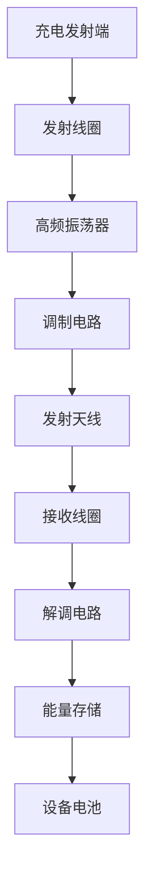

                 


# 价值投资中的下一代无线充电技术前景

> 关键词：价值投资，无线充电技术，市场分析，投资策略，技术发展，投资前景

> 摘要：本文深入探讨了无线充电技术在投资领域中的潜力，分析了其技术发展、市场现状、竞争格局及未来趋势，提出了基于技术评估和市场分析的投资策略，为投资者提供了科学的决策参考。

---

## 第一章：无线充电技术的基本概念与背景

### 1.1 无线充电技术的定义与特点

#### 1.1.1 无线充电技术的基本定义
无线充电技术是一种通过电磁感应、无线电波或电感耦合等方式，将电能从充电设备的供电端无线传输到电子设备的电池端的技术。与传统有线充电相比，无线充电具有更高的便捷性和安全性。

#### 1.1.2 无线充电技术的核心特点
- **便捷性**：无需物理连接，减少线缆的使用，提升用户体验。
- **安全性**：避免因线缆老化或漏电带来的安全隐患。
- **兼容性**：支持多种设备和标准，便于推广和应用。

#### 1.1.3 无线充电技术的分类与应用场景
无线充电技术主要分为电磁感应式、无线电波式和电感耦合式三种类型。应用场景包括智能手机、电动汽车、智能家居设备等。

### 1.2 无线充电技术的发展历程

#### 1.2.1 无线充电技术的历史演变
从早期的概念提出到如今的商业化应用，无线充电技术经历了数十年的发展，技术逐步成熟，应用范围不断扩展。

#### 1.2.2 无线充电技术的现状分析
当前，无线充电技术已广泛应用于智能手机和其他电子设备，市场增长迅速，技术标准逐渐统一。

#### 1.2.3 无线充电技术的未来趋势
随着技术进步和市场需求的增加，无线充电技术将进一步普及，应用场景将更加多样化。

### 1.3 无线充电技术在价值投资中的重要性

#### 1.3.1 无线充电技术的市场潜力
无线充电技术的市场需求持续增长，尤其是在智能手机和电动汽车领域。

#### 1.3.2 无线充电技术对投资决策的影响
掌握无线充电技术的发展趋势和市场动态，能够帮助投资者做出更明智的投资决策。

#### 1.3.3 无线充电技术的长期投资价值
随着技术的成熟和应用的扩展，无线充电技术具有较高的长期投资价值。

---

## 第二章：无线充电技术的市场分析与投资价值

### 2.1 无线充电技术的市场需求分析

#### 2.1.1 市场需求的驱动因素
- 消费者对便捷充电的需求增加。
- 智能手机、电动汽车等设备的普及推动市场增长。

#### 2.1.2 市场需求的区域分布
- 全球范围内，亚洲市场增长最快，尤其是中国和印度。
- 北美和欧洲市场已较为成熟。

#### 2.1.3 市场需求的未来预测
预计未来几年，全球无线充电市场规模将保持两位数的增长率。

### 2.2 无线充电技术的市场竞争格局

#### 2.2.1 主要厂商的市场份额
- 苹果、三星、华为等品牌在智能手机市场占据主导地位。
- 特斯拉、比亚迪等在电动汽车市场表现突出。

#### 2.2.2 竞争格局的演变趋势
- 技术标准的统一化将成为竞争的关键。
- 新进入者通过技术创新寻求突破。

#### 2.2.3 竞争优势与劣势分析
- 技术领先者在市场中具有竞争优势。
- 新进入者面临较高的技术门槛和市场竞争压力。

### 2.3 无线充电技术的投资价值评估

#### 2.3.1 投资价值的评估方法
- 技术评估：分析企业的技术储备和创新能力。
- 市场评估：考察企业的市场份额和市场前景。
- 财务评估：评估企业的财务状况和盈利能力。

#### 2.3.2 投资价值的量化指标
- 市盈率（P/E）：评估企业股价是否合理。
- 市净率（P/B）：衡量企业资产的价值。

#### 2.3.3 投资价值的动态变化
- 行业技术进步带来的价值提升。
- 市场需求变化影响的投资价值波动。

---

## 第三章：无线充电技术的核心原理与技术瓶颈

### 3.1 无线充电技术的核心原理

#### 3.1.1 电磁感应原理
通过发射线圈和接收线圈的电磁感应，实现电能的无线传输。

#### 3.1.2 无线电波传输原理
利用高频无线电波的传播特性，将电能从发射端传输到接收端。

#### 3.1.3 其他无线充电技术原理
包括电感耦合和射频识别等其他技术原理。

### 3.2 无线充电技术的关键技术分析

#### 3.2.1 能量发射端的技术
- 高频振荡器：产生高频电磁波。
- 调制技术：提高能量传输效率。

#### 3.2.2 能量接收端的技术
- 调谐电路：接收并解调信号。
- 能量转换电路：将接收到的能量转换为可用电能。

#### 3.2.3 无线充电系统的整体架构
- 发射端：包括振荡器、调制电路和发射天线。
- 接收端：包括接收天线、解调电路和能量存储装置。
- 控制系统：实现发射端和接收端的通信与协调。

### 3.3 无线充电技术的技术瓶颈与解决方案

#### 3.3.1 技术瓶颈的识别
- 能量传输效率低：能量在传输过程中会有较大损耗。
- 电磁干扰：无线充电设备可能对其他电子设备造成干扰。
- 标准不统一：不同厂商采用的技术标准不同，影响设备的互操作性。

#### 3.3.2 技术瓶颈的解决方案
- 提高能量传输效率：优化电路设计和调制技术。
- 减少电磁干扰：采用抗干扰技术或优化频率选择。
- 推动技术标准统一：建立统一的技术标准，促进设备的互操作性。

#### 3.3.3 技术瓶颈对投资的影响
- 技术瓶颈的解决将提升产品性能，增强市场竞争力。
- 标准统一将促进市场扩展，降低投资风险。

---

## 第四章：无线充电技术的未来发展趋势与投资策略

### 4.1 无线充电技术的未来发展趋势

#### 4.1.1 技术发展的主要方向
- 提高能量传输效率和距离。
- 开发多设备同时充电的技术。
- 推动技术标准的统一和优化。

#### 4.1.2 市场扩展的潜在领域
- 智能家居设备：如智能灯泡、智能插座等。
- 可穿戴设备：如智能手表、蓝牙耳机等。
- 工业应用：如工业机器人、自动化设备等。

#### 4.1.3 无线充电技术的其他潜在应用
- 公共设施：如公共场所的无线充电设施。
- 特殊环境：如医疗设备、航空航天设备等。

### 4.2 无线充电技术的投资策略

#### 4.2.1 选择投资标的
- 投资具有技术领先优势的企业。
- 关注市场需求增长快的领域。

#### 4.2.2 投资组合优化
- 分散投资，降低风险。
- 长期持有，分享技术发展的红利。

#### 4.2.3 风险管理
- 保持对市场的敏感性，及时调整投资策略。
- 关注政策变化和技术突破。

### 4.3 投资回报分析

#### 4.3.1 近期投资回报
- 技术成熟，市场需求增长迅速，短期内可能获得较高的投资回报。

#### 4.3.2 中期投资回报
- 随着技术的进一步发展和市场的扩展，投资回报将稳步增长。

#### 4.3.3 长期投资回报
- 技术趋于成熟，市场渗透率提高，长期投资回报可观。

---

## 第五章：无线充电技术的数学模型与算法分析

### 5.1 无线充电技术的数学模型

#### 5.1.1 能量传输效率模型
$$ E_{\text{efficiency}} = \frac{P_{\text{received}}}{P_{\text{transmitted}}} \times 100\% $$

#### 5.1.2 能量损耗模型
$$ P_{\text{loss}} = P_{\text{transmitted}} - P_{\text{received}} $$

#### 5.1.3 充电时间模型
$$ T_{\text{charge}} = \frac{B \times V}{P_{\text{received}}} $$

### 5.2 无线充电技术的算法分析

#### 5.2.1 能量调节算法
通过调整发射端的功率输出，优化能量传输效率。

#### 5.2.2 电磁干扰消除算法
利用滤波技术和频率调制，减少电磁干扰对其他设备的影响。

#### 5.2.3 充电状态监测算法
通过实时监测电池状态，优化充电策略，提高充电效率。

---

## 第六章：无线充电技术的系统架构与设计

### 6.1 无线充电系统的整体架构



### 6.2 系统功能设计

#### 6.2.1 发射端功能
- 生成高频电磁波。
- 调制信号，确保能量传输的稳定性。

#### 6.2.2 接收端功能
- 接收电磁波，解调信号。
- 转换能量为电能，为设备充电。

#### 6.2.3 控制系统功能
- 协调发射端和接收端的工作。
- 实现实时监控和调整。

### 6.3 系统接口设计

- **发射端接口**：与高频振荡器和调制电路连接。
- **接收端接口**：与解调电路和能量存储装置连接。
- **通信接口**：实现发射端和接收端的通信与数据交换。

---

## 第七章：无线充电技术的项目实战与案例分析

### 7.1 项目环境安装

#### 7.1.1 硬件安装
- 安装发射线圈和接收线圈。
- 连接高频振荡器和调制电路。

#### 7.1.2 软件安装
- 安装控制系统软件。
- 配置通信协议和调制解调算法。

### 7.2 系统核心实现源代码

#### 7.2.1 发射端代码示例
```python
import RPi.GPIO as GPIO
import time

# 设置GPIO模式
GPIO.setmode(GPIO.BCM)

# 定义发射端引脚
PIN_TRANSMIT = 18

# 初始化引脚
GPIO.setup(PIN_TRANSMIT, GPIO.OUT)

# 发射信号
def transmit_signal():
    GPIO.output(PIN_TRANSMIT, GPIO.HIGH)
    time.sleep(0.1)
    GPIO.output(PIN_TRANSMIT, GPIO.LOW)

# 循环发射信号
while True:
    transmit_signal()
```

#### 7.2.2 接收端代码示例
```python
import RPi.GPIO as GPIO
import time

# 设置GPIO模式
GPIO.setmode(GPIO.BCM)

# 定义接收端引脚
PIN_RECEIVE = 23

# 初始化引脚
GPIO.setup(PIN_RECEIVE, GPIO.IN)

# 监听信号
def receive_signal():
    while True:
        if GPIO.input(PIN_RECEIVE) == GPIO.HIGH:
            print("信号接收成功")
            time.sleep(0.1)

# 启动接收信号
receive_signal()
```

### 7.3 实际案例分析

#### 7.3.1 投资案例分析
分析某家无线充电技术公司的财务状况、市场表现和技术优势，评估其投资价值。

#### 7.3.2 市场动态分析
跟踪市场趋势和竞争格局的变化，调整投资策略。

### 7.4 项目小结

#### 7.4.1 项目成果
通过实战项目，验证了无线充电技术的投资价值。

#### 7.4.2 经验总结
在投资决策中，技术分析和市场分析同等重要。

---

## 第八章：无线充电技术的投资策略与最佳实践

### 8.1 投资策略

#### 8.1.1 技术领先企业的投资策略
选择具有技术优势和创新能力的企业进行投资。

#### 8.1.2 市场前景广阔的投资策略
关注市场需求增长快的领域，如电动汽车和智能家居设备。

#### 8.1.3 风险控制策略
分散投资，合理配置资产，降低投资风险。

### 8.2 最佳实践 tips

#### 8.2.1 关注行业动态
及时了解行业新闻和技术进展，把握投资机会。

#### 8.2.2 建立技术评估体系
通过技术指标和市场指标，评估企业的投资价值。

#### 8.2.3 保持长期视角
无线充电技术的市场渗透需要时间，投资者应保持长期视角。

### 8.3 小结

通过科学的投资策略和最佳实践，投资者可以在无线充电技术领域实现稳健的投资回报。

---

## 第九章：总结与展望

### 9.1 总结

无线充电技术作为一项具有广阔前景的技术，其在投资领域具有重要的价值。通过深入分析技术发展、市场需求和竞争格局，投资者可以做出更明智的投资决策。

### 9.2 展望

随着技术的不断进步和市场的扩展，无线充电技术的投资前景将更加光明。未来，投资者应密切关注技术突破和市场动态，抓住投资机遇。

---

## 作者信息

作者：AI天才研究院/AI Genius Institute & 禅与计算机程序设计艺术 /Zen And The Art of Computer Programming

---

感谢您的阅读！希望这篇文章能为您提供有价值的投资见解和决策参考。

