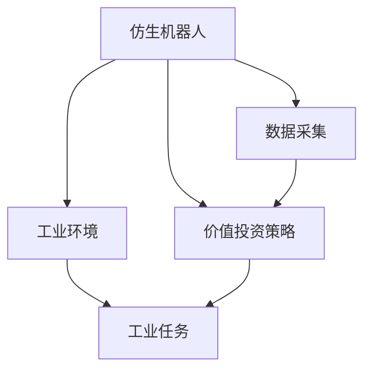
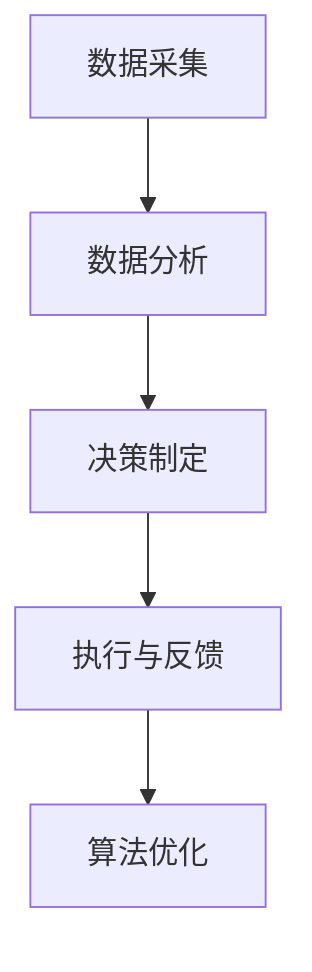
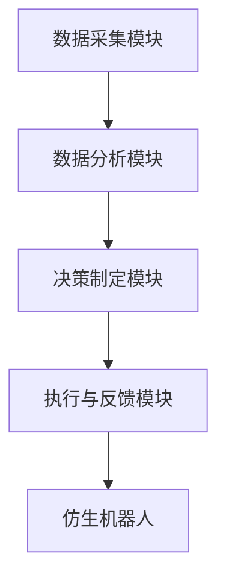
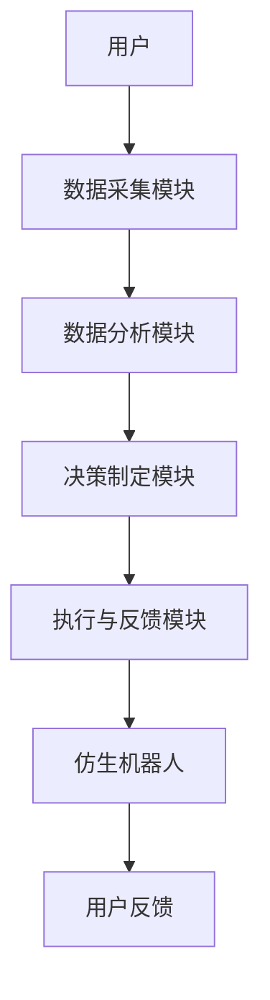

                 


# 价值投资中的仿生机器人在工业中的应用前景

---

## 关键词：
仿生机器人，价值投资，工业应用，算法原理，系统架构

---

## 摘要：
本文探讨了仿生机器人在工业中的应用前景，结合价值投资策略，分析了两者结合的可能性与优势。文章从背景介绍、核心概念、算法原理、系统架构、项目实战到最佳实践，全面阐述了仿生机器人在工业中的应用，强调了其在提高生产效率、降低成本和优化决策中的潜力。

---

# 第一部分：背景介绍

---

# 第1章：仿生机器人与价值投资概述

## 1.1 仿生机器人的定义与特点

### 1.1.1 仿生机器人的定义

仿生机器人是一种模拟生物行为和功能的智能机器人，结合了生物学、人工智能和机械工程的最新技术。它们能够感知环境、自主决策并执行复杂任务，具备高度的灵活性和适应性。

### 1.1.2 仿生机器人的核心特点

1. **自主性**：仿生机器人能够自主感知环境并做出决策，无需人工干预。
2. **适应性**：能够根据环境变化调整行为，适应不同的工业场景。
3. **智能性**：通过人工智能算法，如深度学习和强化学习，不断提升性能。
4. **协作性**：能够与其他机器人或系统协同工作，提高整体效率。

### 1.1.3 仿生机器人在工业中的应用背景

工业领域对高效、智能的解决方案需求日益增长。传统工业机器人在特定任务中表现出色，但缺乏灵活性和自主性。仿生机器人通过模拟生物行为，能够应对复杂多变的工业环境，成为工业4.0时代的重要工具。

---

## 1.2 价值投资的核心概念

### 1.2.1 价值投资的定义

价值投资是一种投资策略，强调以低于市场价买入具有内在价值的资产。其核心在于分析资产的内在价值，而非短期市场波动。

### 1.2.2 价值投资的基本原理

1. **基本面分析**：通过分析公司的财务状况、行业地位和竞争优势，评估其内在价值。
2. **安全边际**：买入价格低于内在价值，以降低风险。
3. **长期视角**：关注长期收益，而非短期波动。

### 1.2.3 价值投资在工业中的应用

在工业领域，价值投资策略可用于评估和优化生产流程、供应链管理以及设备投资，以实现长期的成本节约和效率提升。

---

## 1.3 仿生机器人与价值投资的结合

### 1.3.1 仿生机器人在工业中的应用领域

1. **智能制造**：优化生产流程，提高效率。
2. **物流与仓储**：实现智能仓储管理和高效物流配送。
3. **质量控制**：通过视觉识别和传感器，提升产品质量。
4. **危险环境作业**：在高温、高压等危险环境中执行任务。

### 1.3.2 价值投资在工业中的应用

1. **设备投资决策**：评估购买仿生机器人的经济效益，确保投资回报。
2. **生产优化**：通过价值投资策略，优化生产流程，降低成本。
3. **供应链管理**：优化供应链，降低库存成本，提高效率。

### 1.3.3 仿生机器人与价值投资的结合方式

1. **数据驱动决策**：利用仿生机器人收集的数据，进行价值投资分析。
2. **智能优化**：通过价值投资策略优化仿生机器人的行为，提高效率。
3. **协同创新**：结合仿生机器人技术和价值投资策略，创新工业应用模式。

---

## 1.4 本章小结

本章介绍了仿生机器人的定义、特点及其在工业中的应用背景，详细阐述了价值投资的核心概念和基本原理。最后，探讨了仿生机器人与价值投资的结合方式及其在工业中的应用前景。

---

# 第二部分：核心概念与联系

---

# 第2章：仿生机器人与价值投资的核心概念

## 2.1 仿生机器人的工作原理

### 2.1.1 仿生机器人的感知系统

1. **视觉感知**：通过摄像头和图像处理技术，识别环境中的物体和人员。
2. **触觉感知**：通过传感器感知物体的形状、质地和温度。
3. **听觉感知**：通过麦克风和语音识别技术，识别环境中的声音。

### 2.1.2 仿生机器人的决策系统

1. **路径规划**：通过算法计算最优路径，避开障碍物。
2. **行为决策**：基于感知数据，做出行为决策，如抓取、移动等。
3. **学习与优化**：通过机器学习算法，不断优化决策模型。

### 2.1.3 仿生机器人的执行系统

1. **运动控制**：通过电机和伺服系统，实现精准的运动控制。
2. **操作执行**：通过机械臂或其他执行机构，完成具体的工业任务。
3. **反馈控制**：根据执行结果，调整控制参数，确保任务完成。

---

## 2.2 价值投资的策略与模型

### 2.2.1 基本面分析

1. **财务指标分析**：分析公司的收入、利润、资产负债等财务指标。
2. **行业分析**：研究公司所在行业的竞争格局和发展趋势。
3. **竞争优势分析**：评估公司的核心竞争力，如技术优势、成本优势等。

### 2.2.2 股票估值模型

1. **市盈率模型（P/E）**：通过市盈率指标评估股票的估值。
2. **市净率模型（P/B）**：通过市净率指标评估股票的估值。
3. **现金流折现模型（DCF）**：通过现金流折现法评估股票的内在价值。

### 2.2.3 投资组合优化

1. **风险与收益平衡**：通过分析不同资产的风险和收益，构建最优投资组合。
2. **资产配置**：根据市场环境和个人风险偏好，配置不同类型的资产。
3. **动态调整**：根据市场变化和公司情况，动态调整投资组合。

---

## 2.3 仿生机器人与价值投资的结合模型

### 2.3.1 仿生机器人在价值投资中的角色

1. **数据采集**：通过仿生机器人采集工业环境中的实时数据，为价值投资提供支持。
2. **决策优化**：利用仿生机器人的决策系统，优化价值投资策略。
3. **执行与反馈**：通过仿生机器人执行投资决策，并根据反馈调整策略。

### 2.3.2 价值投资策略对仿生机器人的优化

1. **成本控制**：通过价值投资策略，优化仿生机器人的采购和使用成本。
2. **效率提升**：通过价值投资策略，优化仿生机器人的运行效率，提高投资回报。
3. **风险管理**：通过价值投资策略，降低仿生机器人在工业应用中的风险。

### 2.3.3 仿生机器人与价值投资的协同效应

1. **数据共享**：仿生机器人与价值投资系统共享数据，提高决策的准确性。
2. **协同优化**：通过协同优化，实现仿生机器人与价值投资系统的互补优势。
3. **创新应用**：结合仿生机器人技术和价值投资策略，创新工业应用模式。

---

## 2.4 核心概念对比分析

### 2.4.1 仿生机器人与传统工业机器人的对比

| 特性                | 仿生机器人              | 传统工业机器人          |
|---------------------|-------------------------|-------------------------|
| 自主性              | 高                     | 低                     |
| 灵活性              | 高                     | 低                     |
| 智能性              | 高                     | 低                     |
| 应用场景            | 复杂工业环境            | 简单工业环境            |

### 2.4.2 价值投资与传统投资策略的对比

| 特性                | 价值投资              | 传统投资策略            |
|---------------------|------------------------|-------------------------|
| 投资理念            | 以内在价值为导向      | 以市场波动为导向        |
| 分析方法            | 基本面分析            | 技术分析和市场分析      |
| 投资期限            | 长期                  | 短期和长期              |

---

## 2.5 实体关系图（ER图）



---

# 第三部分：算法原理

---

# 第3章：价值投资中的仿生机器人算法原理

## 3.1 价值投资算法原理

### 3.1.1 股票估值模型

股票的内在价值可以通过以下公式计算：

$$ V = \frac{CF}{r - g} $$

其中：
- \( V \) 是股票的内在价值
- \( CF \) 是未来现金流
- \( r \) 是折现率
- \( g \) 是增长率

### 3.1.2 投资组合优化

通过马科维茨的有效组合理论，可以构建最优投资组合：

$$ \text{Minimize } \sigma^2 \text{ subject to } \mu \geq \text{target return} $$

其中：
- \( \sigma^2 \) 是组合的方差
- \( \mu \) 是组合的期望收益

---

## 3.2 仿生机器人算法原理

### 3.2.1 路径规划算法

A*算法是一种常用的路径规划算法，其步骤如下：

1. **生成候选节点**：从起点开始，扩展到相邻节点。
2. **计算候选节点的优先级**：使用估价函数 \( f(n) = g(n) + h(n) \)，其中 \( g(n) \) 是已知成本，\( h(n) \) 是启发函数。
3. **选择优先级最高的节点**：从候选节点中选择优先级最高的节点进行处理。
4. **检查是否到达终点**：如果当前节点是终点，算法结束。
5. **扩展节点**：将当前节点的相邻节点加入候选节点列表。

### 3.2.2 决策优化算法

强化学习是一种常用的决策优化算法，其核心在于通过试错学习，优化决策策略。以下是强化学习的基本流程：

1. **环境交互**：机器人与环境交互，获取状态和奖励。
2. **状态感知**：感知当前状态，决定下一步动作。
3. **动作选择**：根据当前状态，选择一个动作。
4. **奖励反馈**：根据动作的执行结果，获得奖励或惩罚。
5. **策略更新**：根据奖励反馈，更新策略，以最大化长期奖励。

---

## 3.3 算法原理的结合

### 3.3.1 价值投资与仿生机器人结合的算法流程

1. **数据采集**：通过仿生机器人采集工业环境中的实时数据。
2. **数据分析**：利用价值投资算法对数据进行分析，评估投资价值。
3. **决策制定**：结合仿生机器人和价值投资算法的结果，制定最优决策。
4. **执行与反馈**：通过仿生机器人执行决策，并根据反馈调整算法参数。

### 3.3.2 算法流程图



---

# 第四部分：系统分析与架构设计

---

# 第4章：价值投资中的仿生机器人系统架构

## 4.1 项目背景

随着工业4.0的发展，工业智能化需求日益增长。仿生机器人结合价值投资策略，能够为工业应用提供智能化、高效化的解决方案。

---

## 4.2 系统功能设计

### 4.2.1 数据采集模块

- 负责采集工业环境中的实时数据，如温度、湿度、设备状态等。

### 4.2.2 数据分析模块

- 对采集的数据进行分析，评估投资价值，优化决策策略。

### 4.2.3 决策制定模块

- 根据分析结果，制定最优决策，指导仿生机器人的行为。

### 4.2.4 执行与反馈模块

- 通过仿生机器人执行决策，并根据反馈调整系统参数。

---

## 4.3 系统架构设计

### 4.3.1 系统架构图



### 4.3.2 接口设计

- **数据接口**：负责数据的输入和输出，采用RESTful API。
- **控制接口**：负责接收和发送控制指令，采用MQTT协议。
- **反馈接口**：负责接收仿生机器人的反馈信息，采用HTTP协议。

---

## 4.4 交互流程图



---

# 第五部分：项目实战

---

# 第5章：价值投资中的仿生机器人项目实战

## 5.1 环境安装

### 5.1.1 系统环境

- 操作系统：Linux（Ubuntu 20.04）
- 开发工具：Python 3.8，TensorFlow 2.5，ROS（Robot Operating System）

### 5.1.2 依赖安装

```bash
pip install numpy pandas scikit-learn matplotlib tensorflow
```

---

## 5.2 核心代码实现

### 5.2.1 数据采集模块

```python
import rospy
from sensor_msgs.msg import LaserScan

def laser_callback(data):
    print("Distance: ", data.ranges[0])

rospy.init_node('laser_subscriber')
rospy.Subscriber('laser_topic', LaserScan, laser_callback)
rospy.spin()
```

### 5.2.2 数据分析模块

```python
import pandas as pd
from sklearn import linear_model

data = pd.read_csv('stock_data.csv')
X = data[['PE', 'PB', 'ROE']]
y = data['Price']

model = linear_model.LinearRegression()
model.fit(X, y)
print('Coefficients:', model.coef_)
```

### 5.2.3 决策制定模块

```python
import numpy as np

def calculate_intrinsic_value(fundamentals):
    # 假设fundamentals是一个字典，包含公司财务数据
    # 使用CAPM模型计算内在价值
    r = 0.1  # 期望回报率
    g = 0.05  # 增长率
    V = fundamentals['CF'] / (r - g)
    return V

# 示例
fundamentals = {'CF': 100, 'r': 0.1, 'g': 0.05}
intrinsic_value = calculate_intrinsic_value(fundamentals)
print('Intrinsic Value:', intrinsic_value)
```

### 5.2.4 执行与反馈模块

```python
from scipy.optimize import minimize

def optimize_portfolio(weights, returns, covariance):
    # 定义目标函数
    def objective(weights):
        return np.dot(weights.T, covariance).dot(weights)
    
    # 定义约束条件
    constraints = [{'type': 'eq', 'fun': lambda w: sum(w) - 1}]
    
    # 求解优化问题
    result = minimize(objective, weights, constraints=constraints)
    return result.x

# 示例
returns = np.array([0.1, 0.2, 0.15])
covariance = np.array([[0.01, 0.005, 0.008],
                       [0.005, 0.02, 0.01],
                       [0.008, 0.01, 0.03]])
weights = np.array([1/3, 1/3, 1/3])
optimal_weights = optimize_portfolio(weights, returns, covariance)
print('Optimal Portfolio Weights:', optimal_weights)
```

---

## 5.3 代码解读与分析

### 5.3.1 数据采集模块

上述代码通过ROS（Robot Operating System）订阅激光扫描数据，实现对工业环境的实时感知。

### 5.3.2 数据分析模块

使用线性回归模型对股票数据进行分析，预测股票价格，为价值投资提供数据支持。

### 5.3.3 决策制定模块

通过CAPM模型计算股票的内在价值，为投资决策提供依据。

### 5.3.4 执行与反馈模块

通过优化算法，求解最优投资组合，实现资产配置的最优化。

---

## 5.4 实际案例分析

### 5.4.1 案例背景

假设某制造企业计划引入仿生机器人优化其生产流程，降低生产成本，提高效率。

### 5.4.2 数据分析

通过数据采集模块获取生产过程中的实时数据，包括生产时间、设备状态、原材料成本等。

### 5.4.3 投资决策

通过价值投资算法分析，评估引入仿生机器人的投资回报，确定最优投资方案。

### 5.4.4 系统实施

部署仿生机器人，实现生产流程的智能化优化，降低生产成本，提高效率。

### 5.4.5 结果分析

通过数据分析模块，评估系统的实际效果，验证投资回报，调整优化策略。

---

## 5.5 项目小结

本章通过实际案例，展示了仿生机器人在工业中的应用，详细阐述了系统的设计与实现，验证了价值投资策略在工业应用中的有效性和潜力。

---

# 第六部分：最佳实践

---

# 第6章：价值投资中的仿生机器人应用总结

## 6.1 本章总结

本文系统地探讨了仿生机器人在工业中的应用前景，结合价值投资策略，分析了两者结合的可能性与优势。通过算法原理、系统架构和项目实战的详细阐述，展示了仿生机器人在工业中的广泛应用潜力。

---

## 6.2 最佳实践 tips

1. **数据质量**：在价值投资中，数据质量至关重要。确保数据的准确性和完整性，才能做出准确的决策。
2. **算法优化**：根据实际需求，不断优化算法模型，提高系统的效率和准确性。
3. **系统维护**：定期维护和更新系统，确保其稳定性和安全性。
4. **团队协作**：价值投资和仿生机器人应用需要多学科团队的协作，包括数据科学家、软件工程师和工业专家。

---

## 6.3 小结

仿生机器人与价值投资的结合，为工业应用提供了智能化、高效化的解决方案。通过本文的详细阐述，读者可以深入了解仿生机器人在工业中的应用前景，掌握价值投资策略在实际应用中的优化方法。

---

## 6.4 注意事项

- 在实际应用中，需注意数据隐私和安全问题，确保系统的合规性。
- 系统的实施需要充分考虑工业环境的复杂性，确保系统的适应性和鲁棒性。
- 投资决策需结合市场环境和个人风险偏好，制定合理的投资策略。

---

## 6.5 拓展阅读

1. 《The Intelligent Investor》——本杰明·格雷厄姆
2. 《机器学习实战》——奥雷利·沙拉
3. 《ROS机器人开发实践》——威廉·斯通

---

# 作者：AI天才研究院 & 禅与计算机程序设计艺术

---

