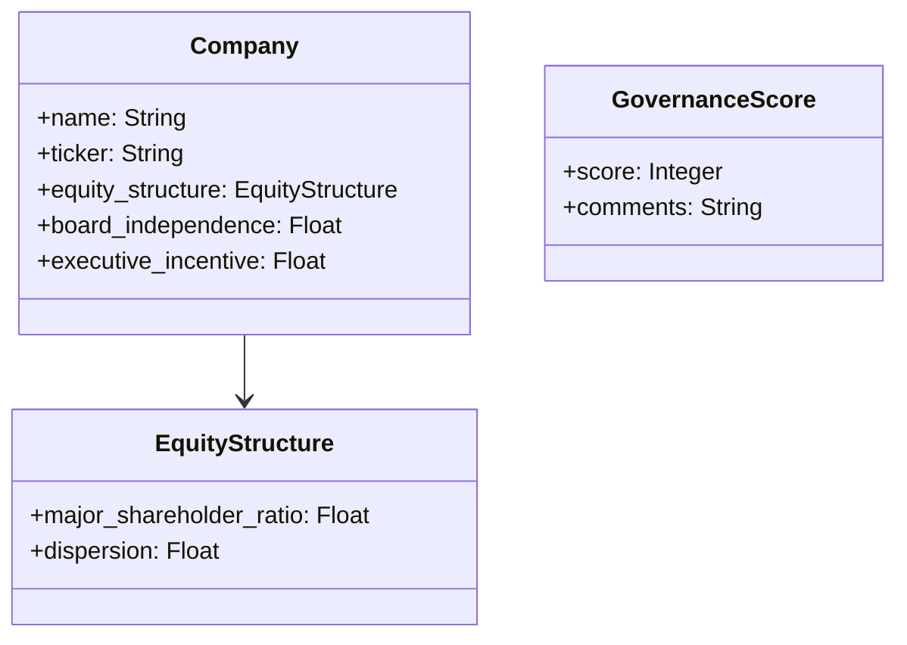
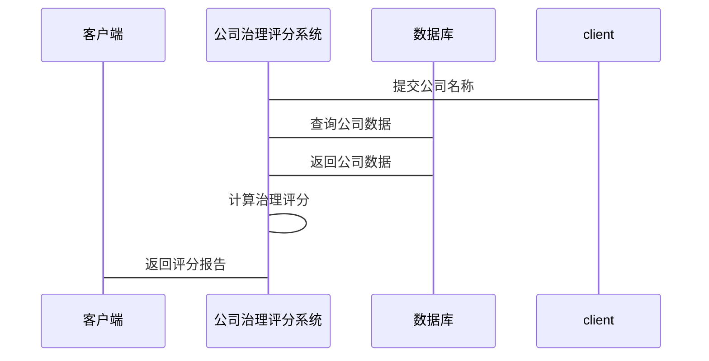

                 


# 价值投资中的公司治理分析：好公司vs好股票

---

## 关键词：价值投资、公司治理、好公司、好股票、层次分析法、股权激励、董事会结构

---

## 摘要

在价值投资中，选择“好公司”和“好股票”是投资者追求长期稳健收益的关键。然而，许多投资者容易将“好公司”与“好股票”混淆，忽视了公司治理在其中的重要性。本文从公司治理的角度，详细分析了如何区分“好公司”与“好股票”，并构建了一个基于公司治理评分模型的数学框架，帮助投资者更好地评估公司治理质量。文章首先介绍了价值投资的核心理念和公司治理的基本概念，然后分析了公司治理的核心要素和影响因素，最后提出了一个基于层次分析法（AHP）的公司治理评分模型，并通过案例分析展示了模型的应用。本文将为投资者提供一套科学的公司治理分析方法，帮助他们在价值投资中做出更明智的决策。

---

## 第1章: 价值投资的背景与核心理念

### 1.1 价值投资的起源与发展

#### 1.1.1 价值投资的起源
价值投资理念起源于20世纪初，由本杰明·格雷厄姆和戴维·多德提出。他们强调以低于内在价值的价格买入优质股票，以实现长期稳健的收益。格雷厄姆的“烟屁股”理论和多德的“价值投资”理论奠定了现代价值投资的基础。

#### 1.1.2 价值投资的核心理念
价值投资的核心理念包括：
1. **安全边际**：买入价格低于内在价值，确保投资的安全性。
2. **长期主义**：关注企业的长期盈利能力，而非短期市场波动。
3. **基本面分析**：通过对企业财务状况、行业地位和管理团队的深入分析，寻找具有竞争优势的企业。

#### 1.1.3 价值投资与现代投资理论的联系
现代投资组合理论（MPT）强调分散投资和风险控制，而价值投资则更注重个股的内在价值。两者在风险管理方面有共同点，但价值投资更注重个股选择。

---

### 1.2 公司治理的基本概念

#### 1.2.1 公司治理的定义
公司治理是通过公司章程、董事会、高管和股东之间的关系，确保企业高效运作和合规经营的机制。

#### 1.2.2 公司治理的核心要素
1. **股权结构**：股东的权益分配和控制权。
2. **董事会结构**：董事会的组成、独立性和职责。
3. **高管激励**：高管的薪酬结构和绩效考核机制。

#### 1.2.3 公司治理与企业价值的关系
良好的公司治理能够提升企业透明度、降低代理成本、优化决策流程，从而增强企业的市场信任度和长期盈利能力。

---

### 1.3 好公司与好股票的区分

#### 1.3.1 好公司的定义与特征
好公司具有以下特征：
1. **持续盈利能力**：稳定的收入和利润增长。
2. **强大的竞争优势**：市场地位高，护城河明显。
3. **良好的治理结构**：董事会独立，高管激励合理。

#### 1.3.2 好股票的定义与特征
好股票具有以下特征：
1. **低估价格**：市场价格低于内在价值。
2. **低估值指标**：市盈率、市净率等估值指标低于行业平均水平。
3. **高分红率**：稳定的股息收益。

#### 1.3.3 好公司与好股票的差异与联系
好公司是好股票的基础，而好股票是好公司的市场表现。投资者需要区分这两者，避免混淆短期市场波动与长期企业价值。

---

### 1.4 价值投资中的公司治理分析

#### 1.4.1 公司治理在价值投资中的重要性
公司治理直接影响企业的长期价值，是判断好公司的重要标准。

#### 1.4.2 公司治理分析的基本框架
1. 股权结构分析。
2. 董事会独立性评估。
3. 高管激励机制分析。

#### 1.4.3 公司治理分析的实践意义
通过分析公司治理质量，投资者可以更好地识别具有长期竞争优势的企业。

---

## 第2章: 公司治理分析的核心要素

### 2.1 公司治理的层次分析

#### 2.1.1 股东治理
- 股东结构：控股股东与小股东的权益平衡。
- 股权激励：通过股权激励绑定股东与管理层的利益。

#### 2.1.2 董事会治理
- 董事会结构：独立董事比例与董事会职责。
- 董事会会议频率与决策透明度。

#### 2.1.3 高管治理
- 高管团队稳定性：高管任期与离职率。
- 高管激励机制：薪酬结构与绩效考核。

---

### 2.2 公司治理的主要参与者

#### 2.2.1 股东
- 股东的权力与义务。
- 股东在公司治理中的角色。

#### 2.2.2 董事会
- 董事会的职责与结构。
- 独立董事的作用。

#### 2.2.3 高级管理人员
- 高管的职责与权力。
- 高管激励机制对企业发展的影响。

#### 2.2.4 利益相关者
- 员工、客户、债权人等利益相关者的权益保护。

---

### 2.3 公司治理的主要机制

#### 2.3.1 股权激励机制
- 股权激励的作用。
- 股权激励的实施方式。

#### 2.3.2 董事会监督机制
- 董事会的监督职能。
- 董事会会议的决策流程。

#### 2.3.3 信息披露机制
- 定期财务报告的披露。
- 重大事项的及时公告。

---

### 2.4 公司治理的评价指标

#### 2.4.1 股权结构合理性
- 主要股东持股比例。
- 股权分散度。

#### 2.4.2 董事会独立性
- 独立董事比例。
- 董事会的决策独立性。

#### 2.4.3 高管激励机制的有效性
- 激励机制与企业绩效的关联性。
- 激励机制的透明度。

---

## 第3章: 公司治理评分模型的构建

### 3.1 公司治理评分模型的概述

#### 3.1.1 模型的目标与意义
- 量化公司治理质量。
- 为投资者提供决策参考。

#### 3.1.2 模型的基本假设
- 公司治理质量可以通过量化指标评估。
- 各指标权重可以通过层次分析法确定。

---

### 3.2 公司治理评分模型的构建步骤

#### 3.2.1 确定评价指标
- 股权结构合理性。
- 董事会独立性。
- 高管激励机制的有效性。

#### 3.2.2 确定指标权重
- 使用层次分析法（AHP）确定权重。
- 指标权重反映了其对整体治理质量的影响程度。

#### 3.2.3 计算评分
- 综合各指标评分，计算公司治理总得分。
- 得分范围：1（差）到 10（优）。

---

### 3.3 指标权重的确定方法

#### 3.3.1 层次分析法（AHP）
- AHP的基本原理。
- 指标权重的计算步骤。

---

## 第4章: 系统分析与架构设计

### 4.1 问题场景介绍

#### 4.1.1 项目背景
- 价值投资中的公司治理分析需求。
- 构建一个自动化公司治理评分系统。

#### 4.1.2 项目目标
- 开发一个基于公司治理评分模型的分析系统。
- 提供直观的评分结果和可视化报告。

---

### 4.2 系统功能设计

#### 4.2.1 领域模型（Mermaid 类图）


---

### 4.3 系统架构设计

#### 4.3.1 系统架构图（Mermaid 架构图）


---

### 4.4 系统接口设计

#### 4.4.1 输入接口
- 公司名称或股票代码。
- 相关财务数据和治理数据。

#### 4.4.2 输出接口
- 公司治理评分报告。
- 可视化图表和建议。

---

### 4.5 系统交互设计

#### 4.5.1 交互流程（Mermaid 序列图）


---

## 第5章: 项目实战

### 5.1 环境配置

#### 5.1.1 Python 环境安装
- 安装 Python 和必要的库（如 `pandas`, `scipy`）。

#### 5.1.2 数据来源
- 数据来源：公开的公司治理数据和财务数据。

---

### 5.2 系统核心实现

#### 5.2.1 指标计算模块（Python 代码）

```python
import numpy as np
from scipy.stats import rankdata

def calculate_governance_score(company_data):
    # 公司治理指标
    equity_structure = company_data['equity_structure']
    board_independence = company_data['board_independence']
    executive_incentive = company_data['executive_incentive']
    
    # 计算各指标的排名
    equity_rank = rankdata([equity_structure], method='min')
    board_rank = rankdata([board_independence], method='min')
    incentive_rank = rankdata([executive_incentive], method='min')
    
    # 计算总分
    score = (equity_rank[0] + board_rank[0] + incentive_rank[0]) / 3 * 10
    return int(score)
```

---

### 5.3 代码应用解读与分析

#### 5.3.1 指标计算模块的实现
- 通过排名计算各治理指标的相对表现。
- 最终得分是各指标排名的加权平均。

#### 5.3.2 实际案例分析
- 以某公司为例，展示模型的计算过程。

---

## 第6章: 最佳实践与小结

### 6.1 最佳实践

#### 6.1.1 关注公司治理质量
- 选择治理结构合理、董事会独立性强的公司。

#### 6.1.2 长期投资
- 价值投资需要耐心，避免短期波动干扰。

#### 6.1.3 定期复盘
- 定期评估投资组合的治理质量和市场表现。

---

### 6.2 注意事项

#### 6.2.1 数据的准确性
- 确保输入数据的准确性和完整性。

#### 6.2.2 模型的局限性
- 模型结果仅供参考，需结合其他因素综合判断。

---

### 6.3 拓展阅读

#### 6.3.1 推荐书籍
- 《价值》——雪球财经
- 《公司治理》——某权威作者

#### 6.3.2 推荐网站
- 某公司治理评级网站
- 某金融数据平台

---

## 作者：AI天才研究院/AI Genius Institute & 禅与计算机程序设计艺术 /Zen And The Art of Computer Programming

---

**注**：以上为文章的完整目录结构，具体内容需要根据上述框架逐步撰写，确保每部分内容详实、逻辑清晰。

