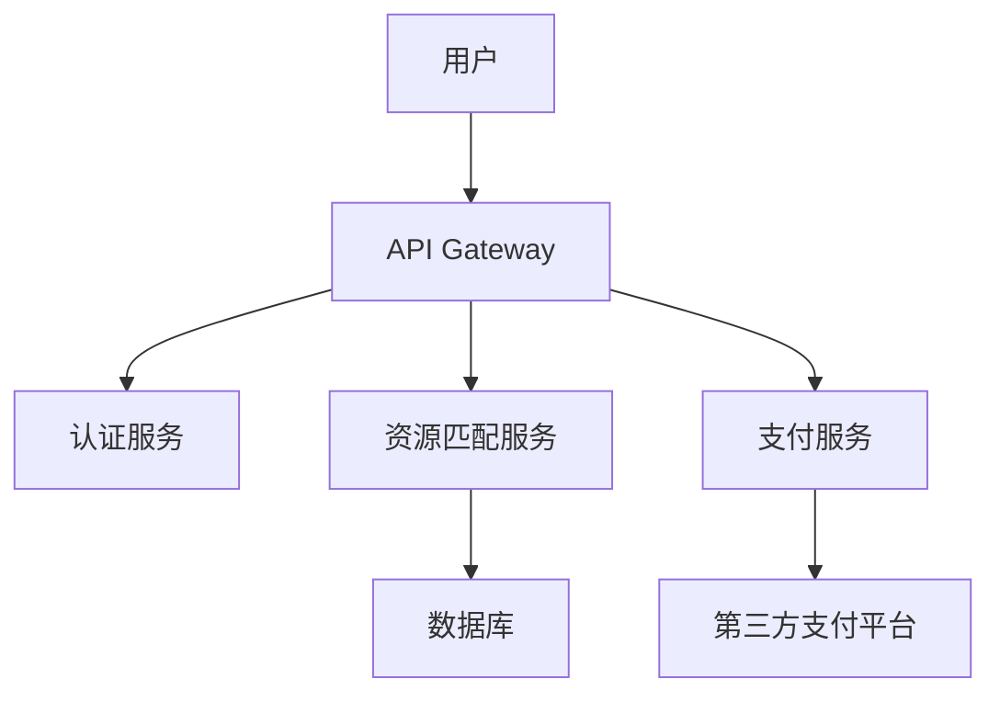

                 


---

# 价值投资中的共享经济模式分析

> 关键词：价值投资，共享经济，模式分析，数学模型，系统架构，案例分析

> 摘要：本文从价值投资的角度分析共享经济模式，探讨其核心要素、价值评估方法、数学模型构建以及系统架构设计。通过实际案例分析，揭示共享经济模式在价值投资中的机会与挑战，并提出相应的投资策略和风险管理建议。

---

## 第一部分：价值投资与共享经济的背景与概念

### 第1章：价值投资与共享经济的概述

#### 1.1 价值投资的核心概念

##### 1.1.1 价值投资的定义与起源
价值投资是一种以基本面分析为基础的投资策略，由本杰明·格雷厄姆和戴维·多德提出，强调以低于内在价值的价格买入优质资产。其核心理念是寻找市场先生的错误定价，通过长期持有优质资产实现财富增长。

##### 1.1.2 价值投资的核心理念与原则
- **安全边际**：买入价格低于内在价值，确保足够的安全空间。
- **长期视角**：关注企业的长期盈利能力，而非短期市场波动。
- **优质企业**：选择具有强大竞争优势、良好财务状况和管理团队的企业。

##### 1.1.3 价值投资在现代金融中的地位
价值投资是投资理论的重要组成部分，尤其是在市场波动和不确定性增加的背景下，价值投资策略因其稳健性和长期性受到广泛重视。

#### 1.2 共享经济的定义与特点

##### 1.2.1 共享经济的定义与模式
共享经济是一种基于闲置资源利用和使用权共享的经济模式，通过数字化平台连接供需双方，实现资源的高效配置。其主要模式包括：
- **P2P共享**：个人对个人的资源分享，如Airbnb、滴滴出行。
- **B2P共享**：企业对个人的资源分享，如共享单车。

##### 1.2.2 共享经济的核心特征与优势
- **资源利用效率高**：通过共享减少资源闲置。
- **降低成本**：用户按需付费，降低使用成本。
- **技术创新驱动**：依赖数字化平台和大数据技术。

##### 1.2.3 共享经济的典型案例分析
- **滴滴出行**：通过移动应用平台，整合司机和乘客资源，实现高效匹配。
- **Airbnb**：利用闲置房源，提供短租服务，降低住宿成本。

#### 1.3 价值投资与共享经济的结合

##### 1.3.1 价值投资与共享经济的契合点
- **资产轻量化**：共享经济模式减少固定资产投入，降低企业的资本密集度。
- **用户参与度高**：通过平台模式，实现用户与企业的高效互动。

##### 1.3.2 共享经济模式对价值投资的影响
- 提供新的投资标的，如共享经济平台企业。
- 降低企业的固定资产依赖，提升资产周转率。

##### 1.3.3 价值投资视角下的共享经济机会
- 投资具有强大平台优势和网络效应的共享经济企业。
- 关注具有可持续增长潜力的共享经济模式。

---

## 第二部分：价值投资中的共享经济模式分析

### 第2章：共享经济模式的核心要素与价值评估

#### 2.1 共享经济模式的核心要素

##### 2.1.1 资产共享的实现机制
- **平台技术**：利用移动互联网和大数据技术实现供需匹配。
- **信任机制**：通过平台信用评分和用户评价建立信任。

##### 2.1.2 平台角色与功能分析
- **供需匹配**：平台作为中介，连接供给方和需求方。
- **支付与结算**：提供安全的支付渠道，确保交易顺利完成。
- **风险管理**：制定规则和保险机制，降低交易风险。

##### 2.1.3 用户参与与行为模式
- **用户需求**：用户按需使用，降低持有成本。
- **用户供给**：用户通过分享资源获得额外收入。

#### 2.2 价值投资中的共享经济模式分析

##### 2.2.1 共享经济模式的分类与特点
- **C2C模式**：个人对个人，如Airbnb。
- **B2C模式**：企业对个人，如共享单车。
- **B2B模式**：企业对企业，如共享办公空间。

##### 2.2.2 共享经济模式的价值链分析
- **上游资源提供者**：提供共享资源。
- **平台运营商**：构建和运营共享平台。
- **下游用户**：使用共享服务。

##### 2.2.3 共享经济模式的经济效益与风险
- **经济效益**：提高资源利用效率，降低成本。
- **风险**：市场竞争激烈，平台依赖性强。

#### 2.3 共享经济模式的价值评估方法

##### 2.3.1 价值评估的核心指标与模型
- **用户活跃度**：衡量平台的用户粘性和使用频率。
- **收入增长**：关注平台的收入规模和增长速度。
- **利润率**：分析平台的盈利能力。

##### 2.3.2 共享经济模式的财务指标分析
- **成本结构**：固定成本和可变成本的比例。
- **边际利润**：每次交易的边际收益。

##### 2.3.3 共享经济模式的市场潜力评估
- **市场规模**：预测未来市场容量。
- **竞争格局**：分析市场的主要竞争对手。

---

## 第三部分：共享经济模式的数学模型与算法分析

### 第3章：共享经济模式的数学模型构建

#### 3.1 共享经济模式的数学模型概述

##### 3.1.1 模型构建的基本思路
- **目标函数**：最大化平台利润或用户满意度。
- **约束条件**：供需匹配、资源限制。

#### 3.2 共享经济模式的收益与成本模型

##### 3.2.1 收益模型的构建与分析
$$ \text{收益} = \sum_{i=1}^{n} p_i \cdot q_i $$
其中，\( p_i \) 是第 \( i \) 种服务的价格，\( q_i \) 是销量。

##### 3.2.2 成本模型的构建与分析
$$ \text{成本} = \sum_{j=1}^{m} c_j \cdot k_j $$
其中，\( c_j \) 是第 \( j \) 种资源的成本，\( k_j \) 是使用量。

##### 3.2.3 收益与成本的平衡分析
$$ \text{利润} = \text{收益} - \text{成本} $$

#### 3.3 共享经济模式的风险评估模型

##### 3.3.1 风险因素的识别与分类
- **市场风险**：需求波动。
- **运营风险**：平台维护成本。
- **政策风险**：法规变化。

##### 3.3.2 风险评估的数学模型
$$ R = \sum_{r=1}^{k} w_r \cdot r_r $$
其中，\( w_r \) 是风险 \( r_r \) 的权重。

##### 3.3.3 风险模型的验证与优化
通过历史数据验证模型的准确性，并根据实际结果进行参数调整。

---

## 第四部分：共享经济模式的系统分析与架构设计

### 第4章：共享经济模式的系统分析

#### 4.1 系统功能需求分析

##### 4.1.1 用户需求分析
- 用户注册与登录。
- 服务搜索与预订。
- 支付与结算。

##### 4.1.2 平台功能需求
- 资源发布与管理。
- 供需匹配算法。
- 交易监控与风险管理。

##### 4.1.3 服务提供者需求
- 资源上架与管理。
- 收益结算。

#### 4.2 系统架构设计

##### 4.2.1 系统架构图


##### 4.2.2 系统功能模块
- **认证模块**：用户身份验证。
- **匹配模块**：供需匹配算法。
- **支付模块**：交易处理。

##### 4.2.3 数据流设计
- 用户请求 → API Gateway → 资源匹配服务 → 数据库查询 → 返回结果。

---

## 第五部分：项目实战与案例分析

### 第5章：共享经济模式的项目实战

#### 5.1 项目环境安装与配置

##### 5.1.1 开发环境
- Python 3.8+
- Django框架
- PostgreSQL数据库

##### 5.1.2 安装依赖
```bash
pip install django psycopg2
```

#### 5.2 核心功能实现

##### 5.2.1 资源发布模块
```python
# models.py
from django.db import models

class Resource(models.Model):
    title = models.CharField(max_length=100)
    description = models.TextField()
    price = models.DecimalField(max_digits=10, decimal_places=2)
    owner = models.ForeignKey('auth.User', on_delete=models.CASCADE)

    def __str__(self):
        return self.title
```

##### 5.2.2 供需匹配算法
```python
# views.py
from rest_framework.views import APIView
from rest_framework.response import Response
from .models import Resource, Request
import json

class MatchResource(APIView):
    def post(self, request, format=None):
        data = json.loads(request.body)
        # 简单的匹配逻辑
        resources = Resource.objects.filter(category=data['category'])
        return Response({'matched_resources': [r.title for r in resources]})
```

#### 5.3 案例分析与解读

##### 5.3.1 案例分析：滴滴出行
滴滴出行通过移动应用平台，整合司机和乘客资源，实现高效匹配。其商业模式包括：
- 用户端：打车服务。
- 司机端：收入分成。

##### 5.3.2 价值评估
- **用户活跃度**：日活用户数。
- **收入增长**：每单收入和订单量。
- **利润率**：扣除分成和运营成本后的利润。

#### 5.4 项目小结
通过实际案例分析，验证共享经济模式的可行性，并总结其在价值投资中的潜力和风险。

---

## 第六部分：最佳实践与总结

### 第6章：共享经济模式的价值投资策略

#### 6.1 投资策略与风险管理

##### 6.1.1 投资策略
- **选择优质平台**：关注平台的网络效应和技术创新能力。
- **分散投资**：降低单一投资的风险。

##### 6.1.2 风险管理
- **市场风险**：关注行业竞争格局和政策变化。
- **运营风险**：评估平台的运营效率和成本结构。

#### 6.2 未来趋势与投资建议

##### 6.2.1 未来趋势
- **技术驱动**：人工智能和大数据技术的应用。
- **全球化**：共享经济模式向新兴市场扩展。

##### 6.2.2 投资建议
- 关注具有强大技术优势和良好商业模式的共享经济企业。
- 保持长期视角，关注企业的长期价值创造。

---

## 总结

通过本文的分析，我们从价值投资的角度深入探讨了共享经济模式的各个方面，包括其核心要素、数学模型、系统架构以及实际案例。未来，随着技术的不断进步和市场的扩展，共享经济模式在价值投资中的潜力将更加显著。投资者需要结合市场变化和企业实际情况，制定合理的投资策略，以实现长期稳定的收益。

---

作者：AI天才研究院/AI Genius Institute & 禅与计算机程序设计艺术 /Zen And The Art of Computer Programming

